<div style="font-size: 16px; line-height: 1.65;">

<br/>
<div align="center">
  
</div>
<br/>
<h2 align="center"><strong>Universidad Peruana de Ciencias Aplicadas</strong></h2>
<h2 align="center"><strong>Carrera de Ingeniería de Software</strong></h2>

<h2 align="center"><strong>1ASI0732</strong></h2>
<h2 align="center"><strong>Diseño de Experimentos de Ingeniería de Software</strong></h2>
<h2 align="center">NRC</h2>
<h2 align="center"><strong>9090</strong></h2>
<h2 align="center"><strong>Informe del Trabajo Final</strong></h2>
<h2 align="center">Docente</h2>
<h2 align="center"><strong>Flores Moroco, Juan Antonio</strong></h2>
<h2 align="center">Equipo</h2>
<h2 align="center"><strong>Chronos</strong></h2>
<h2 align="center">Proyecto</h2>
<h2 align="center"><strong>SafeStep</strong></h2>

<h2 align="center"><strong>Integrantes:</strong></h2>

<div align="center">
  <table align="center">
    <thead>
      <tr>
        <th align="center">Código</th>
        <th align="center">Nombre</th>
      </tr>
    </thead>
    <tbody>
      <tr>
        <td align="center">U201913639</td>
        <td align="center">Palacios Jáuregui, Kalid Jesus</td>
      </tr>
      <tr>
        <td align="center">U201817507</td>
        <td align="center">Sanchez Arenas, Manuel Angel</td>
      </tr>
      <tr>
        <td align="center">U202315165</td>
        <td align="center">Melgarejo Quiroz, Josep Eliu</td>
      </tr>
      <tr>
        <td align="center">U202113310</td>
        <td align="center">Tello Palacios, Fabrizio Rafael</td>
      </tr>
      <tr>
        <td align="center">U20181D263</td>
        <td align="center">Aylas De La Cruz, Paulo Smit</td>
      </tr>
    </tbody>
  </table>
</div>

<h2 align="center"><strong>Período 202620</strong></h2>
<h2 align="center"><strong>Septiembre 2026</strong></h2>

</div>
<div style="font-size: 18px; line-height: 1.65;">

<div style="page-break-before: always;"></div>

<div align="center">

## Índice general

</div>

### [Registro de Versiones del Informe](#toc-registro-de-versiones-del-informe)
### [Project Report Collaboration Insights](#toc-project-report-collaboration-insights)
### [Student Outcome](#toc-student-outcome)

**Capítulo I: Introducción**

  - [1.1. Startup Profile](#toc-1-1-startup-profile)
    - [1.1.1. Descripción de la Startup](#toc-1-1-1-descripcion-de-la-startup)
    - [1.1.2. Perfiles de integrantes del equipo](#toc-1-1-2-perfiles-de-integrantes-del-equipo)
  - [1.2. Solution Profile](#toc-1-2-solution-profile)
    - [1.2.1. Antecedentes y problemática](#toc-1-2-1-antecedentes-y-problematica)
    - [1.2.2. Lean UX Process](#toc-1-2-2-lean-ux-process)
      - [1.2.2.1. Lean UX Problem Statements](#toc-1-2-2-1-lean-ux-problem-statements)
      - [1.2.2.2. Lean UX Assumptions](#toc-1-2-2-2-lean-ux-assumptions)
      - [1.2.2.3. Lean UX Hypothesis Statements](#toc-1-2-2-3-lean-ux-hypothesis-statements)
      - [1.2.2.4. Lean UX Canvas](#toc-1-2-2-4-lean-ux-canvas)
  - [1.3. Segmentos objetivo](#toc-1-3-segmentos-objetivo)

**Capítulo II: Requirements Elicitation & Analysis**

  - [2.1. Competidores](#toc-2-1-competidores)
    - [2.1.1. Análisis competitivo](#toc-2-1-1-analisis-competitivo)
    - [2.1.2. Estrategias y tácticas frente a competidores](#toc-2-1-2-estrategias-y-tacticas-frente-a-competidores)
  - [2.2. Entrevistas](#toc-2-2-entrevistas)
    - [2.2.1. Diseño de entrevistas](#toc-2-2-1-diseno-de-entrevistas)
    - [2.2.2. Registro de entrevistas](#toc-2-2-2-registro-de-entrevistas)
    - [2.2.3. Análisis de entrevistas](#toc-2-2-3-analisis-de-entrevistas)
  - [2.3. Needfinding](#toc-2-3-needfinding)
    - [2.3.1. User Personas](#toc-2-3-1-user-personas)
    - [2.3.2. User Task Matrix](#toc-2-3-2-user-task-matrix)
    - [2.3.3. User Journey Mapping](#toc-2-3-3-user-journey-mapping)
    - [2.3.4. Empathy Mapping](#toc-2-3-4-empathy-mapping)
    - [2.3.5. As-is Scenario Mapping](#toc-2-3-5-as-is-scenario-mapping)
  - [2.4. Ubiquitous Language](#toc-2-4-ubiquitous-language)

**Capítulo III: Requirements Specification**

  - [3.1. To-Be Scenario Mapping](#toc-3-1-to-be-scenario-mapping)
  - [3.2. User Stories](#toc-3-2-user-stories)
  - [3.3. Product Backlog](#toc-3-3-product-backlog)
  - [3.4. Impact Mapping](#toc-3-4-impact-mapping)

**Capítulo IV: Product Design**

  - [4.1. Style Guidelines](#toc-4-1-style-guidelines)
    - [4.1.1. General Style Guidelines](#toc-4-1-1-general-style-guidelines)
    - [4.1.2. Web Style Guidelines](#toc-4-1-2-web-style-guidelines)
    - [4.1.3. Mobile Style Guidelines](#toc-4-1-3-mobile-style-guidelines)
      - [4.1.3.1. iOS Mobile Style Guidelines](#toc-4-1-3-1-ios-mobile-style-guidelines)
      - [4.1.3.2. Android Mobile Style Guidelines](#toc-4-1-3-2-android-mobile-style-guidelines)
  - [4.2. Information Architecture](#toc-4-2-information-architecture)
    - [4.2.1. Organization Systems](#toc-4-2-1-organization-systems)
    - [4.2.2. Labeling Systems](#toc-4-2-2-labeling-systems)
    - [4.2.3. SEO Tags and Meta Tags](#toc-4-2-3-seo-tags-and-meta-tags)
    - [4.2.4. Searching Systems](#toc-4-2-4-searching-systems)
    - [4.2.5. Navigation Systems](#toc-4-2-5-navigation-systems)
  - [4.3. Landing Page UI Design](#toc-4-3-landing-page-ui-design)
    - [4.3.1. Landing Page Wireframe](#toc-4-3-1-landing-page-wireframe)
    - [4.3.2. Landing Page Mock-up](#toc-4-3-2-landing-page-mock-up)
  - [4.4. Mobile Applications UX/UI Design](#toc-4-4-mobile-applications-ux-ui-design)
    - [4.4.1. Mobile Applications Wireframes](#toc-4-4-1-mobile-applications-wireframes)
    - [4.4.2. Mobile Applications Wireflow Diagrams](#toc-4-4-2-mobile-applications-wireflow-diagrams)
    - [4.4.3. Mobile Applications Mock-ups](#toc-4-4-3-mobile-applications-mock-ups)
    - [4.4.4. Mobile Applications User Flow Diagrams](#toc-4-4-4-mobile-applications-user-flow-diagrams)
  - [4.5. Mobile Applications Prototyping](#toc-4-5-mobile-applications-prototyping)
    - [4.5.1. Android Mobile Applications Prototyping](#toc-4-5-1-android-mobile-applications-prototyping)
    - [4.5.2. iOS Mobile Applications Prototyping](#toc-4-5-2-ios-mobile-applications-prototyping)
  - [4.6. Web Applications UX/UI Design](#toc-4-6-web-applications-ux-ui-design)
    - [4.6.1. Web Applications Wireframes](#toc-4-6-1-web-applications-wireframes)
    - [4.6.2. Web Applications Wireflow Diagrams](#toc-4-6-2-web-applications-wireflow-diagrams)
    - [4.6.3. Web Applications Mock-ups](#toc-4-6-3-web-applications-mock-ups)
    - [4.6.4. Web Applications User Flow Diagrams](#toc-4-6-4-web-applications-user-flow-diagrams)
  - [4.7. Web Applications Prototyping](#toc-4-7-web-applications-prototyping)
  - [4.8. Domain-Driven Software Architecture](#toc-4-8-domain-driven-software-architecture)
    - [4.8.1. Software Architecture Context Diagram](#toc-4-8-1-software-architecture-context-diagram)
    - [4.8.2. Software Architecture Container Diagrams](#toc-4-8-2-software-architecture-container-diagrams)
    - [4.8.3. Software Architecture Components Diagrams](#toc-4-8-3-software-architecture-components-diagrams)
  - [4.9. Software Object-Oriented Design](#toc-4-9-software-object-oriented-design)
    - [4.9.1. Class Diagrams](#toc-4-9-1-class-diagrams)
    - [4.9.2. Class Dictionary](#toc-4-9-2-class-dictionary)
  - [4.10. Database Design](#toc-4-10-database-design)
    - [4.10.1. Relational/Non-Relational Database Diagram](#toc-4-10-1-relational-non-relational-database-diagram)

**Capítulo V: Product Implementation**

  - [5.1. Software Configuration Management](#toc-5-1-software-configuration-management)
    - [5.1.1. Software Development Environment Configuration](#toc-5-1-1-software-development-environment-configuration)
    - [5.1.2. Source Code Management](#toc-5-1-2-source-code-management)
    - [5.1.3. Source Code Style Guide & Conventions](#toc-5-1-3-source-code-style-guide-conventions)
    - [5.1.4. Software Deployment Configuration](#toc-5-1-4-software-deployment-configuration)
  - [5.2. Product Implementation & Deployment](#toc-5-2-product-implementation-deployment)
    - [5.2.1. Sprint Backlogs](#toc-5-2-1-sprint-backlogs)
    - [5.2.2. Implemented Landing Page Evidence](#toc-5-2-2-implemented-landing-page-evidence)
    - [5.2.3. Implemented Frontend-Web Application Evidence](#toc-5-2-3-implemented-frontend-web-application-evidence)
    - [5.2.4. Acuerdo de Servicio - SaaS](#toc-5-2-4-acuerdo-de-servicio-saas)
    - [5.2.5. Implemented Native-Mobile Application Evidence](#toc-5-2-5-implemented-native-mobile-application-evidence)
    - [5.2.6. Implemented RESTful API and/or Serverless Backend Evidence](#toc-5-2-6-implemented-restful-api-and-or-serverless-backend-evidence)
    - [5.2.7. RESTful API documentation](#toc-5-2-7-restful-api-documentation)
    - [5.2.8. Team Collaboration Insights](#toc-5-2-8-team-collaboration-insights)
  - [5.3. Video About-the-Product](#toc-5-3-video-about-the-product)

**Capítulo VI: Product Verification & Validation**

  - [6.1. Testing Suites & Validation](#toc-6-1-testing-suites-validation)
    - [6.1.1. Core Entities Unit Tests](#toc-6-1-1-core-entities-unit-tests)
    - [6.1.2. Core Integration Tests](#toc-6-1-2-core-integration-tests)
    - [6.1.3. Core Behavior-Driven Development](#toc-6-1-3-core-behavior-driven-development)
    - [6.1.4. Core System Tests](#toc-6-1-4-core-system-tests)
  - [6.2. Static testing & Verification](#toc-6-2-static-testing-verification)
    - [6.2.1. Static Code Analysis](#toc-6-2-1-static-code-analysis)
      - [6.2.1.1. Coding standard & Code conventions](#toc-6-2-1-1-coding-standard-code-conventions)
      - [6.2.1.2. Code Quality & Code Security](#toc-6-2-1-2-code-quality-code-security)
    - [6.2.2. Reviews](#toc-6-2-2-reviews)
  - [6.3. Validation Interviews](#toc-6-3-validation-interviews)
    - [6.3.1. Diseño de Entrevistas](#toc-6-3-1-diseno-de-entrevistas)
    - [6.3.2. Registro de Entrevistas](#toc-6-3-2-registro-de-entrevistas)
    - [6.3.3. Evaluaciones según heurísticas](#toc-6-3-3-evaluaciones-segun-heuristicas)
  - [6.4. Auditoría de Experiencias de Usuario](#toc-6-4-auditoria-de-experiencias-de-usuario)
    - [6.4.1. Auditoría realizada](#toc-6-4-1-auditoria-realizada)
      - [6.4.1.1. Información del grupo auditado](#toc-6-4-1-1-informacion-del-grupo-auditado)
      - [6.4.1.2. Cronograma de auditoría realizada](#toc-6-4-1-2-cronograma-de-auditoria-realizada)
      - [6.4.1.3. Contenido de auditoría realizada](#toc-6-4-1-3-contenido-de-auditoria-realizada)
    - [6.4.2. Auditoría recibida](#toc-6-4-2-auditoria-recibida)
      - [6.4.2.1. Información del grupo auditor](#toc-6-4-2-1-informacion-del-grupo-auditor)
      - [6.4.2.2. Cronograma de auditoría recibida](#toc-6-4-2-2-cronograma-de-auditoria-recibida)
      - [6.4.2.3. Contenido de auditoría recibida](#toc-6-4-2-3-contenido-de-auditoria-recibida)
      - [6.4.2.4. Resumen de modificaciones para subsanar hallazgos](#toc-6-4-2-4-resumen-de-modificaciones-para-subsanar-hallazgos)

**Capítulo VII: DevOps Practices**

  - [7.1. Continuous Integration](#toc-7-1-continuous-integration)
    - [7.1.1. Tools and Practices](#toc-7-1-1-tools-and-practices)
    - [7.1.2. Build & Test Suite Pipeline Components](#toc-7-1-2-build-test-suite-pipeline-components)
  - [7.2. Continuous Delivery](#toc-7-2-continuous-delivery)
    - [7.2.1. Tools and Practices](#toc-7-2-1-tools-and-practices)
    - [7.2.2. Stages Deployment Pipeline Components](#toc-7-2-2-stages-deployment-pipeline-components)
  - [7.3. Continuous deployment](#toc-7-3-continuous-deployment)
    - [7.3.1. Tools and Practices](#toc-7-3-1-tools-and-practices)
    - [7.3.2. Production Deployment Pipeline Components](#toc-7-3-2-production-deployment-pipeline-components)
  - [7.4. Continuous Monitoring](#toc-7-4-continuous-monitoring)
    - [7.4.1. Tools and Practices](#toc-7-4-1-tools-and-practices)
    - [7.4.2. Monitoring Pipeline Components](#toc-7-4-2-monitoring-pipeline-components)
    - [7.4.3. Alerting Pipeline Components](#toc-7-4-3-alerting-pipeline-components)
    - [7.4.4. Notification Pipeline Components](#toc-7-4-4-notification-pipeline-components)

**Capítulo VIII: Experiment-Driven Development**

  - [8.1. Experiment Planning](#toc-8-1-experiment-planning)
    - [8.1.1. As-Is Summary](#toc-8-1-1-as-is-summary)
    - [8.1.2. Raw Material: Assumptions, Knowledge Gaps, Ideas, Claims](#toc-8-1-2-raw-material-assumptions-knowledge-gaps-ideas-claims)
    - [8.1.3. Experiment-Ready Questions](#toc-8-1-3-experiment-ready-questions)
    - [8.1.4. Question Backlog](#toc-8-1-4-question-backlog)
    - [8.1.5. Experiment Cards](#toc-8-1-5-experiment-cards)
  - [8.2. Experiment Design](#toc-8-2-experiment-design)
    - [8.2.1. Hypotheses](#toc-8-2-1-hypotheses)
    - [8.2.2. Domain Business Metrics](#toc-8-2-2-domain-business-metrics)
    - [8.2.3. Measures](#toc-8-2-3-measures)
    - [8.2.4. Conditions](#toc-8-2-4-conditions)
    - [8.2.5. Scale Calculations and Decisions](#toc-8-2-5-scale-calculations-and-decisions)
    - [8.2.6. Methods Selection](#toc-8-2-6-methods-selection)
    - [8.2.7. Data Analytics: Goals, KPIs and Metrics Selection](#toc-8-2-7-data-analytics-goals-kpis-and-metrics-selection)
    - [8.2.8. Web and Mobile Tracking Plan](#toc-8-2-8-web-and-mobile-tracking-plan)
  - [8.3. Experimentation](#toc-8-3-experimentation)
    - [8.3.1. To-Be User Stories](#toc-8-3-1-to-be-user-stories)
    - [8.3.2. To-Be Product Backlog](#toc-8-3-2-to-be-product-backlog)
    - [8.3.3. Pipeline-supported, Experiment-Driven To-Be Software Platform Lifecycle](#toc-8-3-3-pipeline-supported-experiment-driven-to-be-software-platform-lifecycle)
      - [8.3.3.1. To-Be Sprint Backlogs](#toc-8-3-3-1-to-be-sprint-backlogs)
      - [8.3.3.2. Implemented To-Be Landing Page Evidence](#toc-8-3-3-2-implemented-to-be-landing-page-evidence)
      - [8.3.3.3. Implemented To-Be Frontend-Web Application Evidence](#toc-8-3-3-3-implemented-to-be-frontend-web-application-evidence)
      - [8.3.3.4. Implemented To-Be Native-Mobile Application Evidence](#toc-8-3-3-4-implemented-to-be-native-mobile-application-evidence)
      - [8.3.3.5. Implemented To-Be RESTful API and/or Serverless Backend Evidence](#toc-8-3-3-5-implemented-to-be-restful-api-and-or-serverless-backend-evidence)
      - [8.3.3.6. Team Collaboration Insights](#toc-8-3-3-6-team-collaboration-insights)
    - [Matriz de Evaluación Ética y de Impacto](#toc-matriz-de-evaluacion-etica-y-de-impacto)
    - [8.3.4. To-Be Validation Interviews](#toc-8-3-4-to-be-validation-interviews)
      - [8.3.4.1. Diseño de Entrevistas](#toc-8-3-4-1-diseno-de-entrevistas)
      - [8.3.4.2. Registro de Entrevistas](#toc-8-3-4-2-registro-de-entrevistas)
  - [8.4. Experiment Aftermath & Analysis](#toc-8-4-experiment-aftermath-analysis)
    - [8.4.1. Analysis and Interpretation of Results](#toc-8-4-1-analysis-and-interpretation-of-results)
    - [8.4.2. Re-scored and Re-prioritized Question Backlog](#toc-8-4-2-re-scored-and-re-prioritized-question-backlog)
  - [8.5. Continuous Learning](#toc-8-5-continuous-learning)
    - [8.5.1. Shareback Session Artifacts: Learning Workflow](#toc-8-5-1-shareback-session-artifacts-learning-workflow)
  - [8.6. To-Be Software Platform Pre-launch](#toc-8-6-to-be-software-platform-pre-launch)
    - [8.6.1. About-the-Product Intro Video](#toc-8-6-1-about-the-product-intro-video)
    - [8.6.2. Resumen usando Gees Framework](#toc-8-6-2-resumen-usando-gees-framework)
### [Conclusiones y recomendaciones](#toc-conclusiones-y-recomendaciones)
### [Video App Validation](#toc-video-app-validation)
### [Video About The Team](#toc-video-about-the-team)
### [Bibliografía](#toc-bibliografia)
### [Anexos](#toc-anexos)

<div style="page-break-before: always;"></div>

<a id="toc-registro-de-versiones-del-informe"></a>
# Registro de Versiones del informe

<table>
    <tr>
        <td align="center"><b>Versión</b></td>
        <td align="center"><b>Autor</b></td>
        <td align="center"><b>Descripción de la modificación</b></td>
    </tr>
    <tr>
        <td align="center">1.0</td>
        <td>Melgarejo Quiroz, Josep Eliu</td>
        <td>Creación del informe.</td>
    </tr>
    <tr>
        <td align="center">1.1</td>
        <td>Palacios Jáuregui, Kalid Jesus</td>
        <td>Capítulo I: Introducción.</td>
    </tr>
    <tr>
        <td align="center">1.2</td>
        <td>Sanchez Arenas, Manuel Angel</td>
        <td>Capítulo II: Requirements Elicitation &amp; Analysis.</td>
    </tr>
    <tr>
        <td align="center">1.3</td>
        <td>Tello Palacios, Fabrizio Rafael</td>
        <td>Capítulo III: Requirements Specification.</td>
    </tr>
    <tr>
        <td align="center">1.4</td>
        <td>Aylas De La Cruz, Paulo Smit</td>
        <td>Capítulo IV: Product Design.</td>
    </tr>
    <tr>
        <td align="center">1.5</td>
        <td>Melgarejo Quiroz, Josep Eliu</td>
        <td>Capítulo V: Product Implementation.</td>
    </tr>
</table>

<br>

<div style="page-break-before: always;"></div>

<a id="toc-project-report-collaboration-insights"></a>
# Project Report Collaboration Insights

**Nombre de la organización**: Chronos

**Nombre del producto**: SafeStep

**URL de la organización**: 

<a href="https://github.com/1ASI0732-2620-9090-Grupo-4">https://github.com/1ASI0732-2620-9090-Grupo-4</a>

**URL del reporte de SafeStep**:

<a href="https://github.com/1ASI0732-2620-9090-Grupo-4/safeStept-report.git">https://github.com/1ASI0732-2620-9090-Grupo-4/safeStept-report.git</a>

**URL del landing page de SafeStep**:

<a href="https://github.com/1ASI0732-2620-9090-Grupo-4/safestept-landing-page.git">https://github.com/1ASI0732-2620-9090-Grupo-4/safestept-landing-page.git</a>

**URL del frontend de SafeStep**:

<a href="https://github.com/1ASI0732-2620-9090-Grupo-4/safestept-frontend.git">https://github.com/1ASI0732-2620-9090-Grupo-4/safestept-frontend.git</a>

**URL del backend de SafeStep**:

<a href="https://github.com/1ASI0732-2620-9090-Grupo-4/safestept-backend.git">https://github.com/1ASI0732-2620-9090-Grupo-4/safestept-backend.git</a>

<a id="toc-trabajo-1-av1"></a>
## Trabajo 1 (AV1)


<div align="center">
  <p>
    <b>Gráfico 2</b>: Analytics AV1
  </p>
  
  <p>
    <i><b>Fuente</b>: Elaboración propia.</i>
  </p>
</div>

<a id="toc-trabajo-2-tb1"></a>
## Trabajo 2 (TB1)


<div align="center">
  <p>
    <b>Gráfico 2</b>: Analytics TB1
  </p>
  
  <p>
    <i><b>Fuente</b>: Elaboración propia.</i>
  </p>
</div>

<a id="toc-trabajo-3-av2"></a>
## Trabajo 3 (AV2)

<div align="center">
  <p>
    <b>Gráfico 2</b>: Analytics AV2
  </p>
  
  <p>
    <i><b>Fuente</b>: Elaboración propia.</i>
  </p>
</div>

<a id="toc-trabajo-4-tb2"></a>
## Trabajo 4 (TB2)


<div align="center">
  <p>
    <b>Gráfico 2</b>: Analytics TB2
  </p>
  
  <p>
    <i><b>Fuente</b>: Elaboración propia.</i>
  </p>
</div>

<br>

<div style="page-break-before: always;"></div>

<a id="toc-student-outcome"></a>
# Student Outcome

<a id="toc-abet-eac-student-outcome-4"></a>
## ABET – EAC - Student Outcome 4

**Criterio:** La capacidad de reconocer responsabilidades éticas y profesionales en situaciones de ingeniería y hacer juicios informados, que deben considerar el impacto de las soluciones de ingeniería en contextos globales, económicos, ambientales y sociales.

En el siguiente cuadro se describe las acciones realizadas y enunciados de conclusiones por parte del grupo, que permiten sustentar el haber alcanzado el logro del ABET – EAC - Student Outcome 4, tomando como referencia el Avance 1 (AV1) del proyecto SafeStep, correspondiente a la documentación de los capítulos I al V elaborada hasta el momento.

<table>
    <tr>
        <td align="center"><b>Criterio específico</b></td>
        <td align="center"><b>Acciones realizadas</b></td>
        <td align="center"><b>Conclusiones</b></td>
    </tr>
    <tr>
        <td rowspan="5">
            <b>4.c.1. Reconoce responsabilidad ética y profesional en situaciones de ingeniería de software.</b>
        </td>
        <td>
            <b>Palacios Jáuregui, Kalid Jesus</b> <br/>
            <i>AV1</i>
            <p>Al redactar el Startup Profile y el Solution Profile (capítulo I), documenté explícitamente que SafeStep es una herramienta educativa complementaria que <b>no sustituye</b> la capacitación práctica de profesionales acreditados, la evaluación médica ni la comunicación con servicios de emergencia, para evitar que el producto sea percibido como una fuente de decisiones clínicas.</p>
        </td>
        <td rowspan="5">
            <i>AV1</i>
            <p>El equipo reconoció que trabajar sobre un dominio sensible como primeros auxilios exige límites éticos explícitos en el propio producto y en el informe: deslindar responsabilidad médica, no presentar el modelo de negocio como validado cuando aún es una hipótesis, tratar los datos de las personas entrevistadas con consentimiento y resguardo de su identidad, y documentar honestamente las limitaciones técnicas y de seguridad detectadas en lugar de ocultarlas para mostrar un avance más completo del que realmente existe. Estas decisiones se reflejan de forma trazable en los capítulos I a V del informe y en el código de los repositorios de SafeStep.</p>
        </td>
    </tr>
    <tr>
        <td>
            <b>Sanchez Arenas, Manuel Angel</b> <br/>
            <i>AV1</i>
            <p>En el capítulo II (Needfinding y entrevistas) apliqué el resguardo de la identidad de las personas entrevistadas usando resúmenes en lugar de transcripciones completas, y evité atribuir citas o conclusiones que los entrevistados no expresaron, para no distorsionar los hallazgos usados como base del producto.</p>
        </td>
    </tr>
    <tr>
        <td>
            <b>Tello Palacios, Fabrizio Rafael</b> <br/>
            <i>AV1</i>
            <p>Al construir el Product Backlog (capítulo III) evité priorizar arbitrariamente historias técnicas de seguridad o autenticación por encima de historias de valor para el usuario, siguiendo el criterio de priorización por valor de negocio indicado en el statement, para no simular un avance orientado solo a infraestructura interna.</p>
        </td>
    </tr>
    <tr>
        <td>
            <b>Aylas De La Cruz, Paulo Smit</b> <br/>
            <i>AV1</i>
            <p>Al diseñar el modelo de base de datos (capítulo IV) apliqué las tres formas de normalización y documenté los archivos SQL como artefactos de diseño, no como scripts de migración listos para producción, para no dar a entender que existe una base de datos productiva con información real de usuarios.</p>
        </td>
    </tr>
    <tr>
        <td>
            <b>Melgarejo Quiroz, Josep Eliu</b> <br/>
            <i>AV1</i>
            <p>Al preparar la configuración y el despliegue (capítulo V), identifiqué una credencial de base de datos que había quedado versionada en el historial de Git y documenté que debe rotarse en el proveedor en lugar de solo eliminarla del archivo actual; también detecté que cuentas con rol de usuario común podían ver controles de administración en la web y agregué restricciones de rol (<code>@PreAuthorize</code> en el backend y un <code>adminGuard</code> en el frontend) antes de reportar el avance como funcional.</p>
        </td>
    </tr>
    <tr>
        <td rowspan="5">
            <b>4.c.2. Emite juicios informados considerando el impacto de las soluciones de ingeniería de software en contextos globales, económicos, ambientales y sociales.</b>
        </td>
        <td>
            <b>Palacios Jáuregui, Kalid Jesus</b> <br/>
            <i>AV1</i>
            <p>En el Solution Profile documenté el modelo de negocio de SafeStep (venta de productos de primeros auxilios y posibles servicios digitales) explícitamente como una <b>hipótesis por validar</b>, no como ingresos comprobados, para no sustentar decisiones de producto sobre supuestos económicos no verificados.</p>
        </td>
        <td rowspan="5">
            <i>AV1</i>
            <p>El equipo emitió juicios informados al reconocer que el modelo de negocio de SafeStep todavía es una hipótesis económica sin validar, que los segmentos de usuario (estudiantes, comunidades vecinales y brigadistas) enfrentan contextos sociales y de acceso distintos entre sí, que el idioma por defecto debe ampliarse a inglés para no limitar el alcance social del producto, y que el diseño de datos debe evitar exponer información personal entre bounded contexts. En conjunto, estas decisiones muestran que el equipo considera el impacto económico, social y de protección de datos de sus decisiones de ingeniería antes de presentarlas como parte del producto, en lugar de evaluarlas únicamente desde un criterio técnico.</p>
        </td>
    </tr>
    <tr>
        <td>
            <b>Sanchez Arenas, Manuel Angel</b> <br/>
            <i>AV1</i>
            <p>Al analizar los segmentos objetivo (estudiantes universitarios, comunidades vecinales y brigadistas) en el capítulo I y II, consideré diferencias de contexto social y de acceso a la preparación en primeros auxilios entre estos grupos, en lugar de asumir un único perfil de usuario homogéneo para todo el país.</p>
        </td>
    </tr>
    <tr>
        <td>
            <b>Tello Palacios, Fabrizio Rafael</b> <br/>
            <i>AV1</i>
            <p>Al redactar los criterios de aceptación de las historias de usuario, incluí historias relacionadas con el cambio de idioma (español/inglés) de la aplicación, reconociendo que el statement exige inglés como idioma por defecto para ampliar el alcance social del producto más allá de un único idioma.</p>
        </td>
    </tr>
    <tr>
        <td>
            <b>Aylas De La Cruz, Paulo Smit</b> <br/>
            <i>AV1</i>
            <p>Al diseñar el diagrama de base de datos evité incluir columnas o relaciones que expusieran innecesariamente datos personales entre bounded contexts (por ejemplo, referencias lógicas en vez de llaves foráneas físicas entre usuario y otros contextos), como medida orientada a la protección de datos de los futuros usuarios.</p>
        </td>
    </tr>
    <tr>
        <td>
            <b>Melgarejo Quiroz, Josep Eliu</b> <br/>
            <i>AV1</i>
            <p>Documenté en el capítulo V que el puntaje y los pasos correctos de un intento de simulación son calculados por el cliente y que el backend todavía no los valida contra las respuestas reales, dejando explícito que esos datos <b>no deben usarse aún</b> como medición confiable para recompensas ni para futuras decisiones experimentales, evitando así un impacto negativo por decisiones basadas en datos no verificados.</p>
        </td>
    </tr>
</table>

Como conclusión general, el equipo SafeStep evidencia el cumplimiento del ABET – EAC - Student Outcome 4 en el Avance 1 porque, al documentar el estado real del producto y del informe, reconoció límites éticos y profesionales propios de un dominio sensible (primeros auxilios) y evitó presentar como validado, seguro o terminado aquello que todavía es una hipótesis, una limitación conocida o un riesgo pendiente de resolver. Esta autocrítica se mantendrá y profundizará en las siguientes entregas del curso conforme el producto y sus validaciones avancen.

<br>

<div style="page-break-before: always;"></div>

<br>
<br>

<div align="center">
  
</div>

<br>
<br>

<a id="toc-1-1-startup-profile"></a>
# 1.1. Startup Profile

<a id="toc-1-1-1-descripcion-de-la-startup"></a>
## 1.1.1. Descripción de la Startup

**Chronos** es una startup académica de base tecnológica conformada por estudiantes de Ingeniería de Software de la Universidad Peruana de Ciencias Aplicadas. El equipo se orienta al diseño y desarrollo de productos digitales relacionados con la educación preventiva, la preparación ciudadana y el uso responsable de la tecnología en situaciones de emergencia. Su trabajo integra investigación de usuarios, diseño de experiencia, desarrollo de software, pruebas, despliegue y aprendizaje basado en evidencia.

El producto principal de Chronos es **SafeStep**, una plataforma web para el aprendizaje y la práctica guiada de primeros auxilios. SafeStep busca reducir la distancia entre conocer un procedimiento y ser capaz de tomar decisiones ordenadas ante una situación simulada. Para ello, la solución utiliza escenarios interactivos, alternativas de decisión, retroalimentación inmediata, registro del progreso y elementos de gamificación.

La versión actual de SafeStep incluye autenticación de usuarios, catálogo y ejecución de simulaciones, historial de intentos, progreso, insignias, misiones, ranking, SafeCoins, certificados internos y una tienda virtual con productos, carrito, pedidos y pago mediante Stripe Checkout. La plataforma también dispone de una landing page pública para comunicar el problema, la propuesta de valor y las características del producto.

SafeStep es una herramienta educativa complementaria. No sustituye la capacitación práctica impartida por profesionales acreditados, la evaluación médica, los protocolos oficiales ni la comunicación con los servicios de emergencia. El contenido y las recomendaciones del producto deben revisarse periódicamente y mantener trazabilidad hacia fuentes confiables.

<a id="toc-modelo-de-negocio"></a>
### Modelo de Negocio

Chronos plantea para SafeStep un modelo de negocio digital híbrido. La primera fuente potencial de ingresos corresponde a la comercialización de productos e insumos no farmacológicos de primeros auxilios mediante la tienda integrada. La segunda fuente potencial corresponde a servicios digitales de valor agregado, como contenidos avanzados, rutas de aprendizaje y funcionalidades de seguimiento. Esta segunda fuente todavía constituye una hipótesis de negocio y no debe interpretarse como una suscripción implementada ni como una certificación oficial.

La sostenibilidad del modelo dependerá de comprobar, mediante investigación y experimentos, si los usuarios perciben valor en la práctica digital, si las recomendaciones contextuales facilitan decisiones de compra responsables y si existe disposición real de pago. Por ello, las tasas de conversión, recompra, retención y adopción se tratarán como métricas por medir, no como resultados alcanzados.

<a id="toc-mision"></a>
### Misión

Facilitar el aprendizaje continuo y responsable de primeros auxilios mediante experiencias digitales accesibles, interactivas y basadas en evidencia, ayudando a que estudiantes, familias y brigadistas fortalezcan su preparación ante emergencias cotidianas.

<a id="toc-vision"></a>
### Visión

Ser una plataforma latinoamericana de referencia en educación preventiva digital, reconocida por la calidad de sus experiencias de aprendizaje, su enfoque inclusivo y el uso ético de datos para mejorar continuamente la preparación de sus usuarios.

<a id="toc-1-1-2-perfiles-de-integrantes-del-equipo"></a>
## 1.1.2. Perfiles de integrantes del equipo

<table>
  <tr>
    <td width="30%" align="center">
      
    </td>
    <td width="70%">
      <h3>Desarrollador frontend</h3>
      <h4>Palacios Jáuregui, Kalid Jesus U201913639</h4>
      <p>
        Soy estudiante de Ingeniería de Software en la Universidad Peruana de Ciencias Aplicadas (UPC). Tengo conocimientos en Especificación y Análisis de Requerimientos, desarrollo UI/UX y desarrollo Frontend aplicaré lo aprendido para aportar en UX, diseño de interfaces y prototipado dentro del proyecto.
      </p>
    </td>
  </tr>
  <tr>
    <td width="30%" align="center">
      
    </td>
    <td width="70%">
      <h3>Desarrollador backend</h3>
      <h4>Sanchez Arenas, Manuel Angel U201817507</h4>
      <p>
        Soy estudiante de Ingeniería de Software. Tengo conocimientos en Diseño y Patrones de Software, Especificación y Análisis de Requerimientos y desarrollo de Base de Datos.
      </p>
    </td>
  </tr>
  <tr>
    <td width="30%" align="center">
      
    </td>
    <td width="70%">
      <h3>Diseñador UI/UX</h3>
      <h4>Josep Eliu Melgarejo Quiroz u20231516</h4>
      <p>
        Soy estudiante de la carrera de ingenieria de software de la UPC, lidero el diseño UI/UX de SafeStep fusionando la estructura técnica de la ingeniería con una visión centrada en el usuario. Mi labor se enfoca en traducir protocolos médicos de alta complejidad en interfaces intuitivas y accesibles, garantizando que la plataforma sea fácil de usar incluso en situaciones de emergencia.
      </p>
    </td>
  </tr>
  <tr>
    <td width="30%" align="center">
      
    </td>
    <td width="70%">
      <h3>Desarrollador de Base de Datos</h3>
      <h4>Tello Palacios, Fabrizio Rafael U202113310</h4>
      <p>
        Soy estudiante de la carrera de ingenieria de software de la UPC, soy el encargado de diseñar el modelo de base de datos para nuestro proyecto SafeStep aplicando las 3 principales formas de normalizacion. 
      </p>
    </td>
  </tr>

  <tr>
    <td width="30%" align="center">
      
    </td>
    <td width="70%">
      <h3>Desarrollador de Base de Datos</h3>
      <h4>Aylas De La Cruz, Paulo Smit U20181D263</h4>
      <p>
        Soy estudiante de la carrera de ingenieria de software de la UPC, soy el encargado de diseñar el modelo de base de datos para nuestro proyecto SafeStep aplicando las 3 principales formas de normalizacion. 
      </p>
    </td>
  </tr>


</table>

<br>

<br>
<br>

<div align="center">
  
</div>

<br>
<br>

<a id="toc-1-2-solution-profile"></a>
# 1.2. Solution Profile

<a id="toc-1-2-1-antecedentes-y-problematica"></a>
## 1.2.1. Antecedentes y problemática

Los primeros auxilios comprenden acciones iniciales que pueden brindarse mientras se obtiene ayuda profesional. Su aprendizaje resulta relevante porque una respuesta desordenada, tardía o basada en información incorrecta puede aumentar el riesgo para la persona afectada y para quien intenta ayudar. La capacitación digital puede ampliar el acceso y favorecer el repaso, pero debe entenderse como complemento de la formación práctica y de los protocolos oficiales.

En Perú se han identificado brechas de conocimiento en distintos grupos. Lozano Villegas (2024) estudió factores asociados al conocimiento de primeros auxilios en estudiantes universitarios, mientras que Chuman Ramos y Ramírez Mayorca (2024) evaluaron el efecto de una intervención educativa en estudiantes de una institución de Lima. Ambos antecedentes respaldan la necesidad de estudiar no solo el acceso al contenido, sino también su comprensión, práctica y retención.

En el ámbito comunitario, el Gobierno Regional de La Libertad (2017) informó que una proporción importante de la población carecía de conocimientos para actuar ante víctimas de accidentes de tránsito. En el ámbito de respuesta organizada, el Ministerio de Salud del Perú (2025) destacó que la formación de brigadistas combina contenidos teóricos y prácticos sobre gestión de riesgos, atención sanitaria básica, primeros auxilios y transporte asistido. Estas fuentes muestran que las necesidades y el nivel de experiencia varían según el segmento.

La evidencia internacional también señala que el aprendizaje requiere refuerzo. White (2024) revisa la retención de habilidades de primeros auxilios y RCP, y Rodríguez-García et al. (2024) comparan modalidades tradicionales y gamificadas mediante simulación. Asimismo, Caicedo Vega y Zumbado Fernández (2023) identificaron, en docentes de educación básica, una diferencia entre el interés por aprender, la autopercepción y la preparación real. Estos resultados no se extrapolan directamente a la población peruana de SafeStep, pero aportan antecedentes para formular preguntas que deberán comprobarse con usuarios de los segmentos objetivo.

<div align="center">
  <p>
    <b>Gráfico 1.</b> Caracterización de participantes según capacitación, motivación y autopercepción del conocimiento sobre primeros auxilios
  </p>
  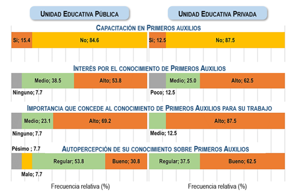
  <p>
    <i><b>Fuente:</b> Caicedo Vega y Zumbado Fernández (2023).</i>
  </p>
</div>

El gráfico evidencia que un nivel alto de interés o una autopercepción favorable no garantizan haber recibido capacitación ni poseer conocimientos suficientes. Para SafeStep, esta diferencia justifica medir comportamientos observables —como decisiones correctas, finalización de escenarios o reducción de errores— además de opiniones de satisfacción o confianza.

<a id="toc-enunciado-del-problema"></a>
### Enunciado del problema

Las personas interesadas en aprender primeros auxilios encuentran contenido disperso, experiencias predominantemente pasivas y pocas oportunidades accesibles para practicar la toma de decisiones y recibir retroalimentación. Como consecuencia, pueden percibirse preparadas sin haber comprobado su comprensión en escenarios simulados.

A esta brecha educativa se suma una brecha de preparación material: algunos usuarios desconocen qué insumos no farmacológicos son adecuados para un botiquín básico, cómo revisar su vigencia o cómo relacionarlos con situaciones concretas. No obstante, la disponibilidad de productos no equivale a competencia práctica; SafeStep debe evitar transmitir que una compra reemplaza la capacitación.

<a id="toc-aspectos-que-debe-resolver-la-propuesta"></a>
### Aspectos que debe resolver la propuesta

SafeStep debe abordar los siguientes aspectos:

- Acceso a experiencias breves y comprensibles de práctica guiada.
- Retroalimentación inmediata sobre las decisiones tomadas.
- Seguimiento del progreso y repetición de escenarios.
- Uso de elementos de gamificación sin distraer del objetivo educativo.
- Comunicación clara de los límites de una simulación digital.
- Contenido trazable a fuentes confiables y sujeto a revisión.
- Accesibilidad e internacionalización de la experiencia.
- Recomendaciones comerciales transparentes que no exploten la preocupación del usuario.
- Recolección ética y mínima de datos para evaluar el producto y ejecutar experimentos.

<a id="toc-estado-actual-de-la-solucion"></a>
### Estado actual de la solución

La siguiente tabla delimita el estado As-Is del producto y evita presentar como implementadas capacidades que todavía pertenecen a una visión futura.

| Capacidad | Estado As-Is | Observación |
|---|---|---|
| Landing page informativa | Implementada | Presenta la propuesta y dirige a la aplicación web. |
| Registro, inicio de sesión y perfil | Implementados | Se utiliza autenticación con JWT. |
| Simulaciones interactivas | Implementadas | Incluyen escenarios, intentos y retroalimentación. |
| Gamificación | Implementada | Incluye experiencia, SafeCoins, misiones, insignias y ranking. |
| Progreso, estadísticas y certificados internos | Implementados | Son reconocimientos de la plataforma, no certificaciones profesionales. |
| Tienda, carrito y pedidos | Implementados | Incluye integración con Stripe Checkout. |
| Recomendaciones de productos | Implementadas de forma inicial | Su utilidad y aceptación todavía deben medirse. |
| Aplicación móvil nativa | No implementada | La solución disponible es una aplicación web responsiva. |
| Funcionamiento offline | No implementado | Se mantiene como posibilidad futura. |
| Suscripción premium | No implementada | Es una hipótesis del modelo de negocio. |
| Portal operativo para instructores | No implementado | El rol existe conceptualmente, pero no hay una experiencia completa. |
| Plataforma de experimentación y tracking | No implementada | Forma parte del alcance del nuevo curso. |

<a id="toc-objetivo-general"></a>
### Objetivo general

Evaluar y evolucionar SafeStep como plataforma web de aprendizaje de primeros auxilios mediante verificación del software, automatización del ciclo de entrega y experimentos controlados que produzcan evidencia sobre el comportamiento y las necesidades de sus usuarios.

<a id="toc-objetivos-especificos"></a>
### Objetivos específicos

- Caracterizar las necesidades de estudiantes universitarios, comunidades vecinales y brigadistas mediante fuentes documentales, entrevistas y observación de uso.
- Verificar las funcionalidades principales mediante pruebas unitarias, de integración, comportamiento y sistema.
- Implementar un pipeline reproducible de integración, entrega, despliegue y monitoreo continuo.
- Definir métricas de negocio y de producto con fórmulas, fuentes de datos y criterios de interpretación.
- Diseñar y ejecutar experimentos éticos que contrasten hipótesis sobre comprensión, confianza, finalización, retención e interacción con recomendaciones.
- Analizar los resultados obtenidos y convertirlos en decisiones justificadas para el backlog del producto.
- Mantener el contenido educativo y las comunicaciones comerciales separados, transparentes y sujetos a revisión.

<a id="toc-restricciones"></a>
### Restricciones

- SafeStep es una herramienta complementaria y no reemplaza la atención médica, los servicios de emergencia ni la capacitación práctica acreditada.
- El equipo no debe afirmar que un usuario está preparado para una emergencia real basándose únicamente en una simulación digital.
- El contenido médico debe estar respaldado por fuentes identificables y revisarse cuando cambien los protocolos aplicables.
- La tienda debe priorizar insumos no farmacológicos y cumplir las normas peruanas de comercio electrónico, protección al consumidor y protección de datos.
- Las recomendaciones de compra no deben presentarse como prescripciones médicas.
- Los experimentos deben aplicar consentimiento informado cuando corresponda, minimizar datos personales y evitar patrones manipulativos.
- La solución As-Is es web responsiva; cualquier aplicación móvil nativa u operación offline requiere diseño e implementación adicional.
- El alcance está condicionado por el tiempo del ciclo académico, el acceso a participantes y los servicios gratuitos o de bajo costo disponibles para despliegue y monitoreo.

<a id="toc-tecnica-de-the-5-w-s-y-2-h-s"></a>
### Técnica de The 5 W's y 2 H's

<a id="toc-what-que-ocurre"></a>
#### What — ¿Qué ocurre?

Existe una brecha entre el interés por aprender primeros auxilios y la posibilidad de practicar decisiones, recibir retroalimentación y comprobar la comprensión de manera accesible. También existe incertidumbre sobre el valor real que aportan la gamificación y las recomendaciones de productos dentro de la experiencia educativa.

<a id="toc-when-cuando-ocurre"></a>
#### When — ¿Cuándo ocurre?

La brecha aparece durante el aprendizaje inicial, al intentar recordar procedimientos después de un periodo sin práctica y al enfrentar información dispersa. SafeStep se utiliza de manera preventiva y formativa, no durante una emergencia como sustituto de los servicios especializados.

<a id="toc-where-donde-ocurre"></a>
#### Where — ¿Dónde ocurre?

El aprendizaje puede realizarse desde hogares, universidades, espacios comunitarios o centros laborales mediante dispositivos con acceso web. Las emergencias relacionadas con el dominio pueden ocurrir en esos mismos entornos, pero la aplicación se enfoca en preparación previa y práctica simulada.

<a id="toc-who-a-quien-afecta"></a>
#### Who — ¿A quién afecta?

Afecta principalmente a estudiantes universitarios, miembros de comunidades vecinales y brigadistas que desean adquirir o reforzar conocimientos. Las víctimas potenciales de una respuesta incorrecta son beneficiarios indirectos, pero no son usuarios necesariamente.

<a id="toc-why-por-que-ocurre"></a>
#### Why — ¿Por qué ocurre?

Entre las posibles causas se encuentran el acceso limitado a práctica guiada, la dependencia de contenidos pasivos, la falta de refuerzo, la sobreestimación del conocimiento propio y la dificultad para evaluar la calidad de la información disponible. Estas causas deben tratarse como explicaciones sustentadas o supuestos por comprobar, no como verdades universales.

<a id="toc-how-como-se-aborda"></a>
#### How — ¿Cómo se aborda?

SafeStep ofrece escenarios interactivos, alternativas de decisión, retroalimentación, repetición, progreso y gamificación. El nuevo ciclo incorporará pruebas automatizadas, despliegue continuo, instrumentación y experimentos para determinar qué elementos generan resultados útiles.

<a id="toc-how-much-cual-es-la-magnitud"></a>
#### How much — ¿Cuál es la magnitud?

Las fuentes revisadas evidencian brechas relevantes en poblaciones específicas, pero no permiten calcular directamente el tamaño del problema o del mercado total de SafeStep. La magnitud para los segmentos seleccionados se estimará con datos secundarios claramente citados y con datos primarios obtenidos durante entrevistas y experimentos. Las cifras de conversión, disposición de pago y recompra se consideran desconocidas hasta ser medidas.

<a id="toc-1-2-2-lean-ux-process"></a>
## 1.2.2. Lean UX Process

El Lean UX Process permite relacionar necesidades de usuarios, resultados de negocio y decisiones de producto mediante ciclos de construcción, medición y aprendizaje. En esta etapa se documentan creencias iniciales; no se presentan como hechos comprobados. Las hipótesis Lean UX de esta sección servirán posteriormente como material de entrada para las preguntas e hipótesis experimentales del Capítulo VIII.

<a id="toc-1-2-2-1-lean-ux-problem-statements"></a>
### 1.2.2.1. Lean UX Problem Statements

<a id="toc-domain"></a>
#### Domain

Educación preventiva digital, práctica simulada de primeros auxilios y preparación responsable ante emergencias cotidianas.

<a id="toc-customer-segments"></a>
#### Customer segments

- **Segmento inicial:** estudiantes universitarios.
- **Segmentos secundarios:** miembros de comunidades vecinales y brigadistas.

Se prioriza inicialmente a estudiantes universitarios porque el equipo puede acceder a participantes de este segmento durante el ciclo académico y porque su familiaridad digital facilita observar el uso de una plataforma web. Esta decisión no supone que sea el segmento con mayor valor comercial; dicha afirmación deberá comprobarse.

<a id="toc-pain-points"></a>
#### Pain points

- Acceso limitado a oportunidades de práctica frecuente.
- Contenidos extensos o pasivos que dificultan mantener la atención.
- Falta de retroalimentación inmediata.
- Incertidumbre sobre cuánto se comprende o recuerda.
- Dificultad para identificar información y productos confiables.
- Falta de claridad sobre la relación entre progreso, recompensas y aprendizaje.

<a id="toc-gap"></a>
#### Gap

Las alternativas existentes pueden ofrecer información, capacitación presencial o venta de productos por separado. La oportunidad identificada consiste en comprobar si una experiencia digital integrada puede facilitar práctica guiada, seguimiento y preparación responsable sin sustituir la formación profesional.

<a id="toc-vision-and-strategy"></a>
#### Vision and strategy

Chronos busca que SafeStep se convierta en una plataforma de aprendizaje continuo que tome decisiones de producto a partir de evidencia. La estrategia consiste en ofrecer una experiencia web accesible, medir los principales recorridos, probar cambios pequeños y conservar únicamente aquellos que demuestren aportar valor sin comprometer la seguridad ni la autonomía del usuario.

<a id="toc-initial-segment"></a>
#### Initial segment

El primer ciclo de descubrimiento y experimentación se enfocará en estudiantes universitarios mayores de edad con acceso habitual a internet y sin requerir experiencia previa en primeros auxilios. Los demás segmentos se investigarán progresivamente y no se asumirán equivalentes.

<a id="toc-problem-statement"></a>
#### Problem statement

Hemos observado que estudiantes universitarios interesados en primeros auxilios disponen de información, pero cuentan con pocas oportunidades accesibles para practicar decisiones y recibir retroalimentación. Esto puede producir una diferencia entre su confianza percibida y su desempeño en escenarios simulados. SafeStep explorará si una experiencia web interactiva, clara y repetible mejora la finalización, la comprensión y la disposición a continuar practicando. El éxito se evaluará mediante métricas previamente definidas y no solo mediante opiniones positivas.

<a id="toc-1-2-2-2-lean-ux-assumptions"></a>
### 1.2.2.2. Lean UX Assumptions

<a id="toc-business-assumptions"></a>
#### Business assumptions

- Existe interés en una experiencia digital complementaria de aprendizaje de primeros auxilios.
- Una parte de los usuarios podría valorar servicios avanzados o productos relacionados, pero su disposición de pago es desconocida.
- La sostenibilidad dependerá de retención, uso recurrente y confianza, no únicamente de registros o visitas.
- Integrar educación y comercio podría aportar conveniencia, pero también generar desconfianza si la recomendación no es transparente.

<a id="toc-user-assumptions"></a>
#### User assumptions

- Los estudiantes universitarios utilizan con familiaridad aplicaciones web y experiencias gamificadas.
- Los usuarios valoran explicaciones breves y retroalimentación inmediata.
- La confianza declarada puede diferir del desempeño observable.
- Los brigadistas tienen necesidades diferentes de las personas sin formación previa.
- Los miembros de comunidades vecinales pueden priorizar claridad, accesibilidad y aplicación en el hogar.

<a id="toc-problem-assumptions"></a>
#### Problem assumptions

- La falta de práctica frecuente contribuye a errores y olvido.
- Parte del contenido disponible es percibido como extenso, fragmentado o difícil de aplicar.
- Los usuarios necesitan comprender los límites de una simulación digital.
- El sistema actual puede no explicar suficientemente la relación entre misiones, recompensas, progreso y aprendizaje.

<a id="toc-solution-assumptions"></a>
#### Solution assumptions

- Los escenarios ramificados pueden favorecer la práctica de toma de decisiones.
- La retroalimentación inmediata puede ayudar a reconocer errores.
- La repetición y el progreso visible pueden promover continuidad.
- La gamificación puede motivar, aunque también podría distraer.
- Mostrar fuentes y criterios de revisión puede aumentar la confianza.
- Explicar por qué se recomienda un producto puede ser mejor recibido que mostrar una recomendación sin contexto.

<a id="toc-risks-and-knowledge-gaps"></a>
#### Risks and knowledge gaps

- No se conoce la frecuencia real con la que los usuarios repetirán simulaciones.
- No se conoce qué elementos de gamificación aportan valor educativo.
- No se conoce la disposición de pago ni la intención real de compra.
- No se ha comprobado que las recomendaciones comerciales mejoren la experiencia.
- No se ha medido la retención del aprendizaje en el tiempo.
- Existe riesgo de que el usuario interprete la plataforma como sustituto de capacitación profesional.
- Existe riesgo de sesgo si la muestra se limita a compañeros cercanos al equipo.

<a id="toc-1-2-2-3-lean-ux-hypothesis-statements"></a>
### 1.2.2.3. Lean UX Hypothesis Statements

Las siguientes hipótesis son preliminares y deberán transformarse en diseños experimentales con hipótesis nula, medidas, condiciones y escala en el Capítulo VIII.

<a id="toc-lh-01-claridad-del-primer-uso"></a>
#### LH-01 — Claridad del primer uso

Creemos que explicar, antes de la primera simulación, el objetivo educativo, el funcionamiento de las decisiones y el significado de las recompensas ayudará a los estudiantes universitarios sin experiencia previa. Sabremos que existe evidencia favorable cuando aumente la proporción de usuarios que inicia y completa su primera simulación sin incrementar la tasa de abandono.

<a id="toc-lh-02-retroalimentacion-accionable"></a>
#### LH-02 — Retroalimentación accionable

Creemos que una retroalimentación que explique el motivo de cada decisión ayudará a los usuarios que completan simulaciones. Sabremos que existe evidencia favorable cuando disminuyan los errores repetidos en un segundo intento comparable.

<a id="toc-lh-03-confianza-y-trazabilidad"></a>
#### LH-03 — Confianza y trazabilidad

Creemos que mostrar fuentes, fecha de revisión y límites educativos aumentará la confianza informada en SafeStep. Sabremos que existe evidencia favorable cuando los usuarios identifiquen correctamente el propósito y los límites de la plataforma y aumente su intención de continuar practicando.

<a id="toc-lh-04-gamificacion-con-sentido-educativo"></a>
#### LH-04 — Gamificación con sentido educativo

Creemos que relacionar misiones e insignias con objetivos de aprendizaje concretos motivará la práctica recurrente sin desviar la atención hacia recompensas aisladas. Sabremos que existe evidencia favorable cuando aumente la repetición voluntaria de simulaciones y se mantenga o mejore el desempeño.

<a id="toc-lh-05-recomendaciones-transparentes"></a>
#### LH-05 — Recomendaciones transparentes

Creemos que explicar la relación entre una simulación y un producto no farmacológico recomendado generará mayor comprensión y aceptación que una recomendación sin justificación. Sabremos que existe evidencia favorable cuando aumente la interacción informada con la recomendación sin reducir la confianza en el contenido educativo.

<a id="toc-1-2-2-4-lean-ux-canvas"></a>
### 1.2.2.4. Lean UX Canvas

El Lean UX Canvas actualizado sintetiza el estado de la estrategia y diferencia las capacidades actuales de las hipótesis pendientes de comprobación.

<div align="center">
  <p>
    <b>Gráfico 2.</b> Lean UX Canvas actualizado de SafeStep
  </p>
  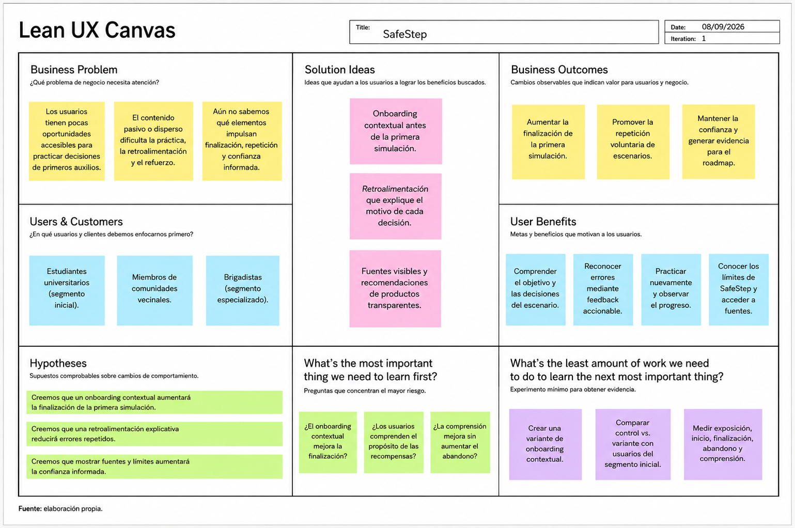
  <p>
    <i><b>Fuente:</b> elaboración propia.</i>
  </p>
</div>

El canvas establece como aprendizaje prioritario determinar si un onboarding contextual mejora la finalización y la comprensión de la primera simulación. Para obtener evidencia con el menor trabajo útil, propone comparar una condición de control con una variante que incorpora el onboarding y medir exposición, inicio, finalización, abandono y comprensión.

Las posibles soluciones futuras —como modo offline, suscripción premium o un portal completo para instructores— no se presentan como capacidades actuales ni forman parte de este primer experimento.

El canvas se revisará después de cada ciclo de aprendizaje. Los cambios deberán sustentarse con resultados del Question Backlog, los experimentos y las entrevistas, evitando convertir una observación aislada en una conclusión general.

<br>

<br>
<br>

<div align="center">
  
</div>

<br>
<br>

<a id="toc-1-3-segmentos-objetivo"></a>
# 1.3. Segmentos objetivo

SafeStep considera tres segmentos vinculados con el aprendizaje y la práctica de primeros auxilios: estudiantes universitarios, miembros de comunidades vecinales y brigadistas. Los segmentos no se consideran homogéneos ni intercambiables; difieren en experiencia previa, contexto de uso, necesidades y criterios de confianza.

Para el primer ciclo de experimentación se prioriza a los **estudiantes universitarios mayores de edad**. La priorización responde al acceso razonable a participantes durante el ciclo académico y a la posibilidad de observar su interacción con una aplicación web. No implica que este sea el segmento con mayor rentabilidad. Las afirmaciones sobre conversión, frecuencia de compra o disposición de pago se tratarán como preguntas de investigación hasta contar con evidencia.

<a id="toc-1-3-1-estudiantes-universitarios"></a>
## 1.3.1. Estudiantes universitarios

<a id="toc-caracteristicas-demograficas-y-contextuales"></a>
### Características demográficas y contextuales

- **Edad de referencia:** principalmente entre 18 y 25 años.
- **Nivel educativo:** estudios universitarios en curso.
- **Ubicación inicial:** Lima Metropolitana y otras zonas urbanas del Perú.
- **Acceso digital:** uso frecuente de teléfonos inteligentes, computadoras y plataformas web.
- **Experiencia previa:** variable; no se presupone capacitación formal en primeros auxilios.
- **Contextos relevantes:** universidad, hogar, transporte, actividades deportivas y espacios públicos.

Lozano Villegas (2024) estudió factores asociados al nivel de conocimiento de primeros auxilios en estudiantes de la Universidad Ricardo Palma. En la población analizada, el 43,2 % tenía entre 18 y 20 años y el 56,8 % superaba los 20 años; el 51,4 % eran mujeres y el 48,6 % hombres. El estudio también reportó que el 29,6 % había llevado un curso de primeros auxilios y que el 95,6 % mostraba interés en capacitarse. Estos resultados corresponden a una institución y periodo específicos, por lo que sirven como antecedente y no como representación automática de todos los universitarios peruanos.

<a id="toc-necesidades-y-comportamiento-esperado"></a>
### Necesidades y comportamiento esperado

Los estudiantes pueden valorar experiencias breves, accesibles desde dispositivos de uso cotidiano y compatibles con horarios variables. SafeStep puede permitirles practicar decisiones en escenarios simulados, reconocer errores y revisar su progreso.

Su familiaridad digital no garantiza que comprendan la interfaz, el contenido médico o el sistema de recompensas. Por ello, deberán evaluarse la claridad del primer uso, la comprensión de la retroalimentación, la accesibilidad y la diferencia entre confianza declarada y desempeño observable.

<a id="toc-relacion-con-la-propuesta-de-valor"></a>
### Relación con la propuesta de valor

La propuesta para este segmento se centra en:

- Acceso web a simulaciones guiadas.
- Retroalimentación inmediata.
- Repetición de escenarios.
- Progreso y gamificación vinculados con objetivos educativos.
- Comunicación de fuentes y límites del producto.
- Recomendaciones transparentes de insumos no farmacológicos.

La intención de compra, la disposición de pago y la frecuencia de uso no se consideran demostradas. Se medirán mediante entrevistas, observación y experimentos.

<a id="toc-1-3-2-comunidades-vecinales"></a>
## 1.3.2. Comunidades vecinales

<a id="toc-caracteristicas-demograficas-y-contextuales-1"></a>
### Características demográficas y contextuales

- **Edad de referencia:** personas adultas, principalmente entre 25 y 60 años.
- **Perfil:** madres, padres, cuidadores, vecinos y responsables de seguridad comunitaria.
- **Ubicación:** zonas urbanas y semiurbanas.
- **Nivel educativo:** diverso.
- **Acceso digital:** heterogéneo según edad, conectividad y experiencia tecnológica.
- **Contextos relevantes:** hogar, edificios residenciales, barrios y actividades comunitarias.

El Gobierno Regional de La Libertad (2017) señaló que el 70 % de los peruanos no tenía conocimientos de primeros auxilios para actuar ante víctimas de accidentes de tránsito. Esta cifra procede de una comunicación institucional y debe utilizarse como antecedente contextual, no como estimación actual de todas las comunidades del país.

Las comunidades vecinales comprenden perfiles diversos. Una persona encargada del cuidado de niños, una persona que convive con adultos mayores y un coordinador de seguridad vecinal pueden tener prioridades distintas. En consecuencia, futuras investigaciones deberán precisar subsegmentos y evitar diseñar una única experiencia basada en el concepto genérico de “familia”.

<a id="toc-necesidades-y-comportamiento-esperado-1"></a>
### Necesidades y comportamiento esperado

Este segmento puede requerir:

- Lenguaje sencillo y libre de tecnicismos innecesarios.
- Escenarios relacionados con situaciones domésticas y comunitarias.
- Navegación accesible desde teléfonos y computadoras.
- Explicaciones claras sobre cuándo buscar ayuda profesional.
- Orientación para organizar y revisar un botiquín básico.
- Transparencia sobre el origen del contenido y de las recomendaciones.

No debe asumirse que todas las personas poseen alta familiaridad con comercio electrónico ni que desean comprar inmediatamente después de aprender. La confianza, la utilidad percibida y la aceptación de recomendaciones deberán investigarse.

<a id="toc-relacion-con-la-propuesta-de-valor-1"></a>
### Relación con la propuesta de valor

SafeStep puede aportar práctica guiada y acceso flexible a contenidos preventivos. La tienda puede facilitar el reconocimiento de insumos básicos no farmacológicos, siempre que las recomendaciones se mantengan separadas de prescripciones médicas y no utilicen miedo o urgencia artificial para incentivar compras.

Las posibles compras familiares, reposiciones o modelos de suscripción constituyen hipótesis de negocio pendientes de evaluación.

<a id="toc-1-3-3-brigadistas"></a>
## 1.3.3. Brigadistas

<a id="toc-caracteristicas-demograficas-y-contextuales-2"></a>
### Características demográficas y contextuales

- **Edad:** población adulta; el rango dependerá del tipo de institución y de sus requisitos.
- **Perfil:** brigadistas voluntarios o institucionales, personal de apoyo y participantes de equipos de respuesta.
- **Formación:** experiencia teórica y práctica variable.
- **Ubicación:** empresas, universidades, municipalidades, establecimientos y organizaciones comunitarias.
- **Acceso digital:** uso funcional de herramientas web, condicionado por el entorno institucional.
- **Contextos relevantes:** capacitación periódica, simulacros, prevención y actualización de procedimientos.

El Ministerio de Salud del Perú (2025) informó que más de 4000 brigadistas de primera respuesta en salud habían sido formados mediante programas que incluyen gestión de riesgos, atención sanitaria básica, primeros auxilios y transporte asistido. Por su parte, el Poder Judicial del Perú (2019) presenta criterios particulares para la preparación de brigadas de emergencia. Estos antecedentes confirman que el brigadismo posee requisitos institucionales y no debe caracterizarse mediante un único rango de edad universal.

<a id="toc-necesidades-y-comportamiento-esperado-2"></a>
### Necesidades y comportamiento esperado

En comparación con usuarios sin formación, los brigadistas pueden requerir:

- Escenarios de mayor dificultad.
- Retroalimentación técnica y trazable.
- Repetición y comparación de desempeño.
- Contenido actualizado.
- Claridad sobre el alcance educativo de cada simulación.
- Evidencia de progreso que complemente, pero no sustituya, acreditaciones institucionales.

No debe asumirse que todos los brigadistas desean comprar equipos profesionales ni que poseen autoridad para realizar adquisiciones institucionales. Es necesario distinguir entre usuario, comprador y decisor de una organización.

<a id="toc-relacion-con-la-propuesta-de-valor-2"></a>
### Relación con la propuesta de valor

SafeStep puede utilizarse como recurso complementario para repaso y práctica individual. Antes de diseñar funcionalidades especializadas, deberá comprobarse si los escenarios actuales ofrecen suficiente profundidad y si la retroalimentación satisface las expectativas de personas con experiencia previa.

La venta de equipos especializados, los precios por volumen y los programas institucionales quedan fuera del alcance As-Is y se mantienen como oportunidades sujetas a investigación, regulación y alianzas con proveedores autorizados.

<a id="toc-1-3-4-priorizacion-y-comparacion-de-segmentos"></a>
## 1.3.4. Priorización y comparación de segmentos

| Dimensión | Estudiantes universitarios | Comunidades vecinales | Brigadistas |
|---|---|---|---|
| Experiencia previa esperada | Baja o variable | Baja o variable | Media o alta |
| Contexto principal | Universidad y vida cotidiana | Hogar y comunidad | Institucional y preventivo |
| Necesidad principal por investigar | Práctica accesible y retroalimentación | Claridad y aplicación cotidiana | Profundidad y actualización |
| Familiaridad digital esperada | Generalmente alta | Heterogénea | Media y dependiente de la institución |
| Rol en el primer ciclo experimental | Segmento inicial | Segmento secundario | Segmento secundario especializado |
| Riesgo de diseño | Confundir motivación con aprendizaje | Generalizar perfiles familiares | Simplificar en exceso contenido técnico |
| Supuesto comercial | No comprobado | No comprobado | No comprobado |

La priorización inicial permite trabajar con una población accesible sin excluir los demás segmentos. Después de cada ciclo experimental, el equipo deberá revisar esta decisión con base en la evidencia recopilada.

<a id="toc-1-3-5-criterios-para-reclutamiento-futuro"></a>
## 1.3.5. Criterios para reclutamiento futuro

Para mantener coherencia entre el Capítulo I y los experimentos posteriores, el reclutamiento deberá registrar como mínimo:

- Segmento al que pertenece la persona.
- Edad en rangos, evitando recolectar la fecha de nacimiento si no es necesaria.
- Experiencia previa en primeros auxilios.
- Experiencia con aplicaciones educativas.
- Dispositivo utilizado.
- Necesidades de accesibilidad declaradas.
- Consentimiento para participar y para el tratamiento de datos.
- Relación previa con integrantes del equipo, a fin de reconocer posibles sesgos.

No se recopilarán diagnósticos médicos ni otros datos sensibles que no sean necesarios para responder las preguntas experimentales. Los resultados deberán presentarse de forma agregada o anonimizada.

<br>

<div style="page-break-before: always;"></div>

<br>
<br>

<div align="center">
  
</div>

<br>
<br>

<a id="toc-2-1-competidores"></a>
# 2.1. Competidores

Se comparan tres productos digitales de primeros auxilios con SafeStep. Son **competidores directos por la atención y el tiempo de aprendizaje del usuario**, aunque no necesariamente por su modelo de ingresos. La Escuela Nacional de la Cruz Roja Peruana se considera una alternativa **indirecta** de capacitación formal, no una cuarta aplicación equivalente. El alcance geográfico, el idioma y las características pueden variar por versión; las observaciones corresponden a las fuentes oficiales consultadas el 16/09/2026. No se atribuyen a ningún producto carencias que no puedan verificarse.

Los tres productos digitales del cuadro son First Aid de British Red Cross, First Aid de American Red Cross y First Aid – IFRC. Sus fichas oficiales se enlazan en la cabecera. Como alternativa indirecta adicional se considera la [Escuela Nacional de la Cruz Roja Peruana](https://cruzroja.org.pe/escuela_nacional.html), que ofrece formación en primeros auxilios y RCP, pero no se equipara a una cuarta aplicación.

Estas ofertas no equivalen automáticamente a SafeStep. La comparación se centra en las tareas que una persona podría elegir para aprender, repasar o practicar antes de una emergencia. La capacitación institucional y la práctica presencial siguen siendo complementos necesarios: ninguna simulación digital acredita por sí sola competencia para actuar en una emergencia real.

<a id="toc-2-1-1-analisis-competitivo"></a>
## 2.1.1. Análisis competitivo

<a id="toc-competitive-analysis-landscape"></a>
### Competitive Analysis Landscape

<table border="1" cellpadding="6" cellspacing="0" width="100%">
  <tr>
    <th colspan="6" align="left">Competitive Analysis Landscape</th>
  </tr>
  <tr>
    <th colspan="2" align="left">¿Por qué llevar a cabo este análisis?</th>
    <td colspan="4">Identificar cómo aprenden y repasan primeros auxilios los usuarios mediante alternativas digitales, qué valor ofrece cada una y qué posible diferenciación de SafeStep aún debe comprobarse.</td>
  </tr>
  <tr>
    <th colspan="2" align="left">Startup y competidores</th>
    <th align="center"><br>SafeStep</th>
    <th align="center"><br><a href="https://www.redcross.org.uk/first-aid/first-aid-apps">British Red Cross</a></th>
    <th align="center"><br><a href="https://www.redcross.org/get-help/how-to-prepare-for-emergencies/mobile-apps.html">American Red Cross</a></th>
    <th align="center"><br><a href="https://play.google.com/store/apps/details?id=com.cube.gdpc.fa">IFRC</a></th>
  </tr>
  <tr>
    <th rowspan="2" scope="rowgroup">Perfil</th>
    <th align="left">Overview</th>
    <td>Plataforma web responsiva de práctica simulada de primeros auxilios, progreso y tienda. Producto de la startup Chronos.</td>
    <td>Aplicación de primeros auxilios de la sociedad nacional británica, con guías y recursos para aprender o consultar.</td>
    <td>Aplicación de la sociedad nacional estadounidense, con orientación paso a paso y recursos multimedia.</td>
    <td>Aplicación de la federación internacional con escenarios paso a paso y recursos de aprendizaje multilingües.</td>
  </tr>
  <tr>
    <th align="left">Ventaja competitiva: ¿qué valor ofrece a los clientes?</th>
    <td>Permite ensayar decisiones, revisar errores y repetir escenarios. Que ello genere una ventaja frente a otras apps es una hipótesis pendiente de medición.</td>
    <td>Información gratuita y respaldo institucional, con acceso a contenidos sin conexión.</td>
    <td>Consejos, videos y cuestionarios en una aplicación gratuita, con opción de inglés o español.</td>
    <td>Recursos gratuitos, contenido offline, seguimiento del progreso e insignias.</td>
  </tr>
  <tr>
    <th rowspan="2" scope="rowgroup">Perfil de Marketing</th>
    <th align="left">Mercado objetivo</th>
    <td>Primer ciclo: estudiantes universitarios peruanos mayores de edad. Comunidades vecinales y brigadistas son segmentos secundarios.</td>
    <td>Público que busca aprender o consultar primeros auxilios; oferta desarrollada en el contexto británico.</td>
    <td>Público general que busca orientación básica en primeros auxilios; oferta desarrollada en el contexto estadounidense.</td>
    <td>Público internacional interesado en primeros auxilios y preparación ante emergencias.</td>
  </tr>
  <tr>
    <th align="left">Estrategias de marketing</th>
    <td>Landing page informativa. La captación por alianzas, campañas o planes de pago no está validada en el alcance As-Is.</td>
    <td>Difusión desde el portal y los recursos educativos oficiales de British Red Cross.</td>
    <td>Difusión desde el portal de aplicaciones y los recursos formativos oficiales de American Red Cross.</td>
    <td>Disponibilidad en tiendas de aplicaciones y vinculación con sociedades nacionales de la Cruz Roja y Media Luna Roja.</td>
  </tr>
  <tr>
    <th rowspan="3" scope="rowgroup">Perfil de Producto</th>
    <th align="left">Productos &amp; Servicios</th>
    <td>Simulaciones, intentos, retroalimentación, gamificación, seguimiento, tienda y pedidos. Los certificados son internos.</td>
    <td>Guías paso a paso, videos y cuestionarios; funciona sin internet.</td>
    <td>Guías, videos, cuestionarios, localización de hospitales y acceso a certificaciones de cursos obtenidos por otras vías.</td>
    <td>Escenarios paso a paso, cuestionarios, progreso, insignias, contenido precargado y varios idiomas.</td>
  </tr>
  <tr>
    <th align="left">Precios &amp; Costos</th>
    <td>No existe suscripción premium. La tienda muestra precios de productos; el costo operativo del servicio no se cuantifica aquí.</td>
    <td>Aplicación gratuita; los cursos son una oferta separada.</td>
    <td>Aplicación gratuita; los cursos son una oferta separada.</td>
    <td>Aplicación gratuita.</td>
  </tr>
  <tr>
    <th align="left">Canales de distribución (Web y/o Móvil)</th>
    <td>Web responsiva. No hay aplicación móvil nativa ni funcionamiento offline implementados.</td>
    <td>Aplicación móvil y recursos web de la institución.</td>
    <td>Aplicación móvil y recursos web de la institución.</td>
    <td>Aplicación móvil con contenido precargado.</td>
  </tr>
  <tr>
    <th rowspan="5" scope="rowgroup">Análisis SWOT</th>
    <td colspan="5">Comparación de fortalezas y debilidades internas, y de oportunidades y amenazas del entorno. Las oportunidades y amenazas son inferencias estratégicas; no acreditan superioridad de una oferta. Las fortalezas de SafeStep deben ponerse a prueba para establecer su posible ventaja competitiva.</td>
  </tr>
  <tr>
    <th align="left">Fortalezas</th>
    <td>Simulaciones web con decisiones y retroalimentación; enfoque inicial en usuarios peruanos.</td>
    <td>Respaldo institucional, gratuidad, cuestionarios y acceso offline.</td>
    <td>Respaldo institucional, videos, cuestionarios y opción en español.</td>
    <td>Alcance internacional, varios idiomas, offline, progreso e insignias.</td>
  </tr>
  <tr>
    <th align="left">Debilidades</th>
    <td>Sin app nativa, modo offline ni acreditación profesional; medición experimental pendiente.</td>
    <td>La adecuación de su contenido al segmento peruano de SafeStep no se ha evaluado en este estudio.</td>
    <td>La adecuación de su contenido al segmento peruano de SafeStep no se ha evaluado en este estudio.</td>
    <td>La experiencia específica de estudiantes peruanos no se ha evaluado en este estudio.</td>
  </tr>
  <tr>
    <th align="left">Oportunidades</th>
    <td>Probar onboarding, claridad del feedback y práctica repetida con participantes locales.</td>
    <td>Adaptar recursos a contextos y públicos adicionales.</td>
    <td>Ampliar el alcance de recursos en español y contextos locales.</td>
    <td>Profundizar la localización y colaboración con sociedades nacionales.</td>
  </tr>
  <tr>
    <th align="left">Amenazas</th>
    <td>Alternativas gratuitas y reconocidas; riesgo de prometer aprendizaje no demostrado.</td>
    <td>Otras aplicaciones gratuitas y expectativas cambiantes de aprendizaje.</td>
    <td>Alternativas con recorridos adaptados a contextos locales.</td>
    <td>Alternativas locales más pertinentes para ciertos casos de uso.</td>
  </tr>
</table>

Las descripciones de los competidores se basan en las fichas oficiales enlazadas en la cabecera; el estado de SafeStep se delimita en [1.2. Solution Profile](../chapter-1/1-2-solution-profile.md). «No se ha evaluado» expresa un límite de este análisis, no la ausencia de una capacidad del competidor. Ningún cuestionario, insignia o certificado interno equivale por sí solo a una acreditación profesional.

**Conclusión:** SafeStep no puede alegar «única app interactiva», «única app gamificada» ni superioridad pedagógica general: IFRC y American Red Cross ya ofrecen cuestionarios, y IFRC incluye progreso e insignias. La **posible** ventaja de SafeStep es un recorrido web localizado de decisiones, explicación de errores y repetición que facilite comprender y completar una primera simulación. Esa ventaja queda como hipótesis de comparación y deberá medirse en el Capítulo VIII.

<a id="toc-2-1-2-estrategias-y-tacticas-frente-a-competidores"></a>
## 2.1.2. Estrategias y tácticas frente a competidores

Las acciones siguientes responden a hallazgos del Landscape y del FODA. Se distinguen cambios implementables en el nuevo ciclo de ideas dependientes de alianzas externas.

| Hallazgo competitivo | Estrategia | Táctica comprobable | Evidencia de éxito o decisión |
| --- | --- | --- | --- |
| Las apps oficiales ya ofrecen contenidos, cuestionarios y, en el caso de IFRC, progreso e insignias | Diferenciar la **comprensión del recorrido**, no solo la existencia de funciones | Comparar onboarding actual con una variante contextual antes de la primera simulación | Exposición, inicio, finalización, abandono y comprensión; conservar el cambio solo si mejora el resultado sin perjuicios relevantes |
| La autoridad de las organizaciones competidoras favorece la confianza | Transparencia sobre fuentes y límites educativos | Mostrar fuente, fecha de revisión y aviso de que SafeStep no sustituye atención ni formación acreditada | Comprensión de límites y confianza informada en entrevistas y pruebas |
| El certificado interno de SafeStep no equivale a una acreditación | Evitar promesas de aval institucional no obtenido | Etiquetar claramente certificados e insignias como reconocimientos internos | Menos confusión observada entre reconocimiento y acreditación profesional |
| British Red Cross e IFRC ofrecen contenido offline; SafeStep aún no | Priorizar según necesidad observada, no por paridad de características | Investigar conectividad y frecuencia de uso antes de estimar un modo offline | Evidencia de necesidad y viabilidad; no prometer una fecha de lanzamiento |
| Los tres competidores digitales ofrecen acceso gratuito | No asumir disposición de pago | Mantener los precios y modelos premium como preguntas de investigación; medir utilidad percibida antes de monetizar | Entrevistas y experimentos específicos; no inferir demanda de una muestra pequeña |
| Una recomendación comercial puede afectar la confianza educativa | Separar aprendizaje y comercio | Explicar por qué se muestra un insumo no farmacológico y permitir ignorarlo | Interacción informada sin pérdida de confianza ni interrupción del aprendizaje |

No se declara como táctica vigente una alianza con la Cruz Roja, MINSA u otra institución: requiere coordinación y autorización de dichas entidades. La estrategia de corto plazo es mejorar y medir el producto propio; una acreditación externa sería un proyecto distinto.

<br>

<br>
<br>

<div align="center">
    
</div>

<br>
<br>

<a id="toc-2-2-entrevistas"></a>
# 2.2. Entrevistas

<a id="toc-2-2-1-diseno-de-entrevistas"></a>
## 2.2.1. Diseño de entrevistas

Las diez entrevistas documentadas se realizaron previamente con un guion exploratorio. Para no alterar el registro histórico, la siguiente **guía revisada** organiza las preguntas que deben emplearse en nuevas sesiones o entrevistas complementarias. Los resúmenes de 2.2.2 se redactaron a partir de los registros originales y solo usan respuestas disponibles; no afirman que estas nuevas preguntas se hayan aplicado. La ausencia de respuesta se registra como dato no documentado.

**Objetivo:** comprender comportamientos actuales de aprendizaje y práctica, barreras, dispositivos, fuentes de confianza y contexto personal antes de presentar SafeStep. Primero se preguntan experiencias pasadas y tareas concretas; al final se exploran reacciones a una posible solución, sin asumir interés, pago o eficacia. La persona puede omitir preguntas. Se debe explicar el propósito, solicitar autorización para grabar y para publicar imágenes o nombres, y separar ese permiso del consentimiento para participar. La fecha, modalidad, duración y permiso deben quedar en una ficha de campo; no se reconstruyen retroactivamente.

<a id="toc-guia-revisada-estudiantes-universitarios"></a>
### Guía revisada: estudiantes universitarios

1. ¿Qué edad tienes, en qué distrito vives, qué estudias y cómo es una semana habitual de estudio? ¿Hay responsabilidades familiares o laborales que afecten tu tiempo?
2. Cuéntame la última vez que buscaste información o capacitación en primeros auxilios. ¿Qué necesitabas resolver, dónde buscaste y cómo decidiste si la fuente era confiable?
3. ¿Qué cursos o charlas has recibido? ¿Qué recuerdas haber practicado y qué no pudiste practicar?
4. Piensa en una emergencia que te preocupe en la universidad, el hogar o el transporte. ¿Qué harías primero y en qué parte dudarías?
5. ¿Qué te dificulta aprender o repasar? ¿Qué te motiva a continuar y qué te hace abandonar?
6. ¿Qué dispositivos, navegador, aplicaciones y canales digitales usas para aprender? ¿Hay problemas de conectividad, accesibilidad o costo?
7. ¿Prefieres aprender solo, con otras personas o mediante ejercicios? Describe una experiencia concreta que te haya funcionado.
8. ¿Qué instituciones, personas, marcas o señales influyen en tu confianza en contenido de salud? ¿Qué significado atribuyes a una constancia o certificación?
9. Después de describir la idea de una simulación digital: ¿qué beneficio, riesgo o duda ves? ¿Qué necesitarías comprobar antes de usarla o recomendarla?
10. Solo si tiene sentido para la persona: ¿por qué recurso educativo has pagado realmente? ¿Qué condiciones deberían darse para considerar pagar por este tipo de aprendizaje?

<a id="toc-guia-revisada-miembros-de-comunidades-vecinales"></a>
### Guía revisada: miembros de comunidades vecinales

1. ¿Qué edad tienes, en qué distrito vives, a qué te dedicas y con quiénes compartes responsabilidades de cuidado o seguridad? ¿Participas en alguna organización vecinal?
2. Describe una situación reciente de accidente o preparación ante emergencias en tu comunidad. ¿Qué hicieron tú y tus vecinos?
3. ¿Dónde han aprendido primeros auxilios o recibido simulacros? ¿Qué les resultó útil y qué quedó sin resolver?
4. ¿Cómo buscan y comprueban información cuando tienen dudas? ¿Qué instituciones, personas o medios influyen en sus decisiones?
5. ¿Qué impide que tú o tus vecinos participen en capacitaciones: tiempo, costo, distancia, conectividad, lenguaje u otras razones? Da ejemplos.
6. ¿Qué tareas preferirías hacer individualmente y cuáles con el grupo? ¿Por qué?
7. ¿Qué dispositivos, navegador, aplicaciones y canales de comunicación usas? ¿Cuáles emplea habitualmente el grupo?
8. ¿Qué te haría confiar o desconfiar de una capacitación digital? ¿Qué tendría que demostrar antes de recomendarla?
9. Al final, después de explicar una posible simulación: ¿qué utilidad concreta ves y qué no resolvería?
10. ¿Quién toma decisiones de gasto en el hogar o la organización? ¿Existe alguna compra o capacitación previa comparable? No asumir disposición a pagar.

<a id="toc-guia-revisada-brigadistas"></a>
### Guía revisada: brigadistas

1. ¿Qué edad tienes, dónde vives, cuál es tu ocupación y qué institución, rol y experiencia efectiva tienes como brigadista?
2. Describe una capacitación reciente: frecuencia, contenidos, práctica, evaluación, fuentes y actualización de protocolos.
3. ¿Qué situaciones has atendido o practicado? Sin identificar pacientes, relata cómo se coordina el equipo y qué decisiones resultan difíciles.
4. ¿Cómo repasas entre capacitaciones? ¿Qué documentos, aplicaciones, dispositivos, navegador y canales digitales usas?
5. ¿Qué limitaciones observas en la formación actual? Distingue tiempo, costo, logística, realismo y diferencias de experiencia entre integrantes.
6. ¿Qué criterios e instituciones consideras fiables? ¿Cómo verificas versiones de protocolos y qué acreditación es necesaria para tu rol?
7. ¿Cuándo es preferible practicar individualmente y cuándo en equipo? Da un ejemplo de cada caso.
8. Después de presentar una posible simulación digital: ¿qué tareas podría apoyar y cuáles exigirían práctica presencial supervisada?
9. ¿Qué evidencia necesitarías para recomendarla? ¿Quién decide una eventual compra o licencia y con qué presupuesto comprobado?
10. ¿Hay características personales, responsabilidades o condiciones de conectividad que cambien tu forma de capacitarte? Solo registrar lo que la persona quiera compartir.

**Datos para arquetipos:** edad, distrito, ocupación, experiencia, objetivos, frustraciones, habilidades, preferencias, influencias, marcas, familia y personalidad se documentan solo si fueron preguntados y respondidos. No se deducen de fotografías, género ni lugar de residencia. Las preguntas sobre productos y certificaciones distinguen explícitamente reconocimientos internos de acreditaciones profesionales.

<a id="toc-2-2-2-registro-de-entrevistas"></a>
## 2.2.2. Registro de entrevistas

A continuación se presentan diez entrevistas: cuatro estudiantes universitarios (E01–E04), tres miembros de comunidades vecinales (C01–C03) y tres personas con experiencia como brigadistas (B01–B03). Cada ficha conserva **sin cambios** su imagen, URL y duración, y ahora incluye un resumen descriptivo en lugar de la transcripción pregunta por pregunta. La guía revisada de 2.2.1 no se presenta como el guion históricamente aplicado.

El material actual enlaza videos individuales en YouTube y SharePoint; no se observa en esta sección un video único editado de todas las entrevistas ni marcas de inicio en dicho video. Para cumplir estrictamente el statement, el equipo aún debe producirlo y alojarlo en Microsoft Stream/Clipchamp, comprobar acceso y registrar para cada entrevista el tiempo de inicio y la duración, manteniendo los enlaces originales como evidencia adicional. Las fechas y autorizaciones de publicación tampoco constan en los registros y deben recuperarse del material de campo, no inventarse.

<table align="center">
    <tr>
        <td colspan="2" align="center">
            <b>Entrevista N° 1</b>
        </td>
    </tr>
    <tr>
        <td width="30%" align="center">
            
        </td>
        <td width="70%">
            <b>Entrevistado</b>: Nataly Aguilar Ortiz <br/>
            <b>Entrevistador</b>: Jorge Brayan Ayala Fernandez <br/>
            <b>Duración</b>:  00:04:15 <br/>
            <b>Género</b>: Femenino <br/>
            <b>Edad</b>: 23 años <br/>
            <b>Segmento</b>: Estudiante <br/>
            <b>Lugar de Residencia</b>: Callao <br/>
        </td>
    </tr>
    <tr>
        <td colspan="2" align="center">
            Link de la entrevista: <a href="https://youtu.be/DEq_rtuM_Ng" style="word-break: break-all; overflow-wrap: anywhere;">https://youtu.be/DEq_rtuM_Ng</a>
        </td>
    </tr>
    <tr>
        <td colspan="2" align="center">
            
        </td>
    </tr>
    <tr>
        <td colspan="2" align="center">
            <b>Resumen de la entrevista (E01):</b>
        </td>
    </tr>
    <tr>
        <td colspan="2">
            <b>E01 — Nataly Aguilar Ortiz, 23 años, Callao, estudiante de Psicología.</b> Recibió una capacitación universitaria y la consideró útil, pero sostiene que es necesario continuar formándose. Le preocupan los accidentes de laboratorio. Estudia con laptop y usa Zoom, Meet y Teams. Prefiere aprender en grupo para intercambiar experiencias. La facilidad de uso y una certificación le transmitirían confianza. Expresó que consideraría pagar S/100–150 por un curso que juzgue bueno. No constan navegador, responsabilidades familiares, marcas personales ni evidencia de que haya usado SafeStep.
        </td>
    </tr>
</table>

<table align="center">
    <tr>
        <td colspan="2" align="center">
            <b>Entrevista N° 2</b>
        </td>
    </tr>
    <tr>
        <td width="30%" align="center">
            
        </td>
        <td width="70%">
            <b>Entrevistado</b>: Maria Elena Gamboa Azabache <br/>
            <b>Entrevistador</b>: Jorge Brayan Ayala Fernandez <br/>
            <b>Duración</b>:  00:04:00 <br/>
            <b>Género</b>: Femenino <br/>
            <b>Edad</b>: 21 años <br/>
            <b>Segmento</b>: Estudiante <br/>
            <b>Lugar de Residencia</b>: Comas <br/>
        </td>
    </tr>
    <tr>
        <td colspan="2" align="center">
            Link de la entrevista: <a href="https://www.youtube.com/watch?v=5td3gHjUBVw" style="word-break: break-all; overflow-wrap: anywhere;">https://www.youtube.com/watch?v=5td3gHjUBVw</a>
        </td>
    </tr>
    <tr>
        <td colspan="2" align="center">
            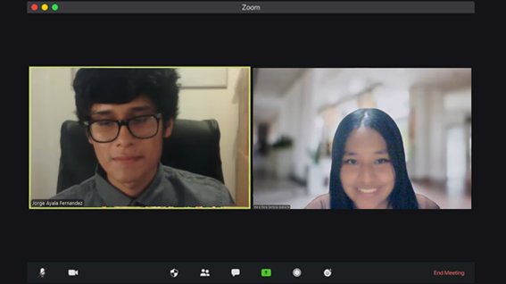
        </td>
    </tr>
    <tr>
        <td colspan="2" align="center">
            <b>Resumen de la entrevista (E02):</b>
        </td>
    </tr>
    <tr>
        <td colspan="2">
            <b>E02 — Maria Elena Gamboa Azabache, 21 años, Comas, estudiante universitaria.</b> No recibió capacitación en su universidad; solo tuvo una introducción breve. Se siente parcialmente preparada y considera que necesita práctica. Mencionó accidentes en laboratorios, laptop y celular, aula virtual, Classroom y Meet. Prefiere simulaciones y videos/casos breves; la calidad de la simulación y una certificación le generarían confianza. No fijó un precio: pidió probar primero una versión gratuita. No constan carrera, navegador ni situación familiar.
        </td>
    </tr>
</table>

<table align="center">
    <tr>
        <td colspan="2" align="center">
            <b>Entrevista N° 3</b>
        </td>
    </tr>
    <tr>
        <td width="30%" align="center">
            
        </td>
        <td width="70%">
            <b>Entrevistado</b>: Luciana Celeste, Sanchez Silva <br/>
            <b>Entrevistador</b>: Josep Eliu, Melgarejo Quiroz <br/>
            <b>Duración</b>:  00:06:03 <br/>
            <b>Género</b>: Femenino <br/>
            <b>Edad</b>: 20 años <br/>
            <b>Segmento</b>: Estudiante <br/>
            <b>Lugar de Residencia</b>: San Miguel <br/>
        </td>
    </tr>
    <tr>
        <td colspan="2" align="center">
            Link de la entrevista: <a href="https://youtu.be/N1L3TChMK6w" style="word-break: break-all; overflow-wrap: anywhere;">https://youtu.be/N1L3TChMK6w</a>
        </td>
    </tr>
    <tr>
        <td colspan="2" align="center">
            
        </td>
    </tr>
    <tr>
        <td colspan="2" align="center">
            <b>Resumen de la entrevista (E03):</b>
        </td>
    </tr>
    <tr>
        <td colspan="2">
            <b>E03 — Luciana Celeste Sanchez Silva, 20 años, San Miguel, estudiante de Ingeniería de Software.</b> No recibió capacitación formal y se considera poco preparada. Le preocupa especialmente un episodio de atragantamiento. Usa laptop y tablet, y mencionó Coursera y Blackboard. No eligió una única modalidad de aprendizaje; señaló sentirse cómoda con varias. Valora la calidad de simulación y una certificación. Indicó un máximo de S/18 para el curso hipotético. No constan navegador ni experiencia de uso del producto.
        </td>
    </tr>
</table>

<table align="center">
    <tr>
        <td colspan="2" align="center">
            <b>Entrevista N° 4</b>
        </td>
    </tr>
    <tr>
        <td width="30%" align="center">
            
        </td>
        <td width="70%">
            <b>Entrevistado</b>: Alessandro Daniel, Bravo Castillo <br/>
            <b>Entrevistador</b>: Rodrigo Jesus, Miraval Pomalaya <br/>
            <b>Duración</b>:  00:04:20 <br/>
            <b>Género</b>: Masculino <br/>
            <b>Edad</b>: 20 años <br/>
            <b>Segmento</b>: Estudiante <br/>
            <b>Lugar de Residencia</b>: San martin de Porres <br/>
        </td>
    </tr>
    <tr>
        <td colspan="2" align="center">
            Link de la entrevista: <a href="https://youtu.be/qjcDbt8-Obk" style="word-break: break-all; overflow-wrap: anywhere;">https://youtu.be/qjcDbt8-Obk</a>
        </td>
    </tr>
    <tr>
        <td colspan="2" align="center">
            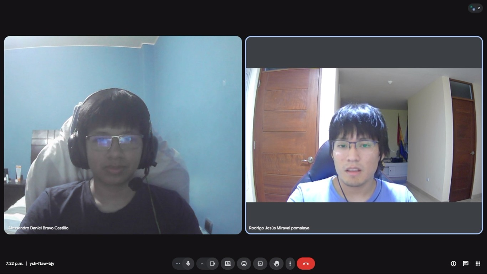
        </td>
    </tr>
    <tr>
        <td colspan="2" align="center">
            <b>Resumen de la entrevista (E04):</b>
        </td>
    </tr>
    <tr>
        <td colspan="2">
            <b>E04 — Alessandro Daniel Bravo Castillo, 20 años, San Martín de Porres, estudiante universitario.</b> Reportó charlas generales, no capacitación formal. Se siente medianamente preparado y anticipa nerviosismo ante una emergencia; le preocupan desmayos y accidentes de taller o laboratorio. Usa laptop y celular, y mencionó Classroom, Canva, YouTube, Moodle, Coursera y Udemy. Prefiere simulaciones interactivas, aunque también acepta trabajo grupal. Señaló un rango hipotético de S/40–80 condicionado a un curso completo y algún certificado. El registro base menciona dos áreas de estudio distintas; su carrera exacta requiere confirmación.
        </td>
    </tr>
</table>

<table align="center">
    <tr>
        <td colspan="2" align="center">
            <b>Entrevista N° 5</b>
        </td>
    </tr>
    <tr>
        <td width="30%" align="center">
            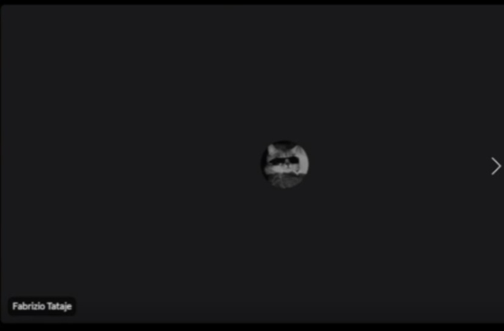
        </td>
        <td width="70%">
            <b>Entrevistado</b>: Fabrizio Ernesto Tataje <br/>
            <b>Entrevistador</b>: Rodrigo Jesus, Miraval Pomalaya <br/>
            <b>Duración</b>:  00:03:28 <br/>
            <b>Género</b>: Masculino <br/>
            <b>Edad</b>: 27 años <br/>
            <b>Segmento</b>: Comunidad vecinal <br/>
            <b>Lugar de Residencia</b>: San Miguel <br/>
        </td>
    </tr>
    <tr>
        <td colspan="2" align="center">
            Link de la entrevista: <a href="https://youtu.be/r7HQDIlXcsA" style="word-break: break-all; overflow-wrap: anywhere;">https://youtu.be/r7HQDIlXcsA</a>
        </td>
    </tr>
    <tr>
        <td colspan="2" align="center">
            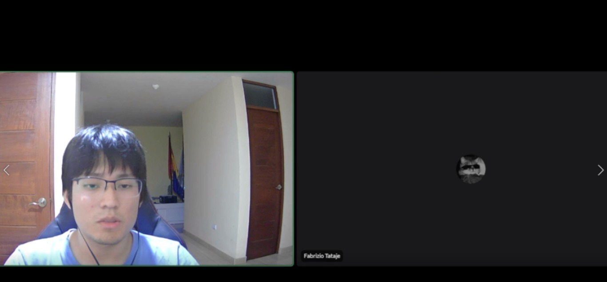
        </td>
    </tr>
    <tr>
        <td colspan="2" align="center">
            <b>Resumen de la entrevista (C01):</b>
        </td>
    </tr>
    <tr>
        <td colspan="2">
            <b>C01 — Fabrizio Ernesto Tataje, 27 años, San Miguel, programador independiente.</b> Recibió capacitación municipal, no desempeña un rol vecinal formal y considera insuficiente la preparación comunitaria. Identificó tiempo y falta de información como barreras. Usa iPhone e Instagram. Prefiere talleres grupales y asocia la formación con ayuda mutua. Consideraría una contribución comunitaria, pero no dio precio ni evidencia de compra. La entrevista no documenta navegador, situación familiar ni frecuencia de uso de redes.
        </td>
    </tr>
</table>

<table align="center">
    <tr>
        <td colspan="2" align="center">
            <b>Entrevista N° 6</b>
        </td>
    </tr>
    <tr>
        <td width="30%" align="center">
            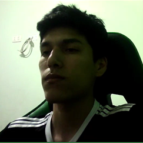
        </td>
        <td width="70%">
            <b>Entrevistado</b>: Rodrigo Nicolas, Alfaro Mancilla <br/>
            <b>Entrevistador</b>: Josep Eliu, Melgarejo Quiroz <br/>
            <b>Duración</b>:  00:05:24 <br/>
            <b>Género</b>: Masculino <br/>
            <b>Edad</b>: 27 años <br/>
            <b>Segmento</b>: Comunidad vecinal <br/>
            <b>Lugar de Residencia</b>: Chorrillos <br/>
        </td>
    </tr>
    <tr>
        <td colspan="2" align="center">
            Link de la entrevista: <a href="https://youtu.be/tcYkW5-9Oh" style="word-break: break-all; overflow-wrap: anywhere;">https://youtu.be/tcYkW5-9Oh</a>
        </td>
    </tr>
    <tr>
        <td colspan="2" align="center">
            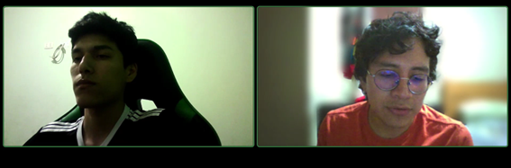
        </td>
    </tr>
    <tr>
        <td colspan="2" align="center">
            <b>Resumen de la entrevista (C02):</b>
        </td>
    </tr>
    <tr>
        <td colspan="2">
            <b>C02 — Rodrigo Nicolas Alfaro Mancilla, 27 años, Chorrillos, trabajador de reparación electrónica.</b> No recibió capacitación; participa como voluntario cuando hay actividades relevantes. Considera poco preparado a su vecindario e identifica accidentes domésticos entre los casos comunes. Señaló falta de tiempo, usa Instagram, TikTok y WhatsApp, y prefiere aprender individualmente. Cree que una suscripción podría aceptarse si se explica su valor, pero no comprometió una compra propia. No consta marca de teléfono, navegador ni configuración familiar.
        </td>
    </tr>
</table>

<table align="center">
    <tr>
        <td colspan="2" align="center">
            <b>Entrevista N° 7</b>
        </td>
    </tr>
    <tr>
        <td width="30%" align="center">
            
        </td>
        <td width="70%">
            <b>Entrevistado</b>: Rodrigo Andres Gonzales Portugal<br/>
            <b>Entrevistador</b>: Angel Thyago Flores Eusebio <br/>
            <b>Duración</b>:  00:05:34 <br/>
            <b>Género</b>: Masculino <br/>
            <b>Edad</b>: 20 años <br/>
            <b>Segmento</b>: Comunidad vecinal <br/>
            <b>Lugar de Residencia</b>: San Miguel <br/>
        </td>
    </tr>
    <tr>
        <td colspan="2" align="center">
            Link de la entrevista: <a href="https://upcedupe-my.sharepoint.com/:v:/g/personal/u20231b781_upc_edu_pe/IQDbFlhEINQvT45Otx80J_hnAbtQ9dRFtdzn2oUHG5tSYJQ?e=AZkgmM&nav=eyJyZWZlcnJhbEluZm8iOnsicmVmZXJyYWxBcHAiOiJTdHJlYW1XZWJBcHAiLCJyZWZlcnJhbFZpZXciOiJTaGFyZURpYWxvZy1MaW5rIiwicmVmZXJyYWxBcHBQbGF0Zm9ybSI6IldlYiIsInJlZmVycmFsTW9kZSI6InZpZXcifX0%3D" style="word-break: break-all; overflow-wrap: anywhere;">https://upcedupe-my.sharepoint.com/:v:/g/personal/u20231b781_upc_edu_pe/IQDbFlhEINQvT45Otx80J_hnAbtQ9dRFtdzn2oUHG5tSYJQ?e=AZkgmM&nav=eyJyZWZlcnJhbEluZm8iOnsicmVmZXJyYWxBcHAiOiJTdHJlYW1XZWJBcHAiLCJyZWZlcnJhbFZpZXciOiJTaGFyZURpYWxvZy1MaW5rIiwicmVmZXJyYWxBcHBQbGF0Zm9ybSI6IldlYiIsInJlZmVycmFsTW9kZSI6InZpZXcifX0%3D</a>
        </td>
    </tr>
    <tr>
        <td colspan="2" align="center">
            
        </td>
    </tr>
    <tr>
        <td colspan="2" align="center">
            <b>Resumen de la entrevista (C03):</b>
        </td>
    </tr>
    <tr>
        <td colspan="2">
            <b>C03 — Rodrigo Andres Gonzales Portugal, 20 años, San Miguel, estudiante de Comunicación Audiovisual.</b> Participó en charlas o simulacros, pero no en una capacitación formal de primeros auxilios. Describe una preparación vecinal insuficiente para accidentes graves; mencionó sismos, caídas y cortes. Tiempo, costo y falta de información son barreras. Usa smartphone y computadora, Instagram, TikTok, Google Drive y Zoom. Prefiere talleres grupales y considera valioso compartir experiencias; cree que algunos vecinos podrían pagar si perciben valor, aunque muchos preferirían apoyo municipal. No se registró una decisión real de compra.
        </td>
    </tr>
</table>

<table align="center">
    <tr>
        <td colspan="2" align="center">
            <b>Entrevista N° 8</b>
        </td>
    </tr>
    <tr>
        <td width="30%" align="center">
            
        </td>
        <td width="70%">
            <b>Entrevistado</b>: Gian Marco Chavez Lopez <br/>
            <b>Entrevistador</b>: Angel Thyago Flores Eusebio <br/>
            <b>Duración</b>:  00:06:46 <br/>
            <b>Género</b>: Masculino <br/>
            <b>Edad</b>: 20 años <br/>
            <b>Segmento</b>: Brigadista / Bombero <br/>
            <b>Lugar de Residencia</b>: Independencia <br/>
        </td>
    </tr>
    <tr>
        <td colspan="2" align="center">
            Link de la entrevista: <a href="https://upcedupe-my.sharepoint.com/:v:/g/personal/u20231b781_upc_edu_pe/IQCciLTZaWZVSo2Byxy3vkGYATEv5m3SAtT56hPzhOW7qjc?e=nUtcma&nav=eyJyZWZlcnJhbEluZm8iOnsicmVmZXJyYWxBcHAiOiJTdHJlYW1XZWJBcHAiLCJyZWZlcnJhbFZpZXciOiJTaGFyZURpYWxvZy1MaW5rIiwicmVmZXJyYWxBcHBQbGF0Zm9ybSI6IldlYiIsInJlZmVycmFsTW9kZSI6InZpZXcifX0%3D" style="word-break: break-all; overflow-wrap: anywhere;">https://upcedupe-my.sharepoint.com/:v:/g/personal/u20231b781_upc_edu_pe/IQCciLTZaWZVSo2Byxy3vkGYATEv5m3SAtT56hPzhOW7qjc?e=nUtcma&nav=eyJyZWZlcnJhbEluZm8iOnsicmVmZXJyYWxBcHAiOiJTdHJlYW1XZWJBcHAiLCJyZWZlcnJhbFZpZXciOiJTaGFyZURpYWxvZy1MaW5rIiwicmVmZXJyYWxBcHBQbGF0Zm9ybSI6IldlYiIsInJlZmVycmFsTW9kZSI6InZpZXcifX0%3D</a>
        </td>
    </tr>
    <tr>
        <td colspan="2" align="center">
            
        </td>
    </tr>
    <tr>
        <td colspan="2" align="center">
            <b>Resumen de la entrevista (B01):</b>
        </td>
    </tr>
    <tr>
        <td colspan="2">
            <b>B01 — Gian Marco Chavez Lopez, 20 años, Independencia, bombero voluntario.</b> Declaró formación en soporte básico de vida y explicó que la actualización no tiene una frecuencia fija. Valora la capacitación presencial, pero desea ensayar conocimientos sin esperar una emergencia real. Consulta documentos digitales y propone contenido descargable, actividades colaborativas y herramientas educativas variadas. Considera importante el respaldo institucional y mencionó AHA, MINSA y NFPA. Dio un rango hipotético de US$10–20 al mes para una modalidad híbrida; no convertirlo a soles ni atribuirlo a una app aislada.
        </td>
    </tr>
</table>

<table align="center">
    <tr>
        <td colspan="2" align="center">
            <b>Entrevista N° 9</b>
        </td>
    </tr>
    <tr>
        <td width="30%" align="center">
            
        </td>
        <td width="70%">
            <b>Entrevistado</b>: Juan Miguel Barrios Casanova <br/>
            <b>Entrevistador</b>: Mathias Enrique Sanchez Espinoza <br/>
            <b>Duración</b>:  00:07:14 <br/>
            <b>Género</b>: Masculino <br/>
            <b>Edad</b>: 20 años <br/>
            <b>Segmento</b>: Brigadista <br/>
            <b>Lugar de Residencia</b>: Lima<br/>
        </td>
    </tr>
    <tr>
        <td colspan="2" align="center">
            Link de la entrevista: <a href="https://youtu.be/lpGebdtVGkM" style="word-break: break-all; overflow-wrap: anywhere;">https://youtu.be/lpGebdtVGkM</a>
        </td>
    </tr>
    <tr>
        <td colspan="2" align="center">
            
        </td>
    </tr>
    <tr>
        <td colspan="2" align="center">
            <b>Resumen de la entrevista (B02):</b>
        </td>
    </tr>
    <tr>
        <td colspan="2">
            <b>B02 — Juan Miguel Barrios Casanova, 20 años, Lima, estudiante y exbrigadista municipal.</b> Refirió formación básica y capacitación dos veces al mes, con uso de videos. Percibe insuficiente práctica realista y prefiere el entrenamiento grupal. Sugirió demostraciones/modelado 3D y certificación reconocida; mencionó al MINSA como posible respaldo. Su precio aproximado fue S/20, condicionado al enfoque del producto. La experiencia fue previa, por lo que no debe describirse como brigadista actualmente activo.
        </td>
    </tr>
</table>

<table align="center">
    <tr>
        <td colspan="2" align="center">
            <b>Entrevista N° 10</b>
        </td>
    </tr>
    <tr>
        <td width="30%" align="center">
            
        </td>
        <td width="70%">
            <b>Entrevistado</b>: Diego Alonso León Lino <br/>
            <b>Entrevistador</b>: Mathias Enrique Sanchez Espinoza <br/>
            <b>Duración</b>:  00:06:42 <br/>
            <b>Género</b>: Masculino <br/>
            <b>Edad</b>: 20 años <br/>
            <b>Segmento</b>: Brigadista <br/>
            <b>Lugar de Residencia</b>: Lima, Perú <br/>
        </td>
    </tr>
    <tr>
        <td colspan="2" align="center">
            Link de la entrevista: <a href="https://youtu.be/itTG0QX_dkg" style="word-break: break-all; overflow-wrap: anywhere;">https://youtu.be/itTG0QX_dkg</a>
        </td>
    </tr>
    <tr>
        <td colspan="2" align="center">
            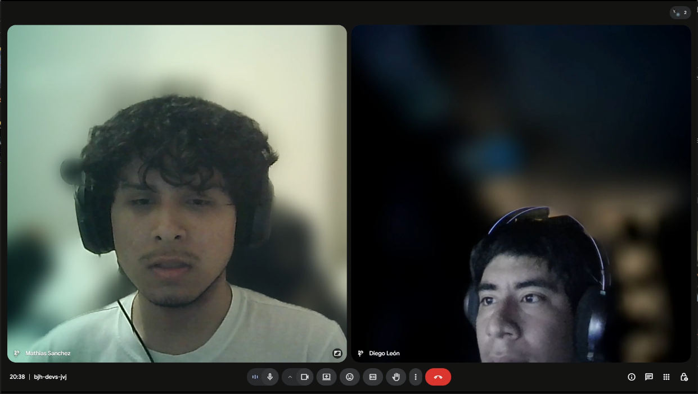
        </td>
    </tr>
    <tr>
        <td colspan="2" align="center">
            <b>Resumen de la entrevista (B03):</b>
        </td>
    </tr>
    <tr>
        <td colspan="2">
            <b>B03 — Diego Alonso León Lino, 20 años, Lima, estudiante y exbrigadista escolar.</b> Reportó capacitación intermedia y refuerzos cada cuatro o seis meses, según la programación. Prefiere la práctica presencial y grupal, aunque ve utilidad complementaria en simulaciones digitales con evaluación y retroalimentación. Identifica tiempo, baja frecuencia y realismo como barreras. Considera importante un respaldo institucional; mencionó al MINSA. Dio un rango hipotético de S/30–80 mensuales por usuario según la oferta. Su rol de brigadista fue anterior, no actual.
        </td>
    </tr>
</table>

<a id="toc-2-2-3-analisis-de-entrevistas"></a>
## 2.2.3. Análisis de entrevistas

Se analizaron diez entrevistas semiestructuradas: cuatro estudiantes (E01–E04), tres miembros de comunidades vecinales (C01–C03) y tres personas con experiencia actual o previa como brigadistas (B01–B03). Los códigos remiten a los registros y resúmenes anteriores. Para cada porcentaje se muestra el numerador y denominador del **segmento entrevistado**, no de la población peruana. Una mención cuenta solo si aparece en la respuesta; ausencia de mención no significa desacuerdo. Las preguntas originales incluyen opciones sugeridas y descripciones de la solución, por lo que las preferencias declaradas pueden estar inducidas.

<a id="toc-estudiantes-universitarios-n-4"></a>
### Estudiantes universitarios — n = 4

| Dimensión observada | Resultado en la muestra | Evidencia |
| --- | --- | --- |
| Edad | 20–23 años; media 21 años | E01: 23; E02: 21; E03: 20; E04: 20 |
| Capacitación universitaria formal declarada | 1/4 (25 %). E02 menciona una introducción breve y E04 charlas generales, pero no las equiparamos a capacitación formal | E01–E04 |
| Uso de laptop para estudiar | 4/4 (100 %); celular explícito en 2/4 (50 %) y tablet en 1/4 (25 %) | E01–E04; celular: E02, E04; tablet: E03 |
| Preocupación por accidentes de laboratorio/taller | 3/4 (75 %) | E01, E02, E04 |
| Aprendizaje considerado importante | 4/4 (100 %) | E01–E04 |
| Preferencia declarada | Simulación: 2/4; grupo: 1/4; sin modalidad única: 1/4 | E02, E04; E01; E03 |
| Confianza condicionada a una certificación | 4/4 mencionan certificación; 3/4 también mencionan calidad de simulación. Esto **no** prueba que aceptarían un certificado interno de SafeStep como equivalente | E01–E04 |

**Lectura cualitativa:** E03 afirma sentirse poco preparada; E02 y E04 describen preparación parcial y necesidad de práctica; E01 subraya que la preparación requiere actualización. E04 teme bloquearse ante una emergencia. Estas son percepciones, no mediciones de habilidad. Los precios no son comparables ni promediables: E01 mencionó S/100–150, E03 un máximo de S/18, E04 S/40–80 condicionados, y E02 pidió una prueba gratuita antes de valorar el precio. Para el User Persona estudiantil son sostenibles el contexto universitario, el uso de laptop, la preocupación por practicar y la variabilidad de preferencias; no lo son una marca específica, estado civil o un precio «típico».

<a id="toc-miembros-de-comunidades-vecinales-n-3"></a>
### Miembros de comunidades vecinales — n = 3

| Dimensión observada | Resultado en la muestra | Evidencia |
| --- | --- | --- |
| Edad | 20–27 años; media 24,7 años | C01: 27; C02: 27; C03: 20 |
| Capacitación municipal declarada | 1/3 (33 %); C03 participó en charlas/simulacros sin formación formal | C01; C03 |
| Barrera de tiempo | 3/3 (100 %) | C01–C03 |
| Falta de información sobre capacitación | 2/3 (67 %) | C01, C03 |
| Costo como posible barrera | 1/3 (33 %) | C03 |
| Preferencia por talleres grupales | 2/3 (67 %); aprendizaje individual: 1/3 (33 %) | C01, C03; C02 |
| Uso de canales digitales o redes | 3/3 mencionan aplicaciones; solo C01 y C03 identifican explícitamente el smartphone | C01–C03 |

**Lectura cualitativa:** C01 y C02 consideran insuficiente la preparación de sus vecinos. C03 se describe a sí mismo como medianamente preparado y duda de la respuesta ante incidentes graves; no corresponde codificarlo como una respuesta idéntica sobre todo el vecindario. C01 propone una contribución; C02 y C03 plantean pago condicionado al valor percibido, la explicación o el apoyo institucional. No existe una compra observada ni un precio consensuado. Las situaciones citadas difieren: C01 no reporta emergencias graves frecuentes, C02 menciona accidentes domésticos y C03 añade sismos, caídas y cortes. No debe afirmarse unanimidad sobre tipos de emergencia.

<a id="toc-personas-con-experiencia-como-brigadistas-n-3"></a>
### Personas con experiencia como brigadistas — n = 3

| Dimensión observada | Resultado en la muestra | Evidencia |
| --- | --- | --- |
| Edad | Los tres tienen 20 años; media 20 | B01–B03 |
| Situación del rol | Un bombero voluntario activo; un exbrigadista municipal y un exbrigadista escolar | B01; B02; B03 |
| Formación previa declarada | 3/3 (100 %), con niveles distintos y sin verificación documental de acreditaciones | B01–B03 |
| Frecuencia de actualización | No uniforme: sin frecuencia fija; dos veces al mes; cada cuatro o seis meses | B01; B02; B03 |
| Refuerzo mediante documentos o videos digitales | 2/3 (67 %); B03 no suele utilizar apps/plataformas para ello | B01, B02; B03 |
| Necesidad de practicar sin depender de una emergencia real o de más realismo | 3/3 la expresan con matices diferentes | B01–B03 |
| Importancia de acreditación o respaldo institucional | 3/3 mencionan certificación/reconocimiento; B01 cita AHA, MINSA y NFPA; B02 y B03 citan MINSA | B01–B03 |
| Modalidad | B01 valora combinar individual y grupo; B02 y B03 prefieren grupo | B01–B03 |

**Lectura cualitativa:** la práctica digital se concibe como complemento, no sustituto automático de la formación presencial. B01 solicita incluso uso offline, pero esto es una necesidad expresada por **una** persona, no una capacidad actual ni una prioridad validada para todos. Las respuestas de precio se refieren a ofertas distintas: B01 habló de US$10–20 al mes para una modalidad híbrida, B02 de aproximadamente S/20 según el enfoque y B03 de S/30–80 mensuales por usuario. No se calcula promedio ni «disposición de pago del segmento». Este grupo no equivale a una muestra de profesionales sanitarios.

<a id="toc-trazabilidad-y-limites-para-los-artefactos-de-2-3"></a>
### Trazabilidad y límites para los artefactos de 2.3

| Hallazgo sustentado | Entrevistas | Uso admisible en Needfinding |
| --- | --- | --- |
| Preparación percibida incompleta y deseo de práctica entre estudiantes | E01–E04 | Objetivos y frustraciones de una persona estudiantil **compuesta**, sin afirmar desempeño real |
| Barrera de tiempo en contexto vecinal; preferencia de aprendizaje no uniforme | C01–C03 | Fases de búsqueda, capacitación y continuidad; incluir alternativa individual además de grupal |
| Experiencia brigadista heterogénea y necesidad de refuerzo | B01–B03 | No presentar un único rol institucional ni una frecuencia universal de actualización |
| Certificación como señal de confianza, sin aval de SafeStep | E01–E04, B01–B03 | Distinguir interés por acreditación de certificaciones internas disponibles |
| Datos ausentes sobre familia, estado civil, personalidad y navegadores | Todos los registros | Marcar «no documentado» o realizar nuevas entrevistas; no inventar datos en las fichas |

**Limitaciones:** selección por conveniencia, muestras de tres o cuatro personas por segmento, preguntas con ejemplos y posible sesgo de deseabilidad. Los porcentajes describen solamente a las personas entrevistadas. El registro base contiene inconsistencias que requieren contraste con video, por ejemplo la carrera de E04. Las citas textuales y rasgos no verificados se omiten del análisis para evitar atribuciones erróneas. Los mapas y User Personas deben revisarse a partir de esta matriz, sin reescribir retrospectivamente los testimonios.

<br>

<br>
<br>

<div align="center">
  
</div>

<br>
<br>

<a id="toc-2-3-needfinding"></a>
# 2.3. Needfinding

Esta sección sintetiza necesidades de aprendizaje y preparación en primeros auxilios **antes de utilizar SafeStep**. La evidencia primaria son diez entrevistas del apartado 2.2: cuatro estudiantes universitarios (E01–E04), tres miembros de comunidades vecinales (C01–C03) y tres personas con experiencia actual o previa como brigadistas (B01–B03). El análisis competitivo de 2.1 aporta contexto: existen aplicaciones gratuitas con guías, cuestionarios y, en algunos casos, progreso, insignias o acceso offline. Por ello, ninguno de estos elementos se presenta como ventaja exclusiva de SafeStep.

El recorrido metodológico es: respuestas y resúmenes de entrevistas → patrones por segmento → arquetipos compuestos → tareas independientes de la solución → journeys, empathy maps y escenarios As-Is. Se indica cuando un rasgo es una inferencia de síntesis y cuando faltan datos. **No se observó el comportamiento real de toda la población**, no se midió competencia clínica y los porcentajes de 2.2.3 solo describen a las personas entrevistadas.

Se han restituido las **imágenes originales** del informe. Estas imágenes son material histórico y todavía no reflejan todas las correcciones del análisis textual: en particular, la ficha vecinal muestra a Anaís y no a Alex, algunas edades y rasgos no están sustentados por las entrevistas, y el único escenario original representa el uso de SafeStep en lugar de la situación previa. Por tanto, no se presentan como evidencia de conformidad final. El statement exige elaborar y exportar User Personas, User Journey Maps y Empathy Maps desde **UXPressia**, y los As-Is Scenario Maps desde **Miro o Lucidchart**, con sus enlaces editables.

<a id="toc-2-3-1-user-personas"></a>
## 2.3.1. User Personas

Se construyó un arquetipo por segmento, vinculando cada ficha con las características más recurrentes del análisis de entrevistas y con el contexto competitivo. Los nombres son ficticios. Las edades son **ilustrativas y se encuentran dentro de la muestra correspondiente**, no describen una distribución poblacional. Ocupación, experiencia, metas, barreras, dispositivos y señales de confianza se incluyen solo cuando tienen sustento en los registros; familia, estado civil, navegador y personalidad se declaran no documentados en lugar de inventarse. Las fichas no reproducen la biografía de una persona entrevistada.

<a id="toc-camila-rojas-estudiante-universitaria"></a>
### Camila Rojas — estudiante universitaria

Camila representa una necesidad compartida por E01–E04: adquirir y repasar conocimientos, ensayar decisiones y reducir la inseguridad ante situaciones cotidianas. Los cuatro usan laptop para estudiar; tres mencionaron laboratorio o taller como fuente de preocupación. Las preferencias de modalidad y los precios declarados difieren, por lo que no se fijan como atributos universales del arquetipo.

<div align="center">
  <p><b>Gráfico 1.</b> User Persona — Camila Rojas (estudiantes universitarios)</p>
  
  <p><i>Fuente: imagen original del equipo; pendiente de actualización con E01–E04.</i></p>
</div>

<a id="toc-alex-torres-miembro-de-comunidad-vecinal"></a>
### Alex Torres — miembro de comunidad vecinal

Alex combina patrones de C01–C03: interés por la preparación local, barrera de tiempo presente en las tres entrevistas y búsqueda de información sobre oportunidades de capacitación. Dos participantes prefirieron actividades grupales y uno el aprendizaje individual; la ficha preserva esa diferencia. Su edad ilustrativa de 27 años coincide con dos participantes, sin suponer que represente a todos los vecinos.

<div align="center">
  <p><b>Gráfico 2.</b> User Persona original — Anaís Torres (comunidades vecinales)</p>
  
  <p><i>Fuente: imagen original del equipo; el arquetipo textual corregido es Alex Torres y la ficha aún no se ha actualizado con C01–C03.</i></p>
</div>

<a id="toc-carlos-mendoza-persona-con-experiencia-brigadista"></a>
### Carlos Mendoza — persona con experiencia brigadista

Carlos sintetiza B01–B03, quienes declararon formación previa y valoraron la práctica y el respaldo institucional. **Solo B01 desempeñaba un rol activo al momento del registro; B02 y B03 describieron experiencia anterior.** Sus frecuencias de actualización y modalidades preferidas no fueron uniformes. La ficha no lo presenta como profesional sanitario ni como titular de una acreditación verificada.

<div align="center">
  <p><b>Gráfico 3.</b> User Persona — Carlos Mendoza (experiencia brigadista)</p>
  
  <p><i>Fuente: imagen original del equipo; pendiente de actualizar la edad y otros rasgos con B01–B03.</i></p>
</div>

Las fichas originales se conservan visualmente, pero sus edades y algunos rasgos personales no pueden rastrearse a los registros. El aprendizaje **no implica** que un certificado interno de SafeStep sea una acreditación profesional ni que las tres personas entrevistadas representen a todas las comunidades o brigadas.

<a id="toc-2-3-2-user-task-matrix"></a>
## 2.3.2. User Task Matrix

La matriz compara tareas que Camila, Alex y Carlos pueden realizar **aunque SafeStep no exista**. Se excluyen acciones como iniciar sesión, obtener puntos, ver un ranking, comprar dentro de la app o revisar un panel de progreso: son interacciones de una solución particular, no tareas del dominio del problema. Las tareas provienen de los objetivos y barreras de 2.2.3; los valores de frecuencia e importancia son **estimaciones ordinales del equipo para priorizar investigación**, no frecuencias observadas, mediciones de uso ni porcentajes. `Alta`, `Media` y `Baja` deben contrastarse en nuevas entrevistas u observación contextual.

<table border="1" cellpadding="6" cellspacing="0" width="100%">
  <tr>
    <th rowspan="2" align="left">Tarea independiente de SafeStep</th>
    <th colspan="2">Camila · estudiante</th>
    <th colspan="2">Alex · comunidad vecinal</th>
    <th colspan="2">Carlos · experiencia brigadista</th>
  </tr>
  <tr>
    <th>Frecuencia</th><th>Importancia</th>
    <th>Frecuencia</th><th>Importancia</th>
    <th>Frecuencia</th><th>Importancia</th>
  </tr>
  <tr><td>Identificar riesgos y reconocer cuándo solicitar ayuda especializada</td><td>Media</td><td>Alta</td><td>Media</td><td>Alta</td><td>Media</td><td>Alta</td></tr>
  <tr><td>Buscar y contrastar fuentes de primeros auxilios</td><td>Media</td><td>Alta</td><td>Media</td><td>Alta</td><td>Media</td><td>Alta</td></tr>
  <tr><td>Localizar y comparar oportunidades de capacitación</td><td>Media</td><td>Alta</td><td>Media</td><td>Alta</td><td>Media</td><td>Media</td></tr>
  <tr><td>Asistir a una capacitación o taller</td><td>Baja</td><td>Alta</td><td>Baja</td><td>Alta</td><td>Media</td><td>Alta</td></tr>
  <tr><td>Ensayar procedimientos y decisiones en prácticas supervisadas</td><td>Baja</td><td>Alta</td><td>Baja</td><td>Alta</td><td>Media</td><td>Alta</td></tr>
  <tr><td>Repasar conocimientos entre capacitaciones</td><td>Baja</td><td>Alta</td><td>Baja</td><td>Alta</td><td>Media</td><td>Alta</td></tr>
  <tr><td>Resolver dudas con instructores, fuentes o pares</td><td>Media</td><td>Media</td><td>Media</td><td>Media</td><td>Media</td><td>Alta</td></tr>
  <tr><td>Coordinar preparación o roles con otras personas</td><td>Baja</td><td>Media</td><td>Media</td><td>Alta</td><td>Media</td><td>Alta</td></tr>
  <tr><td>Comprobar validez y vigencia de cursos o protocolos</td><td>Media</td><td>Media</td><td>Baja</td><td>Media</td><td>Media</td><td>Alta</td></tr>
</table>

**Tareas relativamente más frecuentes.** Buscar información, comparar capacitación y consultar dudas reciben frecuencia `Media` en los tres arquetipos. Ninguna tarea se clasifica como `Alta` en frecuencia porque las entrevistas no midieron recurrencia; atribuir uso habitual sería injustificado. En Carlos, asistencia, práctica y repaso se estiman `Media` por la formación previa y las actualizaciones declaradas, aunque estas tuvieron frecuencias distintas.

**Tareas más importantes.** Identificar riesgos, contrastar fuentes, practicar y repasar se estiman `Alta` en importancia para los tres perfiles por su relación con preparación responsable. Importancia no equivale a frecuencia: asistir y practicar pueden ser valiosos aunque sucedan poco.

**Diferencias y coincidencias.** Alex enfrenta una barrera de tiempo documentada en 3/3 y puede necesitar coordinación vecinal, pero no se debe imponer modalidad grupal a todos. Carlos requiere atención especial a protocolos y acreditaciones; su experiencia institucional es heterogénea. Camila expresa necesidad de práctica y criterios de confianza, con preferencias de aprendizaje y pago divergentes. Los tres perfiles comparten la necesidad de fuentes claras y de oportunidades de practicar sin afirmar que una simulación digital sustituya la formación presencial.

<a id="toc-2-3-3-user-journey-mapping"></a>
## 2.3.3. User Journey Mapping

Cada User Journey Map muestra el recorrido **end-to-end As-Is**, desde reconocer la necesidad de aprender hasta practicar o intentar recordar lo aprendido, sin incorporar a SafeStep. Se vincula al User Persona correspondiente y presenta fases, acciones, pensamientos, emociones, fricciones y oportunidades. Las emociones y pensamientos son una síntesis interpretativa de respuestas, no citas literales; los mapas deben contrastarse con participantes. Este recorrido se distingue de un flujo de interfaz y del futuro To-Be del Capítulo III.

<a id="toc-journey-as-is-de-camila"></a>
### Journey As-Is de Camila

Desde una preocupación en universidad u hogar, Camila busca recursos, compara formación, participa cuando puede y necesita repasar. E01–E04 sustentan la preocupación por situaciones concretas, la formación desigual y la falta de práctica.

<div align="center">
  <p><b>Gráfico 4.</b> User Journey Map As-Is — Camila Rojas</p>
  
  <p><i>Fuente: imagen original del equipo; pendiente de contraste con E01–E04.</i></p>
</div>

<a id="toc-journey-as-is-de-alex"></a>
### Journey As-Is de Alex

Alex identifica riesgos vecinales, intenta encontrar capacitación, contrasta tiempo y costo, participa si le resulta posible y luego comparte o repasa. La barrera temporal procede de C01–C03; el trabajo grupal no se asume universal.

<div align="center">
  <p><b>Gráfico 5.</b> User Journey Map As-Is — Alex Torres</p>
  
  <p><i>Fuente: imagen original del equipo; pendiente de contraste con C01–C03.</i></p>
</div>

<a id="toc-journey-as-is-de-carlos"></a>
### Journey As-Is de Carlos

Carlos reconoce una brecha de actualización, consulta fuentes, participa en capacitación, ensaya cuando hay oportunidad y refuerza conocimientos entre sesiones. Las variantes de rol y frecuencia de B01–B03 impiden interpretar el mapa como un protocolo institucional único.

<div align="center">
  <p><b>Gráfico 6.</b> User Journey Map As-Is — Carlos Mendoza</p>
  
  <p><i>Fuente: imagen original del equipo; pendiente de contraste con B01–B03.</i></p>
</div>

<a id="toc-2-3-4-empathy-mapping"></a>
## 2.3.4. Empathy Mapping

Se preparó un mapa por persona, ubicando el arquetipo en el centro y ordenando observaciones en: qué necesita hacer, dice, ve, hace, escucha, piensa y siente; se añadieron pains y gains. El contenido combina **paráfrasis de los registros** con inferencias de síntesis identificadas como tales; no atribuye comillas textuales a participantes sin verificar. Los mapas facilitan preguntas de investigación, no diagnostican personalidad ni prueban comportamiento futuro.

<a id="toc-empathy-map-de-camila"></a>
### Empathy Map de Camila

Las respuestas E01–E04 sostienen el interés por practicar, la preparación percibida como incompleta y la certificación como señal de confianza. Falta observar qué decisiones ejecutaría realmente ante un caso simulado.

<div align="center">
  <p><b>Gráfico 7.</b> Empathy Map — Camila Rojas</p>
  
  <p><i>Fuente: imagen original del equipo; pendiente de contraste con E01–E04.</i></p>
</div>

<a id="toc-empathy-map-de-alex"></a>
### Empathy Map de Alex

C01–C03 muestran una barrera de tiempo compartida y preferencias distintas entre formación grupal e individual. El mapa no extiende estas observaciones a toda la comunidad.

<div align="center">
  <p><b>Gráfico 8.</b> Empathy Map — Alex Torres</p>
  
  <p><i>Fuente: imagen original del equipo; pendiente de contraste con C01–C03.</i></p>
</div>

<a id="toc-empathy-map-de-carlos"></a>
### Empathy Map de Carlos

B01–B03 valoran practicar antes de una emergencia y la confianza institucional, aunque difieren en rol, frecuencia de actualización y uso digital. El mapa conserva la distinción entre apoyo de aprendizaje y acreditación profesional.

<div align="center">
  <p><b>Gráfico 9.</b> Empathy Map — Carlos Mendoza</p>
  
  <p><i>Fuente: imagen original del equipo; pendiente de contraste con B01–B03.</i></p>
</div>

<a id="toc-2-3-5-as-is-scenario-mapping"></a>
## 2.3.5. As-is Scenario Mapping

El único mapa original de esta sección muestra registro, selección del escenario y primera simulación **dentro de SafeStep**. Se restituye como material histórico, pero no cubre el As-Is solicitado por el statement, que debe representar la situación previa a la solución. Faltan mapas por cada User Persona con fases y filas `Phases`, `Doing`, `Thinking` y `Feeling`, además de áreas positivas, negativas y *blank areas*.

Para elaborar los mapas faltantes, el equipo debe revisar individualmente los resúmenes de cada segmento, agrupar las actividades actuales en fases, contrastar acciones y pensamientos con las entrevistas, etiquetar puntos favorables, fricciones y vacíos, y revisar que ninguna fase presuponga la existencia de SafeStep. La revisión colaborativa y la elaboración en Miro/Lucidchart quedan pendientes de evidencia.

<div align="center">
  <p><b>Gráfico 10.</b> As-Is Scenario Mapping original — recorrido dentro de SafeStep (material histórico)</p>
  
  <p><i>Fuente: imagen original del equipo; no cubre el As-Is de Needfinding.</i></p>
</div>

<a id="toc-escenario-as-is-de-camila"></a>
### Escenario As-Is de Camila

Fases: necesidad, búsqueda, capacitación y continuidad. La principal zona negativa es la escasez de práctica; los vacíos preguntan cómo verifica fuentes y cuándo vuelve a practicar realmente.


<a id="toc-escenario-as-is-de-alex"></a>
### Escenario As-Is de Alex

Fases: toma de conciencia, búsqueda de oferta, organización y participación o postergación. El tiempo restringe la capacitación de los tres entrevistados; aún se desconoce cómo coordinan presupuestos y canales de convocatoria en grupos vecinales más amplios.


<a id="toc-escenario-as-is-de-carlos"></a>
### Escenario As-Is de Carlos

Fases: identificación de brecha, consulta de fuentes, ensayo y mantenimiento de competencia. Los espacios de práctica y la vigencia de protocolos varían entre instituciones; las competencias reales no fueron evaluadas en las entrevistas.


**Pendiente para conformidad formal con el statement:** corregir las tres fichas, tres journeys y tres empathy maps en UXPressia, y elaborar los tres escenarios As-Is previos a SafeStep en Miro/Lucidchart; exportar capturas legibles, documentar enlaces editables y registrar la revisión del equipo.

<br>

<br>
<br>

<div align="center">
    
</div>

<br>
<br>

<a id="toc-2-4-ubiquitous-language"></a>
# 2.4. Ubiquitous Language

Es el lenguaje común compartido entre desarrolladores y expertos del negocio que se formula durante el EventStorming para alinear modelos mentales y eliminar ambigüedades. Este lenguaje asegura que tanto la documentación técnica como el código final de SafeStep utilicen exactamente los mismos términos definidos para el dominio empresarial.

| Concepto | Definición |
| --- | --- |
| Alumno | Usuario del sistema con rol académico que busca inscribirse en cursos. |
| Docente | Actor del sistema que tiene acceso a gestionar el silabo y la asistencia en sus cursos asignados. |
| Administrador | Usuario con permisos para gestionar la configuración global de cursos y periodos. |
| Curso | Unidad curricular básica que posee créditos, syllabus y requisitos. |
| Ciclo Académico | Periodo de tiempo específico (ej. 2026-I) durante el cual se desarrollan los cursos. |
| Cupo | Cantidad limitada de vacantes disponibles para un curso en un horario específico. |
| Silabo | Documento oficial que contiene el contenido, objetivos y evaluación de un curso. |
| Matrícula | Proceso formal de inscripción de un alumno en un conjunto de cursos. |
| Pre-requisito | Curso previo que debe estar aprobado antes de inscribir el curso actual. |
| Estado de Pago | Condición financiera del alumno que habilita o bloquea su proceso de matrícula. |
| Módulo de Pagos | Sistema encargado de validar la deuda y procesar transacciones para habilitar la matrícula. |
| Historial Académico | Registro histórico de cursos aprobados y desaprobados que determina la elegibilidad para futuros cursos. |
| Solicitud de Matrícula | Registro temporal generado por el alumno que inicia el proceso antes de la confirmación final. |
| Reporte de Matrícula | Documento o dashboard generado para el administrador con métricas de cupos y alumnos inscritos. |
| Ventanilla única | Canal centralizado de atención donde el alumno puede resolver incidencias técnicas o administrativas. |
<br>
<br>

<br>

<div style="page-break-before: always;"></div>

<br>
<br>

<div align="center">
    
</div>

<br>
<br>

<a id="toc-3-1-to-be-scenario-mapping"></a>
# 3.1. To-Be Scenario Mapping

Este mapa plantea de forma gráfica una comparación de la experiencia de nuestro User Persona con la experiencia que tendría al usar nuestra solución.

<div align="center">
  <p>
    Escenario To-Be elaborado en Miro.
  </p>
  
  <p>
    <i><b>Fuente:</b> elaboración propia.</i>
  </p>
</div>

<br>

<br>
<br>

<div align="center">
    
</div>

<br>
<br>

<a id="toc-3-2-user-stories"></a>
# 3.2. User Stories

En esta sección se presentan las épicas, user stories y technical stories que guían el desarrollo de SafeStep. Las historias se redactan desde la perspectiva del usuario o del equipo de desarrollo, siguiendo la estructura **Como [rol], quiero [necesidad], para [beneficio]**, con el fin de relacionar cada requerimiento con un valor concreto para el producto.
 
Los criterios de aceptación se expresan bajo el formato **Gherkin**, utilizando la estructura **Dado que / Cuando / Entonces**. De esta manera, cada historia cuenta con condiciones verificables que permiten validar su cumplimiento durante el desarrollo, las pruebas funcionales y la revisión de cada Sprint. Las filas identificadas como épicas no incluyen criterios de aceptación específicos, debido a que funcionan como agrupadores de historias relacionadas.

En la columna **Priority**, `#1` indica la mayor prioridad y cada número corresponde al **# Orden** del Product Backlog de 3.3. Las épicas agrupan historias y no tienen una prioridad independiente. Se conserva una sola tabla para todo el conjunto de épicas e historias; cada ficha ocupa varias filas conforme al formato del statement.


<table border="1" cellpadding="6" cellspacing="0" width="100%">
  <tbody>
    <tr><th>Story ID</th><th>User</th><th>Priority</th><th>Epic</th></tr>
    <tr><td>EP02</td><td>usuario de SafeStep</td><td>—</td><td>No aplica</td></tr>
    <tr><th>Title</th><td colspan="3">Dashboard principal</td></tr>
    <tr><th colspan="4">Description</th></tr>
    <tr><td colspan="4"><b>Como</b> usuario de SafeStep, <b>quiero</b> visualizar un dashboard principal con mi avance, entrenamientos, misiones y productos sugeridos, <b>para</b> decidir rapidamente que hacer despues.</td></tr>
    <tr><th colspan="4">Acceptance Criteria</th></tr>
    <tr><td colspan="4">No aplica por tratarse de una epica agrupadora.</td></tr>
    <tr><th>Story ID</th><th>User</th><th>Priority</th><th>Epic</th></tr>
    <tr><td>US06</td><td>usuario</td><td>#25</td><td>EP02</td></tr>
    <tr><th>Title</th><td colspan="3">Visualizar resumen general de entrenamiento</td></tr>
    <tr><th colspan="4">Description</th></tr>
    <tr><td colspan="4"><b>Como</b> usuario, <b>quiero</b> ver un resumen de mi progreso al entrar a la aplicacion <b>para</b> saber mi estado actual.</td></tr>
    <tr><th colspan="4">Acceptance Criteria</th></tr>
    <tr><td colspan="4">- <b>Dado que</b> el usuario tiene simulaciones, XP y racha registrada, <b>Cuando</b> ingresa al dashboard, <b>Entonces</b> el sistema muestra metricas principales de su progreso<br><br>- <b>Dado que</b> el usuario aun no tiene suficientes datos, <b>Cuando</b> ingresa al dashboard, <b>Entonces</b> el sistema muestra valores iniciales o recomendaciones para empezar</td></tr>
    <tr><th>Story ID</th><th>User</th><th>Priority</th><th>Epic</th></tr>
    <tr><td>US07</td><td>usuario</td><td>#26</td><td>EP02</td></tr>
    <tr><th>Title</th><td colspan="3">Continuar con el siguiente entrenamiento</td></tr>
    <tr><th colspan="4">Description</th></tr>
    <tr><td colspan="4"><b>Como</b> usuario, <b>quiero</b> ver la siguiente simulacion sugerida <b>para</b> continuar mi aprendizaje sin buscar manualmente.</td></tr>
    <tr><th colspan="4">Acceptance Criteria</th></tr>
    <tr><td colspan="4">- <b>Dado que</b> hay simulaciones no completadas, <b>Cuando</b> el usuario entra al dashboard, <b>Entonces</b> el sistema muestra una simulacion recomendada para continuar<br><br>- <b>Dado que</b> el dashboard muestra una simulacion recomendada, <b>Cuando</b> el usuario selecciona practicar, <b>Entonces</b> el sistema abre el detalle de esa simulacion</td></tr>
    <tr><th>Story ID</th><th>User</th><th>Priority</th><th>Epic</th></tr>
    <tr><td>US08</td><td>usuario</td><td>#27</td><td>EP02</td></tr>
    <tr><th>Title</th><td colspan="3">Ver misiones activas desde el dashboard</td></tr>
    <tr><th colspan="4">Description</th></tr>
    <tr><td colspan="4"><b>Como</b> usuario, <b>quiero</b> ver misiones activas en el dashboard <b>para</b> recordar objetivos que puedo completar.</td></tr>
    <tr><th colspan="4">Acceptance Criteria</th></tr>
    <tr><td colspan="4">- <b>Dado que</b> existen misiones activas, <b>Cuando</b> el usuario ingresa al dashboard, <b>Entonces</b> el sistema muestra una vista breve de misiones activas y su progreso<br><br>- <b>Dado que</b> el usuario desea ver mas misiones, <b>Cuando</b> selecciona la opcion de abrir gamificacion, <b>Entonces</b> el sistema lo lleva al apartado de gamificacion</td></tr>
    <tr><th>Story ID</th><th>User</th><th>Priority</th><th>Epic</th></tr>
    <tr><td>US09</td><td>usuario</td><td>#28</td><td>EP02</td></tr>
    <tr><th>Title</th><td colspan="3">Ver productos sugeridos desde el dashboard</td></tr>
    <tr><th colspan="4">Description</th></tr>
    <tr><td colspan="4"><b>Como</b> usuario, <b>quiero</b> ver productos sugeridos <b>para</b> mi preparacion para acceder rapidamente a la tienda.</td></tr>
    <tr><th colspan="4">Acceptance Criteria</th></tr>
    <tr><td colspan="4">- <b>Dado que</b> existen productos recomendados, <b>Cuando</b> el usuario entra al dashboard, <b>Entonces</b> el sistema muestra productos destacados con su imagen, categoria y precio<br><br>- <b>Dado que</b> el usuario visualiza productos sugeridos, <b>Cuando</b> selecciona la opcion de ir a tienda, <b>Entonces</b> el sistema abre el catalogo de productos</td></tr>
    <tr><th>Story ID</th><th>User</th><th>Priority</th><th>Epic</th></tr>
    <tr><td>EP03</td><td>usuario en entrenamiento</td><td>—</td><td>No aplica</td></tr>
    <tr><th>Title</th><td colspan="3">Simulaciones medicas</td></tr>
    <tr><th colspan="4">Description</th></tr>
    <tr><td colspan="4"><b>Como</b> usuario en entrenamiento, <b>quiero</b> practicar emergencias mediante simulaciones medicas interactivas, <b>para</b> aprender a tomar mejores decisiones en primeros auxilios.</td></tr>
    <tr><th colspan="4">Acceptance Criteria</th></tr>
    <tr><td colspan="4">No aplica por tratarse de una epica agrupadora.</td></tr>
    <tr><th>Story ID</th><th>User</th><th>Priority</th><th>Epic</th></tr>
    <tr><td>US10</td><td>usuario</td><td>#29</td><td>EP03</td></tr>
    <tr><th>Title</th><td colspan="3">Visualizar catalogo de simulaciones</td></tr>
    <tr><th colspan="4">Description</th></tr>
    <tr><td colspan="4"><b>Como</b> usuario, <b>quiero</b> ver todas las simulaciones disponibles <b>para</b> elegir que emergencia practicar.</td></tr>
    <tr><th colspan="4">Acceptance Criteria</th></tr>
    <tr><td colspan="4">- <b>Dado que</b> existen simulaciones registradas, <b>Cuando</b> el usuario entra a Simulaciones, <b>Entonces</b> el sistema muestra cartas con imagen, dificultad, duracion, XP y SafeCoins<br><br>- <b>Dado que</b> el usuario ya completo una simulacion, <b>Cuando</b> visualiza el catalogo, <b>Entonces</b> la carta indica que fue completada y cuantas veces se completo</td></tr>
    <tr><th>Story ID</th><th>User</th><th>Priority</th><th>Epic</th></tr>
    <tr><td>US11</td><td>usuario</td><td>#30</td><td>EP03</td></tr>
    <tr><th>Title</th><td colspan="3">Buscar simulaciones por nombre</td></tr>
    <tr><th colspan="4">Description</th></tr>
    <tr><td colspan="4"><b>Como</b> usuario, <b>quiero</b> buscar simulaciones por nombre <b>para</b> encontrar rapidamente el entrenamiento que necesito.</td></tr>
    <tr><th colspan="4">Acceptance Criteria</th></tr>
    <tr><td colspan="4">- <b>Dado que</b> el usuario esta en el listado de simulaciones, <b>Cuando</b> escribe el nombre de una simulacion existente, <b>Entonces</b> el sistema muestra solo las simulaciones que coinciden<br><br>- <b>Dado que</b> el usuario escribe una palabra sin coincidencias, <b>Cuando</b> el filtro se aplica, <b>Entonces</b> el sistema muestra un estado indicando que no hay resultados</td></tr>
    <tr><th>Story ID</th><th>User</th><th>Priority</th><th>Epic</th></tr>
    <tr><td>US12</td><td>usuario</td><td>#31</td><td>EP03</td></tr>
    <tr><th>Title</th><td colspan="3">Revisar detalle de una simulacion antes de iniciar</td></tr>
    <tr><th colspan="4">Description</th></tr>
    <tr><td colspan="4"><b>Como</b> usuario, <b>quiero</b> ver la informacion de una simulacion antes de empezarla <b>para</b> saber que aprendere y que recompensas ofrece.</td></tr>
    <tr><th colspan="4">Acceptance Criteria</th></tr>
    <tr><td colspan="4">- <b>Dado que</b> el usuario selecciona una simulacion, <b>Cuando</b> se abre su detalle, <b>Entonces</b> el sistema muestra objetivos, dificultad, duracion, XP disponible y SafeCoins base<br><br>- <b>Dado que</b> el usuario intenta abrir una simulacion que no existe, <b>Cuando</b> el sistema no encuentra el identificador, <b>Entonces</b> muestra un mensaje de simulacion no encontrada</td></tr>
    <tr><th>Story ID</th><th>User</th><th>Priority</th><th>Epic</th></tr>
    <tr><td>US13</td><td>usuario</td><td>#32</td><td>EP03</td></tr>
    <tr><th>Title</th><td colspan="3">Responder pasos de una simulacion</td></tr>
    <tr><th colspan="4">Description</th></tr>
    <tr><td colspan="4"><b>Como</b> usuario, <b>quiero</b> elegir respuestas en cada escenario <b>para</b> practicar decisiones ante emergencias.</td></tr>
    <tr><th colspan="4">Acceptance Criteria</th></tr>
    <tr><td colspan="4">- <b>Dado que</b> el usuario esta realizando una simulacion, <b>Cuando</b> selecciona una opcion de un paso, <b>Entonces</b> el sistema registra la respuesta seleccionada<br><br>- <b>Dado que</b> el usuario selecciona una respuesta, <b>Cuando</b> el sistema evalua la opcion, <b>Entonces</b> la respuesta correcta e incorrecta se distinguen visualmente</td></tr>
    <tr><th>Story ID</th><th>User</th><th>Priority</th><th>Epic</th></tr>
    <tr><td>US14</td><td>usuario</td><td>#33</td><td>EP03</td></tr>
    <tr><th>Title</th><td colspan="3">Finalizar una simulacion</td></tr>
    <tr><th colspan="4">Description</th></tr>
    <tr><td colspan="4"><b>Como</b> usuario, <b>quiero</b> finalizar la simulacion cuando responda todos los pasos <b>para</b> recibir mi resultado.</td></tr>
    <tr><th colspan="4">Acceptance Criteria</th></tr>
    <tr><td colspan="4">- <b>Dado que</b> el usuario respondio todos los pasos, <b>Cuando</b> selecciona finalizar, <b>Entonces</b> el sistema calcula respuestas correctas, errores, precision, XP y monedas<br><br>- <b>Dado que</b> el usuario aun no respondio todos los pasos, <b>Cuando</b> intenta finalizar, <b>Entonces</b> el sistema no permite finalizar hasta completar la simulacion</td></tr>
    <tr><th>Story ID</th><th>User</th><th>Priority</th><th>Epic</th></tr>
    <tr><td>US15</td><td>usuario</td><td>#34</td><td>EP03</td></tr>
    <tr><th>Title</th><td colspan="3">Recibir SafeCoins por completar una simulacion</td></tr>
    <tr><th colspan="4">Description</th></tr>
    <tr><td colspan="4"><b>Como</b> usuario, <b>quiero</b> recibir monedas al completar una simulacion exitosa <b>para</b> usarlas en la tienda.</td></tr>
    <tr><th colspan="4">Acceptance Criteria</th></tr>
    <tr><td colspan="4">- <b>Dado que</b> el usuario completa una simulacion con precision suficiente, <b>Y</b> es su primera finalizacion exitosa de esa simulacion, <b>Cuando</b> el sistema calcula la recompensa, <b>Entonces</b> recibe el 100% de las SafeCoins correspondientes segun su precision<br><br>- <b>Dado que</b> el usuario ya completo antes la misma simulacion, <b>Cuando</b> la completa nuevamente con precision suficiente, <b>Entonces</b> recibe una recompensa reducida segun el multiplicador de repeticion</td></tr>
    <tr><th>Story ID</th><th>User</th><th>Priority</th><th>Epic</th></tr>
    <tr><td>US16</td><td>usuario</td><td>#35</td><td>EP03</td></tr>
    <tr><th>Title</th><td colspan="3">Ver resumen final de simulacion</td></tr>
    <tr><th colspan="4">Description</th></tr>
    <tr><td colspan="4"><b>Como</b> usuario, <b>quiero</b> ver un resumen final <b>para</b> entender mi rendimiento y recompensa.</td></tr>
    <tr><th colspan="4">Acceptance Criteria</th></tr>
    <tr><td colspan="4">- <b>Dado que</b> el usuario finalizo una simulacion, <b>Cuando</b> se muestra la pantalla final, <b>Entonces</b> el sistema muestra respuestas correctas, errores, XP ganado, monedas ganadas, saldo anterior y saldo nuevo<br><br>- <b>Dado que</b> el calculo de recompensa resulta en cero monedas, <b>Cuando</b> se muestra el resumen final, <b>Entonces</b> el sistema indica claramente que no se ganaron monedas adicionales</td></tr>
    <tr><th>Story ID</th><th>User</th><th>Priority</th><th>Epic</th></tr>
    <tr><td>US17</td><td>usuario</td><td>#36</td><td>EP03</td></tr>
    <tr><th>Title</th><td colspan="3">Ver productos sugeridos segun errores</td></tr>
    <tr><th colspan="4">Description</th></tr>
    <tr><td colspan="4"><b>Como</b> usuario, <b>quiero</b> recibir sugerencias de productos relacionadas con mi simulacion <b>para</b> prepararme mejor.</td></tr>
    <tr><th colspan="4">Acceptance Criteria</th></tr>
    <tr><td colspan="4">- <b>Dado que</b> una simulacion tiene productos sugeridos, <b>Cuando</b> el usuario revisa el detalle o resultado, <b>Entonces</b> el sistema muestra productos relacionados con esa emergencia<br><br>- <b>Dado que</b> la simulacion no tiene productos asociados, <b>Cuando</b> el usuario revisa el resultado, <b>Entonces</b> el sistema no muestra recomendaciones de tienda</td></tr>
    <tr><th>Story ID</th><th>User</th><th>Priority</th><th>Epic</th></tr>
    <tr><td>EP04</td><td>usuario</td><td>—</td><td>No aplica</td></tr>
    <tr><th>Title</th><td colspan="3">Progreso y estadisticas</td></tr>
    <tr><th colspan="4">Description</th></tr>
    <tr><td colspan="4"><b>Como</b> usuario, <b>quiero</b> consultar estadisticas reales de mi aprendizaje, <b>para</b> identificar avances, errores y acciones de mejora.</td></tr>
    <tr><th colspan="4">Acceptance Criteria</th></tr>
    <tr><td colspan="4">No aplica por tratarse de una epica agrupadora.</td></tr>
    <tr><th>Story ID</th><th>User</th><th>Priority</th><th>Epic</th></tr>
    <tr><td>US18</td><td>usuario</td><td>#37</td><td>EP04</td></tr>
    <tr><th>Title</th><td colspan="3">Visualizar resumen general de progreso</td></tr>
    <tr><th colspan="4">Description</th></tr>
    <tr><td colspan="4"><b>Como</b> usuario, <b>quiero</b> ver indicadores generales de mi avance <b>para</b> entender mi desempeno.</td></tr>
    <tr><th colspan="4">Acceptance Criteria</th></tr>
    <tr><td colspan="4">- <b>Dado que</b> el usuario tiene intentos y recompensas registradas, <b>Cuando</b> ingresa a Progreso, <b>Entonces</b> el sistema muestra simulaciones completadas, intentos, precision promedio, XP, SafeCoins y tiempo entrenado<br><br>- <b>Dado que</b> el usuario no tiene intentos registrados, <b>Cuando</b> ingresa a Progreso, <b>Entonces</b> el sistema muestra metricas en cero o mensajes para empezar</td></tr>
    <tr><th>Story ID</th><th>User</th><th>Priority</th><th>Epic</th></tr>
    <tr><td>US19</td><td>usuario</td><td>#38</td><td>EP04</td></tr>
    <tr><th>Title</th><td colspan="3">Revisar rendimiento por simulacion</td></tr>
    <tr><th colspan="4">Description</th></tr>
    <tr><td colspan="4"><b>Como</b> usuario, <b>quiero</b> ver mi rendimiento por cada simulacion <b>para</b> saber cuales domino y cuales debo repetir.</td></tr>
    <tr><th colspan="4">Acceptance Criteria</th></tr>
    <tr><td colspan="4">- <b>Dado que</b> una simulacion tiene intentos del usuario, <b>Cuando</b> se muestra el rendimiento, <b>Entonces</b> el sistema indica intentos, completaciones, mejor puntaje, precision promedio y ultimo intento<br><br>- <b>Dado que</b> una simulacion nunca fue iniciada, <b>Cuando</b> se muestra el rendimiento, <b>Entonces</b> el sistema indica que aun esta pendiente o sin intentos</td></tr>
    <tr><th>Story ID</th><th>User</th><th>Priority</th><th>Epic</th></tr>
    <tr><td>US20</td><td>usuario</td><td>#39</td><td>EP04</td></tr>
    <tr><th>Title</th><td colspan="3">Identificar errores frecuentes</td></tr>
    <tr><th colspan="4">Description</th></tr>
    <tr><td colspan="4"><b>Como</b> usuario, <b>quiero</b> ver mis errores mas repetidos <b>para</b> mejorar en pasos concretos.</td></tr>
    <tr><th colspan="4">Acceptance Criteria</th></tr>
    <tr><td colspan="4">- <b>Dado que</b> el usuario cometio errores en intentos anteriores, <b>Cuando</b> abre el apartado de errores, <b>Entonces</b> el sistema muestra los errores mas frecuentes y una recomendacion asociada<br><br>- <b>Dado que</b> el usuario no tiene errores registrados, <b>Cuando</b> abre el apartado de errores, <b>Entonces</b> el sistema muestra un mensaje positivo o de estado vacio</td></tr>
    <tr><th>Story ID</th><th>User</th><th>Priority</th><th>Epic</th></tr>
    <tr><td>US21</td><td>usuario</td><td>#40</td><td>EP04</td></tr>
    <tr><th>Title</th><td colspan="3">Recibir recomendaciones accionables</td></tr>
    <tr><th colspan="4">Description</th></tr>
    <tr><td colspan="4"><b>Como</b> usuario, <b>quiero</b> recibir recomendaciones basadas en mi rendimiento <b>para</b> saber que hacer despues.</td></tr>
    <tr><th colspan="4">Acceptance Criteria</th></tr>
    <tr><td colspan="4">- <b>Dado que</b> el usuario tiene baja precision en una simulacion, <b>Cuando</b> el sistema genera recomendaciones, <b>Entonces</b> sugiere repetir esa simulacion<br><br>- <b>Dado que</b> el usuario tiene insignias pendientes, <b>Cuando</b> el sistema genera recomendaciones, <b>Entonces</b> sugiere desbloquear una insignia con su requisito</td></tr>
    <tr><th>Story ID</th><th>User</th><th>Priority</th><th>Epic</th></tr>
    <tr><td>US22</td><td>usuario</td><td>#41</td><td>EP04</td></tr>
    <tr><th>Title</th><td colspan="3">Consultar progreso de gamificacion desde Progreso</td></tr>
    <tr><th colspan="4">Description</th></tr>
    <tr><td colspan="4"><b>Como</b> usuario, <b>quiero</b> ver mis misiones e insignias dentro del progreso <b>para</b> relacionar mi aprendizaje con logros.</td></tr>
    <tr><th colspan="4">Acceptance Criteria</th></tr>
    <tr><td colspan="4">- <b>Dado que</b> hay datos de gamificacion, <b>Cuando</b> el usuario revisa Progreso, <b>Entonces</b> el sistema muestra misiones completadas, misiones activas e insignias desbloqueadas<br><br>- <b>Dado que</b> existe ranking semanal, <b>Cuando</b> el usuario revisa su progreso, <b>Entonces</b> el sistema muestra su posicion semanal</td></tr>
    <tr><th>Story ID</th><th>User</th><th>Priority</th><th>Epic</th></tr>
    <tr><td>EP05</td><td>usuario</td><td>—</td><td>No aplica</td></tr>
    <tr><th>Title</th><td colspan="3">Gamificacion</td></tr>
    <tr><th colspan="4">Description</th></tr>
    <tr><td colspan="4"><b>Como</b> usuario, <b>quiero</b> acceder a niveles, misiones, insignias, ranking y SafeCoins, <b>para</b> mantenerme motivado a practicar primeros auxilios.</td></tr>
    <tr><th colspan="4">Acceptance Criteria</th></tr>
    <tr><td colspan="4">No aplica por tratarse de una epica agrupadora.</td></tr>
    <tr><th>Story ID</th><th>User</th><th>Priority</th><th>Epic</th></tr>
    <tr><td>US23</td><td>usuario</td><td>#42</td><td>EP05</td></tr>
    <tr><th>Title</th><td colspan="3">Visualizar resumen de gamificacion</td></tr>
    <tr><th colspan="4">Description</th></tr>
    <tr><td colspan="4"><b>Como</b> usuario, <b>quiero</b> ver mi nivel, XP, racha, ranking y monedas <b>para</b> conocer mi estado competitivo.</td></tr>
    <tr><th colspan="4">Acceptance Criteria</th></tr>
    <tr><td colspan="4">- <b>Dado que</b> el usuario tiene datos de gamificacion, <b>Cuando</b> ingresa a Gamificacion, <b>Entonces</b> el sistema muestra nivel, XP, racha, ranking semanal y SafeCoins<br><br>- <b>Dado que</b> el sistema no puede cargar gamificacion, <b>Cuando</b> el usuario ingresa al apartado, <b>Entonces</b> se muestra un mensaje de error comprensible</td></tr>
    <tr><th>Story ID</th><th>User</th><th>Priority</th><th>Epic</th></tr>
    <tr><td>US24</td><td>usuario</td><td>#43</td><td>EP05</td></tr>
    <tr><th>Title</th><td colspan="3">Ver misiones activas resumidas</td></tr>
    <tr><th colspan="4">Description</th></tr>
    <tr><td colspan="4"><b>Como</b> usuario, <b>quiero</b> ver solo algunas misiones activas inicialmente <b>para</b> no saturarme de informacion.</td></tr>
    <tr><th colspan="4">Acceptance Criteria</th></tr>
    <tr><td colspan="4">- <b>Dado que</b> existen varias misiones activas, <b>Cuando</b> el usuario entra a Gamificacion, <b>Entonces</b> el sistema muestra solo tres misiones activas en la vista principal<br><br>- <b>Dado que</b> el usuario quiere revisar todo el listado, <b>Cuando</b> selecciona ver todas las misiones, <b>Entonces</b> el sistema abre el inventario completo de misiones</td></tr>
    <tr><th>Story ID</th><th>User</th><th>Priority</th><th>Epic</th></tr>
    <tr><td>US25</td><td>usuario</td><td>#44</td><td>EP05</td></tr>
    <tr><th>Title</th><td colspan="3">Revisar inventario de misiones</td></tr>
    <tr><th colspan="4">Description</th></tr>
    <tr><td colspan="4"><b>Como</b> usuario, <b>quiero</b> ver misiones activas, disponibles y bloqueadas <b>para</b> planificar mis objetivos.</td></tr>
    <tr><th colspan="4">Acceptance Criteria</th></tr>
    <tr><td colspan="4">- <b>Dado que</b> existen misiones activas, <b>Cuando</b> el usuario abre el inventario, <b>Entonces</b> el sistema muestra su progreso, recompensa e instrucciones<br><br>- <b>Dado que</b> existen misiones bloqueadas, <b>Cuando</b> el usuario abre el inventario, <b>Entonces</b> el sistema muestra el requisito de desbloqueo</td></tr>
    <tr><th>Story ID</th><th>User</th><th>Priority</th><th>Epic</th></tr>
    <tr><td>US26</td><td>usuario</td><td>#45</td><td>EP05</td></tr>
    <tr><th>Title</th><td colspan="3">Consultar ranking semanal</td></tr>
    <tr><th colspan="4">Description</th></tr>
    <tr><td colspan="4"><b>Como</b> usuario, <b>quiero</b> ver el ranking semanal <b>para</b> comparar mi progreso con otros usuarios.</td></tr>
    <tr><th colspan="4">Acceptance Criteria</th></tr>
    <tr><td colspan="4">- <b>Dado que</b> existe ranking semanal, <b>Cuando</b> el usuario abre Gamificacion, <b>Entonces</b> el sistema muestra los cinco primeros puestos<br><br>- <b>Dado que</b> el usuario no esta entre los cinco primeros, <b>Cuando</b> se muestra el ranking, <b>Entonces</b> el sistema muestra tambien la posicion actual del usuario</td></tr>
    <tr><th>Story ID</th><th>User</th><th>Priority</th><th>Epic</th></tr>
    <tr><td>US27</td><td>usuario</td><td>#46</td><td>EP05</td></tr>
    <tr><th>Title</th><td colspan="3">Ver insignias desbloqueadas</td></tr>
    <tr><th colspan="4">Description</th></tr>
    <tr><td colspan="4"><b>Como</b> usuario, <b>quiero</b> ver mis insignias desbloqueadas <b>para</b> reconocer mis logros.</td></tr>
    <tr><th colspan="4">Acceptance Criteria</th></tr>
    <tr><td colspan="4">- <b>Dado que</b> el usuario tiene insignias desbloqueadas, <b>Cuando</b> ingresa a Gamificacion, <b>Entonces</b> el sistema muestra una vista resumida de cinco insignias<br><br>- <b>Dado que</b> una insignia tiene rareza comun, rara, epica o legendaria, <b>Cuando</b> se renderiza la carta, <b>Entonces</b> el sistema usa un color visual asociado a su rareza</td></tr>
    <tr><th>Story ID</th><th>User</th><th>Priority</th><th>Epic</th></tr>
    <tr><td>US28</td><td>usuario</td><td>#47</td><td>EP05</td></tr>
    <tr><th>Title</th><td colspan="3">Ver inventario completo de insignias</td></tr>
    <tr><th colspan="4">Description</th></tr>
    <tr><td colspan="4"><b>Como</b> usuario, <b>quiero</b> ver todas mis insignias y las bloqueadas <b>para</b> saber que logros puedo perseguir.</td></tr>
    <tr><th colspan="4">Acceptance Criteria</th></tr>
    <tr><td colspan="4">- <b>Dado que</b> el usuario abre el inventario de insignias, <b>Cuando</b> existen insignias desbloqueadas, <b>Entonces</b> el sistema las muestra en cartas con nombre, rareza y descripcion<br><br>- <b>Dado que</b> existen insignias bloqueadas, <b>Cuando</b> el usuario revisa el inventario, <b>Entonces</b> el sistema muestra el requisito para desbloquearlas</td></tr>
    <tr><th>Story ID</th><th>User</th><th>Priority</th><th>Epic</th></tr>
    <tr><td>US29</td><td>usuario</td><td>#48</td><td>EP05</td></tr>
    <tr><th>Title</th><td colspan="3">Consultar historial de SafeCoins</td></tr>
    <tr><th colspan="4">Description</th></tr>
    <tr><td colspan="4"><b>Como</b> usuario, <b>quiero</b> ver mi historial reciente de SafeCoins <b>para</b> entender de donde vienen mis monedas.</td></tr>
    <tr><th colspan="4">Acceptance Criteria</th></tr>
    <tr><td colspan="4">- <b>Dado que</b> el usuario gano monedas por simulaciones, <b>Cuando</b> abre Gamificacion, <b>Entonces</b> el sistema muestra simulacion, precision, multiplicador y monedas ganadas<br><br>- <b>Dado que</b> el usuario aun no gano monedas, <b>Cuando</b> abre el historial de SafeCoins, <b>Entonces</b> el sistema muestra un estado vacio</td></tr>
    <tr><th>Story ID</th><th>User</th><th>Priority</th><th>Epic</th></tr>
    <tr><td>EP06</td><td>usuario comprador</td><td>—</td><td>No aplica</td></tr>
    <tr><th>Title</th><td colspan="3">Tienda, carrito y compras</td></tr>
    <tr><th colspan="4">Description</th></tr>
    <tr><td colspan="4"><b>Como</b> usuario comprador, <b>quiero</b> explorar productos, kits, cupones, carrito, pago e historial de compras, <b>para</b> equiparme ante emergencias.</td></tr>
    <tr><th colspan="4">Acceptance Criteria</th></tr>
    <tr><td colspan="4">No aplica por tratarse de una epica agrupadora.</td></tr>
    <tr><th>Story ID</th><th>User</th><th>Priority</th><th>Epic</th></tr>
    <tr><td>US30</td><td>usuario</td><td>#11</td><td>EP06</td></tr>
    <tr><th>Title</th><td colspan="3">Visualizar productos relevantes en tienda</td></tr>
    <tr><th colspan="4">Description</th></tr>
    <tr><td colspan="4"><b>Como</b> usuario, <b>quiero</b> ver productos relevantes al entrar a la tienda <b>para</b> encontrar rapidamente insumos utiles para mi entrenamiento.</td></tr>
    <tr><th colspan="4">Acceptance Criteria</th></tr>
    <tr><td colspan="4">- <b>Dado que</b> existen recomendaciones y productos populares, <b>Cuando</b> el usuario entra a la tienda, <b>Entonces</b> el sistema muestra productos relevantes con imagen, categoria, rating, stock y precio<br><br>- <b>Dado que</b> no hay recomendaciones personalizadas suficientes, <b>Cuando</b> el usuario entra a la tienda, <b>Entonces</b> el sistema muestra productos populares o primeros productos del catalogo</td></tr>
    <tr><th>Story ID</th><th>User</th><th>Priority</th><th>Epic</th></tr>
    <tr><td>US31</td><td>usuario</td><td>#12</td><td>EP06</td></tr>
    <tr><th>Title</th><td colspan="3">Buscar productos o kits</td></tr>
    <tr><th colspan="4">Description</th></tr>
    <tr><td colspan="4"><b>Como</b> usuario, <b>quiero</b> buscar productos o kits por texto <b>para</b> encontrar rapidamente lo que necesito.</td></tr>
    <tr><th colspan="4">Acceptance Criteria</th></tr>
    <tr><td colspan="4">- <b>Dado que</b> el usuario esta en la tienda, <b>Cuando</b> escribe el nombre o etiqueta de un producto, <b>Entonces</b> el sistema filtra el catalogo con coincidencias<br><br>- <b>Dado que</b> no existen productos relacionados con la busqueda, <b>Cuando</b> se aplica el filtro, <b>Entonces</b> el sistema muestra un estado de categoria vacia</td></tr>
    <tr><th>Story ID</th><th>User</th><th>Priority</th><th>Epic</th></tr>
    <tr><td>US32</td><td>usuario</td><td>#13</td><td>EP06</td></tr>
    <tr><th>Title</th><td colspan="3">Filtrar productos por categoria</td></tr>
    <tr><th colspan="4">Description</th></tr>
    <tr><td colspan="4"><b>Como</b> usuario, <b>quiero</b> filtrar por categoria <b>para</b> ver solo productos de un tipo especifico.</td></tr>
    <tr><th colspan="4">Acceptance Criteria</th></tr>
    <tr><td colspan="4">- <b>Dado que</b> el usuario selecciona una categoria, <b>Cuando</b> el filtro se aplica, <b>Entonces</b> el sistema muestra solo productos de esa categoria<br><br>- <b>Dado que</b> el usuario selecciona Kits, <b>Cuando</b> el filtro se aplica, <b>Entonces</b> el sistema muestra productos tipo kit y kits de emergencia comprables</td></tr>
    <tr><th>Story ID</th><th>User</th><th>Priority</th><th>Epic</th></tr>
    <tr><td>US33</td><td>usuario</td><td>#14</td><td>EP06</td></tr>
    <tr><th>Title</th><td colspan="3">Volver a vista principal de tienda</td></tr>
    <tr><th colspan="4">Description</th></tr>
    <tr><td colspan="4"><b>Como</b> usuario, <b>quiero</b> regresar a todos los productos <b>para</b> ver nuevamente la vista principal de la tienda.</td></tr>
    <tr><th colspan="4">Acceptance Criteria</th></tr>
    <tr><td colspan="4">- <b>Dado que</b> el usuario esta viendo una categoria filtrada, <b>Cuando</b> selecciona Todos los productos, <b>Entonces</b> el sistema vuelve a la vista principal con productos relevantes y catalogo</td></tr>
    <tr><th>Story ID</th><th>User</th><th>Priority</th><th>Epic</th></tr>
    <tr><td>US34</td><td>usuario</td><td>#15</td><td>EP06</td></tr>
    <tr><th>Title</th><td colspan="3">Ver detalle de producto</td></tr>
    <tr><th colspan="4">Description</th></tr>
    <tr><td colspan="4"><b>Como</b> usuario, <b>quiero</b> abrir un producto <b>para</b> revisar imagenes, descripcion, especificaciones y valoraciones.</td></tr>
    <tr><th colspan="4">Acceptance Criteria</th></tr>
    <tr><td colspan="4">- <b>Dado que</b> el usuario hace click en una carta de producto, <b>Cuando</b> se abre el detalle, <b>Entonces</b> el sistema muestra galeria, descripcion, precio, rating, stock y valoraciones<br><br>- <b>Dado que</b> el producto no tiene resenas, <b>Cuando</b> el usuario abre el detalle, <b>Entonces</b> el sistema muestra un mensaje indicando que aun no hay valoraciones</td></tr>
    <tr><th>Story ID</th><th>User</th><th>Priority</th><th>Epic</th></tr>
    <tr><td>US35</td><td>usuario</td><td>#16</td><td>EP06</td></tr>
    <tr><th>Title</th><td colspan="3">Ver detalle de kit de emergencia</td></tr>
    <tr><th colspan="4">Description</th></tr>
    <tr><td colspan="4"><b>Como</b> usuario, <b>quiero</b> abrir un kit <b>para</b> conocer su contenido general, nivel, precio y ahorro.</td></tr>
    <tr><th colspan="4">Acceptance Criteria</th></tr>
    <tr><td colspan="4">- <b>Dado que</b> el usuario hace click en una carta de kit, <b>Cuando</b> se abre el detalle, <b>Entonces</b> el sistema muestra imagen, descripcion extendida, nivel, precio individual, ahorro y precio final<br><br>- <b>Dado que</b> el usuario visualiza una carta de kit, <b>Cuando</b> selecciona Agregar kit, <b>Entonces</b> el sistema agrega el kit al carrito sin abrir accidentalmente el detalle</td></tr>
    <tr><th>Story ID</th><th>User</th><th>Priority</th><th>Epic</th></tr>
    <tr><td>US36</td><td>usuario</td><td>#17</td><td>EP06</td></tr>
    <tr><th>Title</th><td colspan="3">Agregar productos al carrito</td></tr>
    <tr><th colspan="4">Description</th></tr>
    <tr><td colspan="4"><b>Como</b> usuario, <b>quiero</b> agregar productos al carrito <b>para</b> preparar una compra.</td></tr>
    <tr><th colspan="4">Acceptance Criteria</th></tr>
    <tr><td colspan="4">- <b>Dado que</b> el producto no esta en el carrito, <b>Cuando</b> el usuario selecciona Agregar, <b>Entonces</b> el sistema crea un item de carrito con cantidad uno<br><br>- <b>Dado que</b> el producto ya esta en el carrito, <b>Cuando</b> el usuario vuelve a agregarlo, <b>Entonces</b> el sistema aumenta su cantidad</td></tr>
    <tr><th>Story ID</th><th>User</th><th>Priority</th><th>Epic</th></tr>
    <tr><td>US37</td><td>usuario</td><td>#18</td><td>EP06</td></tr>
    <tr><th>Title</th><td colspan="3">Modificar cantidades en carrito</td></tr>
    <tr><th colspan="4">Description</th></tr>
    <tr><td colspan="4"><b>Como</b> usuario, <b>quiero</b> aumentar o disminuir cantidades en el carrito <b>para</b> ajustar mi compra.</td></tr>
    <tr><th colspan="4">Acceptance Criteria</th></tr>
    <tr><td colspan="4">- <b>Dado que</b> el carrito tiene un producto, <b>Cuando</b> el usuario presiona aumentar, <b>Entonces</b> la cantidad del producto incrementa en uno<br><br>- <b>Dado que</b> el carrito tiene un producto con cantidad mayor a uno, <b>Cuando</b> el usuario presiona disminuir, <b>Entonces</b> la cantidad disminuye en uno</td></tr>
    <tr><th>Story ID</th><th>User</th><th>Priority</th><th>Epic</th></tr>
    <tr><td>US38</td><td>usuario</td><td>#19</td><td>EP06</td></tr>
    <tr><th>Title</th><td colspan="3">Quitar productos del carrito</td></tr>
    <tr><th colspan="4">Description</th></tr>
    <tr><td colspan="4"><b>Como</b> usuario, <b>quiero</b> eliminar productos del carrito <b>para</b> comprar solo lo necesario.</td></tr>
    <tr><th colspan="4">Acceptance Criteria</th></tr>
    <tr><td colspan="4">- <b>Dado que</b> el producto esta en el carrito, <b>Cuando</b> el usuario selecciona eliminar, <b>Entonces</b> el sistema remueve el producto del carrito<br><br>- <b>Dado que</b> un producto tiene cantidad uno, <b>Cuando</b> el usuario presiona disminuir, <b>Entonces</b> el sistema elimina ese item del carrito</td></tr>
    <tr><th>Story ID</th><th>User</th><th>Priority</th><th>Epic</th></tr>
    <tr><td>US39</td><td>usuario</td><td>#20</td><td>EP06</td></tr>
    <tr><th>Title</th><td colspan="3">Revisar resumen de compra</td></tr>
    <tr><th colspan="4">Description</th></tr>
    <tr><td colspan="4"><b>Como</b> usuario, <b>quiero</b> ver el total de productos y el monto a pagar antes de comprar.</td></tr>
    <tr><th colspan="4">Acceptance Criteria</th></tr>
    <tr><td colspan="4">- <b>Dado que</b> el carrito contiene productos o kits, <b>Cuando</b> el usuario abre el carrito, <b>Entonces</b> el sistema muestra items, cantidades, subtotales y total<br><br>- <b>Dado que</b> el carrito no tiene productos, <b>Cuando</b> el usuario abre el carrito, <b>Entonces</b> el sistema muestra que el carrito esta vacio</td></tr>
    <tr><th>Story ID</th><th>User</th><th>Priority</th><th>Epic</th></tr>
    <tr><td>US40</td><td>usuario</td><td>#21</td><td>EP06</td></tr>
    <tr><th>Title</th><td colspan="3">Completar pago ficticio</td></tr>
    <tr><th colspan="4">Description</th></tr>
    <tr><td colspan="4"><b>Como</b> usuario, <b>quiero</b> llenar una pasarela de pago ficticia <b>para</b> simular la compra de productos.</td></tr>
    <tr><th colspan="4">Acceptance Criteria</th></tr>
    <tr><td colspan="4">- <b>Dado que</b> el carrito tiene productos, <b>Y</b> el usuario completa todos los datos de pago, <b>Cuando</b> confirma la compra, <b>Entonces</b> el sistema registra la orden, <b>Y</b> muestra el mensaje Producto comprado<br><br>- <b>Dado que</b> el usuario deja campos de pago vacios, <b>Cuando</b> intenta confirmar la compra, <b>Entonces</b> el sistema solicita completar todos los datos</td></tr>
    <tr><th>Story ID</th><th>User</th><th>Priority</th><th>Epic</th></tr>
    <tr><td>US41</td><td>usuario</td><td>#22</td><td>EP06</td></tr>
    <tr><th>Title</th><td colspan="3">Consultar historial de compras</td></tr>
    <tr><th colspan="4">Description</th></tr>
    <tr><td colspan="4"><b>Como</b> usuario, <b>quiero</b> ver mis productos comprados <b>para</b> revisar compras anteriores.</td></tr>
    <tr><th colspan="4">Acceptance Criteria</th></tr>
    <tr><td colspan="4">- <b>Dado que</b> el usuario tiene compras registradas, <b>Cuando</b> abre Historial, <b>Entonces</b> el sistema muestra orden, fecha, estado, productos, cantidades y total<br><br>- <b>Dado que</b> el usuario no tiene compras registradas, <b>Cuando</b> abre Historial, <b>Entonces</b> el sistema muestra un mensaje indicando que aun no hay productos comprados</td></tr>
    <tr><th>Story ID</th><th>User</th><th>Priority</th><th>Epic</th></tr>
    <tr><td>US42</td><td>usuario</td><td>#23</td><td>EP06</td></tr>
    <tr><th>Title</th><td colspan="3">Canjear puntos por cupones</td></tr>
    <tr><th colspan="4">Description</th></tr>
    <tr><td colspan="4"><b>Como</b> usuario, <b>quiero</b> ver cupones canjeables con SafeCoins <b>para</b> obtener descuentos.</td></tr>
    <tr><th colspan="4">Acceptance Criteria</th></tr>
    <tr><td colspan="4">- <b>Dado que</b> el usuario tiene SafeCoins suficientes para un cupon, <b>Cuando</b> abre Canjear puntos, <b>Entonces</b> el sistema marca el cupon como canjeable<br><br>- <b>Dado que</b> el usuario no tiene monedas suficientes, <b>Cuando</b> revisa un cupon, <b>Entonces</b> el sistema indica cuantas SafeCoins le faltan</td></tr>
    <tr><th>Story ID</th><th>User</th><th>Priority</th><th>Epic</th></tr>
    <tr><td>US43</td><td>usuario</td><td>#24</td><td>EP06</td></tr>
    <tr><th>Title</th><td colspan="3">Leer resenas de productos</td></tr>
    <tr><th colspan="4">Description</th></tr>
    <tr><td colspan="4"><b>Como</b> usuario, <b>quiero</b> leer resenas de otros usuarios <b>para</b> decidir mejor mi compra.</td></tr>
    <tr><th colspan="4">Acceptance Criteria</th></tr>
    <tr><td colspan="4">- <b>Dado que</b> existen resenas registradas, <b>Cuando</b> el usuario navega por la tienda o detalle de producto, <b>Entonces</b> el sistema muestra nombre, rating y comentario<br><br>- <b>Dado que</b> el producto seleccionado no tiene resenas, <b>Cuando</b> se abre su detalle, <b>Entonces</b> el sistema muestra un estado sin valoraciones</td></tr>
    <tr><th>Story ID</th><th>User</th><th>Priority</th><th>Epic</th></tr>
    <tr><td>EP07</td><td>usuario de la aplicacion</td><td>—</td><td>No aplica</td></tr>
    <tr><th>Title</th><td colspan="3">Navegacion y experiencia general de la aplicacion</td></tr>
    <tr><th colspan="4">Description</th></tr>
    <tr><td colspan="4"><b>Como</b> usuario de la aplicacion, <b>quiero</b> navegar por una interfaz clara y responsiva, <b>para</b> usar SafeStep desde diferentes dispositivos.</td></tr>
    <tr><th colspan="4">Acceptance Criteria</th></tr>
    <tr><td colspan="4">No aplica por tratarse de una epica agrupadora.</td></tr>
    <tr><th>Story ID</th><th>User</th><th>Priority</th><th>Epic</th></tr>
    <tr><td>US44</td><td>usuario</td><td>#49</td><td>EP07</td></tr>
    <tr><th>Title</th><td colspan="3">Navegar por los modulos principales</td></tr>
    <tr><th colspan="4">Description</th></tr>
    <tr><td colspan="4"><b>Como</b> usuario, <b>quiero</b> usar un menu lateral <b>para</b> moverme entre dashboard, simulaciones, progreso, gamificacion y tienda.</td></tr>
    <tr><th colspan="4">Acceptance Criteria</th></tr>
    <tr><td colspan="4">- <b>Dado que</b> el usuario esta autenticado, <b>Cuando</b> selecciona una opcion del menu lateral, <b>Entonces</b> el sistema abre la seccion correspondiente<br><br>- <b>Dado que</b> el usuario esta en una seccion, <b>Cuando</b> observa el menu lateral, <b>Entonces</b> el sistema resalta la opcion activa</td></tr>
    <tr><th>Story ID</th><th>User</th><th>Priority</th><th>Epic</th></tr>
    <tr><td>US45</td><td>usuario</td><td>#50</td><td>EP07</td></tr>
    <tr><th>Title</th><td colspan="3">Ver notificaciones visuales en toolbar</td></tr>
    <tr><th colspan="4">Description</th></tr>
    <tr><td colspan="4"><b>Como</b> usuario, <b>quiero</b> ver indicadores en el toolbar <b>para</b> reconocer alertas o actividad pendiente.</td></tr>
    <tr><th colspan="4">Acceptance Criteria</th></tr>
    <tr><td colspan="4">- <b>Dado que</b> hay notificaciones disponibles, <b>Cuando</b> el usuario observa el toolbar, <b>Entonces</b> el sistema muestra un indicador visual de notificaciones</td></tr>
    <tr><th>Story ID</th><th>User</th><th>Priority</th><th>Epic</th></tr>
    <tr><td>US46</td><td>usuario movil</td><td>#51</td><td>EP07</td></tr>
    <tr><th>Title</th><td colspan="3">Usar la aplicacion en pantallas pequenas</td></tr>
    <tr><th colspan="4">Description</th></tr>
    <tr><td colspan="4"><b>Como</b> usuario movil, <b>quiero</b> que la aplicacion sea usable desde una pantalla pequena <b>para</b> practicar o comprar desde mi dispositivo.</td></tr>
    <tr><th colspan="4">Acceptance Criteria</th></tr>
    <tr><td colspan="4">- <b>Dado que</b> el usuario abre la aplicacion en una pantalla pequena, <b>Cuando</b> navega por las secciones, <b>Entonces</b> los contenidos se reorganizan sin perder informacion principal<br><br>- <b>Dado que</b> el usuario visualiza productos, misiones o simulaciones, <b>Cuando</b> usa una pantalla pequena, <b>Entonces</b> las cartas se muestran en una sola columna o en una disposicion legible</td></tr>
    <tr><th>Story ID</th><th>User</th><th>Priority</th><th>Epic</th></tr>
    <tr><td>EP01</td><td>usuario de SafeStep</td><td>—</td><td>No aplica</td></tr>
    <tr><th>Title</th><td colspan="3">Identidad, acceso y perfil de usuario</td></tr>
    <tr><th colspan="4">Description</th></tr>
    <tr><td colspan="4"><b>Como</b> usuario de SafeStep, <b>quiero</b> gestionar mi acceso, perfil, idioma y saldo de SafeCoins, <b>para</b> usar la aplicacion con una identidad personalizada.</td></tr>
    <tr><th colspan="4">Acceptance Criteria</th></tr>
    <tr><td colspan="4">No aplica por tratarse de una epica agrupadora.</td></tr>
    <tr><th>Story ID</th><th>User</th><th>Priority</th><th>Epic</th></tr>
    <tr><td>US01</td><td>usuario registrado</td><td>#72</td><td>EP01</td></tr>
    <tr><th>Title</th><td colspan="3">Iniciar sesion en la aplicacion</td></tr>
    <tr><th colspan="4">Description</th></tr>
    <tr><td colspan="4"><b>Como</b> usuario registrado, <b>quiero</b> iniciar sesion <b>para</b> acceder a mi dashboard, simulaciones, progreso, gamificacion y tienda.</td></tr>
    <tr><th colspan="4">Acceptance Criteria</th></tr>
    <tr><td colspan="4">- <b>Dado que</b> el usuario se encuentra en la pantalla de acceso, <b>Y</b> ingresa credenciales validas, <b>Cuando</b> selecciona la opcion de ingresar, <b>Entonces</b> el sistema permite el acceso, <b>Y</b> redirige al usuario al dashboard principal<br><br>- <b>Dado que</b> el usuario se encuentra en la pantalla de acceso, <b>Y</b> ingresa datos incompletos o invalidos, <b>Cuando</b> intenta ingresar, <b>Entonces</b> el sistema no permite continuar, <b>Y</b> muestra una indicacion para corregir los datos</td></tr>
    <tr><th>Story ID</th><th>User</th><th>Priority</th><th>Epic</th></tr>
    <tr><td>US02</td><td>visitante</td><td>#73</td><td>EP01</td></tr>
    <tr><th>Title</th><td colspan="3">Registrarse en SafeStep</td></tr>
    <tr><th colspan="4">Description</th></tr>
    <tr><td colspan="4"><b>Como</b> visitante, <b>quiero</b> crear una cuenta <b>para</b> guardar mi avance y acceder a las funcionalidades de entrenamiento.</td></tr>
    <tr><th colspan="4">Acceptance Criteria</th></tr>
    <tr><td colspan="4">- <b>Dado que</b> el visitante esta en la pantalla de registro, <b>Cuando</b> ingresa sus datos requeridos correctamente, <b>Entonces</b> el sistema crea la cuenta, <b>Y</b> le permite acceder a la aplicacion<br><br>- <b>Dado que</b> el visitante deja campos obligatorios vacios, <b>Cuando</b> intenta crear su cuenta, <b>Entonces</b> el sistema solicita completar la informacion requerida</td></tr>
    <tr><th>Story ID</th><th>User</th><th>Priority</th><th>Epic</th></tr>
    <tr><td>US03</td><td>usuario autenticado</td><td>#74</td><td>EP01</td></tr>
    <tr><th>Title</th><td colspan="3">Visualizar perfil de usuario</td></tr>
    <tr><th colspan="4">Description</th></tr>
    <tr><td colspan="4"><b>Como</b> usuario autenticado, <b>quiero</b> visualizar mi perfil <b>para</b> revisar mi informacion personal, nivel, XP, SafeCoins y racha.</td></tr>
    <tr><th colspan="4">Acceptance Criteria</th></tr>
    <tr><td colspan="4">- <b>Dado que</b> el usuario tiene una sesion activa, <b>Cuando</b> ingresa al perfil, <b>Entonces</b> el sistema muestra su nombre, correo, rol, ciudad, nivel, XP, SafeCoins y racha<br><br>- <b>Dado que</b> el sistema no puede cargar la informacion del usuario, <b>Cuando</b> el usuario ingresa al perfil, <b>Entonces</b> se muestra un estado informativo indicando que no se pudo cargar la informacion</td></tr>
    <tr><th>Story ID</th><th>User</th><th>Priority</th><th>Epic</th></tr>
    <tr><td>US04</td><td>usuario</td><td>#75</td><td>EP01</td></tr>
    <tr><th>Title</th><td colspan="3">Cambiar idioma de la aplicacion</td></tr>
    <tr><th colspan="4">Description</th></tr>
    <tr><td colspan="4"><b>Como</b> usuario, <b>quiero</b> cambiar entre espanol e ingles <b>para</b> usar la aplicacion en el idioma que prefiera.</td></tr>
    <tr><th colspan="4">Acceptance Criteria</th></tr>
    <tr><td colspan="4">- <b>Dado que</b> la aplicacion esta en espanol, <b>Cuando</b> el usuario selecciona EN en el toolbar, <b>Entonces</b> los textos disponibles cambian a ingles<br><br>- <b>Dado que</b> la aplicacion esta en ingles, <b>Cuando</b> el usuario selecciona ES en el toolbar, <b>Entonces</b> los textos disponibles cambian a espanol</td></tr>
    <tr><th>Story ID</th><th>User</th><th>Priority</th><th>Epic</th></tr>
    <tr><td>US05</td><td>usuario</td><td>#76</td><td>EP01</td></tr>
    <tr><th>Title</th><td colspan="3">Ver saldo de SafeCoins en la navegacion</td></tr>
    <tr><th colspan="4">Description</th></tr>
    <tr><td colspan="4"><b>Como</b> usuario, <b>quiero</b> ver mi saldo de SafeCoins en la interfaz principal <b>para</b> saber cuantos puntos puedo usar.</td></tr>
    <tr><th colspan="4">Acceptance Criteria</th></tr>
    <tr><td colspan="4">- <b>Dado que</b> el usuario tiene SafeCoins registradas, <b>Cuando</b> navega por la aplicacion, <b>Entonces</b> el sistema muestra su saldo actualizado en la interfaz<br><br>- <b>Dado que</b> el usuario completa una simulacion y gana monedas, <b>Cuando</b> vuelve al dashboard, gamificacion o tienda, <b>Entonces</b> el sistema muestra el nuevo saldo de SafeCoins</td></tr>
    <tr><th>Story ID</th><th>User</th><th>Priority</th><th>Epic</th></tr>
    <tr><td>EP08</td><td>visitante interesado</td><td>—</td><td>No aplica</td></tr>
    <tr><th>Title</th><td colspan="3">Landing page publica</td></tr>
    <tr><th colspan="4">Description</th></tr>
    <tr><td colspan="4"><b>Como</b> visitante interesado, <b>quiero</b> conocer la propuesta de valor de SafeStep en una landing page publica, <b>para</b> decidir si me registro en la plataforma.</td></tr>
    <tr><th colspan="4">Acceptance Criteria</th></tr>
    <tr><td colspan="4">No aplica por tratarse de una epica agrupadora.</td></tr>
    <tr><th>Story ID</th><th>User</th><th>Priority</th><th>Epic</th></tr>
    <tr><td>US47</td><td>visitante</td><td>#1</td><td>EP08</td></tr>
    <tr><th>Title</th><td colspan="3">Visualizar propuesta de valor en la landing page</td></tr>
    <tr><th colspan="4">Description</th></tr>
    <tr><td colspan="4"><b>Como</b> visitante, <b>quiero</b> ver rapidamente que es SafeStep <b>para</b> entender si me ayuda a aprender primeros auxilios.</td></tr>
    <tr><th colspan="4">Acceptance Criteria</th></tr>
    <tr><td colspan="4">- <b>Dado que</b> el visitante ingresa a la landing page, <b>Cuando</b> la pagina carga, <b>Entonces</b> el sistema muestra logo, navegacion, hero principal, propuesta de valor y llamados a la accion<br><br>- <b>Dado que</b> el visitante esta en el hero, <b>Cuando</b> lee el contenido principal, <b>Entonces</b> entiende que SafeStep ofrece simulaciones interactivas para prepararse ante emergencias</td></tr>
    <tr><th>Story ID</th><th>User</th><th>Priority</th><th>Epic</th></tr>
    <tr><td>US48</td><td>visitante</td><td>#2</td><td>EP08</td></tr>
    <tr><th>Title</th><td colspan="3">Navegar por secciones de la landing</td></tr>
    <tr><th colspan="4">Description</th></tr>
    <tr><td colspan="4"><b>Como</b> visitante, <b>quiero</b> navegar por las secciones de la landing <b>para</b> conocer funcionalidades, simulaciones, gamificacion, tienda y preguntas frecuentes.</td></tr>
    <tr><th colspan="4">Acceptance Criteria</th></tr>
    <tr><td colspan="4">- <b>Dado que</b> el visitante visualiza el menu de la landing, <b>Cuando</b> selecciona una seccion, <b>Entonces</b> la pagina se desplaza a la seccion correspondiente<br><br>- <b>Dado que</b> el visitante esta en un dispositivo movil, <b>Cuando</b> abre el menu, <b>Entonces</b> puede acceder a las mismas secciones principales</td></tr>
    <tr><th>Story ID</th><th>User</th><th>Priority</th><th>Epic</th></tr>
    <tr><td>US49</td><td>visitante</td><td>#3</td><td>EP08</td></tr>
    <tr><th>Title</th><td colspan="3">Conocer las simulaciones ofrecidas</td></tr>
    <tr><th colspan="4">Description</th></tr>
    <tr><td colspan="4"><b>Como</b> visitante, <b>quiero</b> revisar ejemplos de simulaciones <b>para</b> saber que emergencias puedo practicar.</td></tr>
    <tr><th colspan="4">Acceptance Criteria</th></tr>
    <tr><td colspan="4">- <b>Dado que</b> el visitante llega a la seccion de simulaciones, <b>Cuando</b> revisa las tarjetas informativas, <b>Entonces</b> el sistema muestra emergencias como RCP, quemaduras, atragantamiento y sismos<br><br>- <b>Dado que</b> el visitante encuentra una simulacion de interes, <b>Cuando</b> selecciona un llamado a la accion, <b>Entonces</b> el sistema lo dirige hacia registro o acceso</td></tr>
    <tr><th>Story ID</th><th>User</th><th>Priority</th><th>Epic</th></tr>
    <tr><td>US50</td><td>visitante</td><td>#4</td><td>EP08</td></tr>
    <tr><th>Title</th><td colspan="3">Conocer el sistema de gamificacion</td></tr>
    <tr><th colspan="4">Description</th></tr>
    <tr><td colspan="4"><b>Como</b> visitante, <b>quiero</b> conocer las mecanicas de niveles, rachas, ranking, misiones e insignias <b>para</b> saber como la plataforma motiva el aprendizaje.</td></tr>
    <tr><th colspan="4">Acceptance Criteria</th></tr>
    <tr><td colspan="4">- <b>Dado que</b> el visitante llega a la seccion de gamificacion, <b>Cuando</b> lee los beneficios, <b>Entonces</b> el sistema explica niveles, XP, rachas, misiones y recompensas<br><br>- <b>Dado que</b> el visitante revisa la gamificacion, <b>Cuando</b> observa las recompensas, <b>Entonces</b> entiende que puede ganar puntos y avanzar practicando</td></tr>
    <tr><th>Story ID</th><th>User</th><th>Priority</th><th>Epic</th></tr>
    <tr><td>US51</td><td>visitante</td><td>#5</td><td>EP08</td></tr>
    <tr><th>Title</th><td colspan="3">Conocer la tienda de productos</td></tr>
    <tr><th colspan="4">Description</th></tr>
    <tr><td colspan="4"><b>Como</b> visitante, <b>quiero</b> saber que SafeStep tiene una tienda de productos y kits <b>para</b> complementar mi preparacion.</td></tr>
    <tr><th colspan="4">Acceptance Criteria</th></tr>
    <tr><td colspan="4">- <b>Dado que</b> el visitante revisa la landing, <b>Cuando</b> llega a la informacion de tienda, <b>Entonces</b> el sistema comunica que existen productos, botiquines y kits de emergencia<br><br>- <b>Dado que</b> el visitante lee sobre la tienda, <b>Cuando</b> compara la oferta con las simulaciones, <b>Entonces</b> entiende que los productos recomendados ayudan a prepararse ante emergencias reales</td></tr>
    <tr><th>Story ID</th><th>User</th><th>Priority</th><th>Epic</th></tr>
    <tr><td>US52</td><td>visitante</td><td>#6</td><td>EP08</td></tr>
    <tr><th>Title</th><td colspan="3">Leer testimonios de usuarios</td></tr>
    <tr><th colspan="4">Description</th></tr>
    <tr><td colspan="4"><b>Como</b> visitante, <b>quiero</b> leer testimonios <b>para</b> confiar en la utilidad de SafeStep.</td></tr>
    <tr><th colspan="4">Acceptance Criteria</th></tr>
    <tr><td colspan="4">- <b>Dado que</b> el visitante llega a la seccion de testimonios, <b>Cuando</b> revisa las opiniones, <b>Entonces</b> el sistema muestra experiencias positivas de usuarios<br><br>- <b>Dado que</b> el visitante lee un testimonio relevante, <b>Cuando</b> considera registrarse, <b>Entonces</b> tiene mas informacion para decidir probar la aplicacion</td></tr>
    <tr><th>Story ID</th><th>User</th><th>Priority</th><th>Epic</th></tr>
    <tr><td>US53</td><td>visitante</td><td>#7</td><td>EP08</td></tr>
    <tr><th>Title</th><td colspan="3">Consultar preguntas frecuentes</td></tr>
    <tr><th colspan="4">Description</th></tr>
    <tr><td colspan="4"><b>Como</b> visitante, <b>quiero</b> revisar preguntas frecuentes <b>para</b> resolver dudas antes de registrarme.</td></tr>
    <tr><th colspan="4">Acceptance Criteria</th></tr>
    <tr><td colspan="4">- <b>Dado que</b> el visitante abre la seccion de preguntas frecuentes, <b>Cuando</b> revisa la pregunta sobre precio, <b>Entonces</b> el sistema explica el acceso gratuito o planes disponibles segun la propuesta<br><br>- <b>Dado que</b> el visitante duda si necesita experiencia medica, <b>Cuando</b> revisa la pregunta correspondiente, <b>Entonces</b> el sistema aclara que SafeStep esta disenado para principiantes</td></tr>
    <tr><th>Story ID</th><th>User</th><th>Priority</th><th>Epic</th></tr>
    <tr><td>US54</td><td>visitante interesado</td><td>#8</td><td>EP08</td></tr>
    <tr><th>Title</th><td colspan="3">Acceder a registro desde la landing</td></tr>
    <tr><th colspan="4">Description</th></tr>
    <tr><td colspan="4"><b>Como</b> visitante interesado, <b>quiero</b> acceder al registro desde la landing <b>para</b> empezar a usar SafeStep.</td></tr>
    <tr><th colspan="4">Acceptance Criteria</th></tr>
    <tr><td colspan="4">- <b>Dado que</b> el visitante esta en la landing, <b>Cuando</b> selecciona comenzar o registrarse, <b>Entonces</b> el sistema lo dirige a la pantalla de registro o acceso<br><br>- <b>Dado que</b> el visitante llega al final de la landing, <b>Cuando</b> selecciona empezar ahora, <b>Entonces</b> el sistema lo dirige a la experiencia de acceso</td></tr>
    <tr><th>Story ID</th><th>User</th><th>Priority</th><th>Epic</th></tr>
    <tr><td>US55</td><td>visitante movil</td><td>#9</td><td>EP08</td></tr>
    <tr><th>Title</th><td colspan="3">Visualizar la landing en dispositivos moviles</td></tr>
    <tr><th colspan="4">Description</th></tr>
    <tr><td colspan="4"><b>Como</b> visitante movil, <b>quiero</b> que la landing se vea correctamente en mi celular <b>para</b> conocer SafeStep sin problemas de lectura.</td></tr>
    <tr><th colspan="4">Acceptance Criteria</th></tr>
    <tr><td colspan="4">- <b>Dado que</b> el visitante abre la landing desde un celular, <b>Cuando</b> se carga la primera vista, <b>Entonces</b> el hero, texto y botones se adaptan al ancho disponible<br><br>- <b>Dado que</b> el visitante navega por la landing en movil, <b>Cuando</b> revisa tarjetas, testimonios y preguntas frecuentes, <b>Entonces</b> los elementos se muestran de forma legible y ordenada</td></tr>
    <tr><th>Story ID</th><th>User</th><th>Priority</th><th>Epic</th></tr>
    <tr><td>US56</td><td>visitante</td><td>#10</td><td>EP08</td></tr>
    <tr><th>Title</th><td colspan="3">Ver informacion de contacto y marca</td></tr>
    <tr><th colspan="4">Description</th></tr>
    <tr><td colspan="4"><b>Como</b> visitante, <b>quiero</b> ver informacion final de marca y contacto <b>para</b> identificar a SafeStep y sus canales.</td></tr>
    <tr><th colspan="4">Acceptance Criteria</th></tr>
    <tr><td colspan="4">- <b>Dado que</b> el visitante llega al final de la landing, <b>Cuando</b> revisa el footer, <b>Entonces</b> el sistema muestra marca, enlaces relevantes y derechos reservados<br><br>- <b>Dado que</b> el visitante quiere mas informacion, <b>Cuando</b> revisa los enlaces del footer, <b>Entonces</b> puede encontrar canales o secciones relacionadas con SafeStep</td></tr>
    <tr><th>Story ID</th><th>User</th><th>Priority</th><th>Epic</th></tr>
    <tr><td>EP09</td><td>equipo de desarrollo</td><td>—</td><td>No aplica</td></tr>
    <tr><th>Title</th><td colspan="3">Soporte tecnico y arquitectura de la aplicacion</td></tr>
    <tr><th colspan="4">Description</th></tr>
    <tr><td colspan="4"><b>Como</b> equipo de desarrollo, <b>quiero</b> mantener una base tecnica ordenada, modular y verificable, <b>para</b> sostener la evolucion de SafeStep sin afectar la experiencia del usuario.</td></tr>
    <tr><th colspan="4">Acceptance Criteria</th></tr>
    <tr><td colspan="4">No aplica por tratarse de una epica agrupadora.</td></tr>
    <tr><th>Story ID</th><th>User</th><th>Priority</th><th>Epic</th></tr>
    <tr><td>TS01</td><td>developer</td><td>#52</td><td>EP09</td></tr>
    <tr><th>Title</th><td colspan="3">Configuracion base del proyecto Angular</td></tr>
    <tr><th colspan="4">Description</th></tr>
    <tr><td colspan="4"><b>Como</b> developer, <b>quiero</b> configurar la aplicacion Angular con dependencias, scripts y build funcional, <b>para</b> contar con una base estable de desarrollo.</td></tr>
    <tr><th colspan="4">Acceptance Criteria</th></tr>
    <tr><td colspan="4">- <b>Dado que</b> el proyecto se instala con sus dependencias, <b>Cuando</b> se ejecuta el build, <b>Entonces</b> la aplicacion compila sin errores.<br><br>- <b>Dado que</b> el equipo ejecuta el proyecto localmente, <b>Cuando</b> inicia el servidor de desarrollo, <b>Entonces</b> la aplicacion queda disponible desde el navegador.</td></tr>
    <tr><th>Story ID</th><th>User</th><th>Priority</th><th>Epic</th></tr>
    <tr><td>TS02</td><td>developer</td><td>#53</td><td>EP09</td></tr>
    <tr><th>Title</th><td colspan="3">Routing, layout principal y responsive shell</td></tr>
    <tr><th colspan="4">Description</th></tr>
    <tr><td colspan="4"><b>Como</b> developer, <b>quiero</b> configurar rutas, shell principal, toolbar y navegacion responsive, <b>para</b> permitir el acceso ordenado a todos los modulos de SafeStep.</td></tr>
    <tr><th colspan="4">Acceptance Criteria</th></tr>
    <tr><td colspan="4">- <b>Dado que</b> el usuario ingresa a una ruta valida, <b>Cuando</b> Angular resuelve la ruta, <b>Entonces</b> se carga el componente correspondiente dentro del shell.<br><br>- <b>Dado que</b> el usuario usa una pantalla pequena, <b>Cuando</b> abre la aplicacion, <b>Entonces</b> el menu lateral se comporta como drawer movil y no genera desplazamiento horizontal.</td></tr>
    <tr><th>Story ID</th><th>User</th><th>Priority</th><th>Epic</th></tr>
    <tr><td>TS03</td><td>developer</td><td>#54</td><td>EP09</td></tr>
    <tr><th>Title</th><td colspan="3">Estructura por bounded context</td></tr>
    <tr><th colspan="4">Description</th></tr>
    <tr><td colspan="4"><b>Como</b> developer, <b>quiero</b> organizar cada modulo con domain, infrastructure, application y presentation, <b>para</b> alinear el frontend con la arquitectura del curso.</td></tr>
    <tr><th colspan="4">Acceptance Criteria</th></tr>
    <tr><td colspan="4">- <b>Dado que</b> se revisa la estructura del proyecto, <b>Cuando</b> se inspecciona cada bounded context principal, <b>Entonces</b> existen carpetas domain, infrastructure, application y presentation.<br><br>- <b>Dado que</b> se agrega una nueva funcionalidad, <b>Cuando</b> se ubica su codigo, <b>Entonces</b> cada archivo pertenece a la capa que corresponde.</td></tr>
    <tr><th>Story ID</th><th>User</th><th>Priority</th><th>Epic</th></tr>
    <tr><td>TS04</td><td>developer</td><td>#55</td><td>EP09</td></tr>
    <tr><th>Title</th><td colspan="3">Capa application para orquestacion de datos</td></tr>
    <tr><th colspan="4">Description</th></tr>
    <tr><td colspan="4"><b>Como</b> developer, <b>quiero</b> que presentation consuma stores de application en vez de APIs directas, <b>para</b> separar la UI de la infraestructura.</td></tr>
    <tr><th colspan="4">Acceptance Criteria</th></tr>
    <tr><td colspan="4">- <b>Dado que</b> un componente necesita datos, <b>Cuando</b> ejecuta una carga o actualizacion, <b>Entonces</b> usa un store de application.<br><br>- <b>Dado que</b> un store necesita persistir datos, <b>Cuando</b> realiza la operacion, <b>Entonces</b> delega la comunicacion HTTP a infrastructure.</td></tr>
    <tr><th>Story ID</th><th>User</th><th>Priority</th><th>Epic</th></tr>
    <tr><td>TS05</td><td>developer</td><td>#56</td><td>EP09</td></tr>
    <tr><th>Title</th><td colspan="3">Integracion con json-server</td></tr>
    <tr><th colspan="4">Description</th></tr>
    <tr><td colspan="4"><b>Como</b> developer, <b>quiero</b> conectar el frontend con json-server, <b>para</b> simular un backend REST durante el desarrollo.</td></tr>
    <tr><th colspan="4">Acceptance Criteria</th></tr>
    <tr><td colspan="4">- <b>Dado que</b> json-server esta activo, <b>Cuando</b> la aplicacion solicita datos, <b>Entonces</b> recibe respuestas desde los endpoints configurados.<br><br>- <b>Dado que</b> json-server no esta activo, <b>Cuando</b> una vista intenta cargar datos, <b>Entonces</b> la aplicacion informa el problema sin romper la interfaz completa.</td></tr>
    <tr><th>Story ID</th><th>User</th><th>Priority</th><th>Epic</th></tr>
    <tr><td>TS06</td><td>developer</td><td>#57</td><td>EP09</td></tr>
    <tr><th>Title</th><td colspan="3">Persistencia temporal en db.json</td></tr>
    <tr><th colspan="4">Description</th></tr>
    <tr><td colspan="4"><b>Como</b> developer, <b>quiero</b> persistir cambios de usuario en db.json, <b>para</b> conservar carritos, compras, intentos y SafeCoins entre recargas.</td></tr>
    <tr><th colspan="4">Acceptance Criteria</th></tr>
    <tr><td colspan="4">- <b>Dado que</b> el usuario completa una accion persistente, <b>Cuando</b> el store ejecuta una actualizacion, <b>Entonces</b> db.json refleja el cambio.<br><br>- <b>Dado que</b> la pagina se recarga despues de una actualizacion, <b>Cuando</b> se cargan los datos nuevamente, <b>Entonces</b> el estado previo se mantiene.</td></tr>
    <tr><th>Story ID</th><th>User</th><th>Priority</th><th>Epic</th></tr>
    <tr><td>TS07</td><td>developer</td><td>#58</td><td>EP09</td></tr>
    <tr><th>Title</th><td colspan="3">Internacionalizacion espanol e ingles</td></tr>
    <tr><th colspan="4">Description</th></tr>
    <tr><td colspan="4"><b>Como</b> developer, <b>quiero</b> configurar traducciones ES/EN con un selector de idioma, <b>para</b> que la aplicacion pueda cambiar textos principales sin modificar el codigo.</td></tr>
    <tr><th colspan="4">Acceptance Criteria</th></tr>
    <tr><td colspan="4">- <b>Dado que</b> el usuario selecciona un idioma, <b>Cuando</b> el servicio de traduccion aplica el cambio, <b>Entonces</b> los textos configurados se actualizan.<br><br>- <b>Dado que</b> existe una clave de traduccion en los archivos i18n, <b>Cuando</b> se usa en una plantilla, <b>Entonces</b> se muestra el texto correspondiente al idioma activo.</td></tr>
    <tr><th>Story ID</th><th>User</th><th>Priority</th><th>Epic</th></tr>
    <tr><td>TS08</td><td>developer</td><td>#59</td><td>EP03</td></tr>
    <tr><th>Title</th><td colspan="3">Calculo persistente de SafeCoins por simulacion</td></tr>
    <tr><th colspan="4">Description</th></tr>
    <tr><td colspan="4"><b>Como</b> developer, <b>quiero</b> calcular monedas ganadas segun precision y repeticiones, <b>para</b> sostener la regla de recompensas de las simulaciones.</td></tr>
    <tr><th colspan="4">Acceptance Criteria</th></tr>
    <tr><td colspan="4">- <b>Dado que</b> una simulacion se completa con precision suficiente, <b>Cuando</b> se calcula la recompensa, <b>Entonces</b> se aplica la recompensa base, precision y multiplicador de repeticion.<br><br>- <b>Dado que</b> el resultado calculado es menor a una moneda, <b>Cuando</b> se normaliza la recompensa, <b>Entonces</b> se registra cero monedas ganadas.</td></tr>
    <tr><th>Story ID</th><th>User</th><th>Priority</th><th>Epic</th></tr>
    <tr><td>TS09</td><td>developer</td><td>#60</td><td>EP05</td></tr>
    <tr><th>Title</th><td colspan="3">Sincronizacion de saldo y transacciones de SafeCoins</td></tr>
    <tr><th colspan="4">Description</th></tr>
    <tr><td colspan="4"><b>Como</b> developer, <b>quiero</b> sincronizar identityAccess, gamification y el wallet compartido, <b>para</b> que el saldo de SafeCoins sea consistente en toda la app.</td></tr>
    <tr><th colspan="4">Acceptance Criteria</th></tr>
    <tr><td colspan="4">- <b>Dado que</b> el usuario gana SafeCoins, <b>Cuando</b> se persiste la recompensa, <b>Entonces</b> identityAccess y gamification guardan el mismo saldo.<br><br>- <b>Dado que</b> la interfaz muestra el saldo en toolbar, sidebar, gamificacion o tienda, <b>Cuando</b> el saldo cambia, <b>Entonces</b> todas las vistas reflejan el valor actualizado.</td></tr>
    <tr><th>Story ID</th><th>User</th><th>Priority</th><th>Epic</th></tr>
    <tr><td>TS10</td><td>developer</td><td>#61</td><td>EP06</td></tr>
    <tr><th>Title</th><td colspan="3">Persistencia de carrito, checkout ficticio e historial</td></tr>
    <tr><th colspan="4">Description</th></tr>
    <tr><td colspan="4"><b>Como</b> developer, <b>quiero</b> manejar carrito, ordenes e historial desde ecommerce, <b>para</b> simular un flujo de compra completo.</td></tr>
    <tr><th colspan="4">Acceptance Criteria</th></tr>
    <tr><td colspan="4">- <b>Dado que</b> el usuario agrega o modifica items del carrito, <b>Cuando</b> se guarda el cambio, <b>Entonces</b> cartItems se actualiza en db.json.<br><br>- <b>Dado que</b> el usuario completa el checkout ficticio, <b>Cuando</b> confirma la compra, <b>Entonces</b> se crea una orden y el carrito del usuario queda vacio.</td></tr>
    <tr><th>Story ID</th><th>User</th><th>Priority</th><th>Epic</th></tr>
    <tr><td>TS11</td><td>developer</td><td>#62</td><td>EP04</td></tr>
    <tr><th>Title</th><td colspan="3">Estadisticas calculadas desde datos reales</td></tr>
    <tr><th colspan="4">Description</th></tr>
    <tr><td colspan="4"><b>Como</b> developer, <b>quiero</b> calcular progreso desde intentos, simulaciones y transacciones, <b>para</b> evitar depender de metricas ficticias prearmadas.</td></tr>
    <tr><th colspan="4">Acceptance Criteria</th></tr>
    <tr><td colspan="4">- <b>Dado que</b> existen intentos de simulacion, <b>Cuando</b> el usuario abre Progreso, <b>Entonces</b> se calculan intentos, precision, errores y rendimiento por simulacion.<br><br>- <b>Dado que</b> existen transacciones de SafeCoins, <b>Cuando</b> se calcula el resumen, <b>Entonces</b> se muestran monedas y XP derivados de actividad real.</td></tr>
    <tr><th>Story ID</th><th>User</th><th>Priority</th><th>Epic</th></tr>
    <tr><td>TS12</td><td>developer</td><td>#63</td><td>EP06</td></tr>
    <tr><th>Title</th><td colspan="3">Gestion de assets locales para productos, kits y simulaciones</td></tr>
    <tr><th colspan="4">Description</th></tr>
    <tr><td colspan="4"><b>Como</b> developer, <b>quiero</b> referenciar imagenes locales desde los datos del proyecto, <b>para</b> que las cartas y detalles muestren recursos visuales consistentes.</td></tr>
    <tr><th colspan="4">Acceptance Criteria</th></tr>
    <tr><td colspan="4">- <b>Dado que</b> un producto o kit tiene una ruta de imagen local, <b>Cuando</b> se renderiza su carta, <b>Entonces</b> se muestra la imagen correspondiente.<br><br>- <b>Dado que</b> una imagen esta ubicada en assets publicos, <b>Cuando</b> el navegador solicita la ruta, <b>Entonces</b> el recurso carga sin depender de servicios externos.</td></tr>
    <tr><th>Story ID</th><th>User</th><th>Priority</th><th>Epic</th></tr>
    <tr><td>TS13</td><td>developer</td><td>#64</td><td>EP09</td></tr>
    <tr><th>Title</th><td colspan="3">Configuracion base del backend Spring Boot</td></tr>
    <tr><th colspan="4">Description</th></tr>
    <tr><td colspan="4"><b>Como</b> developer, <b>quiero</b> configurar el backend con Spring Boot, Maven, Java y perfiles de ambiente, <b>para</b> contar con una base estable para los Web Services.</td></tr>
    <tr><th colspan="4">Acceptance Criteria</th></tr>
    <tr><td colspan="4">- <b>Dado que</b> el proyecto backend tiene sus dependencias configuradas, <b>Cuando</b> se ejecuta Maven, <b>Entonces</b> el proyecto compila correctamente.<br><br>- <b>Dado que</b> se inicia el backend en ambiente local, <b>Cuando</b> Spring Boot arranca, <b>Entonces</b> el API queda disponible en el puerto configurado.</td></tr>
    <tr><th>Story ID</th><th>User</th><th>Priority</th><th>Epic</th></tr>
    <tr><td>TS14</td><td>developer</td><td>#65</td><td>EP09</td></tr>
    <tr><th>Title</th><td colspan="3">Arquitectura backend por bounded contexts</td></tr>
    <tr><th colspan="4">Description</th></tr>
    <tr><td colspan="4"><b>Como</b> developer, <b>quiero</b> organizar el backend por bounded contexts y capas, <b>para</b> mantener una estructura alineada con la arquitectura del curso.</td></tr>
    <tr><th colspan="4">Acceptance Criteria</th></tr>
    <tr><td colspan="4">- <b>Dado que</b> se revisa la estructura del backend, <b>Cuando</b> se inspecciona cada bounded context, <b>Entonces</b> existen capas de domain, application, infrastructure e interfaces.<br><br>- <b>Dado que</b> se agrega una nueva funcionalidad, <b>Cuando</b> se ubica su codigo, <b>Entonces</b> comandos, queries, resources, controllers y servicios pertenecen a la capa correspondiente.</td></tr>
    <tr><th>Story ID</th><th>User</th><th>Priority</th><th>Epic</th></tr>
    <tr><td>TS15</td><td>developer</td><td>#66</td><td>EP09</td></tr>
    <tr><th>Title</th><td colspan="3">Seguridad backend con JWT y roles</td></tr>
    <tr><th colspan="4">Description</th></tr>
    <tr><td colspan="4"><b>Como</b> developer, <b>quiero</b> implementar autenticacion con JWT y roles, <b>para</b> proteger los endpoints que dependen de un usuario autenticado.</td></tr>
    <tr><th colspan="4">Acceptance Criteria</th></tr>
    <tr><td colspan="4">- <b>Dado que</b> un usuario ingresa credenciales validas, <b>Cuando</b> ejecuta el endpoint de sign-in, <b>Entonces</b> el backend devuelve un token JWT.<br><br>- <b>Dado que</b> un endpoint requiere autenticacion, <b>Cuando</b> se llama sin token valido, <b>Entonces</b> el backend rechaza la solicitud.</td></tr>
    <tr><th>Story ID</th><th>User</th><th>Priority</th><th>Epic</th></tr>
    <tr><td>TS16</td><td>developer</td><td>#67</td><td>EP09</td></tr>
    <tr><th>Title</th><td colspan="3">Persistencia backend con PostgreSQL y JPA</td></tr>
    <tr><th colspan="4">Description</th></tr>
    <tr><td colspan="4"><b>Como</b> developer, <b>quiero</b> configurar persistencia con PostgreSQL y Spring Data JPA, <b>para</b> almacenar datos reales de usuarios, simulaciones, compras y progreso.</td></tr>
    <tr><th colspan="4">Acceptance Criteria</th></tr>
    <tr><td colspan="4">- <b>Dado que</b> PostgreSQL esta disponible, <b>Cuando</b> el backend inicia, <b>Entonces</b> se conecta correctamente a la base de datos configurada.<br><br>- <b>Dado que</b> un endpoint guarda o consulta informacion, <b>Cuando</b> se ejecuta la operacion, <b>Entonces</b> los datos se leen o persisten mediante repositorios JPA.</td></tr>
    <tr><th>Story ID</th><th>User</th><th>Priority</th><th>Epic</th></tr>
    <tr><td>TS17</td><td>developer</td><td>#68</td><td>EP09</td></tr>
    <tr><th>Title</th><td colspan="3">RESTful API por bounded context</td></tr>
    <tr><th colspan="4">Description</th></tr>
    <tr><td colspan="4"><b>Como</b> developer, <b>quiero</b> exponer endpoints REST por bounded context, <b>para</b> que el frontend pueda consumir datos reales de SafeStep.</td></tr>
    <tr><th colspan="4">Acceptance Criteria</th></tr>
    <tr><td colspan="4">- <b>Dado que</b> un modulo del frontend necesita informacion, <b>Cuando</b> consume el endpoint correspondiente, <b>Entonces</b> el backend devuelve una respuesta JSON consistente.<br><br>- <b>Dado que</b> una operacion modifica datos, <b>Cuando</b> el endpoint recibe un request valido, <b>Entonces</b> el backend ejecuta el comando correspondiente y devuelve el estado esperado.</td></tr>
    <tr><th>Story ID</th><th>User</th><th>Priority</th><th>Epic</th></tr>
    <tr><td>TS18</td><td>developer</td><td>#69</td><td>EP09</td></tr>
    <tr><th>Title</th><td colspan="3">Documentacion OpenAPI y Swagger</td></tr>
    <tr><th colspan="4">Description</th></tr>
    <tr><td colspan="4"><b>Como</b> developer, <b>quiero</b> documentar los endpoints con OpenAPI y Swagger UI, <b>para</b> facilitar pruebas, revision e integracion del API.</td></tr>
    <tr><th colspan="4">Acceptance Criteria</th></tr>
    <tr><td colspan="4">- <b>Dado que</b> el backend esta ejecutandose, <b>Cuando</b> se abre Swagger UI, <b>Entonces</b> se muestran los controllers y endpoints disponibles.<br><br>- <b>Dado que</b> un integrante necesita probar un endpoint, <b>Cuando</b> usa Swagger, <b>Entonces</b> puede revisar metodo HTTP, ruta, parametros y respuesta esperada.</td></tr>
    <tr><th>Story ID</th><th>User</th><th>Priority</th><th>Epic</th></tr>
    <tr><td>TS19</td><td>developer</td><td>#70</td><td>EP09</td></tr>
    <tr><th>Title</th><td colspan="3">Seed data para pruebas del backend</td></tr>
    <tr><th colspan="4">Description</th></tr>
    <tr><td colspan="4"><b>Como</b> developer, <b>quiero</b> cargar datos iniciales en el backend, <b>para</b> probar flujos principales sin registrar toda la informacion manualmente.</td></tr>
    <tr><th colspan="4">Acceptance Criteria</th></tr>
    <tr><td colspan="4">- <b>Dado que</b> la base de datos esta vacia, <b>Cuando</b> el backend inicia con seed habilitado, <b>Entonces</b> se cargan datos iniciales de simulaciones, comercio, gamificacion y analitica.<br><br>- <b>Dado que</b> los datos ya fueron cargados, <b>Cuando</b> el backend se reinicia, <b>Entonces</b> no duplica registros existentes.</td></tr>
    <tr><th>Story ID</th><th>User</th><th>Priority</th><th>Epic</th></tr>
    <tr><td>TS20</td><td>developer</td><td>#71</td><td>EP09</td></tr>
    <tr><th>Title</th><td colspan="3">Pruebas y validacion del backend con Maven</td></tr>
    <tr><th colspan="4">Description</th></tr>
    <tr><td colspan="4"><b>Como</b> developer, <b>quiero</b> ejecutar pruebas y validaciones con Maven, <b>para</b> asegurar que el backend compile y funcione antes de integrarlo con el frontend.</td></tr>
    <tr><th colspan="4">Acceptance Criteria</th></tr>
    <tr><td colspan="4">- <b>Dado que</b> el equipo ejecuta las pruebas del backend, <b>Cuando</b> se corre Maven test, <b>Entonces</b> las pruebas finalizan sin errores.<br><br>- <b>Dado que</b> se realizan cambios en el backend, <b>Cuando</b> se ejecuta el build, <b>Entonces</b> el proyecto genera el artefacto correspondiente sin fallas de compilacion.</td></tr>
  </tbody>
</table>

<br>

<br>
<br>

<div align="center">
    
</div>

<br>
<br>

<a id="toc-3-3-product-backlog"></a>
# 3.3. Product Backlog

El Product Backlog de SafeStep organiza las historias de usuario y technical stories de acuerdo con el valor que aportan al negocio y al desarrollo progresivo del producto. El orden de la tabla representa la priorización del backlog: primero se ubican las historias de la landing page, porque permiten comunicar la propuesta de valor y deben considerarse desde el primer sprint; luego se ubican las funcionalidades tipo CRUD y comercio; después el core de negocio, compuesto por dashboard, simulaciones, progreso y gamificación; posteriormente las technical stories necesarias para sostener la arquitectura; y finalmente la gestión de usuario e IAM.

Cada elemento incluye su estimación en story points utilizando la escala Fibonacci solicitada: **1, 2, 3, 5 u 8**. La columna **# Orden** indica la prioridad relativa dentro del Product Backlog y coincide con **Priority** en 3.2.

<table align="center" border="1" cellpadding="8" cellspacing="0" style="border-collapse: collapse; width: 100%; font-family: Arial, sans-serif;">
    <thead>
        <tr>
            <th align="center"><b># Orden</b></th>
            <th align="center"><b>User Story Id</b></th>
            <th align="center"><b>Título</b></th>
            <th align="center"><b>Descripción</b></th>
            <th align="center"><b>Story Points<br>(1 / 2 / 3 / 5 / 8)</b></th>
        </tr>
    </thead>
    <tbody>
        <tr>
            <td align="center">1</td>
            <td align="center">US47</td>
            <td>Visualizar propuesta de valor en la landing page</td>
            <td>Como visitante, quiero ver rápidamente qué es SafeStep para entender si me ayuda a aprender primeros auxilios.</td>
            <td align="center">3</td>
        </tr>
        <tr>
            <td align="center">2</td>
            <td align="center">US48</td>
            <td>Navegar por secciones de la landing</td>
            <td>Como visitante, quiero navegar por las secciones de la landing para conocer funcionalidades, simulaciones, gamificación, tienda y preguntas frecuentes.</td>
            <td align="center">3</td>
        </tr>
        <tr>
            <td align="center">3</td>
            <td align="center">US49</td>
            <td>Conocer las simulaciones ofrecidas</td>
            <td>Como visitante, quiero revisar ejemplos de simulaciones para saber qué emergencias puedo practicar.</td>
            <td align="center">3</td>
        </tr>
        <tr>
            <td align="center">4</td>
            <td align="center">US50</td>
            <td>Conocer el sistema de gamificacion</td>
            <td>Como visitante, quiero conocer las mecánicas de niveles, rachas, ranking, misiones e insignias para saber cómo la plataforma motiva el aprendizaje.</td>
            <td align="center">3</td>
        </tr>
        <tr>
            <td align="center">5</td>
            <td align="center">US51</td>
            <td>Conocer la tienda de productos</td>
            <td>Como visitante, quiero saber que SafeStep tiene una tienda de productos y kits para complementar mi preparación.</td>
            <td align="center">2</td>
        </tr>
        <tr>
            <td align="center">6</td>
            <td align="center">US52</td>
            <td>Leer testimonios de usuarios</td>
            <td>Como visitante, quiero leer testimonios para confiar en la utilidad de SafeStep.</td>
            <td align="center">2</td>
        </tr>
        <tr>
            <td align="center">7</td>
            <td align="center">US53</td>
            <td>Consultar preguntas frecuentes</td>
            <td>Como visitante, quiero revisar preguntas frecuentes para resolver dudas antes de registrarme.</td>
            <td align="center">2</td>
        </tr>
        <tr>
            <td align="center">8</td>
            <td align="center">US54</td>
            <td>Acceder a registro desde la landing</td>
            <td>Como visitante interesado, quiero acceder al registro desde la landing para empezar a usar SafeStep.</td>
            <td align="center">2</td>
        </tr>
        <tr>
            <td align="center">9</td>
            <td align="center">US55</td>
            <td>Visualizar la landing en dispositivos moviles</td>
            <td>Como visitante móvil, quiero que la landing se vea correctamente en mi celular para conocer SafeStep sin problemas de lectura.</td>
            <td align="center">3</td>
        </tr>
        <tr>
            <td align="center">10</td>
            <td align="center">US56</td>
            <td>Ver informacion de contacto y marca</td>
            <td>Como visitante, quiero ver información final de marca y contacto para identificar a SafeStep y sus canales.</td>
            <td align="center">1</td>
        </tr>
        <tr>
            <td align="center">11</td>
            <td align="center">US30</td>
            <td>Visualizar productos relevantes en tienda</td>
            <td>Como usuario, quiero ver productos relevantes al entrar a la tienda para encontrar rápidamente insumos útiles para mi entrenamiento.</td>
            <td align="center">3</td>
        </tr>
        <tr>
            <td align="center">12</td>
            <td align="center">US31</td>
            <td>Buscar productos o kits</td>
            <td>Como usuario, quiero buscar productos o kits por texto para encontrar rápidamente lo que necesito.</td>
            <td align="center">3</td>
        </tr>
        <tr>
            <td align="center">13</td>
            <td align="center">US32</td>
            <td>Filtrar productos por categoría</td>
            <td>Como usuario, quiero filtrar productos por categoría para ver solo productos de un tipo específico.</td>
            <td align="center">3</td>
        </tr>
        <tr>
            <td align="center">14</td>
            <td align="center">US33</td>
            <td>Volver a vista principal de tienda</td>
            <td>Como usuario, quiero regresar a todos los productos para ver nuevamente la vista principal de la tienda.</td>
            <td align="center">1</td>
        </tr>
        <tr>
            <td align="center">15</td>
            <td align="center">US34</td>
            <td>Ver detalle de producto</td>
            <td>Como usuario, quiero abrir un producto para revisar imágenes, descripción, especificaciones y valoraciones.</td>
            <td align="center">3</td>
        </tr>
        <tr>
            <td align="center">16</td>
            <td align="center">US35</td>
            <td>Ver detalle de kit de emergencia</td>
            <td>Como usuario, quiero abrir un kit de emergencia para conocer su contenido general, nivel, precio y ahorro.</td>
            <td align="center">3</td>
        </tr>
        <tr>
            <td align="center">17</td>
            <td align="center">US36</td>
            <td>Agregar productos al carrito</td>
            <td>Como usuario, quiero agregar productos al carrito para preparar una compra.</td>
            <td align="center">3</td>
        </tr>
        <tr>
            <td align="center">18</td>
            <td align="center">US37</td>
            <td>Modificar cantidades en carrito</td>
            <td>Como usuario, quiero aumentar o disminuir cantidades en el carrito para ajustar mi compra.</td>
            <td align="center">3</td>
        </tr>
        <tr>
            <td align="center">19</td>
            <td align="center">US38</td>
            <td>Quitar productos del carrito</td>
            <td>Como usuario, quiero eliminar productos del carrito para comprar solo lo necesario.</td>
            <td align="center">2</td>
        </tr>
        <tr>
            <td align="center">20</td>
            <td align="center">US39</td>
            <td>Revisar resumen de compra</td>
            <td>Como usuario, quiero ver el total de productos y el monto a pagar antes de comprar.</td>
            <td align="center">3</td>
        </tr>
        <tr>
            <td align="center">21</td>
            <td align="center">US40</td>
            <td>Completar pago ficticio</td>
            <td>Como usuario, quiero llenar una pasarela de pago ficticia para simular la compra de productos.</td>
            <td align="center">5</td>
        </tr>
        <tr>
            <td align="center">22</td>
            <td align="center">US41</td>
            <td>Consultar historial de compras</td>
            <td>Como usuario, quiero ver mis productos comprados para revisar compras anteriores.</td>
            <td align="center">3</td>
        </tr>
        <tr>
            <td align="center">23</td>
            <td align="center">US42</td>
            <td>Canjear puntos por cupones</td>
            <td>Como usuario, quiero ver cupones canjeables con SafeCoins para obtener descuentos.</td>
            <td align="center">3</td>
        </tr>
        <tr>
            <td align="center">24</td>
            <td align="center">US43</td>
            <td>Leer reseñas de productos</td>
            <td>Como usuario, quiero leer reseñas de otros usuarios para decidir mejor mi compra.</td>
            <td align="center">2</td>
        </tr>
        <tr>
            <td align="center">25</td>
            <td align="center">US06</td>
            <td>Visualizar resumen general de entrenamiento</td>
            <td>Como usuario, quiero ver un resumen de mi progreso al entrar a la aplicación para saber mi estado actual.</td>
            <td align="center">5</td>
        </tr>
        <tr>
            <td align="center">26</td>
            <td align="center">US07</td>
            <td>Continuar con el siguiente entrenamiento</td>
            <td>Como usuario, quiero ver la siguiente simulación sugerida para continuar mi aprendizaje sin buscar manualmente.</td>
            <td align="center">3</td>
        </tr>
        <tr>
            <td align="center">27</td>
            <td align="center">US08</td>
            <td>Ver misiones activas desde el dashboard</td>
            <td>Como usuario, quiero ver misiones activas en el dashboard para recordar objetivos que puedo completar.</td>
            <td align="center">3</td>
        </tr>
        <tr>
            <td align="center">28</td>
            <td align="center">US09</td>
            <td>Ver productos sugeridos desde el dashboard</td>
            <td>Como usuario, quiero ver productos sugeridos para mi preparación para acceder rápidamente a la tienda.</td>
            <td align="center">3</td>
        </tr>
        <tr>
            <td align="center">29</td>
            <td align="center">US10</td>
            <td>Visualizar catalogo de simulaciones</td>
            <td>Como usuario, quiero ver todas las simulaciones disponibles para elegir qué emergencia practicar.</td>
            <td align="center">5</td>
        </tr>
        <tr>
            <td align="center">30</td>
            <td align="center">US11</td>
            <td>Buscar simulaciones por nombre</td>
            <td>Como usuario, quiero buscar simulaciones por nombre para encontrar rápidamente el entrenamiento que necesito.</td>
            <td align="center">3</td>
        </tr>
        <tr>
            <td align="center">31</td>
            <td align="center">US12</td>
            <td>Revisar detalle de una simulacion antes de iniciar</td>
            <td>Como usuario, quiero ver la información de una simulación antes de empezarla para saber qué aprenderé y qué recompensas ofrece.</td>
            <td align="center">3</td>
        </tr>
        <tr>
            <td align="center">32</td>
            <td align="center">US13</td>
            <td>Responder pasos de una simulacion</td>
            <td>Como usuario, quiero elegir respuestas en cada escenario para practicar decisiones ante emergencias.</td>
            <td align="center">8</td>
        </tr>
        <tr>
            <td align="center">33</td>
            <td align="center">US14</td>
            <td>Finalizar una simulacion</td>
            <td>Como usuario, quiero finalizar la simulación cuando responda todos los pasos para recibir mi resultado.</td>
            <td align="center">5</td>
        </tr>
        <tr>
            <td align="center">34</td>
            <td align="center">US15</td>
            <td>Recibir SafeCoins por completar una simulacion</td>
            <td>Como usuario, quiero recibir monedas al completar una simulación exitosa para usarlas en la tienda.</td>
            <td align="center">5</td>
        </tr>
        <tr>
            <td align="center">35</td>
            <td align="center">US16</td>
            <td>Ver resumen final de simulacion</td>
            <td>Como usuario, quiero ver un resumen final después de cada simulación para entender mi rendimiento y recompensa.</td>
            <td align="center">3</td>
        </tr>
        <tr>
            <td align="center">36</td>
            <td align="center">US17</td>
            <td>Ver productos sugeridos segun errores</td>
            <td>Como usuario, quiero recibir sugerencias de productos relacionadas con mi simulación para prepararme mejor.</td>
            <td align="center">3</td>
        </tr>
        <tr>
            <td align="center">37</td>
            <td align="center">US18</td>
            <td>Visualizar resumen general de progreso</td>
            <td>Como usuario, quiero ver indicadores generales de mi avance para entender mi desempeño general.</td>
            <td align="center">5</td>
        </tr>
        <tr>
            <td align="center">38</td>
            <td align="center">US19</td>
            <td>Revisar rendimiento por simulacion</td>
            <td>Como usuario, quiero ver mi rendimiento por cada simulación para saber cuáles domino y cuáles debo repetir.</td>
            <td align="center">5</td>
        </tr>
        <tr>
            <td align="center">39</td>
            <td align="center">US20</td>
            <td>Identificar errores frecuentes</td>
            <td>Como usuario, quiero ver mis errores más repetidos para mejorar en pasos concretos.</td>
            <td align="center">5</td>
        </tr>
        <tr>
            <td align="center">40</td>
            <td align="center">US21</td>
            <td>Recibir recomendaciones accionables</td>
            <td>Como usuario, quiero recibir recomendaciones basadas en mi rendimiento para saber qué hacer después.</td>
            <td align="center">5</td>
        </tr>
        <tr>
            <td align="center">41</td>
            <td align="center">US22</td>
            <td>Consultar progreso de gamificacion desde Progreso</td>
            <td>Como usuario, quiero ver mis misiones e insignias dentro del progreso para relacionar mi aprendizaje con logros.</td>
            <td align="center">3</td>
        </tr>
        <tr>
            <td align="center">42</td>
            <td align="center">US23</td>
            <td>Visualizar resumen de gamificacion</td>
            <td>Como usuario, quiero ver mi nivel, XP, racha, ranking y monedas para conocer mi estado competitivo.</td>
            <td align="center">3</td>
        </tr>
        <tr>
            <td align="center">43</td>
            <td align="center">US24</td>
            <td>Ver misiones activas resumidas</td>
            <td>Como usuario, quiero ver solo algunas misiones activas inicialmente para no saturarme de información.</td>
            <td align="center">3</td>
        </tr>
        <tr>
            <td align="center">44</td>
            <td align="center">US25</td>
            <td>Revisar inventario de misiones</td>
            <td>Como usuario, quiero ver misiones activas, disponibles y bloqueadas para planificar mis objetivos.</td>
            <td align="center">5</td>
        </tr>
        <tr>
            <td align="center">45</td>
            <td align="center">US26</td>
            <td>Consultar ranking semanal</td>
            <td>Como usuario, quiero ver el ranking semanal para comparar mi progreso con otros usuarios.</td>
            <td align="center">5</td>
        </tr>
        <tr>
            <td align="center">46</td>
            <td align="center">US27</td>
            <td>Ver insignias desbloqueadas</td>
            <td>Como usuario, quiero ver mis insignias desbloqueadas para reconocer mis logros.</td>
            <td align="center">3</td>
        </tr>
        <tr>
            <td align="center">47</td>
            <td align="center">US28</td>
            <td>Ver inventario completo de insignias</td>
            <td>Como usuario, quiero ver todas mis insignias y las bloqueadas para saber qué logros puedo perseguir.</td>
            <td align="center">5</td>
        </tr>
        <tr>
            <td align="center">48</td>
            <td align="center">US29</td>
            <td>Consultar historial de SafeCoins</td>
            <td>Como usuario, quiero ver mi historial reciente de SafeCoins para entender de dónde vienen mis monedas.</td>
            <td align="center">3</td>
        </tr>
        <tr>
            <td align="center">49</td>
            <td align="center">US44</td>
            <td>Navegar por los modulos principales</td>
            <td>Como usuario, quiero usar un menú lateral para moverme entre dashboard, simulaciones, progreso, gamificación y tienda.</td>
            <td align="center">3</td>
        </tr>
        <tr>
            <td align="center">50</td>
            <td align="center">US45</td>
            <td>Ver notificaciones visuales en toolbar</td>
            <td>Como usuario, quiero ver indicadores en el toolbar para reconocer alertas o actividad pendiente.</td>
            <td align="center">2</td>
        </tr>
        <tr>
            <td align="center">51</td>
            <td align="center">US46</td>
            <td>Usar la aplicacion en pantallas pequenas</td>
            <td>Como usuario móvil, quiero que la aplicación sea usable desde una pantalla pequeña para practicar o comprar desde mi dispositivo.</td>
            <td align="center">5</td>
        </tr>
        <tr>
            <td align="center">52</td>
            <td align="center">TS01</td>
            <td>Configuracion base del proyecto Angular</td>
            <td>Como developer, quiero configurar la aplicación Angular con dependencias, scripts y build funcional para contar con una base estable de desarrollo.</td>
            <td align="center">5</td>
        </tr>
        <tr>
            <td align="center">53</td>
            <td align="center">TS02</td>
            <td>Routing, layout principal y responsive shell</td>
            <td>Como developer, quiero configurar rutas, shell principal, toolbar y navegación responsive para permitir el acceso ordenado a todos los módulos de SafeStep.</td>
            <td align="center">5</td>
        </tr>
        <tr>
            <td align="center">54</td>
            <td align="center">TS03</td>
            <td>Estructura por bounded context</td>
            <td>Como developer, quiero organizar cada módulo con domain, infrastructure, application y presentation para alinear el frontend con la arquitectura del curso.</td>
            <td align="center">3</td>
        </tr>
        <tr>
            <td align="center">55</td>
            <td align="center">TS04</td>
            <td>Capa application para orquestacion de datos</td>
            <td>Como developer, quiero que presentation consuma stores de application en vez de APIs directas para separar la UI de la infraestructura.</td>
            <td align="center">5</td>
        </tr>
        <tr>
            <td align="center">56</td>
            <td align="center">TS05</td>
            <td>Integracion con json-server</td>
            <td>Como developer, quiero conectar el frontend con json-server para simular un backend REST durante el desarrollo.</td>
            <td align="center">3</td>
        </tr>
        <tr>
            <td align="center">57</td>
            <td align="center">TS06</td>
            <td>Persistencia temporal en db.json</td>
            <td>Como developer, quiero persistir cambios de usuario en db.json para conservar carritos, compras, intentos y SafeCoins entre recargas.</td>
            <td align="center">3</td>
        </tr>
        <tr>
            <td align="center">58</td>
            <td align="center">TS07</td>
            <td>Internacionalizacion espanol e ingles</td>
            <td>Como developer, quiero configurar traducciones ES/EN con un selector de idioma para que la aplicación pueda cambiar textos principales sin modificar el código.</td>
            <td align="center">3</td>
        </tr>
        <tr>
            <td align="center">59</td>
            <td align="center">TS08</td>
            <td>Calculo persistente de SafeCoins por simulacion</td>
            <td>Como developer, quiero calcular monedas ganadas según precisión y repeticiones para sostener la regla de recompensas de las simulaciones.</td>
            <td align="center">5</td>
        </tr>
        <tr>
            <td align="center">60</td>
            <td align="center">TS09</td>
            <td>Sincronizacion de saldo y transacciones de SafeCoins</td>
            <td>Como developer, quiero sincronizar identityAccess, gamification y el wallet compartido para que el saldo de SafeCoins sea consistente en toda la app.</td>
            <td align="center">5</td>
        </tr>
        <tr>
            <td align="center">61</td>
            <td align="center">TS10</td>
            <td>Persistencia de carrito, checkout ficticio e historial</td>
            <td>Como developer, quiero manejar carrito, órdenes e historial desde ecommerce para simular un flujo de compra completo.</td>
            <td align="center">5</td>
        </tr>
        <tr>
            <td align="center">62</td>
            <td align="center">TS11</td>
            <td>Estadisticas calculadas desde datos reales</td>
            <td>Como developer, quiero calcular progreso desde intentos, simulaciones y transacciones para evitar depender de métricas ficticias prearmadas.</td>
            <td align="center">5</td>
        </tr>
        <tr>
            <td align="center">63</td>
            <td align="center">TS12</td>
            <td>Gestion de assets locales para productos, kits y simulaciones</td>
            <td>Como developer, quiero referenciar imágenes locales desde los datos del proyecto para que las cartas y detalles muestren recursos visuales consistentes.</td>
            <td align="center">3</td>
        </tr>
        <tr>
            <td align="center">64</td>
            <td align="center">TS13</td>
            <td>Configuracion base del backend Spring Boot</td>
            <td>Como developer, quiero configurar el backend con Spring Boot, Maven, Java y perfiles de ambiente para contar con una base estable para los Web Services.</td>
            <td align="center">5</td>
        </tr>
        <tr>
            <td align="center">65</td>
            <td align="center">TS14</td>
            <td>Arquitectura backend por bounded contexts</td>
            <td>Como developer, quiero organizar el backend por bounded contexts y capas para mantener una estructura alineada con la arquitectura del curso.</td>
            <td align="center">5</td>
        </tr>
        <tr>
            <td align="center">66</td>
            <td align="center">TS15</td>
            <td>Seguridad backend con JWT y roles</td>
            <td>Como developer, quiero implementar autenticación con JWT y roles para proteger los endpoints que dependen de un usuario autenticado.</td>
            <td align="center">5</td>
        </tr>
        <tr>
            <td align="center">67</td>
            <td align="center">TS16</td>
            <td>Persistencia backend con PostgreSQL y JPA</td>
            <td>Como developer, quiero configurar persistencia con PostgreSQL y Spring Data JPA para almacenar datos reales de usuarios, simulaciones, compras y progreso.</td>
            <td align="center">5</td>
        </tr>
        <tr>
            <td align="center">68</td>
            <td align="center">TS17</td>
            <td>RESTful API por bounded context</td>
            <td>Como developer, quiero exponer endpoints REST por bounded context para que el frontend pueda consumir datos reales de SafeStep.</td>
            <td align="center">8</td>
        </tr>
        <tr>
            <td align="center">69</td>
            <td align="center">TS18</td>
            <td>Documentacion OpenAPI y Swagger</td>
            <td>Como developer, quiero documentar los endpoints con OpenAPI y Swagger UI para facilitar pruebas, revisión e integración del API.</td>
            <td align="center">3</td>
        </tr>
        <tr>
            <td align="center">70</td>
            <td align="center">TS19</td>
            <td>Seed data para pruebas del backend</td>
            <td>Como developer, quiero cargar datos iniciales en el backend para probar flujos principales sin registrar toda la información manualmente.</td>
            <td align="center">3</td>
        </tr>
        <tr>
            <td align="center">71</td>
            <td align="center">TS20</td>
            <td>Pruebas y validacion del backend con Maven</td>
            <td>Como developer, quiero ejecutar pruebas y validaciones con Maven para asegurar que el backend compile y funcione antes de integrarlo con el frontend.</td>
            <td align="center">3</td>
        </tr>
        <tr>
            <td align="center">72</td>
            <td align="center">US01</td>
            <td>Iniciar sesion en la aplicacion</td>
            <td>Como usuario registrado, quiero iniciar sesión en la aplicación para acceder a mi dashboard, simulaciones, progreso, gamificación y tienda.</td>
            <td align="center">3</td>
        </tr>
        <tr>
            <td align="center">73</td>
            <td align="center">US02</td>
            <td>Registrarse en SafeStep</td>
            <td>Como visitante, quiero crear una cuenta en SafeStep para guardar mi avance y acceder a las funcionalidades de entrenamiento.</td>
            <td align="center">5</td>
        </tr>
        <tr>
            <td align="center">74</td>
            <td align="center">US03</td>
            <td>Visualizar perfil de usuario</td>
            <td>Como usuario autenticado, quiero visualizar mi perfil para revisar mi información personal, nivel, XP, SafeCoins y racha.</td>
            <td align="center">3</td>
        </tr>
        <tr>
            <td align="center">75</td>
            <td align="center">US04</td>
            <td>Cambiar idioma de la aplicacion</td>
            <td>Como usuario, quiero cambiar entre español e inglés para usar la aplicación en el idioma que prefiera.</td>
            <td align="center">2</td>
        </tr>
        <tr>
            <td align="center">76</td>
            <td align="center">US05</td>
            <td>Ver saldo de SafeCoins en la navegacion</td>
            <td>Como usuario, quiero ver mi saldo de SafeCoins en la interfaz principal para saber cuántos puntos puedo usar.</td>
            <td align="center">2</td>
        </tr>
    </tbody>
</table>

- **Herramienta utilizada:** Jira

- **URL pública del Product Backlog:** [Jira Team-4 Public Workspace](https://upc-team-experimentos.atlassian.net/jira/software/projects/SCRUM/boards/1/backlog?atlOrigin=eyJpIjoiZjZiZTMzZDI2MGNmNDc4MmE4YjA0OWM4NzRkY2Y1NDAiLCJwIjoiaiJ9)

<div align="center">
  <p>
    Captura del Product Backlog en la herramienta seleccionada
  </p>
  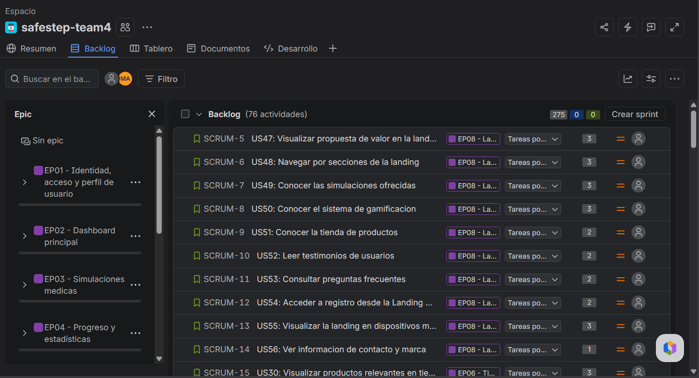
  <p>
    <i><b>Fuente</b>: Elaboración propia</i>
  </p>
</div>

<br>

<br>
<br>

<div align="center">
    
</div>

<br>
<br>

<a id="toc-3-4-impact-mapping"></a>
# 3.4. Impact Mapping

Este impact mapping representa el resumen de todo lo obtenido por las historias de usuario escogidas de tal manera que se examina el user gol principal y cada de unos de los 3 segmentos objetivo donde se reparten por impacts y deliverables. Donde el primero se enfoca en lo que el usuario le impactará o beneficiará a través de lo que consiga con la plataforma y el segundo acerca de lo que se le entregará al usuario en cuanto a la aplicación.

<div align="center">
  <p>
    <b>Grafico 1</b>: Impact Mapping
  </p>
  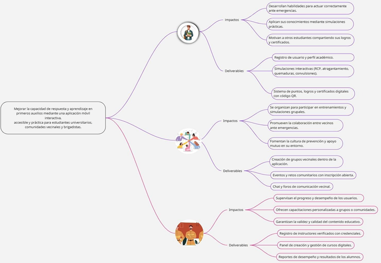
  <p>
    <i><b>Fuente</b>: Elaboración propia.</i>
  </p>
</div>

<br>

<div style="page-break-before: always;"></div>

<br>
<br>

<div align="center">
  
</div>

<br>
<br>

<a id="toc-4-1-style-guidelines"></a>
# 4.1. Style Guidelines

Esta guía reúne decisiones de marca, tipografía, color, espaciado e interacción para la landing page, la aplicación web y la futura experiencia móvil de SafeStep. La base visual se vincula con la necesidad de comprensión y práctica identificada en los tres segmentos de 1.3 y con las historias de la landing (US47–US56) y de la aplicación (US01–US46). **Las reglas para iOS y Android son propuestas de diseño; el proyecto revisado aún no contiene aplicaciones nativas.**

El logotipo e imágenes de la landing están en `safeStept-landing-page/assets/`; la aplicación web guarda recursos en `safeStept-frontend/public/assets/` y sus variables visuales en `safeStept-frontend/src/styles.css`. La landing mantiene variables equivalentes en `safeStept-landing-page/styles.css`. **Todavía no existe un repositorio único de tokens y assets compartidos**: antes de producir nuevos prototipos, el equipo debe acordar una fuente maestra con nombre, valor, propósito, variante y responsable de cada token, y versionar allí logotipo, iconos y recursos con sus licencias. Esta guía es la referencia documental, no sustituye esa sincronización técnica.

<a id="toc-4-1-1-general-style-guidelines"></a>
## 4.1.1. General Style Guidelines

<a id="toc-4-1-1-1-branding-y-lenguaje"></a>
### 4.1.1.1. Branding y lenguaje

**SafeStep** une seguridad y aprendizaje progresivo. El logotipo actual combina un símbolo asociado a primeros auxilios con el nombre de la marca. Se conservará en proporciones y variantes aprobadas por el equipo, evitando deformaciones o cambios de color que reduzcan su reconocimiento.

<div align="center">
  <p><b>Gráfico 1.</b> Logotipo actual de SafeStep</p>
  
  <p><i>Fuente: recurso existente del proyecto.</i></p>
</div>

El lema de trabajo es «Aprende a salvar vidas, un paso a la vez». Como promesa de comunicación, debe acompañarse de un límite explícito: **la plataforma apoya el aprendizaje y no reemplaza la atención de emergencias ni la práctica supervisada**. No se afirmará que el contenido esté validado por profesionales de salud, que las simulaciones acrediten competencias o que una insignia sea certificación profesional hasta contar con evidencia verificable.

| Dimensión del tono | Decisión | Aplicación y sustento |
|---|---|---|
| Serio / divertido | Serio en instrucciones; ligero solo en motivación | Una emergencia requiere indicaciones claras; los elementos lúdicos no deben trivializarla. |
| Formal / casual | Cercano y respetuoso | Los segmentos incluyen principiantes; se explican términos técnicos antes de usarlos. |
| Respetuoso / irreverente | Respetuoso | No se usan bromas sobre lesiones, víctimas o errores. |
| Entusiasta / sereno | Sereno en decisiones; alentador en progreso | El feedback reconoce avances sin prometer capacidad clínica no medida. |

Microcopy recomendado: verbos concretos como «Practicar», «Revisar respuesta» y «Continuar». Los mensajes de error explican qué ocurrió y qué puede hacer la persona; las respuestas médicas deben citar una fuente y fecha de revisión cuando se publiquen. Se evitarán frases absolutas como «ya puedes actuar correctamente» o «certificado oficial» sin respaldo.

<a id="toc-4-1-1-2-typography"></a>
### 4.1.1.2. Typography

El código actual carga **Poppins** para títulos e **Inter** para texto de interfaz tanto en la landing como en el frontend. Se conservan por la diferenciación entre jerarquía visual y lectura prolongada; deben ofrecerse fuentes de reserva del sistema si la carga externa falla.

<div align="center">
  <p><b>Gráfico 2.</b> Referencia tipográfica existente</p>
  
  <p><i>Fuente: recurso existente del proyecto.</i></p>
</div>

| Uso | Familia y peso de referencia | Tamaño web inicial | Regla |
|---|---|---:|---|
| Título principal | Poppins 700 | 32–48 px según espacio | Un H1 semántico por vista; no reducir el texto hasta hacerlo ilegible. |
| Sección | Poppins 600 | 24–32 px | Orden H2/H3 coherente con la estructura. |
| Texto principal | Inter 400 | 16 px | Interlineado aproximado de 1,5. |
| Texto secundario | Inter 400/500 | 14 px | No usarlo para instrucciones críticas extensas. |
| Controles | Inter o Poppins 600 | 14–16 px | Nombre visible y accesible consistente. |

En web se emplearán unidades relativas o `clamp()` cuando corresponda. En móvil nativo, el tamaño de texto respetará los ajustes de accesibilidad del sistema; la equivalencia visual no requiere fijar el mismo número de píxeles en todas las plataformas.

<a id="toc-4-1-1-3-colors"></a>
### 4.1.1.3. Colors

Los colores base proceden de las hojas de estilo actuales. El azul comunica acción y orientación, el verde indica éxito, el naranja precaución y el rojo error o riesgo. **El color nunca será el único indicador del estado**: se añadirá texto, icono o forma.

| Token de diseño | Valor | Uso previsto | Estado |
|---|---|---|---|
| Azul de marca | `#0ea5e9` | Acentos, ilustración y fondos sin texto blanco pequeño | Existente en landing y web. |
| Azul de acción accesible | `#0369a1` | Fondo de botón con texto blanco o enlace sobre blanco | Propuesto para unificar; ya existe como variable en la landing. |
| Azul profundo | `#0c4a6e` | Encabezados y superficies oscuras | Existente en la landing. |
| Verde de marca | `#22c55e` | Estado de éxito acompañado de etiqueta | Existente; no usar con texto blanco pequeño sin revisión. |
| Naranja / rojo | `#f97316` / `#ef4444` | Aviso / error acompañados de mensaje | Existentes; revisar contraste según combinación. |
| Texto / fondo | `#111827` / `#ffffff` | Lectura principal | Existentes. |

El contraste calculado de **blanco sobre `#0ea5e9` es 2,77:1**, insuficiente para el objetivo de 4,5:1 en texto normal. Blanco sobre `#0369a1` alcanza aproximadamente **5,93:1**. Por ello, **no se declara conformidad WCAG AA de la implementación actual**: se debe cambiar la combinación de botones/enlaces afectados y auditar todas las variantes, tamaños y estados. El objetivo se basa en [WCAG 2.2, criterio de contraste mínimo](https://www.w3.org/TR/WCAG22/#contrast-minimum); los valores anteriores son cálculos para colores sólidos, no una auditoría del gradiente completo.

<a id="toc-4-1-1-4-spacing-y-recursos-compartidos"></a>
### 4.1.1.4. Spacing y recursos compartidos

La escala propuesta parte de 4 px: **4, 8, 12, 16, 24, 32, 48 y 64 px**. Se usará para separación entre controles, tarjetas y secciones; no se reducirá de manera mecánica a la mitad en móvil si eso compromete el espacio táctil. El ancho máximo y la retícula de cada vista se comprobarán sobre los diseños reales, evitando imponer 12 columnas a pantallas estrechas.

Para cada nuevo recurso se registrarán formato, versión, origen, licencia, texto alternativo y uso previsto. La biblioteca compartida debe contener variantes de logotipo, iconos, fotografías aprobadas, fuentes o enlaces de distribución, y tokens de color, tipografía y espaciado. Mientras siga dividida entre repositorios, cualquier cambio visual deberá revisarse en landing y frontend para evitar divergencias.

<a id="toc-4-1-1-5-referencia-de-diseno-y-trazabilidad"></a>
### 4.1.1.5. Referencia de diseño y trazabilidad

La aplicación web usa **Angular Material y CSS propio**; la landing usa HTML/CSS/JavaScript y variables CSS. La versión heredada **no implementa Tailwind**. El statement del curso exige una futura adecuación de la experiencia web a Vue/PrimeVue; la guía visual puede reutilizarse, pero no debe presentarse esa migración como terminada. Cada componente nuevo se relacionará con la historia de usuario que atiende, el token que utiliza y sus estados accesibles.

<a id="toc-4-1-2-web-style-guidelines"></a>
## 4.1.2. Web Style Guidelines

Las reglas web cubren la landing y la aplicación autenticada. Su aplicación actual es parcial: el documento establece la decisión objetivo y señala los puntos que requieren ajuste en código.

<a id="toc-4-1-2-1-responsive-design-principles"></a>
### 4.1.2.1. Responsive Design Principles

La landing usa cortes CSS en torno a **480, 768 y 992 px**; el shell de la aplicación cambia a modo compacto en **1024 px**. No son todavía un conjunto unificado. La decisión objetivo es basar cada cambio de disposición en el espacio real del contenido y probar al menos teléfono estrecho, teléfono ancho, tableta y escritorio. El contenido y las acciones esenciales deben permanecer disponibles sin desplazamiento horizontal. «Mobile-first» se tratará como criterio de próximos diseños, no como afirmación comprobada sobre todo el CSS heredado.

<a id="toc-4-1-2-2-componentes-y-estados"></a>
### 4.1.2.2. Componentes y estados

Cada botón, enlace, campo, tarjeta interactiva y elemento de navegación tendrá estados **predeterminado, hover cuando aplique, focus visible, pressed, disabled, carga y error/éxito**. La etiqueta y el feedback deberán indicar el resultado de la acción. El foco no dependerá solo del color y no desaparecerá para navegación por teclado.

<div align="center">
  <p><b>Gráfico 3.</b> Especificación visual propuesta de estados web</p>
  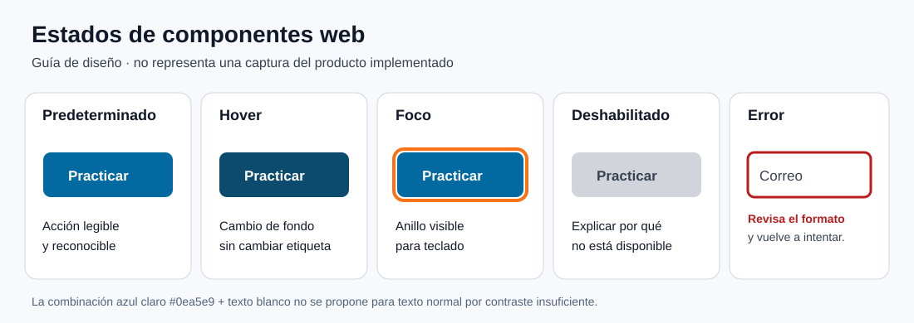
  <p><i>Fuente: elaboración propia. Es una guía de diseño, no una captura de la aplicación implementada.</i></p>
</div>

Los formularios asociarán cada campo con su etiqueta, indicación de obligatoriedad y mensaje de error junto al control. Las acciones destructivas requerirán confirmación cuando su efecto sea difícil de revertir. En web se propone un objetivo táctil de **al menos 44 × 44 px** para controles principales, sujeto a revisión contextual y accesibilidad.

<a id="toc-4-1-2-3-navegacion-accesibilidad-y-movimiento"></a>
### 4.1.2.3. Navegación, accesibilidad y movimiento

La landing dispone de navegación por anclas y acceso a la aplicación; la aplicación utiliza un shell con barra superior y menú lateral que pasa a modo compacto. La ubicación actual y el retorno se señalarán de forma consistente; no se prometerán breadcrumbs ni enlaces legales funcionales donde aún no existan. Los patrones concretos se describen en 4.2.5.

La meta web es cumplir **WCAG 2.2 nivel AA**: navegación por teclado, orden de foco, nombres accesibles, alternativas textuales, contraste y estados perceptibles. Esta es una meta de verificación, no una certificación de conformidad actual. Las transiciones cortas pueden orientar, pero el contenido no dependerá del movimiento y se respetará `prefers-reduced-motion`. Un *pull-to-refresh* nativo no se incluye como regla general de web.

<a id="toc-4-1-3-mobile-style-guidelines"></a>
## 4.1.3. Mobile Style Guidelines

Estas guías definen una **propuesta To-Be** para aplicaciones nativas. No describen pantallas ya desarrolladas. Se conservan marca, lenguaje, colores con contraste comprobado y estructura de contenido, pero controles, medidas y navegación se adaptarán a cada plataforma. La arquitectura de información móvil de 4.2 es igualmente propuesta.

| Elemento compartido | Decisión para las dos plataformas |
|---|---|
| Inicio de práctica | Acceso a simulaciones, progreso y ayuda sin ocultar información crítica tras gamificación o tienda. |
| Contenido de emergencia | Instrucciones breves, fuente visible, fecha de revisión y aviso de que la app no sustituye atención profesional. |
| Feedback | Explicar decisión, consecuencia y siguiente paso sin atribuir competencia clínica por una puntuación. |
| Adaptación | Texto escalable, orientación y tamaños diversos, controles con nombres accesibles, movimiento reducible. |

<div align="center">
  <p><b>Gráfico 4.</b> Patrones móviles propuestos por plataforma</p>
  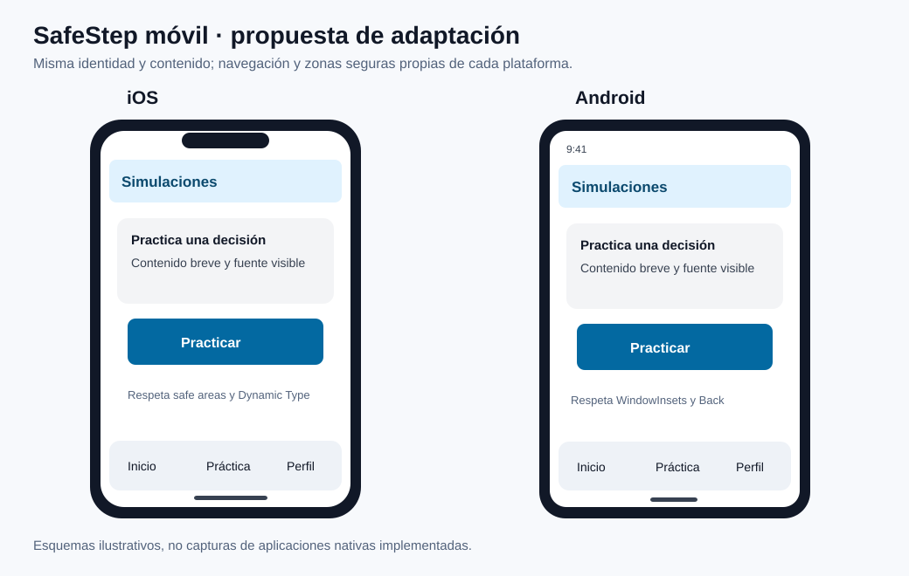
  <p><i>Fuente: elaboración propia basada en las guías oficiales de Apple y Android. No representa una app implementada.</i></p>
</div>

<a id="toc-4-1-3-1-ios-mobile-style-guidelines"></a>
### 4.1.3.1. iOS Mobile Style Guidelines

- Respetar las **safe areas** para que texto y controles no queden bajo la cámara, barra del sistema o indicadores de gesto; adaptar pantallas compactas y ampliadas.
- Usar una barra de pestañas solo para destinos principales estables. En vistas de detalle, conservar una forma reconocible de volver; no depender únicamente de gestos ocultos.
- Integrar **Dynamic Type** y verificar que el contenido siga comprensible con texto ampliado. El área de interacción propuesta para controles es al menos **44 × 44 pt**.
- Ofrecer etiquetas útiles para VoiceOver y no basar la comprensión del resultado exclusivamente en color, vibración o animación.

Referencias: [Apple Human Interface Guidelines: Layout](https://developer.apple.com/design/human-interface-guidelines/layout), [Accessibility](https://developer.apple.com/design/human-interface-guidelines/accessibility) y [Tab bars](https://developer.apple.com/design/human-interface-guidelines/tab-bars).

<a id="toc-4-1-3-2-android-mobile-style-guidelines"></a>
### 4.1.3.2. Android Mobile Style Guidelines

- Respetar barras del sistema, recortes, teclado y **WindowInsets**; si se usa contenido edge-to-edge, mantener acciones fuera de las zonas de gestos.
- Usar navegación principal adaptable: barra para un conjunto pequeño de destinos y, en pantallas amplias, evaluar rail o drawer. El comportamiento de **Back** debe volver de manera predecible desde detalles y flujos.
- Permitir escalado de fuentes y lectura por TalkBack. El área táctil propuesta para controles es al menos **48 × 48 dp**, incluso si el icono visible es menor.
- Usar componentes y patrones Material como referencia Android, manteniendo la identidad de SafeStep sin copiar una pantalla iOS.

Referencias: [Android: System bars](https://developer.android.com/design/ui/mobile/guides/foundations/system-bars), [Accessibility](https://developer.android.com/design/ui/mobile/guides/foundations/accessibility) y [Layouts and navigation patterns](https://developer.android.com/design/ui/mobile/guides/layout-and-content/layout-and-nav-patterns).

<br>

<br>
<br>

<div align="center">
  
</div>

<br>
<br>

<a id="toc-4-2-information-architecture"></a>
# 4.2. Information Architecture

La arquitectura de información organiza el contenido para que visitantes y usuarios encuentren una forma de conocer SafeStep, practicar y revisar su progreso. Se basa en los segmentos de 1.3, en la necesidad de fuentes y práctica descrita en 2.2–2.3 y en las historias de la landing (US47–US56) y de la aplicación (US01–US46). La prioridad es hacer visible la práctica sin confundir una puntuación de simulación con competencia clínica.

**Alcance:** se distinguen la landing HTML/CSS/JavaScript y la aplicación web autenticada actual. Las decisiones de aplicación nativa son **propuestas To-Be**, porque no hay una app iOS o Android en los repositorios revisados. Cuando una función descrita aquí no está implementada, se etiqueta como pendiente y no se presenta como evidencia de producto terminado.

<div align="center">
  <p><b>Gráfico 1.</b> Mapa de contenidos y destinos principales</p>
  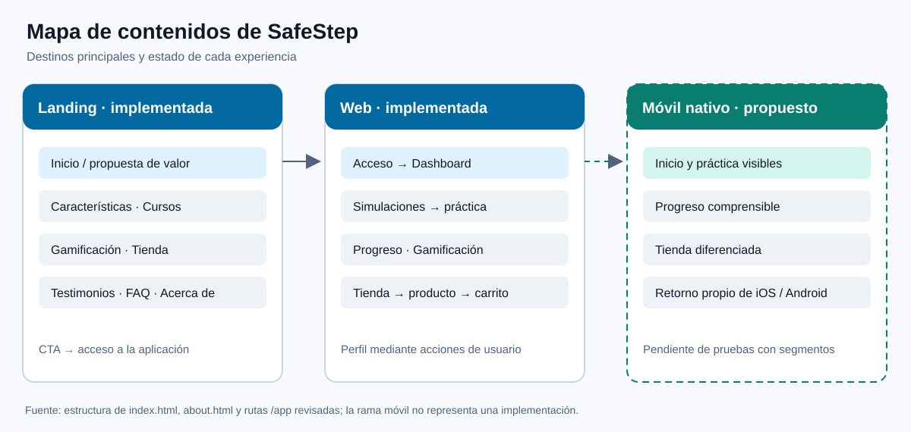
  <p><i>Fuente: elaboración propia a partir de la landing y las rutas del frontend. La rama móvil es propuesta.</i></p>
</div>

<a id="toc-4-2-1-organization-systems"></a>
## 4.2.1. Organization Systems

<a id="toc-4-2-1-1-organizacion-por-producto-y-proposito"></a>
### 4.2.1.1. Organización por producto y propósito

| Producto / grupo | Organización visual | Categorización y orden | Estado |
|---|---|---|---|
| Landing: inicio | Jerárquica: propuesta de valor y CTA antes del detalle; secuencial en «cómo funciona» | Por tópicos: características, cursos, gamificación, tienda, testimonios, FAQ; existe además `about.html` | Implementado en el sitio estático. |
| Web: inicio y práctica | Jerárquica: dashboard → catálogo de simulaciones → detalle → respuesta y resultado | Por tópico/tipo de emergencia; el filtro de catálogo usa `emergencyType` | Implementado en la aplicación web. |
| Web: progreso y gamificación | Jerárquica desde el menú principal; vistas de datos y logros | Cronológica cuando se revisan intentos o actividad; por tópico para estadísticas e insignias | Implementado parcialmente; revisar en cada vista las agrupaciones reales. |
| Web: tienda | Catálogo → producto/kit → carrito y flujo de compra | Por categoría y búsqueda textual; no se presupone un orden alfabético fijo | Implementado en la aplicación web. |
| Móvil nativo | Destinos principales equivalentes, con disposición adaptable a cada sistema | Mantener las mismas categorías y términos, revalidando su prioridad con cada segmento | Propuesta pendiente de diseño y desarrollo. |

La organización **matricial** se reserva como propuesta para cruces de tipo de emergencia, dificultad y estado cuando los datos y controles lo permitan. La organización **por audiencia** —estudiante, miembro de comunidad vecinal y persona con experiencia brigadista— sirve para analizar pertinencia de ejemplos y contenidos; **no se presenta como personalización o roles ya implementados**. Las listas alfabéticas podrían ayudar en un catálogo amplio, mientras las cronológicas son apropiadas para historial; ninguna se atribuye a todas las pantallas sin comprobarlo.

El informe anterior describía módulos obligatorios «teoría → video → evaluación», niveles curriculares y certificaciones como estructura vigente. Esa secuencia no se deduce de las rutas principales actuales, que se organizan alrededor de **simulaciones**. Si el equipo decide desarrollar cursos o módulos más adelante, deberá incorporarlos al backlog, al mapa de contenidos y a pruebas de navegación antes de tratarlos como parte del producto.

<a id="toc-4-2-1-2-reglas-de-jerarquia-y-secuencia"></a>
### 4.2.1.2. Reglas de jerarquía y secuencia

1. En la landing, la pregunta «¿qué es y para quién sirve?» se responde antes del detalle de recompensas o tienda. Los CTA llevan a acceso/registro cuando el destino existe; no se usarán enlaces vacíos como si fueran navegación terminada.
2. En la web, el dashboard ofrece acceso a las cinco áreas principales: Dashboard, Simulaciones, Progreso, Gamificación y Tienda. El perfil se alcanza mediante las acciones de usuario, no como una sexta entrada permanente del menú principal.
3. Un detalle de simulación identifica el tipo de emergencia, qué se practicará y el origen del contenido antes de iniciar. El resultado ofrece un camino claro para revisar o repetir.
4. La tienda mantiene separados el aprendizaje y la compra: una sugerencia comercial no se confundirá con una recomendación clínica.

<a id="toc-4-2-2-labeling-systems"></a>
## 4.2.2. Labeling Systems

El etiquetado utiliza nombres breves y consistentes para relacionar **etiqueta → destino → acción esperada**. La landing y la web tienen contextos distintos; no se forzará la misma etiqueta donde significaría algo diferente. Las traducciones ES/EN de la aplicación deben conservar la misma asociación.

<a id="toc-4-2-2-1-inventario-de-etiquetas-principales"></a>
### 4.2.2.1. Inventario de etiquetas principales

| Contexto | Etiqueta visible o de referencia | Asociación prevista | Estado |
|---|---|---|---|
| Landing | Características | Beneficios y capacidades de SafeStep | Enlace a sección `#features`. |
| Landing | Cursos | Presentación de temas; no equivale a un currículo web ya implementado | Enlace a `#courses`; revisar CTA de cada tarjeta. |
| Landing | Gamificación / Tienda | Explicación de incentivos / productos | Enlaces a `#gamification` y `#store`. |
| Landing | Acerca de | Equipo y proyecto Chronos | `about.html`. |
| Landing | Comenzar Gratis | Acceso a la aplicación | Destino externo actual; validar disponibilidad y promesa de gratuidad. |
| Web | Dashboard | Vista de inicio autenticada | `/app/dashboard`. |
| Web | Simulaciones | Catálogo y práctica | `/app/simulations`. |
| Web | Progreso | Estadísticas personales | `/app/statistics`. |
| Web | Gamificación | Misiones, insignias y recompensas | `/app/gamification`. |
| Web | Tienda | Catálogo y compra | `/app/store`. |
| Web | Perfil | Información y opciones personales | Acceso desde shell a `/app/profile`. |
| Móvil nativo | Inicio / Práctica / Progreso / Tienda | Destinos candidatos de primer nivel | Propuesta; validar mediante pruebas con usuarios. |

<a id="toc-4-2-2-2-reglas-para-contenido-y-acciones"></a>
### 4.2.2.2. Reglas para contenido y acciones

- Usar una sola denominación por concepto: «Simulaciones» no cambia a «Módulos» dentro del mismo flujo; «Progreso» y «Historial» se distinguen cuando muestran información diferente.
- Las acciones se nombran por resultado: «Practicar», «Continuar», «Ver resultado», «Agregar al carrito». «Certificado» solo se utilizará si existe una credencial con alcance, emisor y validez comprobables; las recompensas internas se nombran como **insignias** o **logros**.
- El texto breve de un botón no sustituye el contexto accesible. Un icono aislado tendrá nombre legible para tecnologías de asistencia.
- Cada etiqueta de navegación debe conservar el destino esperado en español e inglés. El equipo revisará traducciones con la nomenclatura del backlog, las rutas y las pantallas, sin usar literalmente claves internas como `nav.dashboard`.

<a id="toc-4-2-3-seo-tags-and-meta-tags"></a>
## 4.2.3. SEO Tags and Meta Tags

El statement solicita valores de **Title, Description, Keywords y Author** para páginas principales de landing y aplicación. La tabla siguiente es una **especificación objetivo**, no una afirmación de que todos los metadatos estén ya publicados. Las páginas privadas de la aplicación no necesitan posicionarse en buscadores y se proponen con `noindex`.

| Página / ruta | Title propuesto | Description propuesta | Keywords propuestas | Author | Indexación |
|---|---|---|---|---|---|
| Landing `index.html` | SafeStep \| Practica decisiones de primeros auxilios | Conoce SafeStep y sus simulaciones educativas para repasar decisiones iniciales ante emergencias. | primeros auxilios, simulaciones, aprendizaje | Equipo Chronos | Pública. |
| Landing `about.html` | Acerca de Chronos \| SafeStep | Conoce al equipo, el propósito y los límites de la plataforma educativa SafeStep. | Chronos, SafeStep, equipo | Equipo Chronos | Pública. |
| Acceso `/auth` | Acceso \| SafeStep | Ingresa a tu espacio de práctica de SafeStep. | SafeStep, acceso | Equipo Chronos | `noindex`. |
| `/app/dashboard` | Inicio \| SafeStep | Consulta accesos a práctica y progreso personal. | SafeStep, inicio | Equipo Chronos | `noindex`. |
| `/app/simulations` y detalle | Simulaciones \| SafeStep / [Nombre] \| SafeStep | Explora simulaciones educativas o revisa el objetivo de una práctica. | simulaciones, primeros auxilios | Equipo Chronos | `noindex` en el producto autenticado. |
| `/app/statistics` | Progreso \| SafeStep | Revisa estadísticas de las prácticas realizadas. | SafeStep, progreso | Equipo Chronos | `noindex`. |
| `/app/gamification` | Gamificación \| SafeStep | Consulta misiones, insignias y recompensas internas. | SafeStep, gamificación | Equipo Chronos | `noindex`. |
| `/app/store` y detalle | Tienda \| SafeStep / [Producto] \| SafeStep | Explora productos o consulta sus características antes de comprar. | SafeStep, tienda | Equipo Chronos | `noindex` mientras requiera autenticación. |

**Diferencia con el código actual:** `index.html` de la landing tiene Title, Description y Keywords, pero no Author; `about.html` tiene Title y Description, pero no Keywords ni Author. La aplicación define títulos de rutas, pero su HTML base no declara las cuatro metatags. Deben implementarse y verificarse en el HTML servido; una tabla del informe por sí sola no configura SEO.

Se retiraron de la propuesta las afirmaciones «50 000+ usuarios», cobertura de envíos, certificación o acreditación y dominios/redes sociales no verificados. La landing actual todavía contiene algunas de esas frases, por lo que **también requieren corrección en código antes de publicarse como hechos**. Los valores Open Graph, Twitter Card, URL canónica y datos estructurados se añadirán solo con URL absoluta, imagen pública y hechos comprobados. No se marcarán como `Course` páginas de cursos que no existan ni se expondrán datos privados mediante metadatos.

<a id="toc-4-2-4-searching-systems"></a>
## 4.2.4. Searching Systems

La búsqueda debe responder «qué puedo encontrar aquí» y mostrar un estado claro cuando no haya resultados. La tabla diferencia los controles presentes de los propuestos; evita atribuir búsqueda global, voz o tolerancia a errores a la versión actual.

| Superficie | Entrada y filtros | Presentación de resultados | Estado |
|---|---|---|---|
| Landing | Navegación por secciones, sin búsqueda interna | Desplazamiento al ancla; sección visible | Implementado. |
| Catálogo de simulaciones | Filtro por **tipo de emergencia** (`emergencyType`) | Tarjetas de simulación y estado vacío si no hay coincidencias | Implementado. Búsqueda textual, dificultad, duración y fecha: pendientes. |
| Tienda | Texto por nombre/categoría/etiquetas y filtro de categoría; los kits usan nombre/descripción/nivel | Productos y kits filtrados en sus vistas | Implementado. Rango de precio, valoración, stock, ordenamiento avanzado y sugerencias: pendientes. |
| Progreso e historial | Consulta de datos propios mediante vistas existentes | Estadísticas/historial según la vista | Búsqueda y filtros por fecha o resultado: pendientes. |
| Búsqueda global o por voz | Unificar contenidos o entrada de voz | Resultados agrupados por tipo | Idea futura; no implementada ni comprometida en esta versión. |

En nuevas búsquedas se debe especificar campo consultado, combinación de filtros, forma de limpiar, cantidad de resultados y estados **cargando / sin coincidencias / error**. Una propuesta de filtro se convierte en requisito solo cuando tiene historia, criterio de aceptación y prueba correspondientes.

<a id="toc-4-2-5-navigation-systems"></a>
## 4.2.5. Navigation Systems

<a id="toc-4-2-5-1-landing-page"></a>
### 4.2.5.1. Landing Page

La navegación principal lleva a Características, Cursos, Gamificación, Tienda y Acerca de; el CTA abre el acceso a la aplicación. Las anclas guían la lectura de la propuesta de valor hacia el detalle y la acción. En el footer hay enlaces con `href="#"` —incluidos algunos sociales, legales y de contacto—: **son marcadores sin destino funcional**, no navegación completada. Se deben sustituir por páginas reales o retirarlos antes de afirmar que la información legal y de contacto es accesible.

<a id="toc-4-2-5-2-aplicacion-web"></a>
### 4.2.5.2. Aplicación web

El shell dispone de los destinos Dashboard, Simulaciones, Progreso, Gamificación y Tienda; bajo 1024 px utiliza navegación compacta. El logo retorna al dashboard. Algunas vistas de tienda y detalle de simulación incluyen breadcrumbs; no se afirma que todas las vistas los tengan. Los estados activos y el retroceso deben verificarse por ruta, incluidos los flujos de compra y administración.

| Origen | Destino o secuencia | Señal de orientación |
|---|---|---|
| Landing | Sección temática → CTA → acceso | Etiqueta de sección y destino explícito del CTA. |
| Dashboard | Simulaciones → detalle → práctica → resultado | Título del caso, avance y salida/revisión claras. |
| Dashboard | Tienda → producto → carrito → pago | Paso actual y posibilidad de regresar sin perder información pertinente. |
| Dashboard | Progreso / Gamificación | Navegación principal con estado activo. |

<a id="toc-4-2-5-3-experiencia-movil-propuesta"></a>
### 4.2.5.3. Experiencia móvil propuesta

Para iOS y Android se conservarán las categorías de contenido, pero la navegación se decidirá mediante pruebas de tareas con los tres segmentos. Se propone acceso visible a inicio, práctica y progreso, con tienda como destino diferenciado; una barra inferior se evaluará solo para destinos principales y el resto podrá ir a menú o perfil. El retorno respetará el comportamiento de cada sistema. **No hay evidencia de barra inferior o gestos nativos implementados actualmente.**

<a id="toc-4-2-5-4-accesibilidad-y-validacion-de-navegacion"></a>
### 4.2.5.4. Accesibilidad y validación de navegación

El flujo debe admitir teclado en web, foco visible, nombres comprensibles para lectores de pantalla y retorno predecible. En móvil se adaptará a VoiceOver o TalkBack. Antes de cerrar esta arquitectura, el equipo debe probar con participantes tareas concretas: encontrar una práctica, interpretar su resultado, volver al catálogo y localizar una compra. Se registrarán errores de navegación, etiquetas ambiguas y rutas sin salida, y se actualizarán el mapa, las historias y las pantallas de diseño con esos hallazgos.

<br>

<br>
<br>

<div align="center">
    
</div>

<br>
<br>

<a id="toc-4-3-landing-page-ui-design"></a>
# 4.3. Landing Page UI Design

<a id="toc-4-3-1-landing-page-wireframe"></a>
## 4.3.1. Landing Page Wireframe

<a id="toc-4-3-1-1-introduccion-al-wireframe-del-landing-page"></a>
### 4.3.1.1. Introducción al Wireframe del Landing Page

El wireframe del Landing Page de SafeStep establece la estructura fundamental y el flujo de información antes de aplicar elementos visuales. Este wireframe sirve como plano base que define la posición de todos los elementos y la arquitectura de información que será posteriormente refinada en los mockups.

El diseño del wireframe sigue el principio de "mobile-first" pero prioriza la presentación desktop dado que el Landing Page busca maximizar conversiones tanto en desktop como en mobile. El wireframe está diseñado para ser escalable y mantener su efectividad en ambos formatos de pantalla.

<a id="toc-4-3-1-2-wireframe-desktop"></a>
### 4.3.1.2. Wireframe Desktop

El wireframe desktop del Landing Page se estructura en las siguientes regiones principales:

<a id="toc-estructura-general-desktop"></a>
#### Estructura General Desktop

<div align="center">
  <p>
    <b>Gráfico</b>: Wireframe desktop del Landing de SafeStep
  </p>
  
  <p>
    <i><b>Fuente</b>: Elaboración propia.</i>
  </p>
</div>

<a id="toc-4-3-1-3-wireframe-mobile"></a>
### 4.3.1.3. wireframe Mobile

El wireframe mobile adapta la estructura desktop a formatos verticales con navegación colapsable:

<a id="toc-estructura-general-mobile"></a>
#### Estructura General Mobile

<div align="center">
  <p>
    <b>Gráfico</b>: Wireframe mobile del Landing de SafeStep
  </p>
  
  <p>
    <i><b>Fuente</b>: Elaboración propia.</i>
  </p>
</div>

<a id="toc-4-3-1-4-regiones-del-wireframe-y-su-funcion"></a>
### 4.3.1.4. Regiones del wireframe y su Función

A continuación se detalla cada región del wireframe según su función en el recorrido del usuario:

<a id="toc-a-header-navegacion-global"></a>
#### A. Header (Navegación Global)

El header contiene el logo de SafeStep, navegación principal con enlaces a secciones clave, y acciones de conversión (iniciar sesión, comenzar). En desktop es horizontal y visible; en mobile se colapsa en hamburger menu.

**Elementos del header:**
- Logo (enlace al inicio)
- Navegación principal: Características, Simulaciones, Tienda, FAQ
- Botones de acción: Iniciar Sesión, Comenzar Gratis

**Principios aplicados:**
- El logo siempre es visible y clickeable
- Las acciones de mayor frecuencia están a la derecha
- El botón principal ("Comenzar") tiene mayor jerarquía visual

<a id="toc-b-hero-section"></a>
#### B. Hero Section

El hero section es la primera impresión y el punto focal principal. Contiene el mensaje de valor central, llamada a la acción, y prueba social.

**Elementos del hero:**
- Badge de prueba social ("+50,000 usuarios")
- Título principal con gradient impact
- Subtítulo explicativo
- Dos CTAs (botón primario "Comenzar", secundario "Ver cómo funciona")
- Indicators de confianza (avatar de usuarios, rating)

**Principios aplicados:**
- Jerarquía clara: título > subtítulo > CTAs
- Prueba social inmediata
- Dos opciones para diferentes tipos de usuario

<a id="toc-c-stats-section"></a>
#### C. Stats Section

La sección de estadísticas proporciona evidencia cuantitativa del impacto de SafeStep.

**Estadísticas mostradas:**
- Usuarios activos (50K+)
- Módulos de simulación (5)
- Satisfacción (98%)
- Vidas preparadas (12K+)

**Principios aplicada:**
- Números redondos y fáciles de recordar
- Formato visual de grilla para scaneo rápido

<a id="toc-d-features-section-caracteristicas-principales"></a>
#### D. Features Section (Características Principales)

Esta sección presenta las características clave de SafeStep en formato de tarjetas.

**Características mostradas:**
1. Simulaciones interactivas
2. Retroalimentación instantánea
3. Aprendizaje progresivo
4. Gamificación
5. Tienda de productos
6. Acceso multiplataforma

**Principios aplicados:**
- Formato visual uniforme (tarjetas)
- Iconografía consistente
- Brief description supporting cada feature

<a id="toc-e-how-it-works-section-paso-a-paso"></a>
#### E. How It Works Section (Paso a Paso)

La sección "Cómo funciona" explica el proceso de uso de SafeStep en tres pasos simples.

**Pasos:**
1. Crea tu cuenta
2. Practica simulaciones
3. Obtén certificaciones

**Principios aplicados:**
- Narrativa secuencial (1 > 2 > 3)
- Progresión visual (izquierda a derecha en desktop)
- Conexiones visuales entre pasos

<a id="toc-f-simulations-section-modulos"></a>
#### F. Simulations Section (Módulos)

La sección de simulaciones muestra los módulos de emergencia disponibles.

**Módulos representados:**
- RCP Básico
- Atragantamiento
- Quemaduras
- Sismos
- Hemorragias
- (+ opción para ver más)

**Principios aplicados:**
- Cards visuales con imagen representativa
- Metadata relevante (duración, rating)
- Call to action hacia "ver todos"

<a id="toc-g-gamification-section"></a>
#### G. Gamification Section

Esta sección comunica el sistema de gamificación que mantiene usuarios comprometidos.

**Elementos de gamificación:**
- Sistema de XP
- Insignias
- Rachas
- Rankings

**Principios aplicados:**
- Muestra el sistema de rewards
- Ilustra progreso y logro

<a id="toc-h-testimonials-section"></a>
#### H. Testimonials Section

Testimonios proporcionan prueba social cualitativa.

**Representación:**
- Avatar de usuario
- Quote del usuario
- Nombre y contexto

**Principios aplicados:**
- Autenticidad percibida
- Formato citas clásico

<a id="toc-i-faq-section-preguntas-frecuentes"></a>
#### I. FAQ Section (Preguntas Frecuentes)

Las preguntas frecuentes abordan objeciones comunes antes de que el usuario las tenga.

**Estructura:**
- Listado de preguntas/respuestas
- Collapsible para más información

**Principios aplicada:**
- Organización Q&A
- Expandible para no saturar

<a id="toc-j-footer"></a>
#### J. Footer

El footer proporciona navegación adicional y enlaces legales.

**Contenido del footer:**
- Links de navegación (Acerca de, Contacto, etc.)
- Redes sociales
- Legal links (Términos, Privacidad)
- Copyright

<a id="toc-4-3-1-5-principios-de-diseno-aplicados-en-el-wireframe"></a>
### 4.3.1.5. Principios de Diseño Aplicados en el Wireframe

El wireframe de SafeStep aplica los siguientes principios de diseño:

<a id="toc-jerarquia-visual"></a>
#### Jerarquía Visual

- El contenido se organiza por importancia: arriba > abajo
- Tamaño y peso visual reflejan jerarquía
- El "F-pattern" para scaneo de contenido

<a id="toc-espaciado-constante"></a>
#### Espaciado Constante

- Uso consistente de gutters y margins
- Grid de 12 columnas en desktop
- Adaptación fluida a breakpoints

<a id="toc-diseno-inclusivo"></a>
#### Diseño Inclusivo

- Tamaño mínimo de elementos táctiles (44x44px)
- Contraste suficiente para legibilidad
- Espacios generosos para interacción

<a id="toc-arquitectura-de-informacion"></a>
#### Arquitectura de Información

- Navegación clara con etiquetas simples
- Agrupación lógica de contenido relacionado
- Breadcrumbs implícitos en la estructura

<a id="toc-4-3-2-landing-page-mock-up"></a>
## 4.3.2. Landing Page Mock-up

Esta sección presenta y explica los Mock-ups del Landing Page, tanto en su versión para Desktop Web Browser como Mobile Web Browser. En la propuesta y la explicación debe evidenciarse la aplicación de los principios, elementos de diseño, diseño inclusivo y arquitectura de información, así como el Design System establecido para los productos digitales.

<a id="toc-4-3-2-1-introduccion-al-mock-up"></a>
### 4.3.2.1. Introducción al Mock-up

El mock-up del Landing Page representa la implementación visual final del wireframe, aplicando el Design System establecido en la sección 4.1. El mock-up utiliza los colores, tipografía, espaciado y componentes definidos en Style Guidelines para crear una experiencia visual coherente con la marca SafeStep.

<a id="toc-4-3-2-2-mock-up-desktop"></a>
### 4.3.2.2. Mock-up Desktop

El mock-up desktop del Landing Page aplica los siguientes elementos del Design System:

<a id="toc-paleta-de-colores-aplicada"></a>
#### Paleta de Colores Aplicada

**Primary (Azul): #0ea5e9**
- Botones primarios, highlights, iconos principales
- Aplicado en: CTAs, badges activos, hovers

**Safe (Verde): #22c55e**
- Indicadores de éxito, elementos de seguridad
- Aplicado en: estadísticas positivas, ratings

**Accent (Naranja): #f97316**
- Énfasis, alertas moderadas
- Aplicado en: botones secundarios, badges destacados

**Escala de Grises**
- Fondos: White, Gray-50, Gray-100
- Texto: Gray-900 (principal), Gray-600 (secundario)
- Bordes: Gray-200, Gray-300

<a id="toc-tipografia-aplicada"></a>
#### Tipografía Aplicada

**Poppins (Headings)**
- H1: 48-64px Bold - Títulos principales
- H2: 36-48px Bold - Títulos de sección
- H3: 24-28px SemiBold - Subtítulos

**Inter (Body)**
- Body: 16px Regular
- Small: 14px Regular
- Caption: 12px Regular

<a id="toc-componentes-visuales"></a>
#### Componentes Visuales

**Tarjetas de características:**
- Fondo: White
- Radio: 16px (rounded-2xl)
- Sombra: shadow-lg
- Padding: 32px
- Hover: translateY(-10px) + shadow-xl

**Botones:**
- Primario: bg-primary, text-white, rounded-full
- Secundario: border-white/30, text-white, rounded-full
- Altura: 48-56px
- Padding: 16px vertical, 32px horizontal

**Inputs:**
- Radio: 12px
- Borde: Gray-300
- Focus ring: primary/20

<a id="toc-4-3-2-3-mock-up-mobile"></a>
### 4.3.2.3. Mock-up Mobile

El mock-up mobile mantiene consistencia con desktop mientras adapta la experiencia a pantallas pequeñas:

<a id="toc-adaptaciones-mobile"></a>
#### Adaptaciones Mobile

**Diseño responsive:**
- Grid de contenido colapsa a 1 columna
- Navegación colapsada en hamburger menu
- Tarjetas de features en grid 1x6
- Spacing reducido (50-75% de desktop)

**Touch targets:**
- Todos los elementosInteractivos mínimo 44x44px
- Botones altura completa de 48px
- Espaciado entre elementos táctiles 16px

**Optimización visual mobile:**
- Imágenes optimizadas para carga rápida
- Texto legible sin zoom
- Formatos vertical scrolling

<a id="toc-4-3-2-4-vistas-detalladas-por-seccion"></a>
### 4.3.2.4. Vistas Detalladas por Sección

<a id="toc-hero-section-vista-detallada"></a>
#### Hero Section - Vista Detallada

**Desktop:**
- Fondo gradiente: linear-gradient(135deg, #0c4a6e, #0369a1, #0ea5e9)
- Texto: White
- Ilustración flotante a la derecha
- Botones con shadow-lg y pulse animation en CTA principal

**Mobile:**
- Fondo similar
- Texto centrado
- Ilustración hidden o colapsada
- Stacked buttons

<a id="toc-features-section-vista-detallada"></a>
#### Features Section - Vista Detallada

**Grid layout:**
- Desktop: 3 columnas
- Tablet: 2 columnas
- Mobile: 1 columna

**Card design:**
- Icono centrado (64x64px)
- Título debajo de icono
- Description debajo de título
- Hover effect con elevación

<a id="toc-simulations-section-vista-detallada"></a>
#### Simulations Section - Vista Detallada

**Card design:**
- Imagen representativa superior (h-48)
- Badge superior ("Popular", "Nuevo")
- Contenido textual inferior
- Footer con metadata

**Categorías de badges:**
- Popular: primary
- Nuevo: accent
- Premium: special gradient

<a id="toc-gamification-section-vista-detallada"></a>
#### Gamification Section - Vista Detallada

**Se características:**
- Fondo gradient azul
- Tarjetas translúcidas
- Iconos grandes prominentes
- Números/stats highlight

<a id="toc-4-3-2-5-aplicacion-del-design-system"></a>
### 4.3.2.5. Aplicación del Design System

El mock-up evidencia la aplicación del Design System a través de:

<a id="toc-consistencia-visual"></a>
#### Consistencia Visual

- Colores utilizados consistentemente a través de secciones
- Tipografía sigue la jerarquía establecida
- Espaciado uniforme
- Bordes y radios consistentes

<a id="toc-diseno-inclusivo-1"></a>
#### Diseño Inclusivo

- Contraste suficiente (WCAG AA mínimo)
- Estados de foco visibles
- Tamaños táctiles adecuados
- Texto alternativa para iconos

<a id="toc-accesibilidad"></a>
#### Accesibilidad

- Labels de form claramente asociados
- Campos de input con placeholders útiles
- Botones con texto claro
- Error states visibles

<a id="toc-4-3-2-6-referencias-visuales"></a>
### 4.3.2.6. Referencias Visuales

Las siguiente referencias muestran el mock-up final:

<a id="toc-desktop-homepage-mock-up"></a>
#### Desktop Homepage Mock-up

<div align="center">
  <p>
    <b>Gráfico</b>: Mock-up desktop del Landing de SafeStep
  </p>
  
  <p>
    <i><b>Fuente</b>: Elaboración propia.</i>
  </p>
</div>

El mockup desktop muestra:
- Hero section completo con illustration
- 6 features cards en grid
- 3 steps visuales
- 6 module cards
- Gamification section con íconos
- Testimonials slider

<a id="toc-mobile-homepage-mock-up"></a>
#### Mobile Homepage Mock-up

<div align="center">
  <p>
    <b>Gráfico</b>: Mock-up mobile del Landing de SafeStep
  </p>
  
  <p>
    <i><b>Fuente</b>: Elaboración propia.</i>
  </p>
</div>

El mockup mobile muestra:
- Collapsed header con hamburger
- Hero adaptado vertical
- Features en lista vertical
- Simulaciones scrollable
- Bottom navigation hint

<a id="toc-4-3-2-7-estados-interactivos-en-el-mock-up"></a>
### 4.3.2.7. Estados Interactivos en el Mock-up

Los mockups también muestran los estados interactivos de los componentes principales:

<a id="toc-estados-de-boton"></a>
#### Estados de Botón

- **Default**: Color fill, sin sombra
- **Hover**: Sombra incrementada, leve translate up
- **Active**: Escala reducida (0.98)
- **Disabled**: Opacidad reducida

<a id="toc-estados-de-tarjeta"></a>
#### Estados de Tarjeta

- **Default**: shadow-md
- **Hover**: shadow-xl, translateY(-10px)
- **Transition**: 300ms ease

<a id="toc-estados-de-input"></a>
#### Estados de Input

- **Default**: Gray-300 border
- **Focus**: Primary ring visible
- **Error**: Red border, mensaje visible
- **Success**: Green border, check icon

<a id="toc-4-3-2-8-diseno-responsivo-general"></a>
### 4.3.2.8. Diseño Responsivo General

El mock-up aplica diseño responsivo a través de:

<a id="toc-breakpoints-aplicados"></a>
#### Breakpoints Aplicados

- Mobile: 0-639px
- Tablet: 640-1023px
- Desktop: 1024px+

<a id="toc-comportamiento-por-breakpoint"></a>
#### Comportamiento por Breakpoint

- Stacking de grids
- Collapsing de navegación
- Adjustment de espaciado
- Images optimization

<a id="toc-imagenes-responsivas"></a>
#### Imágenes Responsivas

- srcset para diferentes anchos
- Lazy loading en imágenes below fold
- Placeholder durante carga

<br>

<a id="toc-4-4-mobile-applications-ux-ui-design"></a>
# 4.4. Mobile Applications UX/UI Design

Pendiente.

<a id="toc-4-4-1-mobile-applications-wireframes"></a>
## 4.4.1. Mobile Applications Wireframes

Pendiente.

<a id="toc-4-4-2-mobile-applications-wireflow-diagrams"></a>
## 4.4.2. Mobile Applications Wireflow Diagrams

Pendiente.

<a id="toc-4-4-3-mobile-applications-mock-ups"></a>
## 4.4.3. Mobile Applications Mock-ups

Pendiente.

<a id="toc-4-4-4-mobile-applications-user-flow-diagrams"></a>
## 4.4.4. Mobile Applications User Flow Diagrams

Pendiente.

<br>

<a id="toc-4-5-mobile-applications-prototyping"></a>
# 4.5. Mobile Applications Prototyping

Pendiente.

<a id="toc-4-5-1-android-mobile-applications-prototyping"></a>
## 4.5.1. Android Mobile Applications Prototyping

Pendiente.

<a id="toc-4-5-2-ios-mobile-applications-prototyping"></a>
## 4.5.2. iOS Mobile Applications Prototyping

Pendiente.

<br>

<br>
<br>

<div align="center">
    
</div>

<br>
<br>

<a id="toc-4-6-web-applications-ux-ui-design"></a>
# 4.6. Web Applications UX/UI Design

Esta sección incluye secciones internas donde se presenta y explica la propuesta visual y de interacción para las aplicaciones que constituyen la experiencia de usuario con los productos digitales.

<a id="toc-4-6-1-web-applications-wireframes"></a>
## 4.6.1. Web Applications Wireframes

Esta sección incluye una sección interna donde se presenta y explica los Wireframes de las aplicaciones móviles. En la propuesta y la explicación debe evidenciarse la aplicación de los principios, elementos de diseño, diseño inclusivo y arquitectura de información. Utilizar para los wireframes las herramientas indicadas.

<a id="toc-4-6-1-1-introduccion-a-wireframes-de-aplicaciones-web"></a>
### 4.6.1.1. Introducción a Wireframes de Aplicaciones Web

Los wireframes de las aplicaciones web de SafeStep establecen la estructura funcional de cada vista antes de aplicar tratamiento visual. Cada wireframe define la posición de elementos interactivos, la arquitectura de información para cada pantalla, y el flujo de interacción esperado para completar tareas específicas.

Los wireframes han sido diseñados siguiendo los principios de mobile-first donde las funcionalidades mobile son esenciales, pero también considerando la experiencia expandida de desktop. Los wireframes se crean en escala de grises para mantener el foco en estructura y función, no en aspectos visuales.

<a id="toc-4-6-1-2-dashboard-wireframe"></a>
### 4.6.1.2. Dashboard Wireframe

El Dashboard es la primera pantalla que ve el usuario después de iniciar sesión. Actúa como centro de control desde donde puede navegar a todas las funcionalidades principales.

<a id="toc-estructura-del-dashboard"></a>
#### Estructura del Dashboard

<div align="center">
  <p>
    <b>Gráfico</b>: Wireframe del dashboard principal de SafeStep
  </p>
  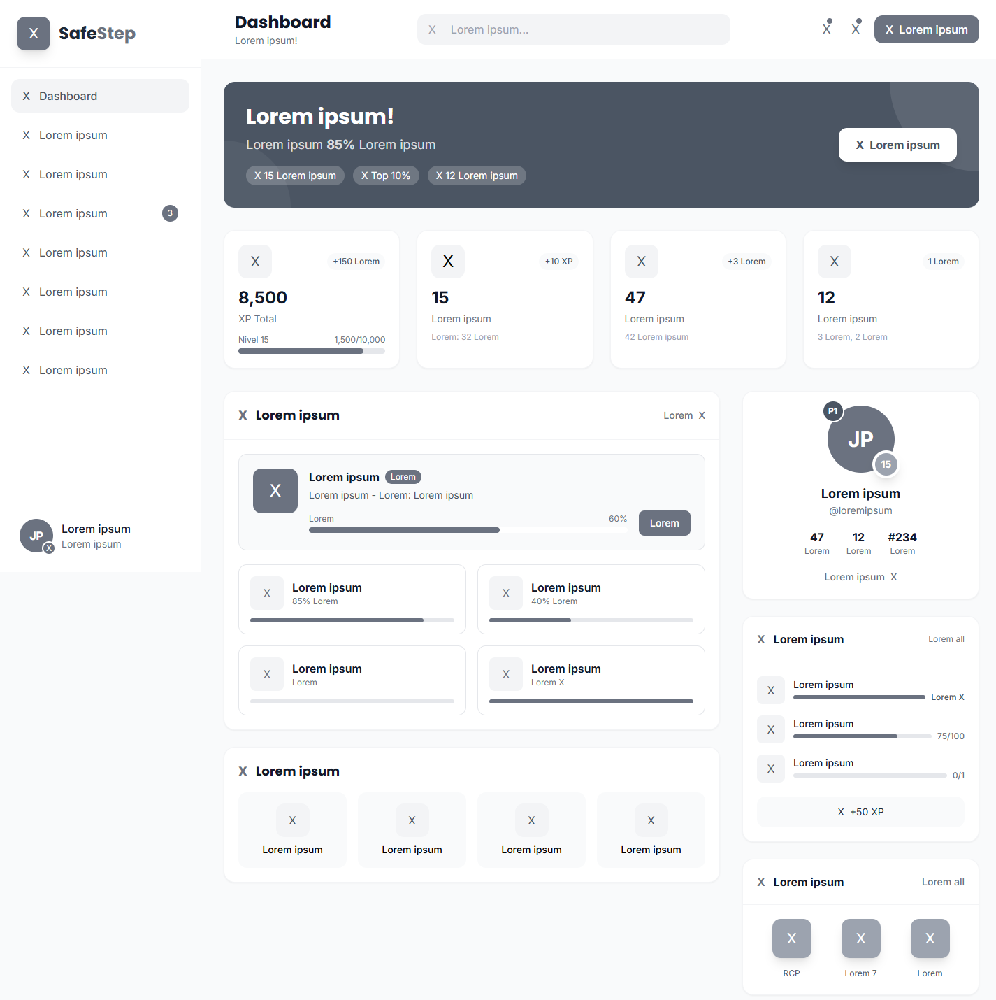
  <p>
    <i><b>Fuente</b>: Elaboración propia.</i>
  </p>
</div>

<a id="toc-elementos-clave-del-dashboard"></a>
#### Elementos Clave del Dashboard

- **Header**: Logo, búsqueda global, notificaciones, acceso a perfil
- **Sidebar**: Navegación principal con avatar y progreso visible
- **Welcome banner**: Mensaje personalizado con continuación
- **Continue learning**: Último módulo en progreso
- **Recomendaciones**: Contenido sugerido basado en historial
- **Stats**: Resumen visual de progreso

<a id="toc-4-6-1-3-learning-page-modulos-wireframe"></a>
### 4.6.1.3.-learning Page (Módulos) Wireframe

La página de aprendizaje muestra los módulos disponibles y el estado de progreso del usuario en cada uno.

<a id="toc-estructura-de-pagina-de-aprendizaje"></a>
#### Estructura de Página de Aprendizaje

<div align="center">
  <p>
    <b>Gráfico</b>: Wireframe de la página de aprendizaje de SafeStep
  </p>
  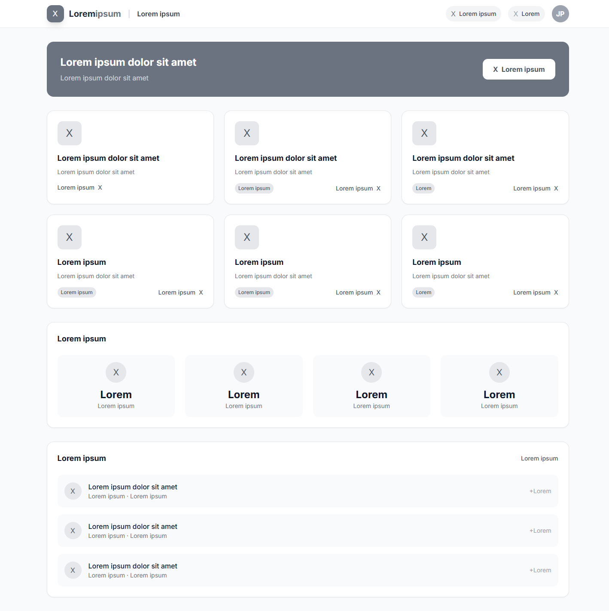
  <p>
    <i><b>Fuente</b>: Elaboración propia.</i>
  </p>
</div>

<a id="toc-elementos-clave"></a>
#### Elementos Clave

- **Breadcrumbs**: Navegación de retorno
- **Filtros por estado**: Todos/En progreso/Completado
- **Filters por categoría**: RCP, Atragantamiento, etc.
- **Módulo cards**: Imagen, título, progreso, indicador de estado

<a id="toc-4-6-1-4-simulacion-page-wireframe"></a>
### 4.6.1.4. Simulación Page Wireframe

La página de simulación es donde el usuario practica situaciones de emergencia.

<a id="toc-estructura-de-simulacion"></a>
#### Estructura de Simulación

<div align="center">
  <p>
    <b>Gráfico</b>: Wireframe de la página de una simulación de SafeStep
  </p>
  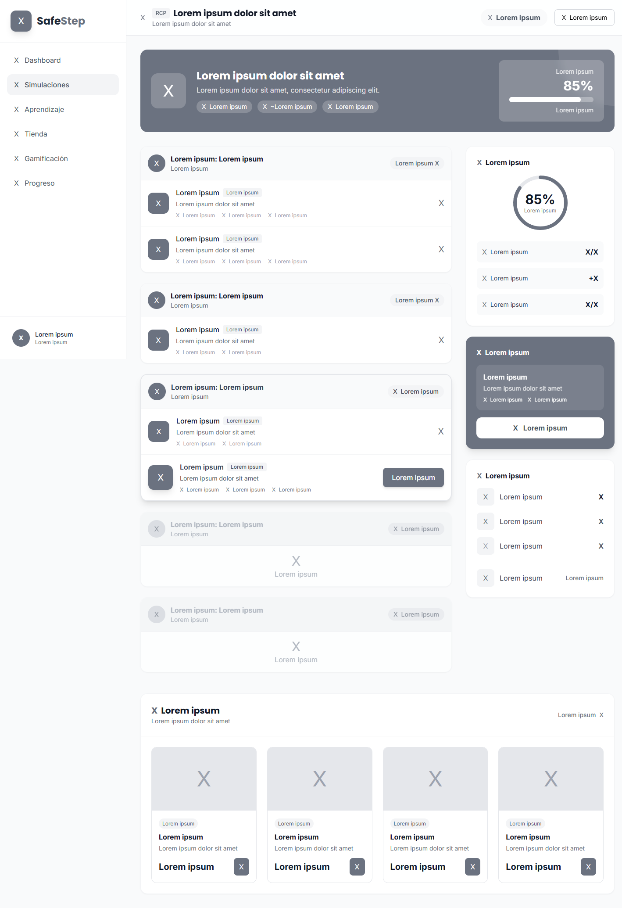
  <p>
    <i><b>Fuente</b>: Elaboración propia.</i>
  </p>
</div>

<a id="toc-elementos-clave-1"></a>
#### Elementos Clave

- **Progress bar**: Muestra avance en la simulación
- **Escenario**: Descripción de la situación
- **Opciones**: Botones de respuesta con letters (A, B, C...)
- **Feedback**: Indicación inmediata de correct/incorrect
- **Opciones de ayuda**: Pista, Saltar

<a id="toc-4-6-1-5-e-commerce-tienda-wireframe"></a>
### 4.6.1.5. E-commerce/Tienda Wireframe

La página de tienda muestra el catálogo de productos disponibles.

<a id="toc-estructura-de-tienda"></a>
#### Estructura de Tienda

<div align="center">
  <p>
    <b>Gráfico</b>: Wireframe de la página de la tienda de SafeStep
  </p>
  
  <p>
    <i><b>Fuente</b>: Elaboración propia.</i>
  </p>
</div>

<a id="toc-elementos-clave-2"></a>
#### Elementos Clave

- **Search bar**: Búsqueda de productos
- **Filtros**: Categoría, precio rango, uso
- **Product cards**: Imagen, nombre, precio, botón agregar
- **Sort**: Opciones de ordenamiento
- **Pagination**: Navegación de resultados

<a id="toc-4-6-1-6-producto-detail-wireframe"></a>
### 4.6.1.6. Producto Detail Wireframe

La página de detalle de producto muestra información completa de un producto específico.

<a id="toc-estructura-de-detalle-de-producto"></a>
#### Estructura de Detalle de Producto

<div align="center">
  <p>
    <b>Gráfico</b>: Wireframe de un producto de SafeStep
  </p>
  
  <p>
    <i><b>Fuente</b>: Elaboración propia.</i>
  </p>
</div>

<a id="toc-4-6-1-7-perfil-configuracion-wireframe"></a>
### 4.6.1.7. Perfil/Configuración Wireframe

La página de configuración y perfil del usuario.

<a id="toc-estructura-de-perfil"></a>
#### Estructura de Perfil

<div align="center">
  <p>
    <b>Gráfico</b>: Wireframe del perfil de usuario de SafeStep
  </p>
  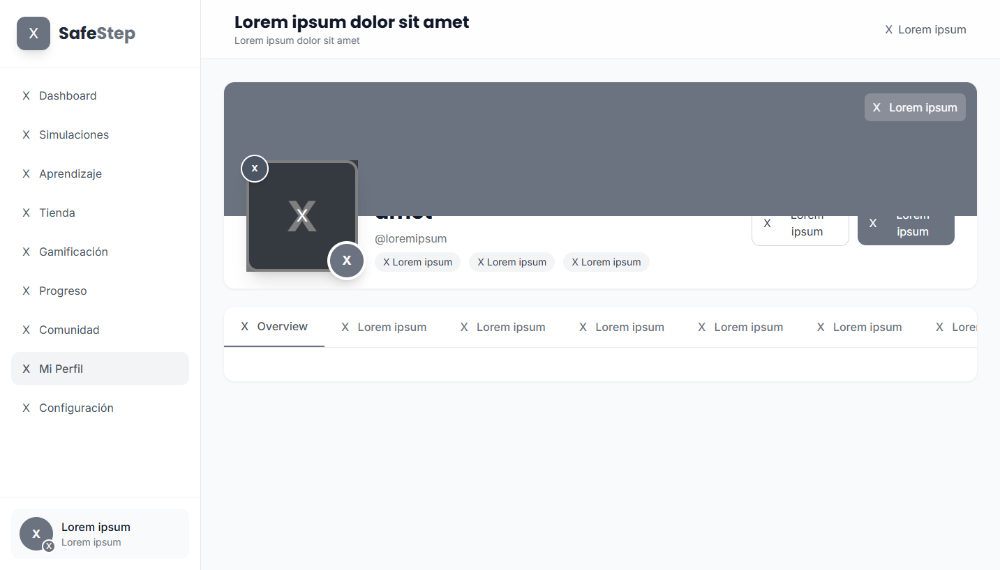
  <p>
    <i><b>Fuente</b>: Elaboración propia.</i>
  </p>
</div>

<a id="toc-4-6-2-web-applications-wireflow-diagrams"></a>
## 4.6.2. Web Applications Wireflow Diagrams

Esta sección presenta la propuesta de Wireflows. Debe considerarse un Wireflow para cada User goal, considerando los User Persona para cada aplicación que forma parte del alcance. Es recomendable que el equipo elabore previamente los correspondientes Task Flows, para establecer un consenso sobre las rutas típicas de steps para cada User goal. Es importante recordar que la forma como se refleja un cambio en una pantalla (Wireframe) como resultado de la interacción en un flujo es agregar un paso con un Wireframe con la representación del nuevo estado. Utilizar para los Wireflows las herramientas indicadas. Cada Wireflow diagram requiere que se redacte el User goal y se complemente con una explicación del flujo especificado.

<a id="toc-4-6-2-1-metodologia-de-wireflows"></a>
### 4.6.2.1. Metodología de Wireflows

SafeStep utiliza wireflows para documentar los flujos de interacción entre pantallas. Un wireflow representa una secuencia de pantallas relacionadas por las acciones del usuario, ilustrando cómo los cambios en una pantalla lead a estados diferentes.

Cada wireflow incluye:
- User goal: El objetivo que el usuario intenta lograr
- Secuencia de pantallas: Ilustración del flujo
- Acciones: Las interacciones que trigger cambios
- Decisiones: Puntos donde el usuario tiene opciones
- Estados alternatives: Variaciones del flujo

<a id="toc-4-6-2-2-wireflow-iniciar-sesion"></a>
### 4.6.2.2. Wireflow: Iniciar Sesión

**User Goal**: El usuario desea acceder a su cuenta en SafeStep para continuar su aprendizaje.

<a id="toc-flujo-principal-happy-path"></a>
#### Flujo Principal (Happy Path)

<div align="center">
  <p>
    <b>Gráfico</b>: Wireflow autenticación (happy path)
  </p>
  
  <p>
    <i><b>Fuente</b>: Elaboración propia.</i>
  </p>
</div>

<a id="toc-flujo-alternativo"></a>
#### Flujo Alternativo

<div align="center">
  <p>
    <b>Gráfico</b>: Wireflow autenticación (alternative path)
  </p>
  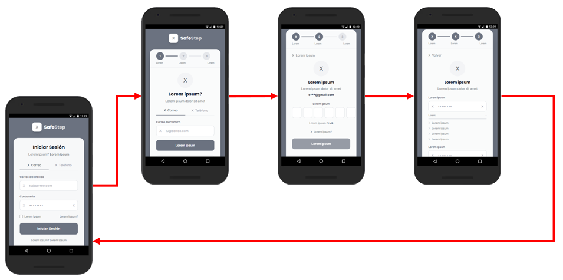
  <p>
    <i><b>Fuente</b>: Elaboración propia.</i>
  </p>
</div>

<a id="toc-4-6-2-3-wireflow-completar-una-leccion"></a>
### 4.6.2.3. Wireflow: Completar una Lección

**User Goal**: El usuario desea completar una lección completa (teoría + video + evaluación).

<a id="toc-flujo-principal"></a>
#### Flujo Principal

<div align="center">
  <p>
    <b>Gráfico</b>: Wireflow lección
  </p>
  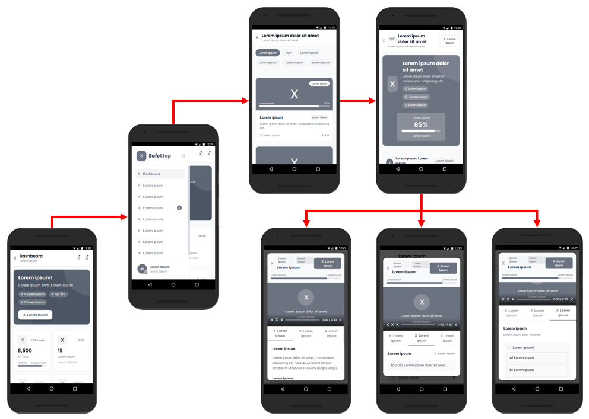
  <p>
    <i><b>Fuente</b>: Elaboración propia.</i>
  </p>
</div>

<a id="toc-4-6-2-4-wireflow-completar-una-simulacion"></a>
### 4.6.2.4. Wireflow: Completar una Simulación

**User Goal**: El usuario desea practicar una simulación de emergencia específica.

<a id="toc-flujo-principal-1"></a>
#### Flujo Principal

<div align="center">
  <p>
    <b>Gráfico</b>: Wireflow simulacion
  </p>
  
  <p>
    <i><b>Fuente</b>: Elaboración propia.</i>
  </p>
</div>

<a id="toc-4-6-2-5-wireflow-compra-en-tienda"></a>
### 4.6.2.5. Wireflow: Compra en Tienda

**User Goal**: El usuario desea comprar productos de primeros auxilios.

<a id="toc-flujo-principal-2"></a>
#### Flujo Principal

<div align="center">
  <p>
    <b>Gráfico</b>: Wireflow tienda
  </p>
  
  <p>
    <i><b>Fuente</b>: Elaboración propia.</i>
  </p>
</div>

<a id="toc-4-6-2-6-wireflow-gestionar-perfil"></a>
### 4.6.2.6. Wireflow: Gestionar Perfil

**User Goal**: El usuario desea actualizar su información personal y preferencias.

<a id="toc-flujo-principal-3"></a>
#### Flujo Principal

<div align="center">
  <p>
    <b>Gráfico</b>: Wireflow perfil
  </p>
  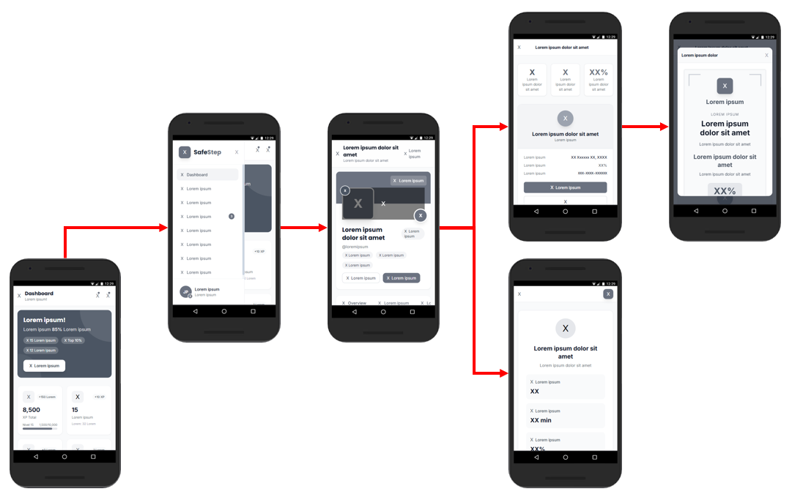
  <p>
    <i><b>Fuente</b>: Elaboración propia.</i>
  </p>
</div>

<a id="toc-4-6-3-web-applications-mock-ups"></a>
## 4.6.3. Web Applications Mock-ups

Esta sección presenta y explica los Mock-ups de las aplicaciones. En la propuesta y la explicación debe evidenciarse la aplicación de los principios, elementos de diseño, diseño inclusivo y arquitectura de información, así como el Design System establecido para los productos digitales. Utilizar para los mock-ups las herramientas indicadas.

<a id="toc-4-6-3-1-introduccion-a-mock-ups"></a>
### 4.6.3.1. Introducción a Mock-ups

Los mock-ups de aplicaciones web representan la implementación visual final de los wireframes, aplicando el Design System establecido. Cada mock-up incorpora la paleta de colores, tipografía, componentes y estilos definidos en-style guidelines para crear experiencias visuales coherentes con la marca SafeStep.

<a id="toc-4-6-3-2-dashboard-mock-up"></a>
### 4.6.3.2. Dashboard Mock-up

El mock-up del Dashboard implementa la estructura del wireframe con tratamiento visual completo:

<a id="toc-elementos-visuales"></a>
#### Elementos Visuales

**Header:**
- Logo con gradiente azul
- Fondo blanco con shadow
- Iconos de navegación (buscar, notificaciones, perfil)

**Sidebar:**
- Fondo White
- Avatar circular con badge de nivel
- Navegación con icons + texto
- Hover states con highlight azul
- Progreso XP mostrado visualmente

**Contenido Principal:**
- Card de bienvenida con gradiente
- Cards de módulos con progress bars
- Stats con icons y colores distintivos
- Badges para progreso completado

<a id="toc-4-6-3-3-learning-page-mock-up"></a>
### 4.6.3.3. Learning Page Mock-up

Mock-up de página de módulos y lecciones:

<a id="toc-elementos-visuales-1"></a>
#### Elementos Visuales

**Filtros:**
- Pills con background active/inactive
- Icons por categoría
- Estados visuales claros

**Módulo Cards:**
- Imagen de fondo por categoría
- Overlay con información
- Progress bar coloreada
- Badges de estado (completado, en progreso, nuevo)
- Hover effects con escala

<a id="toc-4-6-3-4-simulacion-mock-up"></a>
### 4.6.3.4. Simulación Mock-up

Mock-up de la interfaz de simulación interactiva:

<a id="toc-elementos-visuales-2"></a>
#### Elementos Visuales

**Progress indicator:**
- Step indicator visual
- Números claramente visibles
- Color activo para paso actual

**Opciones:**
- Large touch targets (altura mínima 56px)
- Letter claramente visible (A, B, C)
- States: default, hover, selected, correct, incorrect
-Feedback colors: verde para correcto, rojo para incorrecto

**Escenario:**
- Box con background de alerta
- Icon representativo (X placeholder)
- Texto legible

<a id="toc-4-6-3-5-tienda-mock-up"></a>
### 4.6.3.5. Tienda Mock-up

Mock-up del catálogo de tienda:

<a id="toc-elementos-visuales-3"></a>
#### Elementos Visuales

**Product Cards:**
- Imagen prominente
- Badge de descuento si aplica
- Nombre, precio, rating
- Botón "Agregar" prominente

**Filtros Sidebar:**
- Checkboxes visuales
- Range sliders para precio
- Collapsible sections

**Sorting:**
- Dropdown visual
- Icon indicating direction

<a id="toc-4-6-3-6-detalle-producto-mock-up"></a>
### 4.6.3.6. Detalle Producto Mock-up

Mock-up de página de detalle de producto:

<a id="toc-elementos-visuales-4"></a>
#### Elementos Visuales

**Galería:**
- Thumbnails navegables
- Zoom en hover
- Main image grande

**Información:**
- Precio destacado
- Selector de cantidad +/- 
- Botones de acción grandes
- Accordion para descripciones

<a id="toc-4-6-3-7-perfil-mock-up"></a>
### 4.6.3.7. Perfil Mock-up

Mock-up de configuración de perfil:

<a id="toc-elementos-visuales-5"></a>
#### Elementos Visuales

**Avatar:**
- Círculo grande
- Placeholder para cambio
- Badge de verificación si aplica

**Forms:**
- Labels claramente asociadas
- Input fields con estados
- Toggle switches para preferencias
- Save button fixed o prominent

<a id="toc-4-6-3-8-aplicacion-de-design-system-en-mock-ups"></a>
### 4.6.3.8. Aplicación de Design System en Mock-ups

Cada mock-up evidencia la aplicación del Design System:

**Colores:**
- Primario azul en CTAs principales
- Verde para éxitos/completado
- Rojo/naranja para errores/alertas
- Escala de grises para estructura

**Tipografía:**
- Poppins para headings
- Inter para cuerpo
- Jerarquía clara de tamaños

**Componentes:**
- Botones según especificación
- Form inputs con estilos
- Cards con shadow consistente
- Spacing según sistema

<a id="toc-4-6-4-web-applications-user-flow-diagrams"></a>
## 4.6.4. Web Applications User Flow Diagrams

Esta sección presenta la propuesta de User Flows. Debe considerarse un User Flow para cada User goal, considerando los User Persona para cada aplicación que forma parte del alcance. Estos User Flows deben ser consistentes con los Wireflows de los cuales se derivan. Debe recordarse que en el User Flow se incluyen los Mock-ups de las vistas o pantallas de las aplicaciones, junto con los flujos que constituyen la ruta esperada (happy path) y las rutas alternativas (unhappy paths). Utilizar para los User Flows las herramientas indicadas. Cada User Flow diagram requiere que se redacte el User goal y se complemente con una explicación de los flujos y condiciones especificados.

<a id="toc-4-6-4-1-metodologia-de-user-flows"></a>
### 4.6.4.1. Metodología de User Flows

Los User Flows de SafeStep documentan las rutas completas que los usuarios siguen para lograr objetivos específicos. A diferencia de los wireflows que muestran la estructura técnica, los user flows muestran la experiencia desde la perspectiva del usuario.

Cada user flow incluye:
- User Goal: El objetivo del usuario
- Persona: El tipo de usuario
- Happy Path: El flujo ideal
- Unhappy Paths: Variaciones y errores
- Puntos de decisión
- Puntos de salida

<a id="toc-4-6-4-2-user-flow-aprendizaje-completo-de-modulo"></a>
### 4.6.4.2. User Flow: Aprendizaje Completo de Módulo

**User Goal**: Completar todas las lecciones de un módulo de primeros auxilios

**User Type**: Estudiante / Usuario aprendiz

<a id="toc-happy-path"></a>
#### Happy Path

<div align="center">
  <p>
    <b>Gráfico</b>: User flow aprendizaje completo módulo (Happy path)
  </p>
  
  <p>
    <i><b>Fuente</b>: Elaboración propia.</i>
  </p>
</div>

<a id="toc-unhappy-paths"></a>
#### Unhappy Paths

**Evaluación reprobada:**

<div align="center">
  <p>
    <b>Gráfico</b>: User flow aprendizaje completo módulo (Unhappy path) parte 1
  </p>
  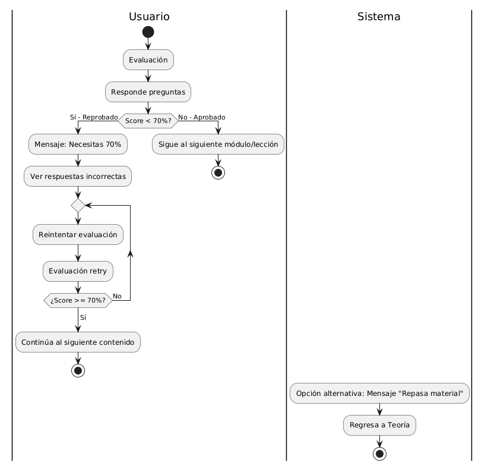
  <p>
    <i><b>Fuente</b>: Elaboración propia.</i>
  </p>
</div>

**Abandonar lección:**

<div align="center">
  <p>
    <b>Gráfico</b>: User flow aprendizaje completo módulo (Unhappy path) parte 2
  </p>
  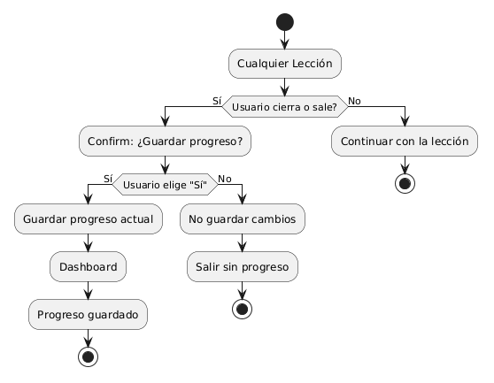
  <p>
    <i><b>Fuente</b>: Elaboración propia.</i>
  </p>
</div>

<a id="toc-4-6-4-3-user-flow-practica-de-simulacion"></a>
### 4.6.4.3. User Flow: Práctica de Simulación

**User Goal**: Practicar respuestas de emergencia en simulación interactiva

**User Type**: Estudiante / Usuario que busca certificación

<a id="toc-happy-path-1"></a>
#### Happy Path

<div align="center">
  <p>
    <b>Gráfico</b>: User flow práctica de simulación (Happy path)
  </p>
  
  <p>
    <i><b>Fuente</b>: Elaboración propia.</i>
  </p>
</div>

<a id="toc-unhappy-paths-1"></a>
#### Unhappy Paths

**Respuesta incorrecta:**

<div align="center">
  <p>
    <b>Gráfico</b>: User flow práctica de simulación (Unhappy path) parte 1
  </p>
  
  <p>
    <i><b>Fuente</b>: Elaboración propia.</i>
  </p>
</div>

**Usar pista:**

<div align="center">
  <p>
    <b>Gráfico</b>: User flow práctica de simulación (Unhappy path) parte 2
  </p>
  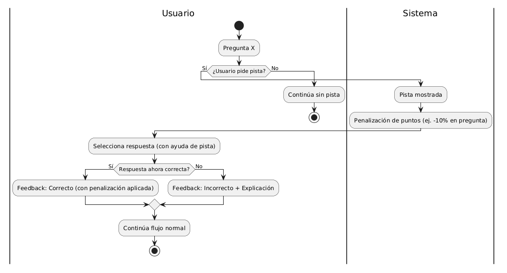
  <p>
    <i><b>Fuente</b>: Elaboración propia.</i>
  </p>
</div>

<a id="toc-4-6-4-4-user-flow-compra-de-producto"></a>
### 4.6.4.4. User Flow: Compra de Producto

**User Goal**: Adquirir productos de primeros auxilios

**User Type**: Comprador / Cliente

<a id="toc-happy-path-2"></a>
#### Happy Path

<div align="center">
  <p>
    <b>Gráfico</b>: User flow compra de producto (Happy path)
  </p>
  
  <p>
    <i><b>Fuente</b>: Elaboración propia.</i>
  </p>
</div>

<a id="toc-unhappy-paths-2"></a>
#### Unhappy Paths

**Producto sin stock:**

<div align="center">
  <p>
    <b>Gráfico</b>: User flow compra de producto (Unhappy path) parte 1
  </p>
  
  <p>
    <i><b>Fuente</b>: Elaboración propia.</i>
  </p>
</div>

**Pago rechazado:**

<div align="center">
  <p>
    <b>Gráfico</b>: User flow compra de producto (Unhappy path) parte 2
  </p>
  
  <p>
    <i><b>Fuente</b>: Elaboración propia.</i>
  </p>
</div>

**Carrito vacío:**

<div align="center">
  <p>
    <b>Gráfico</b>: User flow compra de producto (Unhappy path) parte 3
  </p>
  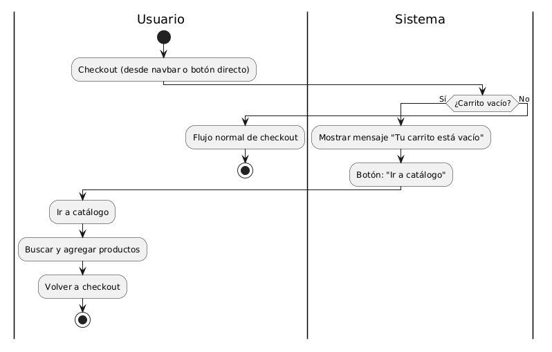
  <p>
    <i><b>Fuente</b>: Elaboración propia.</i>
  </p>
</div>

<a id="toc-4-6-4-5-user-flow-registro-de-nuevo-usuario"></a>
### 4.6.4.5. User Flow: Registro de Nuevo Usuario

**User Goal**: Crear una cuenta en SafeStep

**User Type**: Visitante nuevo

<a id="toc-happy-path-3"></a>
#### Happy Path

<div align="center">
  <p>
    <b>Gráfico</b>: User flow registro de nuevo usuario (Happy path)
  </p>
  
  <p>
    <i><b>Fuente</b>: Elaboración propia.</i>
  </p>
</div>

<a id="toc-unhappy-paths-3"></a>
#### Unhappy Paths

**Email ya registrado:**

<div align="center">
  <p>
    <b>Gráfico</b>: User flow registro de nuevo usuario (Unhappy path) parte 1
  </p>
  
  <p>
    <i><b>Fuente</b>: Elaboración propia.</i>
  </p>
</div>

**Código verificación expirado:**

<div align="center">
  <p>
    <b>Gráfico</b>: User flow registro de nuevo usuario (Unhappy path) parte 2
  </p>
  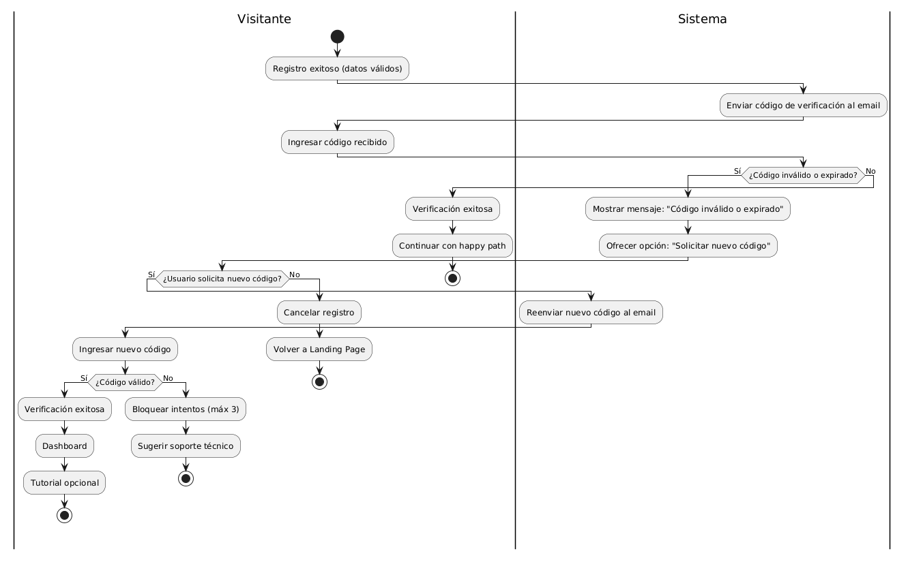
  <p>
    <i><b>Fuente</b>: Elaboración propia.</i>
  </p>
</div>

<a id="toc-4-6-4-6-user-flow-recuperacion-de-contrasena"></a>
### 4.6.4.6. User Flow: Recuperación de Contraseña

**User Goal**: Recuperar acceso a su cuenta

**User Type**: Usuario con cuenta pero sin acceso

<a id="toc-happy-path-4"></a>
#### Happy Path

<div align="center">
  <p>
    <b>Gráfico</b>: User flow recuperación de contraseña (Happy path)
  </p>
  
  <p>
    <i><b>Fuente</b>: Elaboración propia.</i>
  </p>
</div>

<a id="toc-unhappy-paths-4"></a>
#### Unhappy Paths

**Email no encontrado:**

<div align="center">
  <p>
    <b>Gráfico</b>: User flow recuperación de contraseña (Unhappy path) parte 1
  </p>
  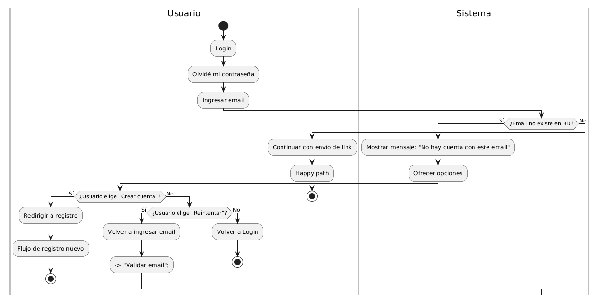
  <p>
    <i><b>Fuente</b>: Elaboración propia.</i>
  </p>
</div>

**Token expirado:**

<div align="center">
  <p>
    <b>Gráfico</b>: User flow recuperación de contraseña (Unhappy path) parte 2
  </p>
  
  <p>
    <i><b>Fuente</b>: Elaboración propia.</i>
  </p>
</div>

<a id="toc-4-6-4-7-consideraciones-de-user-flows"></a>
### 4.6.4.7. Consideraciones de User Flows

Los User Flows de SafeStep consideran:

**Accesibilidad:**
- Rutas alternativas para usuarios con limitaciones
- Opciones de voz donde aplica
- Simplicidad para usuarios no técnicos

**Recuperación:**
- Puntos claros de salida y retorno
- Mensajes claros en errores
- Opciones de recovery sencillas

**Consistencia:**
- Similar estructura de flows
- Patrones familiares
- Terminología consistente

<br>

<br>
<br>

<div align="center">
    
</div>

<br>
<br>

<a id="toc-4-7-web-applications-prototyping"></a>
# 4.7. Web Applications Prototyping

Esta sección incluye Prototipos de UI para Desktop y Mobile Web Browser con simulación de interacción y navegación, acorde con la propuesta de paths de User Flow Diagrams. Esta sección inicia con una introducción en la que se explica los principales criterios para las decisiones de interacción. Es importante evidenciar la relación con las decisiones de arquitectura de información, en particular sobre el sistema de navegación y los tipos de interacciones seleccionadas. Para cada caso debe incluirse 1 screenshot de video y un enlace a un video subido a Microsoft Stream para cada aplicación, en el que se demuestre y explique los principales flujos de interacción que cubren los prototipos.

<a id="toc-4-7-1-introduccion-al-prototipado"></a>
## 4.7.1. Introducción al Prototipado

El prototipado de SafeStep representa la culminación del proceso de diseño, donde las decisiones abstractas de arquitectura, wireframes y mockups se traducen en experiencias interactivas funcionales. Los prototipos demuestran cómo los usuarios realmente interactuarán con la aplicación, revelando aspectos que no son evidentes en representaciones estáticas.

<a id="toc-4-7-1-1-objetivos-del-prototipado"></a>
### 4.7.1.1. Objetivos del Prototipado

Los prototipos de SafeStep cumplen varios objetivos fundamentales:

**Validación de Interacción:**
- Los prototipos permiten probar que los flujos de interacción funcionan como se anticipó
- Se identifican fricciones y puntos de confusión antes del desarrollo
- Los usuarios pueden proporcionar feedback sobre la experiencia real

**Comunicación con Desarrolladores:**
- Los prototipos sirven como especificación técnica para desarrolladores
- Muestran exactamente cómo deben comportarse los elementos
- Reducen la brecha entre diseño y implementación

**Demostración de Valor:**
- Los prototipos permiten stakeholders visualizar el producto final
- Facilitan la validación con usuarios y patrocinadores
- Crean hype y expectativa positiva

<a id="toc-4-7-1-2-criterios-de-interaccion"></a>
### 4.7.1.2. Criterios de Interacción

Las decisiones de interacción en los prototipos de SafeStep siguen criterios específicos:

<a id="toc-facilidad-de-uso"></a>
#### Facilidad de Uso

- Cada interacción es discoverable (el usuario sabe que puede interactuar)
- Los resultados de las acciones son predecibles
- Los errores son difíciles de cometer y fáciles de recover

<a id="toc-consistencia"></a>
#### Consistencia

- Patrones de interacción similares a través de la aplicación
- Elementos similares se comportan de manera similar
- La experiencia es predecible una vez aprendido el patrón

<a id="toc-eficiencia"></a>
#### Eficiencia

- Las acciones frecuentes son rápidas de realizar
- El número de pasos para desarrollarlo es mínimo
- Los atajos están disponibles para usuarios experimentados

<a id="toc-retroalimentacion"></a>
#### Retroalimentación

- Toda acción tiene respuesta visual inmediata
- Los estados de carga se comunican claramente
- El usuario siempre sabe dónde está y qué puede hacer

<a id="toc-4-7-1-3-relacion-con-arquitectura-de-informacion"></a>
### 4.7.1.3. Relación con Arquitectura de Información

Los prototipos evidencian las decisiones de arquitectura de información tomadas en la sección 4.2:

**Sistema de Navegación:**
- El header sticky proporciona navegación constante
- Los breadcrumbs muestran ubicación y rutas de retorno
- La navegación lateral es accesible y predecible

**Organización de Contenido:**
- El contenido se agrupa según los esquemas definidos
- Las etiquetas son consistentes con el labeling system
- La jerarquía visual refleja la organización

**Búsqueda:**
- La búsqueda global es accesible desde cualquier vista
- Los filtros son claramente visibles y aplicables
- Los resultados se presentan según lo especificado

<a id="toc-4-7-2-prototipo-desktop"></a>
## 4.7.2. Prototipo Desktop

El prototipo desktop presenta la experiencia de escritorio completa, optimizada para monitores de computadora y navegación con mouse/teclado.

<a id="toc-4-7-2-1-descripcion-general-del-prototipo-desktop"></a>
### 4.7.2.1. Descripción General del Prototipo Desktop

El prototipo desktop de SafeStep recrea la experiencia completa en un factor de forma de escritorio tradicional. Las interacciones están optimizadas para navegación mediante puntero (mouse) y entrada de teclado.

<a id="toc-caracteristicas-tecnicas"></a>
#### Características Técnicas

**Resolución:**
- Optimizado para 1024px a 1920px de ancho
- Breakpoints: 1024, 1280, 1440, 1920
- escalable con diseño fluida

**Interacciones:**
- Hover states para feedback visual
- Click para activación
- Drag and drop donde aplica
- Keyboard navigation soporte completo

**Componentes Desktop:**

Las siguientes vistas están incluidas en el prototipo desktop:

1. **Dashboard** - Vista principal del usuario
2. **Learning Hub** - Navegación de módulos
3. **Lección** - Contenido de teoría/video
4. **Simulación** - Práctica interactiva
5. **Tienda** - Catálogo de productos
6. **Carrito** - Proceso de checkout
7. **Mi Perfil** - Configuración

<a id="toc-4-7-2-2-prototipo-desktop-dashboard"></a>
### 4.7.2.2. Prototipo Desktop - Dashboard

El prototipo del dashboard muestra la pantalla principal después del login:

<a id="toc-screenshot-de-referencia"></a>
#### Screenshot de Referencia

<div align="center">
  <p>
    <b>Gráfico</b>: Prototipo desktop dashboard
  </p>
  
  <p>
    <i><b>Fuente</b>: Elaboración propia.</i>
  </p>
</div>

<a id="toc-descripcion-visual"></a>
#### Descripción Visual

El dashboard desktop muestra:
- Header con logo, búsqueda, notificaciones, avatar
- Sidebar izquierdo con navegación principal
- Área de contenido principal con:
  - Mensaje de bienvenida personalizado
  - Card de "Continuar aprendiendo" con progreso
  - Recomendaciones de módulos
  - Stats de progreso del usuario

<a id="toc-interacciones-demostradas"></a>
#### Interacciones Demostradas

- Click en navegación sidebar cambia contenido
- Hover en cards muestra énfasis
- Click en "Continuar" lleva a última lección
- Click en recomendaciones lleva a módulos sugeridos
- Notificaciones dropdown con click
- Perfil dropdown con opciones

<a id="toc-explicacion-del-flujo"></a>
#### Explicación del Flujo

El flujo principal mostrado:
1. Usuario llega al dashboard
2. Ve progreso actual y recomendaciones
3. Decide continuar aprendiendo o explorar
4. Navegación le permite ir a cualquier sección
5. Notificaciones informan de updates

<a id="toc-4-7-2-3-prototipo-desktop-simulacion-interactiva"></a>
### 4.7.2.3. Prototipo Desktop - Simulación Interactiva

El prototipo de simulación muestra la experiencia de práctica:

<a id="toc-screenshot-de-referencia-1"></a>
#### Screenshot de Referencia

<div align="center">
  <p>
    <b>Gráfico</b>: Prototipo desktop simulación parte 1
  </p>
  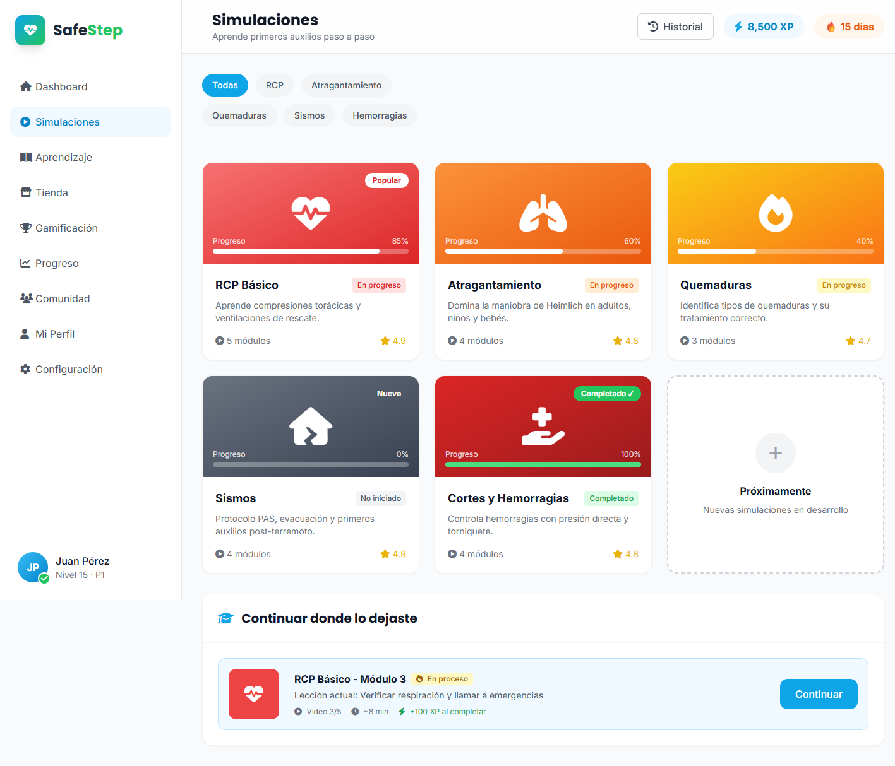
  <p>
    <i><b>Fuente</b>: Elaboración propia.</i>
  </p>
</div>

<div align="center">
  <p>
    <b>Gráfico</b>: Prototipo desktop simulación parte 2
  </p>
  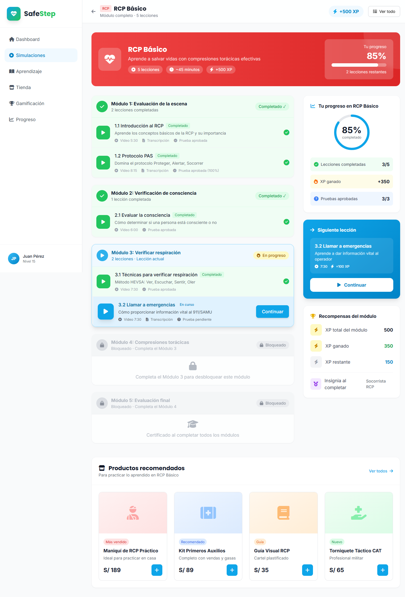
  <p>
    <i><b>Fuente</b>: Elaboración propia.</i>
  </p>
</div>

<div align="center">
  <p>
    <b>Gráfico</b>: Prototipo desktop simulación parte 3
  </p>
  
  <p>
    <i><b>Fuente</b>: Elaboración propia.</i>
  </p>
</div>

<a id="toc-descripcion-visual-1"></a>
#### Descripción Visual

La página de simulación muestra:
- Header con indicador de progreso
- Área de escenario con situación
- Opciones de respuesta en formato de cards
- Botones de ayuda y controls

<a id="toc-interacciones-demostradas-1"></a>
#### Interacciones Demostradas

- Click en opción selecciona respuesta
- Feedback inmediato (correcto/incorrecto)
- Botón "Siguiente" para avanzar
- Botón "Pista" muestra ayuda
- Timer counting down

<a id="toc-explicacion-del-flujo-1"></a>
#### Explicación del Flujo

El flujo de simulación:
1. Usuario selecciona simulación
2. Lee escenario inicial
3. Responde pregunta 1
4. Recibe feedback inmediato
5.Avanza a pregunta siguiente
6. Completa todas las preguntas
7. Ve resultados finales

<a id="toc-4-7-2-4-prototipo-desktop-proceso-de-compra"></a>
### 4.7.2.4. Prototipo Desktop - Proceso de Compra

El prototipo de checkout muestra el flujo de compra:

<a id="toc-screenshot-de-referencia-2"></a>
#### Screenshot de Referencia

<div align="center">
  <p>
    <b>Gráfico</b>: Prototipo desktop proceso de compra parte 1
  </p>
  
  <p>
    <i><b>Fuente</b>: Elaboración propia.</i>
  </p>
</div>

<div align="center">
  <p>
    <b>Gráfico</b>: Prototipo desktop proceso de compra parte 2
  </p>
  
  <p>
    <i><b>Fuente</b>: Elaboración propia.</i>
  </p>
</div>

<div align="center">
  <p>
    <b>Gráfico</b>: Prototipo desktop proceso de compra parte 3
  </p>
  
  <p>
    <i><b>Fuente</b>: Elaboración propia.</i>
  </p>
</div>

<div align="center">
  <p>
    <b>Gráfico</b>: Prototipo desktop proceso de compra parte 4
  </p>
  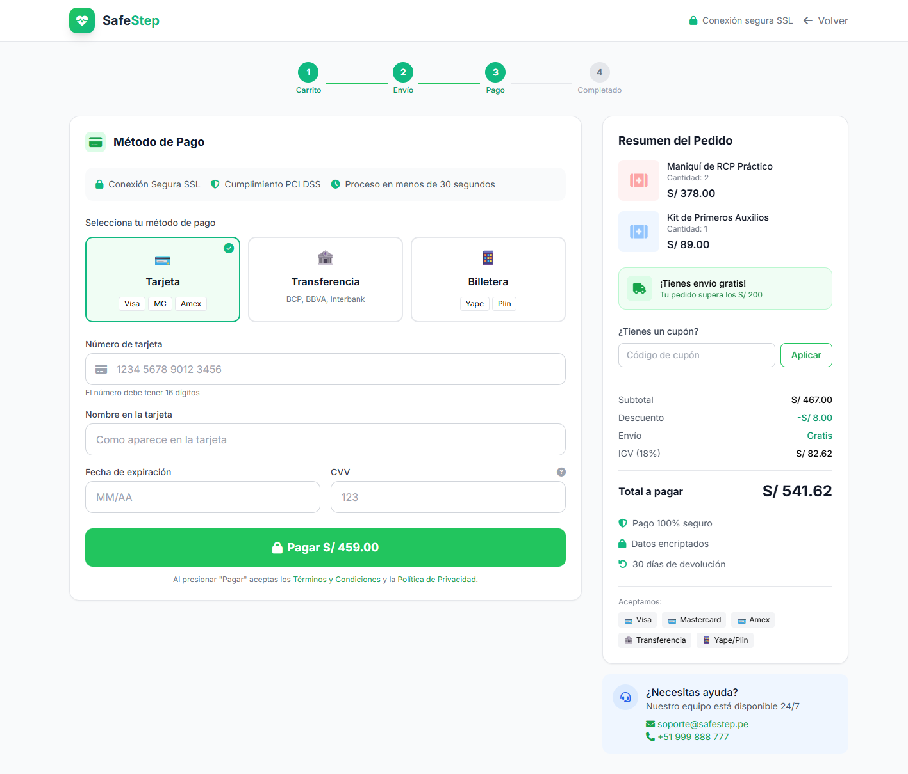
  <p>
    <i><b>Fuente</b>: Elaboración propia.</i>
  </p>
</div>

<div align="center">
  <p>
    <b>Gráfico</b>: Prototipo desktop proceso de compra parte 5
  </p>
  
  <p>
    <i><b>Fuente</b>: Elaboración propia.</i>
  </p>
</div>

<a id="toc-descripcion-visual-2"></a>
#### Descripción Visual

El checkout muestra:
- Pasos claramente marcados (1. Carrito, 2. Envío, 3. Pago, 4. Confirmación)
- Lista de productos en carrito
- Forms de información
- Resumen de orden

<a id="toc-interacciones-demostradas-2"></a>
#### Interacciones Demostradas

- Navegación entre pasos
- Validación de forms en tiempo real
- Aplicación de cupones
- Selección de método de pago
- Confirmación de orden

<a id="toc-explicacion-del-flujo-2"></a>
#### Explicación del Flujo

El flujo de compra:
1. Revisa items en carrito
2. Ingresa/confirma dirección
3. Selecciona método de pago
4. Revisa orden completa
5. Confirma y paga
6. Recibe confirmación

<a id="toc-4-7-2-5-video-prototipo-desktop"></a>
### 4.7.2.5. Video Prototipo Desktop

El video del prototipo desktop demuestra las interacciones principales:

<a id="toc-contenido-del-video"></a>
#### Contenido del Video

El video incluye:
1. Recorrido por dashboard (0:00-0:30)
2. Navegación a módulos (0:30-1:00)
3. Completar una lección (1:00-2:00)
4. Práctica de simulación (2:00-3:00)
5. Exploración de tienda (3:00-4:00)
6. Proceso de compra (4:00-5:30)

<a id="toc-enlace-de-video"></a>
#### Enlace de Video

<div align="center">
  <p>
    <b>Gráfico</b>: Video del prototipo desktop
  </p>
  
  <p>
    <i><b>Fuente</b>: Elaboración propia.</i>
  </p>
</div>

Enlace del video: <a href="https://youtu.be/_nZcADweJ3k">https://youtu.be/_nZcADweJ3k</a>

<a id="toc-4-7-3-prototipo-mobile"></a>
## 4.7.3. Prototipo Mobile

El prototipo mobile presenta la experiencia optimizada para dispositivos táctiles, especialmente smartphones.

<a id="toc-4-7-3-1-descripcion-general-del-prototipo-mobile"></a>
### 4.7.3.1. Descripción General del Prototipo Mobile

El prototipo mobile de SafeStep recrea la experiencia en formato móvil, considerando las limitaciones y fortalezas de dispositivos táctiles.

<a id="toc-caracteristicas-tecnicas-1"></a>
#### Características Técnicas

**Resolución:**
- Optimizado para 320px a 428px de ancho
- Breakpoints: 320, 375, 414, 428
- Viewport meta tag configurado correctamente

**Interacciones:**
- Touch para todas las acciones
- Swipe gestures para navegación
- Pull-to-refresh donde aplica
- Gestures de zoom disponibles

**Componentes Mobile:**

Las siguientes vistas están incluidas:

1. **Home Mobile** - Dashboard adaptado
2. **Aprendizaje Mobile** - Contenido vertical scroll
3. **Simulación Mobile** - Tarjetas táctiles
4. **Tienda Mobile** - Grid optimizado
5. **Checkout Mobile** - Forms verticales

<a id="toc-4-7-3-2-prototipo-mobile-dashboard"></a>
### 4.7.3.2. Prototipo Mobile - Dashboard

El prototipo del dashboard móvil:

<a id="toc-screenshot-de-referencia-3"></a>
#### Screenshot de Referencia

<div align="center">
  <p>
    <b>Gráfico</b>: Prototipo mobile dashboard
  </p>
  
  <p>
    <i><b>Fuente</b>: Elaboración propia.</i>
  </p>
</div>

<a id="toc-descripcion-visual-3"></a>
#### Descripción Visual

El dashboard móvil muestra:
- Header compacto con hamburger menú
- Contenido en layout vertical scroll
- Bottom navigation bar para acceso rápido
- Cards apiladas verticalmente

<a id="toc-interacciones-demostradas-3"></a>
#### Interacciones Demostradas

- Hamburger menu abre drawer
- Pull down para refresh
- Scroll vertical estándar
- Bottom nav clicks cambian vista

<a id="toc-4-7-3-3-prototipo-mobile-simulacion"></a>
### 4.7.3.3. Prototipo Mobile - Simulación

El prototipo de simulación móvil:

<a id="toc-screenshot-de-referencia-4"></a>
#### Screenshot de Referencia

<div align="center">
  <p>
    <b>Gráfico</b>: Prototipo mobile simulación parte 1
  </p>
  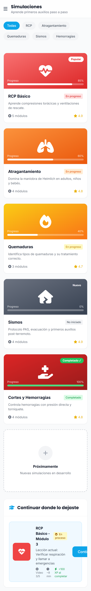
  <p>
    <i><b>Fuente</b>: Elaboración propia.</i>
  </p>
</div>

<div align="center">
  <p>
    <b>Gráfico</b>: Prototipo mobile simulación parte 2
  </p>
  
  <p>
    <i><b>Fuente</b>: Elaboración propia.</i>
  </p>
</div>

<div align="center">
  <p>
    <b>Gráfico</b>: Prototipo mobile simulación parte 3
  </p>
  
  <p>
    <i><b>Fuente</b>: Elaboración propia.</i>
  </p>
</div>

<a id="toc-descripcion-visual-4"></a>
#### Descripción Visual

La simulación móvil muestra:
- Progreso en header
- Tarjetas de respuesta grandes (touch-friendly)
- Espacio suficiente entre opciones
- Botones de control accesibles

<a id="toc-interacciones-demostradas-4"></a>
#### Interacciones Demostradas

- Tap simple en opciones
- Swipe entre preguntas (opcional)
- Botones grandes y táctiles
- Feedback visual claro

<a id="toc-4-7-3-4-prototipo-mobile-tienda"></a>
### 4.7.3.4. Prototipo Mobile - Tienda

El prototipo de tienda móvil:

<a id="toc-screenshot-de-referencia-5"></a>
#### Screenshot de Referencia

<div align="center">
  <p>
    <b>Gráfico</b>: Prototipo mobile proceso de compra parte 1
  </p>
  
  <p>
    <i><b>Fuente</b>: Elaboración propia.</i>
  </p>
</div>

<div align="center">
  <p>
    <b>Gráfico</b>: Prototipo mobile proceso de compra parte 2
  </p>
  
  <p>
    <i><b>Fuente</b>: Elaboración propia.</i>
  </p>
</div>

<div align="center">
  <p>
    <b>Gráfico</b>: Prototipo mobile proceso de compra parte 3
  </p>
  
  <p>
    <i><b>Fuente</b>: Elaboración propia.</i>
  </p>
</div>

<div align="center">
  <p>
    <b>Gráfico</b>: Prototipo mobile proceso de compra parte 4
  </p>
  
  <p>
    <i><b>Fuente</b>: Elaboración propia.</i>
  </p>
</div>

<div align="center">
  <p>
    <b>Gráfico</b>: Prototipo mobile proceso de compra parte 5
  </p>
  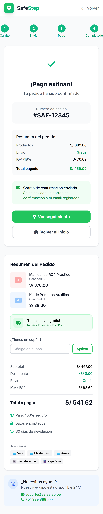
  <p>
    <i><b>Fuente</b>: Elaboración propia.</i>
  </p>
</div>

<a id="toc-descripcion-visual-5"></a>
#### Descripción Visual

La tienda móvil muestra:
- Product grid 2 columnas
- Filtros en sheet inferior
- Carrito en badge de header
- Checkout simplificado

<a id="toc-4-7-3-5-video-prototipo-mobile"></a>
### 4.7.3.5. Video Prototipo Mobile

El video del prototipo mobile demuestra las interacciones touch:

<a id="toc-contenido-del-video-1"></a>
#### Contenido del Video

El video incluye:
1. App launch y splash (0:00-0:10)
2. Login en móvil (0:10-0:30)
3. Navegación bottom nav (0:30-1:00)
4. Exploración de módulos (1:00-1:30)
5. Completar lección móvil (1:30-2:30)
6. Tienda y compra (2:30-4:00)

<a id="toc-enlace-de-video-1"></a>
#### Enlace de Video

<div align="center">
  <p>
    <b>Gráfico</b>: Video del prototipo mobile
  </p>
  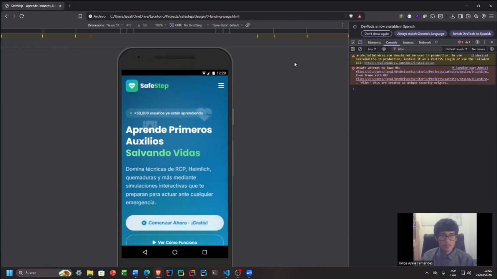
  <p>
    <i><b>Fuente</b>: Elaboración propia.</i>
  </p>
</div>

Enlace del video: <a href="https://youtu.be/cFe5_H0TDsA">https://youtu.be/cFe5_H0TDsA</a>

<a id="toc-4-7-4-flujos-de-interaccion-principales"></a>
## 4.7.4. Flujos de Interacción Principales

Los prototipos demuestran los flujos de interacción principales de SafeStep:

<a id="toc-4-7-4-1-flow-onboarding"></a>
### 4.7.4.1. Flow: Onboarding

El flujo de onboarding introduce nuevos usuarios a la plataforma:

```
[1. Landing] -> [Clic "Comenzar"] -> [Registro] -> [Onboarding:
    | Seleccionar intereses] -> [Recomendaciones basadas] ->
    | [Dashboard]
```

**Puntos clave demostrados:**
- Proceso de registro fluido
- Personalización inicial
- Introducción suave a la plataforma

<a id="toc-4-7-4-2-flow-aprendizaje"></a>
### 4.7.4.2. Flow: Aprendizaje

El flujo muestra cómo usuarios aprenden:

```
[1. Dashboard] -> [Ir a Aprender] -> [Seleccionar Módulo] ->
    | [Lección 1: Teoría] -> [Completar] ->
    | [Lección 1: Video] -> [Completar] ->
    | [Lección 1: Evaluación] -> [Completar] ->
    | [Certificado] -> [Siguiente Módulo]
```

**Puntos clave demostrados:**
- Progresión clara dentro de módulos
- Feedback después de cada etapa
- Motivación con certificado

<a id="toc-4-7-4-3-flow-simulacion"></a>
### 4.7.4.3. Flow: Simulación

El flujo de práctica muestra interacción:

```
[1. Dashboard] -> [Simulaciones] -> [Seleccionar] ->
    | [Instrucciones] -> [Comenzar] ->
    | [Preguntas] -> [Respuestas] -> [Feedback] ->
    | [Resultados]
```

**Puntos clave demostrados:**
- Presión de tiempo (opcional)
- Feedback inmediato
- Aprender de errores

<a id="toc-4-7-4-4-flow-compra"></a>
### 4.7.4.4. Flow: Compra

El flujo de compra evidencia el e-commerce:

```
[1. Tienda] -> [Productos] -> [Detalle] -> [Agregar] ->
    | [Carrito] -> [Checkout] -> [Pago] ->
    | [Confirmación] -> [Tracking]
```

**Puntos clave demostrados:**
- Proceso claro de checkout
- Confirmaciones en cada paso
- Acceso a seguimiento de orden

<a id="toc-4-7-5-herramientas-utilizadas"></a>
## 4.7.5. Herramientas Utilizadas

Los prototipos fueron creados usando las siguientes herramientas:

<a id="toc-herramientas-de-prototipado"></a>
### Herramientas de Prototipado

- **Figma**: Herramienta principal para creación de prototipos
- **Principle**: Para micro-interacciones
- **Prototype**: Para prototipado avanzado
- **Adobe XD**: Alternativa para otras vistas

<a id="toc-especificaciones-tecnicas"></a>
### Especificaciones Técnicas

El prototipo cumple con:
- HTML/CSS funcional
- JavaScript básico para interacciones
- Responsive adaptation
- Transiciones suaves 60fps
- Loading states apropiados

<br>

<br>
<br>

<div align="center">
    
</div>

<br>
<br>

<a id="toc-4-8-domain-driven-software-architecture"></a>
# 4.8. Domain-Driven Software Architecture

<a id="toc-4-8-1-software-architecture-context-diagram"></a>
## 4.8.1. Software Architecture Context Diagram

Representa el nivel más alto de abstracción del sistema. Su propósito es definir los límites de la solución, mostrando el software como un nodo central (caja negra) conectado con sus actores (usuarios) y sistemas externos (servicios de terceros o APIs externas). Esta vista es clave para entender el ecosistema general y el flujo de información de alto nivel sin entrar en detalles de infraestructura o código.

<div align="center">
    
</div>

<a id="toc-4-8-2-software-architecture-container-diagrams"></a>
## 4.8.2. Software Architecture Container Diagrams

Representa el segundo nivel de detalle, donde se hace un "zoom" al sistema para mostrar sus unidades de software distribuidas (Containers). Un container puede ser una aplicación web, una aplicación móvil, una API REST o una base de datos. Este diagrama describe la tecnología elegida, las responsabilidades de cada bloque y cómo se comunican entre sí (ej. mediante protocolos HTTP, gRPC o colas de mensajería).

<div align="center">
    
</div>


<a id="toc-4-8-3-software-architecture-components-diagrams"></a>
## 4.8.3. Software Architecture Components Diagrams

Este diagrama representa el tercer nivel de detalle del modelo C4, realizando un "zoom" sobre un contenedor específico para desglosar sus componentes internos. En el caso de tu proyecto, muestra cómo se organiza la lógica de negocio mediante controladores, servicios y repositorios, siguiendo típicamente los patrones de Domain-Driven Design (DDD) o Arquitectura Hexagonal. Su objetivo es identificar las responsabilidades de cada módulo de código y cómo interactúan entre sí para cumplir con las funcionalidades del sistema.

<div align="center">
    
</div>

<br>

<br>
<br>

<div align="center">
    
</div>

<br>
<br>

<a id="toc-4-9-software-object-oriented-design"></a>
# 4.9. Software Object-Oriented Design

En esta sección se presenta el diagrama de clases de SafeStep, elaborado con el objetivo de representar la estructura principal de la aplicación web y la organización de sus bounded contexts. El diagrama permite identificar las clases más importantes del dominio, sus responsabilidades, las relaciones entre agregados, entidades, servicios, repositorios y controladores, así como la forma en que los distintos módulos colaboran para soportar funcionalidades como autenticación, perfiles de usuario, simulaciones médicas, gamificación, comercio electrónico, pagos y analítica de progreso.

<a id="toc-4-9-1-class-diagrams"></a>
## 4.9.1. Class Diagrams

<div align="center">
    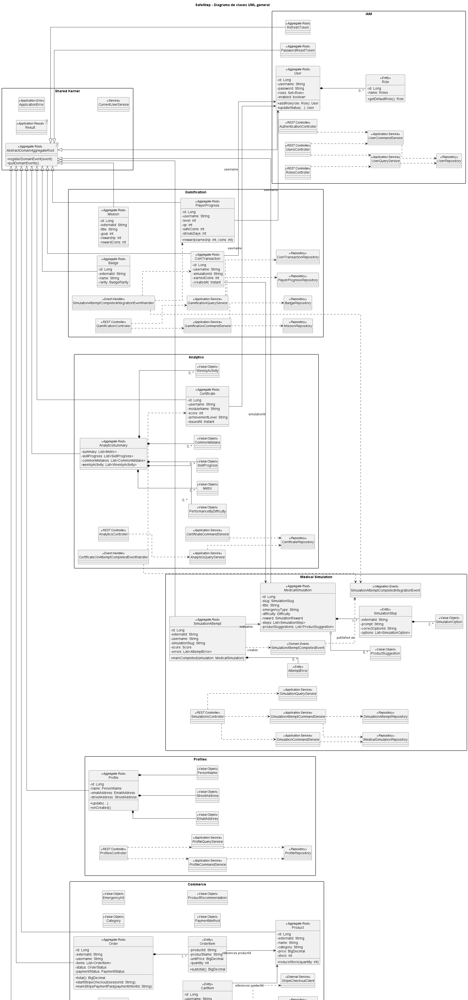
</div>

**link del miro para una mejor vista** 

<a href="https://miro.com/app/board/uXjVH9tP7zk=/?share_link_id=396032164151">https://miro.com/app/board/uXjVH9tP7zk=/?share_link_id=396032164151</a>

<p align="center"><strong>Diagrama Clases Analytics</strong></p>

<div align="center">
    
</div>


<p align="center"><strong>Diagrama Clases Ecommerce</strong></p>

<div align="center">
    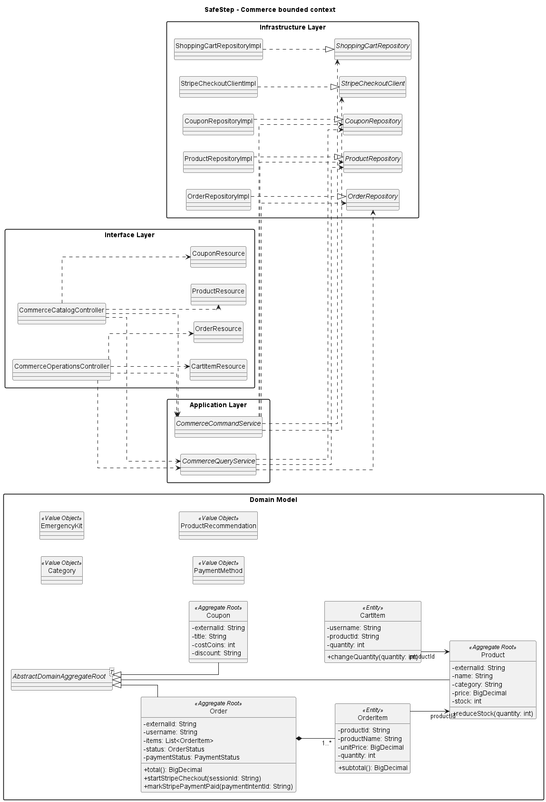
</div>


<p align="center"><strong>Diagrama Clases Gamification</strong></p>

<div align="center">
    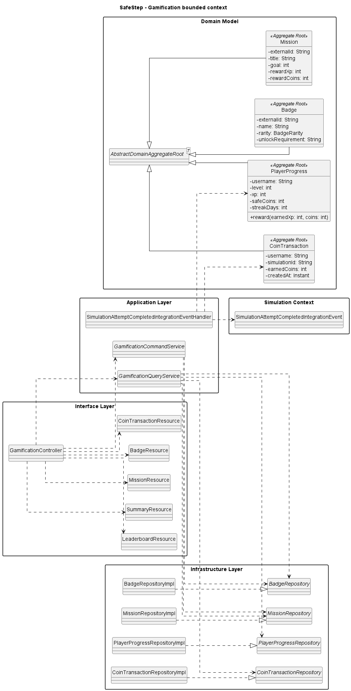
</div>

<p align="center"><strong>Diagrama Clases IAM</strong></p>


<div align="center">
    
</div>

<p align="center"><strong>Diagrama Clases Simulation</strong></p>


<div align="center">
    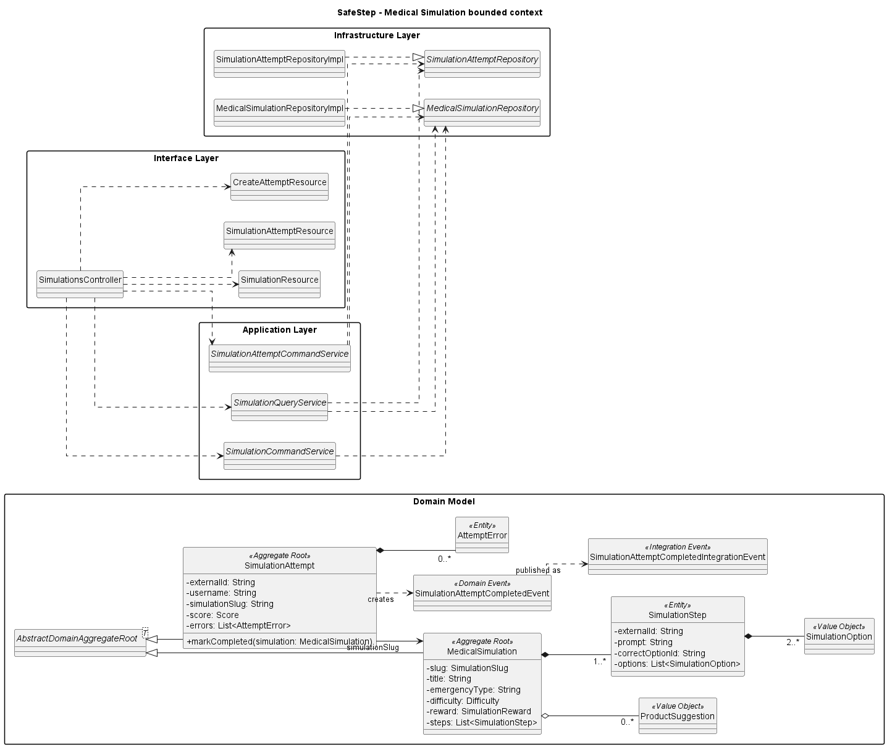
</div>

<a id="toc-4-9-2-class-dictionary"></a>
## 4.9.2. Class Dictionary

El diccionario describe las clases representadas en los diagramas anteriores y añade `UserBadge` y `UserMissionProgress`, necesarias para entender el ERD de Gamification aunque no se destaquen en el UML de dominio. Se contrastaron con los agregados, entidades y objetos de valor del backend; los controladores, servicios y repositorios son clases de aplicación o infraestructura y **no** se convierten automáticamente en tablas. `id` identifica internamente un agregado, mientras que `externalId`, `slug` y `username` son identificadores de negocio o referencias lógicas entre contextos. Las relaciones entre contextos dibujadas en UML no implican necesariamente claves foráneas físicas.

| Contexto | Clase (tipo) | Responsabilidad y atributos principales | Relaciones y operaciones relevantes |
|---|---|---|---|
| IAM | `User` (agregado) | Cuenta, credenciales, estado y conjunto de roles; `id`, `username`, `password`, `enabled`. | Se asocia con `Role`; administra roles y estado. |
| IAM | `Role` (entidad) | Tipo de autorización; `id`, `name`. | Se asigna a varios usuarios mediante `user_roles`. |
| IAM | `RefreshToken` (agregado) | Sesión renovable; hash, usuario, vencimiento y revocación. | Referencia lógicamente a `User` por `username`; permite renovar o revocar la sesión. |
| IAM | `PasswordResetToken` (agregado) | Solicitud de restablecimiento; hash, usuario, vencimiento y uso. | Referencia lógicamente a `User` por `username`; evita reutilizar un token consumido. |
| Profiles | `Profile` (agregado) | Datos personales y de contacto; `id`, `name`, `emailAddress`, `streetAddress`. | Compone `PersonName`, `EmailAddress` y `StreetAddress`; admite creación y actualización. |
| Profiles | `PersonName` (objeto de valor) | Nombre y apellido de la persona. | Parte de `Profile`; no tiene identidad propia. |
| Profiles | `EmailAddress` (objeto de valor) | Dirección de correo validada. | Parte de `Profile`; es única en persistencia. |
| Profiles | `StreetAddress` (objeto de valor) | Calle, número, ciudad, código postal y país. | Parte de `Profile`; se almacena en columnas del perfil. |
| Simulation | `MedicalSimulation` (agregado) | Escenario médico; `id`, `slug`, `title`, tipo, dificultad, recompensa y contenido. | Contiene pasos, opciones, objetivos y sugerencias; se consulta por `slug`. |
| Simulation | `SimulationStep` (entidad del agregado) | Paso o pregunta; identificador externo, enunciado y opción correcta. | Pertenece a `MedicalSimulation` y contiene opciones de respuesta. |
| Simulation | `SimulationOption` (objeto de valor) | Opción, etiqueta y retroalimentación. | Pertenece a un paso; se persiste en `simulation_options`. |
| Simulation | `ProductSuggestion` (objeto de valor) | Producto recomendado y motivo asociado al escenario. | Pertenece a `MedicalSimulation`; `productId` es referencia lógica a Commerce. |
| Simulation | `SimulationAttempt` (agregado) | Intento de un usuario; `externalId`, `username`, `simulationSlug`, puntuación, duración y estado. | Evalúa un escenario y agrupa `AttemptError`; al completarse origina un evento de dominio. |
| Simulation | `AttemptError` (entidad del agregado) | Error cometido, paso, descripción y severidad. | Pertenece a `SimulationAttempt`. |
| Gamification | `PlayerProgress` (agregado) | Progreso del jugador; nivel, XP, monedas, racha y simulaciones completadas. | Se identifica por `username`; aplica recompensas de intentos. |
| Gamification | `Mission` (agregado) | Meta, cadencia, estado y recompensas XP/monedas. | Se vincula con `UserMissionProgress` por identificador externo. |
| Gamification | `Badge` (agregado) | Insignia, rareza y condición de desbloqueo. | Se vincula con `UserBadge` por identificador externo. |
| Gamification | `CoinTransaction` (agregado) | Registro de monedas obtenidas en una simulación. | Referencia lógicamente usuario y simulación; conserva puntuación y multiplicador. |
| Gamification | `UserMissionProgress` (entidad de persistencia) | Avance individual y estado de una misión. | Conecta usuario (`username`) con `Mission.externalId`. |
| Gamification | `UserBadge` (entidad de persistencia) | Insignia desbloqueada y fecha. | Conecta usuario (`username`) con `Badge.externalId`. |
| Analytics | `AnalyticsSummary` (agregado de consulta) | Resumen calculado de métricas, habilidades, errores y actividad semanal. | Compone `Metric`, `SkillProgress`, `CommonMistake`, `WeeklyActivity` y `PerformanceByDifficulty`; no tiene tabla propia en el ERD actual. |
| Analytics | `Certificate` (agregado) | Certificado emitido; usuario, módulo, puntuación, logro y código de verificación. | Se deriva de intentos completados; se persiste en `certificates`. |
| Analytics | `Metric` (objeto de valor) | Indicador cuantitativo del resumen. | Elemento de `AnalyticsSummary`; calculado para consulta. |
| Analytics | `SkillProgress` (objeto de valor) | Progreso por habilidad. | Elemento de `AnalyticsSummary`; calculado para consulta. |
| Analytics | `CommonMistake` (objeto de valor) | Error recurrente identificado entre intentos. | Elemento de `AnalyticsSummary`; calculado para consulta. |
| Analytics | `WeeklyActivity` (objeto de valor) | Actividad agrupada por semana. | Elemento de `AnalyticsSummary`; calculado para consulta. |
| Analytics | `PerformanceByDifficulty` (objeto de valor) | Rendimiento por grado de dificultad. | Elemento de `AnalyticsSummary`; calculado para consulta. |
| Commerce | `Product` (agregado) | Producto, categoría, precio, etiquetas, valoración y existencias. | Se relaciona lógicamente con `Category`; reduce `stock` al procesar pedidos. |
| Commerce | `Order` (agregado) | Pedido, usuario, estado, fecha y datos de pago. | Compone `OrderItem`; calcula total y registra el pago de Stripe. |
| Commerce | `OrderItem` (entidad del agregado) | Línea de pedido; producto, nombre, precio unitario y cantidad. | Pertenece a `Order`; `productId` apunta lógicamente a `Product.externalId`. |
| Commerce | `CartItem` (entidad) | Producto y cantidad que un usuario mantiene en el carrito. | Referencia lógicamente usuario y producto. |
| Commerce | `Coupon` (agregado) | Descuento canjeable y costo en monedas. | Se identifica externamente mediante `externalId`. |
| Commerce | `ShippingAddress` (agregado) | Destinatario y dirección de entrega del usuario. | `username` identifica a su propietario sin FK física en el modelo actual. |
| Commerce | `Category` (objeto de valor) | Categoría comercial y cantidad de productos. | En persistencia tiene tabla propia; `Product.category` conserva el nombre como referencia lógica. |
| Commerce | `EmergencyKit` (objeto de valor) | Kit de emergencia, componentes y precios. | En persistencia tiene tabla propia. |
| Commerce | `PaymentMethod` (objeto de valor) | Medio de pago, comisión y disponibilidad. | En persistencia tiene tabla propia. |
| Commerce | `ProductRecommendation` (objeto de valor) | Recomendación de producto con motivo y prioridad. | En persistencia tiene tabla propia; referencia usuario, producto y simulación por identificadores lógicos. |

**Clases de soporte representadas en el UML.** Las siguientes clases tienen responsabilidad arquitectónica, pero no son entidades de la base de datos.

| Capa | Clases del diagrama | Responsabilidad |
|---|---|---|
| Interfaces REST | `AuthenticationController`, `UsersController`, `ProfilesController`, `SimulationsController`, `GamificationController`, `AnalyticsController`, `CommerceCatalogController`, `CommerceOperationsController` | Recibir solicitudes, validar entradas y devolver recursos de la API. |
| Aplicación | `UserCommandService`, `UserQueryService`, `ProfileCommandService`, `ProfileQueryService`, `SimulationCommandService`, `SimulationQueryService`, `SimulationAttemptCommandService`, `GamificationCommandService`, `GamificationQueryService`, `AnalyticsQueryService`, `CertificateCommandService`, `CommerceCommandService`, `CommerceQueryService` | Coordinar comandos y consultas, sin almacenar estado persistente propio. |
| Persistencia y servicios externos | `UserRepository`, `ProfileRepository`, `MedicalSimulationRepository`, `SimulationAttemptRepository`, `BadgeRepository`, `MissionRepository`, `PlayerProgressRepository`, `CoinTransactionRepository`, `CertificateRepository`, `ProductRepository`, `OrderRepository`, `CouponRepository`, `ShoppingCartRepository`, `StripeCheckoutClient` y sus implementaciones | Definir contratos de almacenamiento o integración y adaptarlos a JPA/Stripe. |
| Compartido y eventos | `AbstractDomainAggregateRoot`, `SimulationAttemptCompletedEvent`, `SimulationAttemptCompletedIntegrationEvent` y sus manejadores | Registrar y publicar hechos del dominio para que Gamification y Analytics reaccionen sin acoplar directamente sus agregados. |

En conjunto, el UML describe estructura y colaboración entre clases, mientras que el ERD del apartado 4.10 describe persistencia. Por ello el número de clases no coincide con el de tablas.

<br>

<br>
<br>

<div align="center">
    
</div>

<br>
<br>

<a id="toc-4-10-database-design"></a>
# 4.10. Database Design

<a id="toc-4-10-1-relational-non-relational-database-diagram"></a>
## 4.10.1. Relational/Non-Relational Database Diagram

El siguiente Diagrama Entidad-Relación (ERD) representa la estructura de datos fundamental que soporta toda la lógica de la plataforma SafeStep. Este modelo relacional, compuesto por 31 entidades, ha sido diseñado aplicando las 3 fases de normalizacion. Para garantizar la escalabilidad, el mantenimiento y la separación de responsabilidades, la base de datos se ha estructurado en 5 paquetes o módulos lógicos:


<div align="center">
    
</div>

**link del diagrama de base de datos para una mejor vista**

<a href="https://miro.com/app/board/uXjVHUFFqvM=/?embedMode=view_only_without_ui&moveToViewport=-2454%2C-663%2C5474%2C2933&embedId=668883533640">https://miro.com/app/board/uXjVHUFFqvM=/?embedMode=view_only_without_ui&moveToViewport=-2454%2C-663%2C5474%2C2933&embedId=668883533640</a>

<div align="center">
    
</div>

<p align="center"><strong>Diagrama ERD Analytics</strong></p>


<div align="center">
    
</div>

<p align="center"><strong>Diagrama ERD Ecommerce</strong></p>


<div align="center">
    
</div>

<p align="center"><strong>Diagrama ERD Gamification</strong></p>

<div align="center">
    
</div>

<p align="center"><strong>Diagrama ERD IAM</strong></p>

<div align="center">
    
</div>

<p align="center"><strong>Diagrama ERD Profiles</strong></p>

<div align="center">
    
</div>

<p align="center"><strong>Diagrama ERD Simulation</strong></p>

<br>

<div style="page-break-before: always;"></div>

<a id="toc-5-1-software-configuration-management"></a>
# 5.1. Software Configuration Management

Este apartado describe la configuración **del proyecto actual**. El capítulo 5 del informe del curso anterior se conserva como antecedente; sus versiones, tableros, repositorios y despliegues no se atribuyen a esta entrega sin una comprobación nueva. La solución disponible consta de una landing page estática, una aplicación web Angular y una API Spring Boot con PostgreSQL. La aplicación Android nativa está en desarrollo y se reporta por separado.

<a id="toc-5-1-1-software-development-environment-configuration"></a>
## 5.1.1. Software Development Environment Configuration

La tabla distingue productos constatados en el código o en este entorno de herramientas previstas para la siguiente iteración. «Disponible» no equivale a una evidencia de uso por todos los integrantes.

| Actividad | Producto y versión constatada | Propósito | Referencia | Estado |
|---|---|---|---|---|
| Gestión de proyecto y requisitos | GitHub Issues/Projects; Trello (histórico) | Historias, tareas, revisión y tablero de sprint | [GitHub](https://github.com/1ASI0732-2620-9090-Grupo-4); [Trello](https://trello.com) | Falta tablero público del curso actual |
| Diseño UX/UI | Figma; Miro/UXPressia según artefacto | Prototipos, escenarios y personas | [Figma](https://www.figma.com); [Miro](https://miro.com); [UXPressia](https://uxpressia.com) | Verificar enlaces de los artefactos actuales |
| Landing page | HTML5, CSS3 y JavaScript | Página pública sin *build* ni gestor de paquetes | [Repositorio Landing](https://github.com/1ASI0732-2620-9090-Grupo-4/safestept-landing-page) | Código disponible |
| Aplicación web | Angular 21.2.12, TypeScript 5.9.2, Angular Material 21.2.10 | Interfaz, navegación y consumo de la API | [Repositorio Frontend](https://github.com/1ASI0732-2620-9090-Grupo-4/safestept-frontend) | Versiones declaradas en `package.json` |
| Entorno web | Node.js 24.15.0, npm 11.12.1 (equipo inspeccionado) | Instalar dependencias y ejecutar `npm run build` / `npm test` | [Node.js](https://nodejs.org) | Versión local; el proyecto declara npm 11.13.0 |
| API | Java 26.0.1, Maven 3.9.16, Spring Boot 4.0.6 | Compilación, API REST y pruebas | [Repositorio Backend](https://github.com/1ASI0732-2620-9090-Grupo-4/safestept-backend) | Java/Spring verificados en `pom.xml` y entorno local |
| Persistencia | PostgreSQL; cliente local 18.4 | Datos transaccionales de la API | [PostgreSQL](https://www.postgresql.org) | El proveedor de producción debe confirmarse |
| Documentación API | springdoc OpenAPI 3.0.3 / Swagger UI | Contratos y prueba interactiva de endpoints | [OpenAPI](https://spec.openapis.org/oas/latest.html) | Dependencia declarada en `pom.xml`; URL pública pendiente de verificar |
| Pruebas web/API | Vitest 4.0.8; Spring Boot Starter Test / JUnit | Pruebas automatizadas y resultados reproducibles | [Vitest](https://vitest.dev); [JUnit](https://junit.org/junit5/) | Dependencias declaradas; resultados en 5.2 y capítulo VI |
| Android nativo | SDK 37, Android Gradle Plugin 9.3.2, Kotlin Compose Compiler 2.3.21, Gradle 9.5 | Implementar y probar la app móvil | Proyecto local `safestept-android`; [Android Developers](https://developer.android.com) | Compilación, pruebas y ejecución con API local verificadas; publicación pendiente |
| Control de versiones | Git/GitHub | Ramas, PR, commits y versiones | [Git](https://git-scm.com); [GitHub](https://github.com) | Cuatro repositorios previos y proyecto Android local disponibles |
| Despliegue | Docker y configuración de GitHub Pages del frontend | Empaquetado y publicación | [Docker](https://docs.docker.com); [GitHub Pages](https://pages.github.com) | Los destinos actuales deben verificarse antes de afirmar despliegue |

Las versiones del equipo de un integrante no constituyen un requisito universal: cada persona debe registrar en su entorno las versiones compatibles con los manifiestos del proyecto. No se utilizarán credenciales personales ni URL internas de bases de datos como «ruta de referencia» del software.

<a id="toc-5-1-2-source-code-management"></a>
## 5.1.2. Source Code Management

El trabajo actual se aloja en la organización [1ASI0732-2620-9090-Grupo-4](https://github.com/1ASI0732-2620-9090-Grupo-4). Los repositorios de la organización antigua citados en el capítulo 5 del informe anterior son exclusivamente evidencia histórica.

| Producto | Repositorio actual | Rama local observada al preparar esta sección |
|---|---|---|
| Informe | [safeStept-report](https://github.com/1ASI0732-2620-9090-Grupo-4/safeStept-report) | `develop` |
| Landing page | [safestept-landing-page](https://github.com/1ASI0732-2620-9090-Grupo-4/safestept-landing-page) | `main` |
| Frontend web | [safestept-frontend](https://github.com/1ASI0732-2620-9090-Grupo-4/safestept-frontend) | `main` |
| API | [safestept-backend](https://github.com/1ASI0732-2620-9090-Grupo-4/safestept-backend) | `main` |
| Android | Repositorio Git local `safestept-android`; remoto de la organización por crear y enlazar | `main` sin commits |

**Flujo acordado:** `main` recibe versiones publicables; `develop` integra cambios revisados; cada historia usa `feature/<id>-<descripcion-en-kebab-case>` desde `develop`; las estabilizaciones usan `release/vMAJOR.MINOR.PATCH` y las correcciones urgentes `hotfix/vMAJOR.MINOR.PATCH`. Una PR debe referir la historia, describir la prueba ejecutada y recibir al menos una revisión distinta de su autor antes de fusionarse. Las ramas `develop` aún no están constatadas en los tres repositorios de producto, por lo que esta política es una **configuración pendiente**, no una práctica ya demostrada.

Los mensajes siguen Conventional Commits, por ejemplo `feat(simulation): show attempt feedback`, `fix(auth): handle expired token` y `test(analytics): cover empty progress`. Los *releases* usan Semantic Versioning `MAJOR.MINOR.PATCH`; un número solo se declara liberado si existe el tag y un artefacto verificable. No se asignarán a los repositorios nuevos fechas, autores, PR o commits heredados de la organización anterior.

<a id="toc-5-1-3-source-code-style-guide-conventions"></a>
## 5.1.3. Source Code Style Guide & Conventions

Las claves, nombres de clases, métodos, rutas y mensajes técnicos se escriben en inglés. La UI se localiza a `en` y `es` mediante recursos, sin mezclar cadenas de presentación en la lógica. Se conserva el idioma inglés como valor por defecto exigido por el statement, con revisión específica de la landing page, que aún declara `lang="es"`.

| Tecnología | Convención comprobable |
|---|---|
| HTML/CSS/JavaScript | HTML semántico; atributos ARIA solo cuando aportan significado; clases CSS en `kebab-case`; variables CSS para tokens; JS en `camelCase`; enlaces y controles accesibles por teclado. |
| TypeScript/Angular | `PascalCase` para tipos/componentes, `camelCase` para miembros, `kebab-case` para rutas/archivos; tipado explícito en contratos; separar dominio, aplicación, infraestructura y presentación; ejecutar `npm run build` y `npm test`. Formato conforme a `.prettierrc` y `.editorconfig` del repositorio. |
| Java/Spring Boot | Paquetes en minúsculas, clases en `PascalCase`, métodos/campos en `camelCase`; DTO de entrada validados; reglas de negocio fuera de controladores; ejecutar `mvn test` y compilar el artefacto. |
| Kotlin/Android | Los mismos criterios de nombres Kotlin; estados UI separados del acceso a datos; textos en recursos localizables; pruebas unitarias y de interfaz Compose antes del APK. |
| SQL | Tablas/columnas en `snake_case`, PK y FK explícitas, sin contraseñas ni datos personales en scripts de ejemplo. |
| Gherkin | `Feature`, `Scenario`, `Given/When/Then` con comportamiento observable, uno por intención de negocio; enlazar cada escenario a una User Story. Los archivos `.feature` aún no están presentes en los repositorios actuales. |

Las referencias adoptadas son [Google HTML/CSS Style Guide](https://google.github.io/styleguide/htmlcssguide.html) y [Google JavaScript Style Guide](https://google.github.io/styleguide/jsguide.html) para la landing; [Angular coding style guide](https://angular.dev/style-guide) y la [documentación TypeScript](https://www.typescriptlang.org/docs/handbook/) para la web; [Google Java Style Guide](https://google.github.io/styleguide/javaguide.html) para la API; [Android Kotlin style guide](https://developer.android.com/kotlin/style-guide) para Android; y la [referencia Gherkin de Cucumber](https://cucumber.io/docs/gherkin/reference/) para escenarios BDD. Adoptarlas no equivale a afirmar que todos los archivos actuales ya las cumplen: esa verificación pertenece a las pruebas estáticas del capítulo VI.

El statement menciona guías Vue y C# porque prescribe esas tecnologías. El equipo conserva Angular y Spring Boot por decisión de proyecto, pero **requiere confirmar con el docente** la aceptación de esta desviación; el informe no debe afirmar conformidad técnica completa antes de ello.

<a id="toc-5-1-4-software-deployment-configuration"></a>
## 5.1.4. Software Deployment Configuration

El procedimiento siguiente describe pasos reproducibles; la existencia de código o configuraciones no demuestra por sí sola una publicación vigente. Los enlaces del capítulo anterior deben comprobarse y sustituirse por los de la organización actual.

1. **Landing:** revisar `index.html`, `about.html`, `styles.css`, `script.js` y recursos; verificar enlaces, idioma, navegación responsive y acuerdo SaaS; publicar la rama/version seleccionada en GitHub Pages; guardar URL, commit, fecha y captura desktop/móvil.
2. **Web:** instalar con `npm ci`; ejecutar `npm test -- --watch=false` y `npm run build`; configurar la URL de API para producción mediante los archivos `src/environments`; desplegar el resultado en GitHub Pages con el `base-href` del repositorio; verificar rutas directas, autenticación, simulación, progreso y estados de error.
3. **API:** ejecutar `mvn test` y empaquetar con Docker; definir `SPRING_PROFILES_ACTIVE=prod` y `PORT`. Inyectar `DATABASE_URL`, `DATABASE_PORT`, `DATABASE_NAME`, `DATABASE_USER`, `DATABASE_PASSWORD` y `JWT_SECRET` desde el proveedor, nunca desde Git. Stripe solo debe configurarse con claves de **prueba** para el piloto (`STRIPE_SECRET_KEY`, `STRIPE_WEBHOOK_SECRET`). Comprobar acceso a base de datos, `/v3/api-docs` y flujos API antes de publicar su URL.
4. **Android:** compilar, probar y generar un APK de prueba firmado para distribución interna; configurar el `baseUrl` del entorno de prueba sin colocar credenciales en el APK; instalar en dispositivo/emulador y registrar versión, huella del artefacto, capturas y resultados. No se publicará en tienda sin nueva revisión.
5. **Reversión:** conservar el commit/tag y artefacto de la versión anterior; ante fallo, volver a la versión previamente validada y verificar los flujos principales. No revertir una base de datos con cambios destructivos sin plan de restauración específico.

**Hallazgo de seguridad al auditar esta sección:** el perfil de producción del backend contenía valores sensibles de respaldo y el Dockerfile iniciaba con el perfil `dev`. La configuración local se corrigió para exigir variables de entorno y activar `prod`. Las credenciales que hayan figurado en el historial deben rotarse por el responsable del servicio; editar el archivo no borra su exposición histórica. Los resultados de publicación y verificación se registrarán en 5.2, no se presumirán aquí.

<br>

<a id="toc-5-2-product-implementation-deployment"></a>
# 5.2. Product Implementation & Deployment

SafeStep parte de una aplicación existente. Esta sección separa **línea base heredada**, **implementación comprobada en el repositorio actual** y **entregables pendientes del nuevo curso**. Una captura antigua, una URL del curso anterior o una funcionalidad descrita en un README no demuestran por sí mismas que la versión actual esté desplegada. Las pruebas detalladas pertenecen al capítulo VI; aquí se registra su vínculo con productos y sprints.

| Estado de evidencia | Significado utilizado en esta sección |
|---|---|
| Implementado en código | Se localizó el archivo, ruta o componente en los repositorios actuales. |
| Probado localmente | Existe un resultado de compilación/prueba ejecutado sobre el código actual. |
| Desplegado/verificado | Se comprobó una URL pública y se registró fecha, versión y captura. |
| Pendiente | Falta artefacto, revisión, ejecución o evidencia; no se presenta como terminado. |

<a id="toc-5-2-1-sprint-backlogs"></a>
## 5.2.1. Sprint Backlogs

<a id="toc-linea-base-as-is-del-curso-anterior"></a>
### Línea base As-Is del curso anterior

El informe elaborado en el curso anterior documenta cuatro sprints del proyecto previo. Sus números y resultados son **afirmaciones históricas de ese informe** y no se contabilizan como trabajo ni velocidad del equipo del curso actual.

| Sprint antiguo | Alcance declarado en el informe anterior | Story Points declarados | Uso en el proyecto nuevo |
|---|---|---:|---|
| 1 | Landing page inicial | 21 | Identificar piezas reutilizables y deuda de i18n/accesibilidad. |
| 2 | Frontend Angular y API simulada | 43 | Revisar qué vistas siguen vigentes y cuáles usan la API real. |
| 3 | Backend real, PostgreSQL, OpenAPI e integración | 45 | Contrastar contratos y despliegues con los repositorios actuales. |
| 4 | IAM, Stripe, persistencia y validación | 34 | Revisar seguridad, pruebas y flujos de pago de prueba. |

<a id="toc-sprints-del-curso-de-diseno-de-experimentos"></a>
### Sprints del curso de Diseño de Experimentos

La siguiente secuencia es un **backlog de implementación**, no una retrospectiva inventada. El equipo debe fijar fechas, responsables, puntos y velocidad en su tablero actual antes de iniciar cada sprint. Las historias se seleccionarán por ID desde el [Product Backlog del capítulo III](../chapter-3/3-3-product-backlog.md), incorporando nuevas historias Android o de corrección mediante control de versiones.

| Sprint nuevo | Goal y criterio de aceptación propuestos | Historias/tareas principales | Evidencia de cierre exigida | Estado |
|---|---|---|---|---|
| 1 — línea base y contratos | Poder compilar y probar web/API, identificar desviaciones y acordar contratos Android. | Auditoría de repositorios, secretos, OpenAPI, i18n/a11y, pruebas existentes, tablero. | Board, planning, LACX, PR, logs de pruebas, lista priorizada de defectos. | En curso; el board y la asignación son pendientes. |
| 2 — Android e integración | Un usuario puede registrarse, practicar una simulación y consultar su progreso/catálogo en Android. | App Kotlin/Compose, cliente API, pruebas unitarias/UI, manejo de errores. | APK de prueba, captura o video en dispositivo, tests y commits. | Recorrido local ejecutado en emulador; faltan board, PR, pruebas de errores y despliegue compartido. |
| 3 — estabilización y entrega | Los productos principales funcionan en los destinos publicados y su evidencia es trazable. | Correcciones, despliegues, acuerdo SaaS aprobado, seguridad, video actual. | URL verificadas, smoke tests, capturas, video, colaboración y retrospectiva. | Pendiente. |

**Plantilla obligatoria por sprint.** Registrar número y fechas; objetivo SMART; *velocity* y suma de puntos; tabla `Story ID | Título | Task ID | Descripción | Horas | Responsable | Estado`; URL pública y captura del board; tabla de commits `Repositorio | Rama | Commit | Mensaje | Fecha`; pruebas asociadas a historia; capturas y video de ejecución; endpoints OpenAPI añadidos; despliegue; LACX y retrospectiva. No inferir horas o puntos a partir de la cantidad de commits. Las tareas de seguridad y documentación que no dependan de una historia deben etiquetarse como tareas técnicas. Las estimaciones en horas de las tablas de Engineering Tasks siguientes son planificación (rango 4–8 h por tarea, según el statement), no hechos verificados; los campos de responsable y fecha exacta permanecen sin asignar hasta la planificación real en el board del equipo.

**Sprint Planning y trazabilidad.** Los trabajos técnicos que siguen se ejecutaron para preparar el producto, pero no se atribuyen retroactivamente a una reunión o Sprint formal. Antes de incorporar cada Sprint a la entrega, el equipo completará el cuadro exigido por el statement: `Date | Time | Location | Prepared By | Attendees | Sprint anterior: review | Sprint anterior: retrospective | Sprint Goal | Velocity | Sum of Story Points`. También incorporará la URL pública y una captura del board, la matriz LACX `Integrante y GitHub | Aspecto 1 L/C | Aspecto 2 L/C`, y la tabla de tareas `Story ID | Story Title | Task ID | Task Title | Description | Estimation (Hours) | Assigned To | Status`. Los campos de personas, horas, puntos y fechas permanecen sin asignar hasta la planificación real.

<a id="toc-sprint-1-linea-base-y-contratos"></a>
### Sprint 1 — línea base y contratos

*Goal propuesto:* que el equipo pueda reproducir la compilación y las pruebas de web/API, y que una cuenta común no pueda modificar catálogos. El evento de confirmación es `mvn package`, `npm run build`, pruebas automatizadas y smoke test local aprobados. La fecha de cierre, la velocidad y las historias seleccionadas deben acordarse en el board; las tareas siguientes aún no constituyen un Sprint Backlog aprobado.

<table border="1" cellpadding="6" cellspacing="0" width="100%">
  <tbody>
    <tr><th width="30%">Sprint #</th><td>Sprint 1</td></tr>
    <tr><th colspan="2" align="left">Sprint Planning Background</th></tr>
    <tr><th>Date</th><td>Pendiente de registrar</td></tr>
    <tr><th>Time</th><td>Pendiente de registrar</td></tr>
    <tr><th>Location</th><td>Pendiente de registrar</td></tr>
    <tr><th>Prepared By</th><td>Pendiente de asignación del equipo</td></tr>
    <tr><th>Attendees (to planning meeting)</th><td>Pendiente de asignación del equipo</td></tr>
    <tr><th>Sprint n-1 Review Summary</th><td>No aplica; es el primer Sprint del curso actual.</td></tr>
    <tr><th>Sprint n-1 Retrospective Summary</th><td>No aplica; es el primer Sprint del curso actual.</td></tr>
    <tr><th colspan="2" align="left">Sprint Goal & User Stories</th></tr>
    <tr><th>Sprint 1 Goal</th><td>Que el equipo pueda reproducir la compilación y las pruebas de web/API, y que una cuenta común no pueda modificar catálogos, confirmado por <code>mvn package</code>, <code>npm run build</code>, pruebas automatizadas y smoke test local aprobados.</td></tr>
    <tr><th>Sprint 1 Velocity</th><td>Pendiente de definir por el equipo; no hay velocidad histórica previa en el curso actual.</td></tr>
    <tr><th>Sum of Story Points</th><td>19 (TS15: 5, TS17: 8, TS18: 3, TS20: 3 — historias técnicas con Story ID del Product Backlog de 3.3 incluidas en este Sprint).</td></tr>
  </tbody>
</table>

| Task técnica propuesta | Resultado comprobado al 16/09/2026 | Pendiente para cierre del Sprint |
|---|---|---|
| Baseline web/API | 42 pruebas API y 2 web aprobadas; ambos productos compilan. | Vincular tests con historias y registrar commits/PR. |
| Contratos y persistencia | Smoke test local de alta, sesión, simulaciones, intento, progreso, catálogo y OpenAPI. | Publicar entorno de prueba y ejemplos de request/response por endpoint. |
| Seguridad de contenido | Mutaciones administrativas restringidas en API y rutas/controles ocultos en web para `ROLE_USER`. | Revisar permisos de administrador y ejecutar análisis estático. |
| Deuda y riesgos | Inventario de dependencias, i18n parcial, bundle sobre presupuesto y secretos históricos. | Priorizar en el board; rotar secretos en el proveedor. |

**Sprint Backlog — Engineering Tasks (Sprint 1).** Descomposición de las tareas anteriores en tareas de ingeniería estimadas en horas (planificación, no hechos verificados; ver nota de la plantilla obligatoria).

| Story ID | Story Title | Task ID | Task Title | Descripción | Estimación (h) | Assigned To | Status |
|---|---|---|---|---|---|---|---|
| TS20 | Pruebas y validación del backend con Maven | T1.1 | Ejecutar y estabilizar suite de pruebas del backend | Correr `mvn test`, revisar las 14 suites/42 pruebas y dejar el build reproducible. | 6 | Por asignar | Hecho |
| TS20 | Pruebas y validación del backend con Maven | T1.2 | Ejecutar suite de pruebas del frontend | Correr `npm test -- --watch=false` y `npm run build`, registrar el aviso de presupuesto de bundle. | 4 | Por asignar | Hecho |
| Tarea técnica | Trazabilidad de pruebas | T1.3 | Vincular tests existentes con Story ID | Anotar en el código o en el board qué historia cubre cada clase de test. | 5 | Por asignar | Pendiente |
| TS17 | RESTful API por bounded context | T1.4 | Smoke test manual de contratos | Ejecutar `scripts/smoke-api.ps1` contra alta, sesión, simulaciones, intento, progreso y catálogo. | 5 | Por asignar | Hecho |
| TS18 | Documentación OpenAPI y Swagger | T1.5 | Publicar ejemplos de request/response | Completar en Swagger un ejemplo por endpoint del alcance del Sprint. | 6 | Por asignar | Pendiente |
| TS15 | Seguridad backend con JWT y roles | T1.6 | Restringir mutaciones administrativas | Agregar `@PreAuthorize("hasAuthority('ROLE_ADMIN')")` en simulaciones, comercio y gamificación. | 7 | Por asignar | Hecho |
| TS15 | Seguridad backend con JWT y roles | T1.7 | Ocultar controles de administración en la web | Añadir `adminGuard`, campo `roles` en la respuesta de login y ocultar rutas/controles para `ROLE_USER`. | 8 | Por asignar | Hecho |
| Tarea técnica | Deuda técnica | T1.8 | Inventariar dependencias vulnerables y secretos | Revisar las 24 alertas de `npm ci` y priorizar la rotación de la credencial expuesta en el proveedor. | 4 | Por asignar | Pendiente |

<a id="toc-sprint-2-android-e-integracion"></a>
### Sprint 2 — Android e integración

*Goal propuesto:* que una persona pueda iniciar sesión, realizar una práctica y consultar su progreso desde Android con datos persistidos. Un recorrido con cuenta ficticia en emulador y API/PostgreSQL locales confirmó el flujo básico; no equivale a cierre de Sprint sin planificación, pruebas negativas y revisión del equipo.

<table border="1" cellpadding="6" cellspacing="0" width="100%">
  <tbody>
    <tr><th width="30%">Sprint #</th><td>Sprint 2</td></tr>
    <tr><th colspan="2" align="left">Sprint Planning Background</th></tr>
    <tr><th>Date</th><td>Pendiente de registrar</td></tr>
    <tr><th>Time</th><td>Pendiente de registrar</td></tr>
    <tr><th>Location</th><td>Pendiente de registrar</td></tr>
    <tr><th>Prepared By</th><td>Pendiente de asignación del equipo</td></tr>
    <tr><th>Attendees (to planning meeting)</th><td>Pendiente de asignación del equipo</td></tr>
    <tr><th>Sprint 1 Review Summary</th><td>Pendiente de sesión de review formal del Sprint 1.</td></tr>
    <tr><th>Sprint 1 Retrospective Summary</th><td>Pendiente de sesión de retrospectiva del Sprint 1.</td></tr>
    <tr><th colspan="2" align="left">Sprint Goal & User Stories</th></tr>
    <tr><th>Sprint 2 Goal</th><td>Que una persona pueda iniciar sesión, realizar una práctica y consultar su progreso desde Android con datos persistidos.</td></tr>
    <tr><th>Sprint 2 Velocity</th><td>Pendiente de definir por el equipo.</td></tr>
    <tr><th>Sum of Story Points</th><td>37 (US01: 3, US02: 5, US10: 5, US12: 3, US13: 8, US14: 5, US16: 3, US18: 5 — mismas historias del Product Backlog de 3.3, implementadas ahora en el cliente Android).</td></tr>
  </tbody>
</table>

| Task técnica propuesta | Resultado comprobado al 16/09/2026 | Pendiente para cierre del Sprint |
|---|---|---|
| Cliente Android Kotlin/Compose | Login, registro, listado, detalle, resultado, progreso y catálogo implementados. | Asociar nuevas historias y publicar repositorio remoto. |
| Pruebas y artefacto | 2 pruebas unitarias, 1 prueba de UI y APK debug reproducible. | Añadir escenarios de errores/red y PR revisado. |
| Integración local | Capturas de recorrido con API/PostgreSQL local. | Repetir contra entorno compartido, registrar versión y test de sistema. |

**Sprint Backlog — Engineering Tasks (Sprint 2).** Las historias reutilizan el mismo Story ID del Product Backlog de 3.3 porque describen el mismo objetivo de usuario implementado ahora en un segundo cliente (Android); el título indica el cliente para evitar confusión con la versión web ya entregada.

| Story ID | Story Title | Task ID | Task Title | Descripción | Estimación (h) | Assigned To | Status |
|---|---|---|---|---|---|---|---|
| US01 | Iniciar sesión (cliente Android) | T2.1 | Pantalla de login y llamada a `/auth/login` | Formulario Compose, manejo de estado y token en memoria. | 6 | Por asignar | Hecho |
| US02 | Registrarse en SafeStep (cliente Android) | T2.2 | Pantalla de registro | Formulario Compose con validación básica y llamada a `/auth/register`. | 5 | Por asignar | Hecho |
| US10 | Visualizar catálogo de simulaciones (cliente Android) | T2.3 | Listado de simulaciones | Consumo del endpoint de catálogo y grilla Compose con imagen, dificultad y recompensas. | 7 | Por asignar | Hecho |
| US12 / US13 | Revisar detalle y responder pasos (cliente Android) | T2.4 | Pantalla de detalle y selección de respuestas | Navegación a detalle, render de pasos/opciones y envío de respuestas seleccionadas. | 8 | Por asignar | Hecho |
| US14 / US16 | Finalizar simulación y ver resumen (cliente Android) | T2.5 | Pantalla de resultado | Cálculo local de resumen y llamada al endpoint de intento. | 6 | Por asignar | Hecho |
| US18 | Visualizar resumen general de progreso (cliente Android) | T2.6 | Pantalla de progreso | Consumo del endpoint de progreso y render de indicadores. | 6 | Por asignar | Hecho |
| Tarea técnica | Calidad Android | T2.7 | Pruebas unitarias y de UI | 2 pruebas unitarias y 1 prueba de UI Compose ejecutadas en `Pixel_7_sem2`. | 5 | Por asignar | Hecho |
| Tarea técnica | Empaquetado | T2.8 | Generar APK debug | Compilar `app-debug.apk` y registrar hash SHA-256 del artefacto. | 4 | Por asignar | Hecho |
| Tarea técnica | Publicación del repositorio | T2.9 | Crear remoto en la organización y subir el proyecto | Enlazar `safestept-android` con GitHub y abrir el primer PR. | 4 | Por asignar | Pendiente |
| Tarea técnica | Resiliencia | T2.10 | Escenarios de error y sin red | Cubrir credenciales inválidas, sesión expirada y pérdida de conexión. | 6 | Por asignar | Pendiente |

<a id="toc-sprint-3-estabilizacion-y-entrega"></a>
### Sprint 3 — estabilización y entrega

*Goal propuesto:* ofrecer landing, web, API y APK de prueba en versiones identificables, con recorrido y evidencia reproducibles para revisión del docente. Su aceptación requerirá URL, commit, fecha, capturas, pruebas de flujos positivos/negativos y video nuevo; actualmente está **pendiente**. Se priorizarán despliegue, accesibilidad/i18n, vulnerabilidades, términos del piloto aprobados, colaboración, retrospectiva y testimonio consentido.

<table border="1" cellpadding="6" cellspacing="0" width="100%">
  <tbody>
    <tr><th width="30%">Sprint #</th><td>Sprint 3</td></tr>
    <tr><th colspan="2" align="left">Sprint Planning Background</th></tr>
    <tr><th>Date</th><td>Pendiente de registrar</td></tr>
    <tr><th>Time</th><td>Pendiente de registrar</td></tr>
    <tr><th>Location</th><td>Pendiente de registrar</td></tr>
    <tr><th>Prepared By</th><td>Pendiente de asignación del equipo</td></tr>
    <tr><th>Attendees (to planning meeting)</th><td>Pendiente de asignación del equipo</td></tr>
    <tr><th>Sprint 2 Review Summary</th><td>Pendiente de sesión de review formal del Sprint 2.</td></tr>
    <tr><th>Sprint 2 Retrospective Summary</th><td>Pendiente de sesión de retrospectiva del Sprint 2.</td></tr>
    <tr><th colspan="2" align="left">Sprint Goal & User Stories</th></tr>
    <tr><th>Sprint 3 Goal</th><td>Ofrecer landing, web, API y APK de prueba en versiones identificables, con recorrido y evidencia reproducibles para revisión del docente.</td></tr>
    <tr><th>Sprint 3 Velocity</th><td>Pendiente de definir por el equipo.</td></tr>
    <tr><th>Sum of Story Points</th><td>5 (US40: 5 — pruebas negativas sobre el checkout ya implementado; el resto del Sprint son tareas técnicas de estabilización sin Story ID del Product Backlog).</td></tr>
  </tbody>
</table>

**Sprint Backlog — Engineering Tasks (Sprint 3, planificado).** Ninguna de estas tareas se ha ejecutado; las horas son una estimación inicial para planificar el Sprint, sujeta a ajuste por el equipo.

| Story ID | Story Title | Task ID | Task Title | Descripción | Estimación (h) | Assigned To | Status |
|---|---|---|---|---|---|---|---|
| Tarea técnica | Despliegue verificado | T3.1 | Confirmar commit servido en landing, web y API | Verificar versión/commit detrás de cada URL pública antes de citarla como evidencia. | 5 | Por asignar | Pendiente |
| Tarea técnica | GitFlow | T3.2 | Crear rama `develop` en los 3 repos de producto | Aplicar la política de GitFlow ya declarada en 5.1.2 a landing, frontend y backend. | 4 | Por asignar | Pendiente |
| Tarea técnica | Seguridad | T3.3 | Rotar credencial expuesta y revisar secretos | Rotar en el proveedor la credencial detectada en el historial de Git y confirmar que no se reintroduce. | 4 | Por asignar | Pendiente |
| Tarea técnica | Accesibilidad e i18n | T3.4 | Completar idioma por defecto en inglés y revisar accesibilidad | Corregir `lang="es"` de la landing y auditar textos de UI aún en español. | 8 | Por asignar | Pendiente |
| US40 | Completar pago ficticio | T3.5 | Pruebas negativas de checkout | Cubrir pago rechazado, carrito vacío y datos inválidos en el flujo de compra. | 6 | Por asignar | Pendiente |
| Tarea técnica | Acuerdo SaaS | T3.6 | Revisión y aprobación del Acuerdo de Servicio | Completar responsable, contacto, tratamiento/retención de datos y fecha antes de publicar. | 5 | Por asignar | Pendiente |
| Tarea técnica | Video About-the-Product | T3.7 | Grabar y publicar el video | Grabar testimonio con consentimiento, subir a OneDrive/YouTube e insertar el enlace en la landing. | 8 | Por asignar | Pendiente |
| Tarea técnica | Colaboración | T3.8 | Completar Team Collaboration Insights | Registrar integrantes, PR, commits, analíticas GitHub y retrospectiva del Sprint 3. | 4 | Por asignar | Pendiente |

**Evidencia que debe añadirse por cada Sprint.** (a) *Development y Testing Suite Evidence:* tablas separadas con `Repository | Branch | Commit Id | Commit Message | Commit Message Body | Committed on`; relacionar pruebas unitarias con clases y comportamientos, e integración/BDD con historias y archivos `.feature`. (b) *Execution Evidence:* capturas de vistas y video de navegación del Sprint. (c) *Services Documentation Evidence:* para cada endpoint, verbo, ruta, parámetros, ejemplo de respuesta, enlace OpenAPI local o publicado y captura con datos de muestra; incluir commits del backend. (d) *Software Deployment Evidence:* cambios de configuración y capturas del proveedor para landing, web y API. (e) *Team Collaboration Insights:* analíticas GitHub del período, interpretación por integrante, LACX y retrospectiva. Se completarán con hechos y enlaces del Sprint real, no con cifras heredadas.

**Registro técnico inicial — 16/09/2026:** `mvn test -q` terminó con **42 pruebas, 0 fallos, 0 errores** en 14 suites del backend y `mvn package -q` generó el artefacto correctamente. `npm test -- --watch=false` terminó con **2 pruebas aprobadas** en una suite del frontend. `npm run build` generó el frontend, con aviso: el bundle inicial excede en 30,28 kB el presupuesto de 700 kB. `npm ci` reportó 24 alertas de dependencias (1 baja, 12 moderadas, 11 altas); deben revisarse y priorizarse, sin aplicar `npm audit fix` a ciegas. Estos resultados locales no sustituyen un pipeline.

<a id="toc-5-2-2-implemented-landing-page-evidence"></a>
## 5.2.2. Implemented Landing Page Evidence

La landing actual incluye `index.html`, `about.html`, CSS y JavaScript, secciones de propuesta de valor, simulaciones, gamificación, catálogo y preguntas frecuentes. Se revisaron sus textos para retirar cifras de éxito, testimonios, certificaciones y disponibilidad sin respaldo. Los precios y productos visibles son ilustrativos para el piloto y los enlaces legales permanecen marcados «en revisión». Se capturó la versión local en Chrome a 1440 × 900 y 390 × 844 píxeles el 16/09/2026. **No se ha comprobado que estas capturas correspondan a la URL pública.**

| Evidencia a conservar | Relación con el producto | Estado |
|---|---|---|
| Capturas del hero en [desktop](markdown/assets/images/chapter-5/landing-local-desktop-2026-09-16.png) y [móvil](markdown/assets/images/chapter-5/landing-local-mobile-2026-09-16.png), con dimensiones y fecha | Historias de landing US47–US53 y relacionadas | Capturadas localmente; faltan recorridos de navegación, FAQ y footer. |
| URL y commit de publicación; comprobación de enlaces CTA hacia la web | Despliegue y recorrido del visitante | Pendiente de verificación |
| Cambio de idioma `en`/`es`, semántica, foco y teclado | i18n/a11y exigidos por el statement | Pendiente; los HTML actuales declaran `lang="es"` |
| Enlace accesible a Terms and Conditions tras aprobación del texto | Acuerdo SaaS | Pendiente de revisión y publicación |

Las imágenes `landing-deployed.png` y otras capturas de `assets/images/chapter-5` pertenecen al informe anterior. Pueden ilustrar el As-Is, pero no se usarán como prueba de un despliegue nuevo sin verificar que corresponden al commit y la URL actuales.

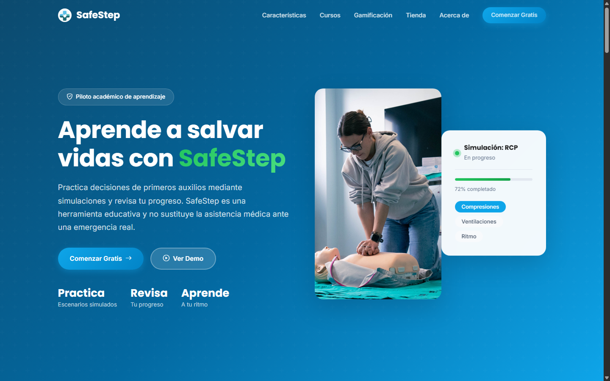

*Figura 5.1. Landing local en escritorio, 16/09/2026; no es evidencia de publicación.*

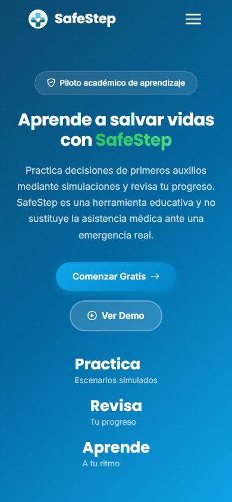

*Figura 5.2. Landing local en viewport móvil, 16/09/2026.*

<a id="toc-5-2-3-implemented-frontend-web-application-evidence"></a>
## 5.2.3. Implemented Frontend-Web Application Evidence

El repositorio actual implementa rutas de autenticación, dashboard, simulaciones, progreso/estadísticas, gamificación y comercio. Contiene recursos `en.json` y `es.json`, y una configuración de API para desarrollo y producción. La compilación y dos pruebas unitarias pasaron localmente el 16/09/2026. En Chrome se inició sesión con una cuenta ficticia contra la API y PostgreSQL locales: el dashboard mostró un intento previamente registrado mediante la API, con 1 simulación completada, 420 XP y 101 monedas. Se verificó además que esa cuenta `ROLE_USER` no ve el control de administración y que `/app/simulations/admin` redirige al dashboard. Esto **no** equivale a un E2E completo de resolución desde la interfaz ni a un despliegue verificado.

| Flujo a evidenciar | Captura y comprobación requeridas | Estado |
|---|---|---|
| Registro/inicio de sesión y cierre | Formulario, errores de validación, respuesta de la API, ruta protegida | Inicio de sesión local comprobado; faltan errores y cierre de sesión en navegador. |
| Selección y resolución de simulación | Catálogo, detalle, opciones, resultado, persistencia del intento | [Lista local capturada](markdown/assets/images/chapter-5/web-simulations-local-2026-09-16.png); resolución web E2E pendiente. |
| Progreso, gamificación y estadísticas | Valores del usuario antes/después de un intento | [Dashboard local](markdown/assets/images/chapter-5/web-dashboard-local-2026-09-16.png) refleja un intento persistido por API; faltan pruebas de todas las vistas. |
| Catálogo y checkout de prueba | Producto, carrito, redirección/resultado de Stripe en modo prueba | Código disponible; no usar pagos reales |
| i18n, accesibilidad y responsive | Capturas `en`/`es`, teclado, foco, lector de pantalla y anchuras móvil/desktop | Capturas [ES](markdown/assets/images/chapter-5/web-dashboard-local-2026-09-16.png), [EN](markdown/assets/images/chapter-5/web-dashboard-en-local-2026-09-16.png), [login desktop](markdown/assets/images/chapter-5/web-login-local-desktop-2026-09-16.png) y [login móvil](markdown/assets/images/chapter-5/web-login-local-mobile-2026-09-16.png); traducción inglesa parcial y auditoría a11y pendientes. |

Antes de registrar «desplegado», se debe asociar cada captura con commit, URL, fecha, navegador y datos de prueba. El aviso del presupuesto del bundle y las alertas de dependencias son hallazgos de calidad pendientes, no fallas ocultas.

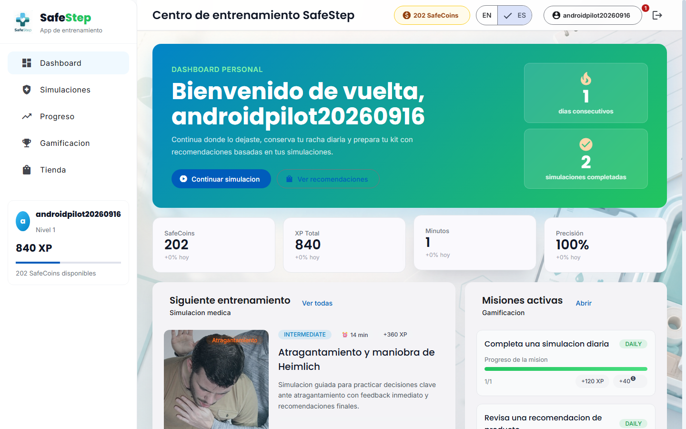

*Figura 5.3. Dashboard web servido localmente en Chrome, con API y PostgreSQL locales; cuenta ficticia y un intento de prueba.*

<a id="toc-5-2-4-acuerdo-de-servicio-saas"></a>
## 5.2.4. Acuerdo de Servicio - SaaS

**Borrador para revisión del equipo — no publicar como versión contractual definitiva.** El statement exige derechos, obligaciones y restricciones en una sección pública «Terms and Conditions», clara y accesible. La siguiente redacción establece el alcance del piloto académico; debe completarse con identidad del responsable, contacto y política de tratamiento de datos antes de enlazarla desde la landing y la aplicación. Su revisión debe contemplar la [Ley peruana 29733](https://leyes.congreso.gob.pe/DetLeyNume_1p.aspx?xNorma=6&xNumero=29733) y su [reglamento vigente](https://www.gob.pe/institucion/anpd/normas-legales/6554453-16-2024-jus).

1. **Objeto y alcance.** SafeStep es un piloto académico para practicar decisiones en escenarios simulados de primeros auxilios. Las puntuaciones y recompensas son educativas, no acreditan competencia clínica ni sustituyen formación certificada.
2. **Emergencias reales.** Ante una emergencia, el usuario debe acudir a servicios de emergencia y personal sanitario. SafeStep no ofrece diagnóstico, triaje ni instrucciones médicas individualizadas en tiempo real.
3. **Cuenta y uso aceptable.** El usuario debe proporcionar datos de prueba o información propia autorizada, proteger su contraseña, no acceder a cuentas ajenas, no manipular resultados y no cargar datos sensibles de terceros. El equipo puede suspender uso abusivo del piloto.
4. **Datos y seguridad.** Se informará qué datos de cuenta, intentos y progreso se recogen, con qué finalidad, a quién se comunican, por cuánto tiempo se conservan y cómo solicitar acceso, rectificación o eliminación. Los responsables y el canal de contacto deben figurar con datos reales antes de la publicación; no se incluirán contraseñas o tokens en el informe.
5. **Comercio y pagos.** Durante el piloto, las demostraciones de Stripe deben usar entorno de prueba: las transacciones simuladas no mueven fondos, conforme a la [documentación de Stripe](https://docs.stripe.com/testing?locale=es-ES). No se prometerán ventas, entregas ni reembolsos reales sin un servicio comercial operativo y condiciones adicionales aprobadas.
6. **Disponibilidad, cambios y cierre.** El piloto puede interrumpirse por mantenimiento o fin de curso; no se garantiza disponibilidad continua. Antes de cerrarlo se comunicará el destino de las cuentas y datos según la política aprobada. Las modificaciones sustanciales del acuerdo deben publicarse con fecha y versión.
7. **Accesibilidad y consultas.** Los términos deben poder leerse en inglés y español, desde el footer de landing y web, con texto navegable por teclado. El canal de consultas debe verificarse antes de hacerlo público.

**Campos aún obligatorios antes de publicar:** denominación legal del prestador/responsable, correo de contacto, domicilio o canal institucional aplicable, finalidades y plazo de retención, destinatarios de datos, procedimiento de ejercicio de derechos, fecha de vigencia y responsable de aprobación. Este texto es un borrador de proyecto, no una opinión legal ni una autorización para procesar pagos reales.

<a id="toc-5-2-5-implemented-native-mobile-application-evidence"></a>
## 5.2.5. Implemented Native-Mobile Application Evidence

Se inició un cliente **Android nativo** en el repositorio Git local `safestept-android`, con Kotlin y Jetpack Compose. El código incluye registro e inicio de sesión, lista y detalle de simulaciones, selección de respuestas y envío de un intento, además de consulta de progreso y catálogo. La administración permanece en la aplicación web. El cliente utiliza los contratos REST existentes y mantiene el token de acceso únicamente en memoria; no incluye secretos de producción. La configuración de red permite HTTP sin cifrar **solo en la variante debug** para conectar al emulador con una API local. La variante release exige HTTPS.

| Evidencia Android | Estado y criterio de cierre |
|---|---|
| Código y correspondencia con historias | Código local implementado; asignar IDs de historias Android y PR cuando el equipo incorpore el repositorio al tablero. |
| Pruebas del cálculo de puntuación | **2 pruebas unitarias aprobadas** con `testDebugUnitTest` el 16/09/2026. En Windows se ejecutaron desde una unidad `subst` ASCII debido a la ruta local con caracteres no ASCII. |
| APK debug | `assembleDebug` correcto: artefacto local `safestept-android/app/build/outputs/apk/debug/app-debug.apk`, **12 001 260 bytes**, SHA-256 `BD6D3CCB4DAAEB011675DC19E56BC8D8E83965F57A22FA505F922BA6F9FBFE16`, 16/09/2026. No es una release firmada para distribución. |
| Ejecución en emulador/dispositivo | **1 prueba de interfaz aprobada** en Pixel_7_sem2 (Android 13). Con cuenta ficticia se ejecutó inicio de sesión, listado, detalle, resolución, resultado, progreso y catálogo frente a la API con PostgreSQL locales. Se conservan [inicio](markdown/assets/images/chapter-5/android-login-2026-09-16.png), [listado](markdown/assets/images/chapter-5/android-simulations-2026-09-16.png), [detalle](markdown/assets/images/chapter-5/android-simulation-detail-2026-09-16.png), [resultado](markdown/assets/images/chapter-5/android-result-2026-09-16.png), [progreso](markdown/assets/images/chapter-5/android-progress-2026-09-16.png) y [catálogo](markdown/assets/images/chapter-5/android-catalog-2026-09-16.png). Faltan pruebas de errores y API pública. |
| Publicación del repositorio y release | Pendiente de crear remoto de la organización, revisión por PR y distribución controlada del APK. |

La decisión del equipo es **Android solamente**. Los prototipos iOS del capítulo IV no demuestran una app iOS implementada; esta limitación y su posible impacto en la evaluación deben validarse con el docente. El recorrido Android sí se ejecutó contra PostgreSQL local, pero falta repetirlo contra la versión que se publique.

<div align="center">
  
  <p><i>Figura 5.4. Pantalla inicial de SafeStep Android, compilación debug local del 16/09/2026. La URL <code>10.0.2.2</code> apunta al host del emulador y no demuestra un backend público.</i></p>
</div>

<div align="center">
  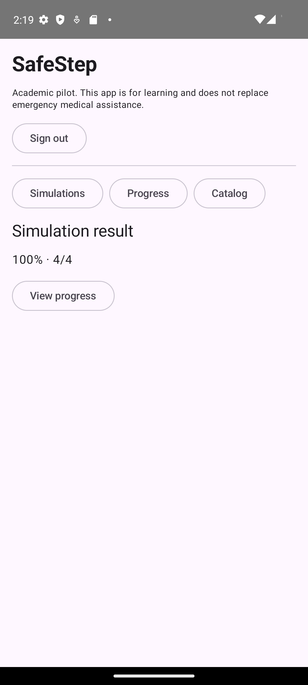
  <p><i>Figura 5.5. Resultado de una simulación ejecutada desde Android con datos de prueba y API local.</i></p>
</div>

<div align="center">
  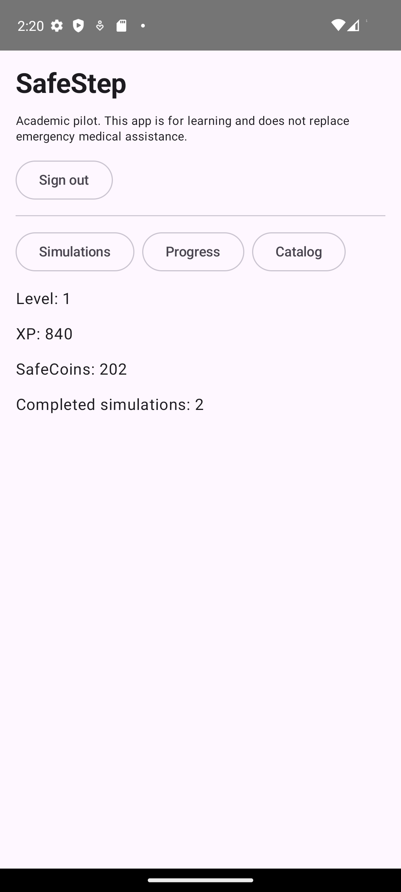
  <p><i>Figura 5.6. Progreso consultado por Android desde la API local; no es una medición con participantes reales.</i></p>
</div>

<a id="toc-5-2-6-implemented-restful-api-and-or-serverless-backend-evidence"></a>
## 5.2.6. Implemented RESTful API and/or Serverless Backend Evidence

El backend actual es una API Spring Boot con persistencia PostgreSQL, recursos IAM, perfiles, simulaciones e intentos, analítica, gamificación y comercio. Los controladores y modelos están en el [repositorio backend](https://github.com/1ASI0732-2620-9090-Grupo-4/safestept-backend). Se ejecutaron **42 pruebas sin fallos** el 16/09/2026. Un smoke test adicional contra PostgreSQL local creó una cuenta ficticia (201), inició sesión con rol `ROLE_USER`, leyó 18 simulaciones y 32 productos, registró un intento (201), recuperó un historial y progreso con una simulación completada, obtuvo OpenAPI (200) y confirmó que el borrado de una simulación con ese usuario devuelve **403**. El script reproducible es `scripts/smoke-api.ps1` del backend. Estos resultados verifican ese entorno local, **no** el despliegue, pagos ni todos los endpoints.

La configuración de producción ahora requiere `DATABASE_USER`, `DATABASE_PASSWORD` y `JWT_SECRET` por variables de entorno; no se documentan valores. El Dockerfile compila con pruebas y usa perfil de producción. Debe verificarse su construcción en el pipeline y la conectividad con una base de datos de prueba antes de publicar. Los secretos que aparecieron antes en archivos versionados deben **rotarse** y retirarse del proveedor; el cambio del archivo actual no borra el historial de Git.

**Limitación de integridad:** el contrato de intentos acepta `score` y `correctSteps` calculados por el cliente. Antes de usar estas métricas como resultado experimental o para recompensas sensibles, el backend debe verificar las respuestas contra la simulación o establecer otro mecanismo de validación; las pruebas actuales no demuestran esa integridad.

| Recorrido a comprobar | Estado y evidencia |
|---|---|
| Alta, inicio, renovación y cierre de sesión | Alta 201 e inicio de sesión comprobados localmente; renovación, cierre y errores 4xx pendientes en este recorrido. |
| Consultar simulación, enviar intento, leer progreso | Consulta y persistencia en PostgreSQL local comprobadas con usuario ficticio; pendiente error de red y validación del puntaje en servidor. |
| Catálogo y pago de prueba | Producto, orden y webhook con credenciales **test**; nunca pagos reales. |
| Administrar contenido | Mutaciones de simulaciones, productos y misiones restringidas a `ROLE_ADMIN` en API; prueba de integración y smoke test confirman 403 para usuario normal. Falta comprobar cada acción de administrador legítimo. |

<a id="toc-5-2-7-restful-api-documentation"></a>
## 5.2.7. RESTful API documentation

La documentación OpenAPI se genera mediante `springdoc`; la ruta esperada en una instancia activa es `/swagger-ui/index.html` y el JSON se obtiene en `/v3/api-docs`. Este JSON devolvió **200 en la instancia local** el 16/09/2026. Antes de colocar enlaces públicos, abrir esas rutas en el despliegue actual y registrar URL, fecha, versión y captura. La matriz siguiente se basa en controladores del código, no en una API publicada comprobada.

| Método y ruta | Entrada principal | Respuesta funcional | Uso / prueba asociada |
|---|---|---|---|
| `POST /api/v1/authentication/sign-up` | Usuario y contraseña | Cuenta creada o error de validación | Registro web/Android; alta pública solo `ROLE_USER`. |
| `POST /api/v1/authentication/sign-in` | Credenciales | Tokens de acceso/renovación y roles | Autenticación y acceso a rutas protegidas. |
| `POST /api/v1/authentication/refresh-token` | Refresh token | Nuevo par de tokens o rechazo | Continuidad de sesión. |
| `POST /api/v1/authentication/logout` | Refresh token | Revocación o rechazo | Cierre de sesión. |
| `GET /api/v1/simulations` | Consulta | Lista de simulaciones | Catálogo de práctica web/Android. |
| `GET /api/v1/simulations/{simulationId}` | ID de simulación | Detalle, pasos y opciones | Inicio de una práctica. |
| `POST /api/v1/simulations/{simulationId}/attempts` | Modo, tiempo, puntuación y errores | Intento registrado o error | Resultado y persistencia. |
| `GET /api/v1/simulations/attempts/me` | Bearer token | Intentos del usuario | Historial personal. |
| `GET /api/v1/analytics/summary/me` | Bearer token | Resumen analítico | Estadísticas web. |
| `GET /api/v1/gamification/summary/me` | Bearer token | Nivel, XP, monedas y racha | Progreso web/Android. |
| `GET /api/v1/commerce/products` | Consulta | Productos | Catálogo web/Android. |
| `POST /api/v1/commerce/orders/{orderId}/payments/stripe-checkout` | Orden autenticada | Sesión de checkout o error | Solo integración de pagos de prueba. |

También existen recursos de administración y perfiles; su lista completa, parámetros, códigos y esquemas deben consultarse en el OpenAPI generado del commit entregado. Antes de la entrega, contrastar la matriz con ese JSON, añadir los enlaces de historias definitivos y una tabla de casos positivos/negativos. No se deben copiar capturas Swagger antiguas como evidencia de la versión nueva.

<a id="toc-5-2-8-team-collaboration-insights"></a>
## 5.2.8. Team Collaboration Insights

Las capturas y métricas del capítulo 5 del informe del curso anterior corresponden al equipo y repositorios de ese curso. Para **cada nuevo sprint**, registrar en la organización actual: integrantes y roles, acta de planificación, pares de revisión, PR enlazados a historias, commits relevantes, comentarios de revisión, decisiones técnicas, bloqueos resueltos y retrospectiva. Adjuntar capturas de las analíticas GitHub con fecha y período, además de una interpretación cualitativa. La cantidad de commits no es una medida suficiente de contribución: una revisión, prueba reproducible, investigación o corrección de seguridad puede no generar muchos commits.

| Sprint actual | Liderazgo y colaboración | PR/commits y analíticas | Reflexión LACX/retrospectiva |
|---|---|---|---|
| 1 | Pendiente de asignación del equipo. | Pendiente de URL y captura del período. | Pendiente de sesión. |
| 2 | Pendiente de asignación del equipo. | Pendiente de URL y captura del período. | Pendiente de sesión. |
| 3 | Pendiente de asignación del equipo. | Pendiente de URL y captura del período. | Pendiente de sesión. |

El capítulo quedará cerrado cuando cada entrega tenga una cadena comprobable `historia → tarea → commit/PR → prueba → captura o URL`. Los defectos, incertidumbres y excepciones de stack deben mantenerse visibles junto con la evidencia positiva.

<br>

<a id="toc-5-3-video-about-the-product"></a>
# 5.3. Video About-the-Product

El video del informe anterior es **antecedente As-Is**; no representa automáticamente la versión actual. Para la entrega de este curso se producirá un video nuevo, en el que el equipo muestre la landing, la aplicación web, Android y la API funcionando sobre una versión identificable. No se insertará un enlace ficticio ni un testimonio reconstruido.

| Tramo del guion | Contenido y evidencia en pantalla | Responsable / estado |
|---|---|---|
| Apertura | Problema, segmentos objetivo y alcance educativo de SafeStep; aclaración de que no reemplaza asistencia médica. | Asignación pendiente. |
| Recorrido landing y web | Navegación, idiomas, registro, simulación, resultado, progreso y catálogo con datos de prueba. | Captura y verificación pendientes. |
| Android nativo | Instalación del APK identificado por versión y commit; inicio de sesión, práctica, resultado, progreso y catálogo en emulador o dispositivo. | Captura pendiente. |
| Integración y calidad | API/OpenAPI, persistencia, pruebas automatizadas y una recuperación controlada ante error. No mostrar claves, tokens ni datos personales. | Captura pendiente. |
| Validación | Fragmento positivo **auténtico** de una entrevista de validación, con consentimiento para usar voz/imagen y contexto de la pregunta. Si no existe autorización, realizar una nueva entrevista y solicitarla; no atribuir frases inventadas. | Entrevista y permiso pendientes. |
| Cierre | Aprendizajes, límites actuales y siguiente experimento. | Asignación pendiente. |

**Ficha de publicación a completar antes de declarar este apartado terminado:** duración final y minutaje de cada tramo; nombres/roles del equipo; fecha de grabación; commit y versión de web, API y APK; enlace de OneDrive del curso con permisos de lectura verificados; URL de YouTube; captura de la inserción funcional del video en la landing; referencia y autorización del testimonio. Comprobar subtítulos, legibilidad en móvil y que todos los enlaces abran sin credenciales del equipo.

El video previo y su captura pueden citarse únicamente como línea base histórica. Hasta que se grabe y verifique la nueva versión, este apartado permanece **pendiente**.

<br>

<div style="page-break-before: always;"></div>

<a id="toc-6-1-testing-suites-validation"></a>
# 6.1. Testing Suites & Validation

Pendiente.


<a id="toc-6-1-1-core-entities-unit-tests"></a>
## 6.1.1. Core Entities Unit Tests

Pendiente.

<a id="toc-6-1-2-core-integration-tests"></a>
## 6.1.2. Core Integration Tests

Pendiente.

<a id="toc-6-1-3-core-behavior-driven-development"></a>
## 6.1.3. Core Behavior-Driven Development

Pendiente.

<a id="toc-6-1-4-core-system-tests"></a>
## 6.1.4. Core System Tests

Pendiente.

<br>

<a id="toc-6-2-static-testing-verification"></a>
# 6.2. Static testing & Verification

Pendiente.

<a id="toc-6-2-1-static-code-analysis"></a>
## 6.2.1. Static Code Analysis

<a id="toc-6-2-1-1-coding-standard-code-conventions"></a>
### 6.2.1.1. Coding standard & Code conventions

Pendiente.

<a id="toc-6-2-1-2-code-quality-code-security"></a>
### 6.2.1.2. Code Quality & Code Security

Pendiente.

<a id="toc-6-2-2-reviews"></a>
## 6.2.2. Reviews

Pendiente.

<br>

<a id="toc-6-3-validation-interviews"></a>
# 6.3. Validation Interviews

Pendiente.


<a id="toc-6-3-1-diseno-de-entrevistas"></a>
## 6.3.1. Diseño de Entrevistas

Pendiente.

<a id="toc-6-3-2-registro-de-entrevistas"></a>
## 6.3.2. Registro de Entrevistas

Pendiente.

<a id="toc-6-3-3-evaluaciones-segun-heuristicas"></a>
## 6.3.3. Evaluaciones según heurísticas

Pendiente.

<br>

<a id="toc-6-4-auditoria-de-experiencias-de-usuario"></a>
# 6.4. Auditoría de Experiencias de Usuario

Pendiente.

<a id="toc-6-4-1-auditoria-realizada"></a>
## 6.4.1. Auditoría realizada

<a id="toc-6-4-1-1-informacion-del-grupo-auditado"></a>
### 6.4.1.1. Información del grupo auditado

Pendiente.

<a id="toc-6-4-1-2-cronograma-de-auditoria-realizada"></a>
### 6.4.1.2. Cronograma de auditoría realizada

Pendiente.

<a id="toc-6-4-1-3-contenido-de-auditoria-realizada"></a>
### 6.4.1.3. Contenido de auditoría realizada

Pendiente.

<a id="toc-6-4-2-auditoria-recibida"></a>
## 6.4.2. Auditoría recibida

<a id="toc-6-4-2-1-informacion-del-grupo-auditor"></a>
### 6.4.2.1. Información del grupo auditor

Pendiente.

<a id="toc-6-4-2-2-cronograma-de-auditoria-recibida"></a>
### 6.4.2.2. Cronograma de auditoría recibida

Pendiente.

<a id="toc-6-4-2-3-contenido-de-auditoria-recibida"></a>
### 6.4.2.3. Contenido de auditoría recibida

Pendiente.

<a id="toc-6-4-2-4-resumen-de-modificaciones-para-subsanar-hallazgos"></a>
### 6.4.2.4. Resumen de modificaciones para subsanar hallazgos

Pendiente.

<br>

<div style="page-break-before: always;"></div>

<a id="toc-7-1-continuous-integration"></a>
# 7.1. Continuous Integration

Pendiente.

<a id="toc-7-1-1-tools-and-practices"></a>
## 7.1.1. Tools and Practices

Pendiente.

<a id="toc-7-1-2-build-test-suite-pipeline-components"></a>
## 7.1.2. Build & Test Suite Pipeline Components

Pendiente.

<br>

<a id="toc-7-2-continuous-delivery"></a>
# 7.2. Continuous Delivery

Pendiente.


<a id="toc-7-2-1-tools-and-practices"></a>
## 7.2.1. Tools and Practices

Pendiente.

<a id="toc-7-2-2-stages-deployment-pipeline-components"></a>
## 7.2.2. Stages Deployment Pipeline Components

Pendiente.

<br>

<a id="toc-7-3-continuous-deployment"></a>
# 7.3. Continuous deployment

Pendiente.


<a id="toc-7-3-1-tools-and-practices"></a>
## 7.3.1. Tools and Practices

Pendiente.

<a id="toc-7-3-2-production-deployment-pipeline-components"></a>
## 7.3.2. Production Deployment Pipeline Components

Pendiente.

<br>

<a id="toc-7-4-continuous-monitoring"></a>
# 7.4. Continuous Monitoring

Pendiente.


<a id="toc-7-4-1-tools-and-practices"></a>
## 7.4.1. Tools and Practices

Pendiente.

<a id="toc-7-4-2-monitoring-pipeline-components"></a>
## 7.4.2. Monitoring Pipeline Components

Pendiente.

<a id="toc-7-4-3-alerting-pipeline-components"></a>
## 7.4.3. Alerting Pipeline Components

Pendiente.

<a id="toc-7-4-4-notification-pipeline-components"></a>
## 7.4.4. Notification Pipeline Components

Pendiente.

<br>

<div style="page-break-before: always;"></div>

<a id="toc-8-1-experiment-planning"></a>
# 8.1. Experiment Planning

Pendiente.


<a id="toc-8-1-1-as-is-summary"></a>
## 8.1.1. As-Is Summary

Pendiente.

<a id="toc-8-1-2-raw-material-assumptions-knowledge-gaps-ideas-claims"></a>
## 8.1.2. Raw Material: Assumptions, Knowledge Gaps, Ideas, Claims

Pendiente.

<a id="toc-8-1-3-experiment-ready-questions"></a>
## 8.1.3. Experiment-Ready Questions

Pendiente.

<a id="toc-8-1-4-question-backlog"></a>
## 8.1.4. Question Backlog

Pendiente.

<a id="toc-8-1-5-experiment-cards"></a>
## 8.1.5. Experiment Cards

Pendiente.

<br>

<a id="toc-8-2-experiment-design"></a>
# 8.2. Experiment Design

Pendiente.


<a id="toc-8-2-1-hypotheses"></a>
## 8.2.1. Hypotheses

Pendiente.

<a id="toc-8-2-2-domain-business-metrics"></a>
## 8.2.2. Domain Business Metrics

Pendiente.

<a id="toc-8-2-3-measures"></a>
## 8.2.3. Measures

Pendiente.

<a id="toc-8-2-4-conditions"></a>
## 8.2.4. Conditions

Pendiente.

<a id="toc-8-2-5-scale-calculations-and-decisions"></a>
## 8.2.5. Scale Calculations and Decisions

Pendiente.

<a id="toc-8-2-6-methods-selection"></a>
## 8.2.6. Methods Selection

Pendiente.

<a id="toc-8-2-7-data-analytics-goals-kpis-and-metrics-selection"></a>
## 8.2.7. Data Analytics: Goals, KPIs and Metrics Selection

Pendiente.

<a id="toc-8-2-8-web-and-mobile-tracking-plan"></a>
## 8.2.8. Web and Mobile Tracking Plan

Pendiente.

<br>

<a id="toc-8-3-experimentation"></a>
# 8.3. Experimentation

Pendiente.


<a id="toc-8-3-1-to-be-user-stories"></a>
## 8.3.1. To-Be User Stories

Pendiente.

<a id="toc-8-3-2-to-be-product-backlog"></a>
## 8.3.2. To-Be Product Backlog

Pendiente.

<a id="toc-8-3-3-pipeline-supported-experiment-driven-to-be-software-platform-lifecycle"></a>
## 8.3.3. Pipeline-supported, Experiment-Driven To-Be Software Platform Lifecycle

<a id="toc-8-3-3-1-to-be-sprint-backlogs"></a>
### 8.3.3.1. To-Be Sprint Backlogs

Pendiente.

<a id="toc-8-3-3-2-implemented-to-be-landing-page-evidence"></a>
### 8.3.3.2. Implemented To-Be Landing Page Evidence

Pendiente.

<a id="toc-8-3-3-3-implemented-to-be-frontend-web-application-evidence"></a>
### 8.3.3.3. Implemented To-Be Frontend-Web Application Evidence

Pendiente.

<a id="toc-8-3-3-4-implemented-to-be-native-mobile-application-evidence"></a>
### 8.3.3.4. Implemented To-Be Native-Mobile Application Evidence

Pendiente.

<a id="toc-8-3-3-5-implemented-to-be-restful-api-and-or-serverless-backend-evidence"></a>
### 8.3.3.5. Implemented To-Be RESTful API and/or Serverless Backend Evidence

Pendiente.

<a id="toc-8-3-3-6-team-collaboration-insights"></a>
### 8.3.3.6. Team Collaboration Insights

Pendiente.

<a id="toc-matriz-de-evaluacion-etica-y-de-impacto"></a>
## Matriz de Evaluación Ética y de Impacto

Pendiente.

<a id="toc-8-3-4-to-be-validation-interviews"></a>
## 8.3.4. To-Be Validation Interviews

<a id="toc-8-3-4-1-diseno-de-entrevistas"></a>
### 8.3.4.1. Diseño de Entrevistas

Pendiente.

<a id="toc-8-3-4-2-registro-de-entrevistas"></a>
### 8.3.4.2. Registro de Entrevistas

Pendiente.

<br>

<a id="toc-8-4-experiment-aftermath-analysis"></a>
# 8.4. Experiment Aftermath & Analysis

Pendiente.


<a id="toc-8-4-1-analysis-and-interpretation-of-results"></a>
## 8.4.1. Analysis and Interpretation of Results

Pendiente.

<a id="toc-8-4-2-re-scored-and-re-prioritized-question-backlog"></a>
## 8.4.2. Re-scored and Re-prioritized Question Backlog

Pendiente.

<br>

<a id="toc-8-5-continuous-learning"></a>
# 8.5. Continuous Learning

Pendiente.


<a id="toc-8-5-1-shareback-session-artifacts-learning-workflow"></a>
## 8.5.1. Shareback Session Artifacts: Learning Workflow

Pendiente.

<br>

<a id="toc-8-6-to-be-software-platform-pre-launch"></a>
# 8.6. To-Be Software Platform Pre-launch

Pendiente.


<a id="toc-8-6-1-about-the-product-intro-video"></a>
## 8.6.1. About-the-Product Intro Video

Pendiente.

<a id="toc-8-6-2-resumen-usando-gees-framework"></a>
## 8.6.2. Resumen usando Gees Framework

Pendiente.

<br>

<div style="page-break-before: always;"></div>

<a id="toc-conclusiones"></a>
# Conclusiones

<a id="toc-conclusiones-y-recomendaciones"></a>
## Conclusiones y recomendaciones

<a id="toc-conclusiones-1"></a>
### Conclusiones

El desarrollo de SafeStep permitio validar la necesidad de una solucion digital orientada al aprendizaje practico de primeros auxilios. A partir del analisis del problema, las entrevistas, las validaciones y la implementacion progresiva del producto, se confirmo que muchos usuarios reconocen la importancia de saber actuar ante emergencias, pero no siempre cuentan con una forma accesible, guiada y constante para practicar. SafeStep responde a esa necesidad mediante una aplicacion web que integra simulaciones medicas, retroalimentacion, progreso, gamificacion y una tienda de productos de emergencia.

Durante el Sprint 1 se establecieron las bases del proyecto, incluyendo la definicion del problema, los segmentos objetivo, el perfil de la startup, la propuesta de valor, el Lean UX Process, el Product Backlog y la primera version de la Landing Page. Este avance fue importante porque permitio comunicar el valor inicial de SafeStep y presentar una primera aproximacion visual del producto a los usuarios.

Durante el Sprint 2 se construyo el frontend de la Web Application con Angular, organizado por bounded contexts y siguiendo patrones similares al proyecto Learning Center utilizado como referencia academica. En esta etapa se implementaron vistas como dashboard, simulaciones, detalle de simulacion, progreso, gamificacion, tienda, carrito y perfil. Inicialmente se utilizaron datos simulados para validar la experiencia de usuario y la navegacion interna antes de conectar la aplicacion con servicios backend reales.

Durante el Sprint 3 se implemento el backend de SafeStep con Spring Boot, Java, PostgreSQL, Maven y Swagger/OpenAPI. Este avance permitio reemplazar progresivamente la dependencia de datos ficticios por servicios REST reales, organizados por bounded contexts como commerce, simulation, gamification, analytics, IAM y profiles. Tambien se conecto el frontend con el backend y se actualizo la Landing Page para mostrar imagenes del producto y material audiovisual relacionado con la propuesta.

Durante el Sprint 4 se fortalecio el producto con la implementacion de IAM y pagos con Stripe tanto en frontend como en backend. La autenticacion con JWT, las rutas protegidas, el manejo de perfil de usuario, la integracion con Stripe Checkout y la persistencia en PostgreSQL desplegado en Render hicieron que SafeStep pasara de ser una simulacion academica a una aplicacion web mas cercana a un entorno real. Este sprint tambien permitio validar flujos criticos como registro, inicio de sesion, compra de productos, confirmacion de pago y despliegue publico.

Las entrevistas de validacion y la evaluacion heuristica evidenciaron que SafeStep es percibido como un producto claro, util y coherente con su objetivo. Los usuarios comprendieron la propuesta de valor desde la Landing Page, identificaron las secciones principales de la aplicacion y valoraron especialmente las simulaciones medicas, la retroalimentacion posterior a cada respuesta, el seguimiento del progreso y la relacion entre aprendizaje y productos de emergencia. No se identificaron problemas criticos de severidad alta en la experiencia evaluada.

En relacion con el trabajo colaborativo, el equipo logro distribuir responsabilidades entre los cuatro integrantes activos: Jorge, Mathias, Josep y Angel. Cada integrante participo en actividades de documentacion, frontend, backend, despliegue, validacion y presentacion del producto. Esta organizacion permitio avanzar de manera incremental y mantener trazabilidad entre las historias de usuario, los sprints, los commits, las evidencias y los entregables finales.

**Contraste con Lean UX y validaciones:**

El Problem Statement inicial planteaba que la preparacion en primeros auxilios suele ser fragmentada, teorica y poco accesible para usuarios que necesitan practicar de forma sencilla antes de enfrentar una emergencia real. Las validaciones realizadas confirmaron que este problema sigue siendo relevante, ya que los participantes entendieron rapidamente el valor de una plataforma que les permita aprender, practicar y recibir recomendaciones relacionadas con situaciones de emergencia.

Las assumptions del proyecto se centraban en que los usuarios valorarian una experiencia interactiva, accesible desde la web, con simulaciones, progreso, recompensas y productos de apoyo. Las entrevistas mostraron que estas suposiciones fueron razonables: los usuarios destacaron las simulaciones como una funcionalidad util, consideraron positivo el uso de misiones e insignias como motivacion y percibieron la tienda como un complemento coherente con el aprendizaje de primeros auxilios.

Las Hypotheses Statements relacionadas con el uso de simulaciones y retroalimentacion fueron validadas de manera cualitativa. Los usuarios indicaron que las preguntas, opciones y respuestas posteriores ayudaban a comprender mejor que hacer en una emergencia. Sin embargo, algunos criterios de exito cuantitativos, como reduccion de errores, retencion a largo plazo o aumento medible de confianza, todavia requieren pruebas con uso continuo de la plataforma y analiticas reales.

La hipotesis relacionada con la tienda de productos de emergencia tambien fue parcialmente validada. Los usuarios entendieron que los productos y kits se relacionan con el objetivo de SafeStep, pero la evaluacion heuristica mostro una oportunidad de mejora: explicar con mayor claridad por que un producto especifico se recomienda despues de una simulacion o escenario. Esto permitiria reforzar la conexion entre aprendizaje, preparacion y compra.

Los criterios de exito definidos en Lean UX se cumplieron principalmente en terminos de comprension, utilidad percibida y aceptacion inicial del producto. No obstante, quedan pendientes criterios que dependen de una medicion posterior, como conversion de usuarios, compras reales, frecuencia de uso, finalizacion de simulaciones, reduccion de errores y adopcion por instructores o instituciones. Por ello, SafeStep debe continuar validandose con usuarios reales en ciclos de uso mas largos.

En sintesis, el contraste entre Lean UX y los resultados obtenidos muestra que SafeStep responde a un problema real y que su propuesta fue entendida por los segmentos evaluados. La validacion no cierra el proceso, sino que orienta los siguientes pasos: profundizar los escenarios, reforzar la confianza con fuentes medicas, mejorar la explicacion de la gamificacion y conectar mejor las recomendaciones de productos con las simulaciones.

<a id="toc-recomendaciones"></a>
### Recomendaciones

**Corto plazo:** Se recomienda mejorar la explicacion de las recompensas, SafeCoins, insignias y misiones dentro de la aplicacion. Aunque los usuarios valoraron la gamificacion, algunos elementos pueden comunicarse mejor para que el usuario entienda como avanzar, que obtiene y por que eso aporta a su aprendizaje.

**Corto plazo:** Se recomienda reforzar la confianza del producto agregando referencias visibles a fuentes medicas, criterios de seguridad o validacion por especialistas. SafeStep trata un tema sensible, por lo que la confianza es un factor clave para que los usuarios adopten la plataforma.

**Corto plazo:** Se recomienda hacer mas explicita la relacion entre simulaciones y productos recomendados. Despues de completar un escenario, la aplicacion podria mostrar productos utiles para ese caso especifico y explicar brevemente para que sirven.

**Mediano plazo:** Se recomienda ampliar las simulaciones con niveles de dificultad, mayor cantidad de pasos y escenarios mas detallados. Esto permitiria atender tanto a usuarios principiantes como a brigadistas o personas con experiencia previa en primeros auxilios.

**Mediano plazo:** Se recomienda fortalecer las pruebas del frontend y backend, incluyendo flujos de autenticacion, pagos con Stripe, persistencia de compras, endpoints protegidos, manejo de errores y validacion de formularios. Esto ayudara a sostener la estabilidad del producto a medida que crezca.

**Mediano plazo:** Se recomienda realizar nuevas validaciones con usuarios utilizando la aplicacion desplegada durante mas tiempo. Esto permitiria medir indicadores reales como retencion, finalizacion de simulaciones, errores frecuentes, confianza percibida antes y despues del entrenamiento, y conversion en la tienda.

**Futuro roadmap:** Se recomienda considerar funcionalidades como certificados, panel para instructores, modo offline o de bajo consumo de datos, reportes avanzados de progreso, administracion por roles y alianzas con especialistas o instituciones de primeros auxilios. Estas mejoras permitirian que SafeStep evolucione de una aplicacion de aprendizaje individual hacia una plataforma de capacitacion mas completa.

---

<a id="toc-video-app-validation"></a>
## Video App Validation

**Pendiente.** Falta grabar y publicar el video de validación de la aplicación con usuarios del curso actual; no se insertará un enlace ficticio ni contenido del curso anterior.

---

<a id="toc-video-about-the-team"></a>
## Video About The Team

El video About The Team presenta la participacion de los cuatro integrantes activos del equipo Chronos durante el desarrollo de SafeStep. En el video se explica como se organizo el trabajo, que responsabilidades asumio cada integrante y como el equipo logro construir la Landing Page, la Web Application, el backend, la integracion con IAM, el sistema de pagos con Stripe y la documentacion del proyecto.

**Datos del video:**

| Elemento | Informacion |
| -------- | ----------- |
| Titulo | Video About The Team - SafeStep |
| Duracion | 10:07 minutos |
| Participantes | Jorge, Mathias, Josep y Angel |
| Publico objetivo | Docente del curso, usuarios interesados en SafeStep y visitantes de la Landing Page |
| URL publicado en YouTube | <a href="https://www.youtube.com/watch?v=jmA1L_1_8bk">https://www.youtube.com/watch?v=jmA1L_1_8bk</a> |
| URL publicado en Microsoft Stream | <a href="https://upcedupe-my.sharepoint.com/:v:/g/personal/u20241c030_upc_edu_pe/IQA4urSyPkX-QLZVQSOsKYhzAax2ZRFU7R0_nyz0d4gm7Tk?nav=eyJyZWZlcnJhbEluZm8iOnsicmVmZXJyYWxBcHAiOiJPbmVEcml2ZUZvckJ1c2luZXNzIiwicmVmZXJyYWxBcHBQbGF0Zm9ybSI6IldlYiIsInJlZmVycmFsTW9kZSI6InZpZXciLCJyZWZlcnJhbFZpZXciOiJNeUZpbGVzTGlua0NvcHkifX0&e=7O4QqF">https://upcedupe-my.sharepoint.com/:v:/g/personal/u20241c030_upc_edu_pe/</a> |
| Uso en Landing Page | El video se utiliza como evidencia publica del trabajo colaborativo del equipo y del proceso de desarrollo del producto. |


<div align="center">
    
    <p><i><b>Fuente</b>: Elaboracion propia.</i></p>
</div>

**Pauta de secuencias del video:**

| Seccion | Timing de inicio | Contenido |
| ------- | ---------------- | --------- |
| Introduccion del equipo y presentacion de SafeStep | 00:00 | Presentacion general del equipo Chronos, del objetivo del proyecto y del problema que busca resolver SafeStep. |
| Organizacion del trabajo y roles del equipo | 01:20 | Explicacion de la distribucion de responsabilidades entre Jorge, Mathias, Josep y Angel durante los sprints del proyecto. |
| Landing Page y comunicacion del producto | 03:00 | Resumen del trabajo realizado en la Landing Page, propuesta de valor, secciones visuales, llamados a la accion y videos publicados. |
| Web Application y experiencia principal | 04:40 | Presentacion del frontend, dashboard, simulaciones, gamificacion, progreso, tienda y flujo general de usuario. |
| Backend, IAM, Stripe y despliegue | 06:30 | Explicacion de la API REST, Swagger, PostgreSQL en Render, autenticacion con JWT, perfiles de usuario y sistema de pagos con Stripe. |
| Aprendizajes, colaboracion y cierre | 08:30 | Reflexion final sobre el trabajo colaborativo, los aprendizajes del equipo, el Student Outcome y el valor de SafeStep como producto digital. |

El contenido del video complementa la seccion Student Outcome porque evidencia la comunicacion oral del equipo, la coordinacion interna y la capacidad de presentar resultados tecnicos y funcionales de manera comprensible. Ademas, funciona como soporte publico para mostrar el proceso de construccion de SafeStep y el aporte de cada integrante durante el trabajo final.

<br>

<div style="page-break-before: always;"></div>

<a id="toc-bibliografia"></a>
# Bibliografía

American Red Cross. (s. f.). *Mobile apps & voice-enabled skills: First Aid App*. Consultado el 16 de septiembre de 2026. <https://www.redcross.org/get-help/how-to-prepare-for-emergencies/mobile-apps.html>

British Red Cross. (s. f.). *Free first aid apps*. Consultado el 16 de septiembre de 2026. <https://www.redcross.org.uk/first-aid/first-aid-apps>

Caicedo Vega, J. L., & Zumbado Fernández, H. M. (2023). *Conocimiento sobre primeros auxilios en docentes de educación básica de la ciudad de Portoviejo, Ecuador*. Revista Eugenio Espejo, 17(2), 22-32. <a href="https://www.redalyc.org/journal/5728/572874846004/html/">https://www.redalyc.org/journal/5728/572874846004/html/</a> 

Chuman Ramos, G. S., & Ramírez Mayorca, S. M. (2024). *Efectividad de una intervención educativa en el conocimiento sobre primeros auxilios en estudiantes de una institución educativa de Lima, 2023*. Tesis de Licenciatura. Fac. Enfermería , Univ. UPCH. [En línea]. <a href="https://repositorio.upch.edu.pe/bitstream/handle/20.500.12866/16365/Efectividad_ChumanRamos_Gemma.pdf?sequence=1">https://repositorio.upch.edu.pe/bitstream/handle/20.500.12866/16365/Efectividad_ChumanRamos_Gemma.pdf?sequence=1</a> 

Cruz Roja Peruana. (s. f.). *Escuela Nacional*. Consultado el 16 de septiembre de 2026. <https://cruzroja.org.pe/escuela_nacional.html>

Do Thi, N., Hoang Thi, G., Lee, Y., Pham Minh, K., Nguyen Thanh, H., Shin, J.-S., & Luong Xuan, T. (2024). First-aid training for primary Healthcare providers on a remote Island: a mixed-methods study. *BMC Medical Education, 24*, Artículo 790. <a href="https://doi.org/10.1186/s12909-024-05768-6">https://doi.org/10.1186/s12909-024-05768-6</a>

Federación Internacional de Sociedades de la Cruz Roja y de la Media Luna Roja. (s. f.). *First Aid – IFRC* [Aplicación móvil]. Google Play. Consultado el 16 de septiembre de 2026. <https://play.google.com/store/apps/details?id=com.cube.gdpc.fa>

Federación Internacional de Sociedades de la Cruz Roja y de la Media Luna Roja. (2025). *First aid*. Recuperado de <a href="https://www.ifrc.org/our-work/health-and-care/first-aid">https://www.ifrc.org/our-work/health-and-care/first-aid</a>

García-Blaya, J. Á., Abraldes, J. A., & Vaquero-Cristóbal, R. (2025). Assessment of First Aid Knowledge at Different Stages of Education. *Healthcare*, 13(13), Artículo 1507. <a href="https://doi.org/10.3390/healthcare13131507">https://doi.org/10.3390/healthcare13131507</a>

Gobierno Regional de La Libertad. (2017, 5 de septiembre). *Charla de primeros auxilios para casos de accidentes en la comunidad y hogar*. gob.pe. <a href="https://www.gob.pe/institucion/regionlalibertad/noticias/105724-charla-de-primeros-auxilios-para-casos-de-accidentes-en-la-comunidad-y-hogar">https://www.gob.pe/institucion/regionlalibertad/noticias/105724-charla-de-primeros-auxilios-para-casos-de-accidentes-en-la-comunidad-y-hogar</a> 

Lozano Villegas, C. (2024). *Factores asociados al nivel de conocimiento en primeros auxilios en estudiantes de la Universidad Ricardo Palma durante el 2022*. Universidad Ricardo Palma - URP. Disponible en: <a href="https://hdl.handle.net/20.500.14138/7399">https://hdl.handle.net/20.500.14138/7399</a> 

Ministerio de Salud del Perú. (2025, 20 de febrero). *Exigente formación de los brigadistas de primera respuesta en salud del Minsa garantiza atenciones de calidad ante los desastres*. gob.pe. <a href="https://www.gob.pe/institucion/minsa/noticias/1113583-exigente-formacion-de-los-brigadistas-de-primera-respuesta-en-salud-del-minsa-garantiza-atenciones-de-calidad-ante-los-desastres">https://www.gob.pe/institucion/minsa/noticias/1113583-exigente-formacion-de-los-brigadistas-de-primera-respuesta-en-salud-del-minsa-garantiza-atenciones-de-calidad-ante-los-desastres</a> 

Poder Judicial del Perú. (2019). *Preparación de brigadas de emergencia*. <a href="https://www.pj.gob.pe/wps/wcm/connect/9f79da0048ab19bf9fc0ff53388de097/PREPARACION%2BBRIGADAS%2BEMERGENCIA%2B-%2B31%2BENERO%2B2019.pdf?CACHEID=9f79da0048ab19bf9fc0ff53388de097&MOD=AJPERES">https://www.pj.gob.pe/wps/wcm/connect/9f79da0048ab19bf9fc0ff53388de097/PREPARACION%2BBRIGADAS%2BEMERGENCIA%2B-%2B31%2BENERO%2B2019.pdf?CACHEID=9f79da0048ab19bf9fc0ff53388de097&MOD=AJPERES</a> 

Ramírez-Torres, C. A., Andrade-Gómez, E., Lozano-Ochoa, C., Caparrós-Civera, M. N., & Sapiña-Beltrán, E. (2023). Nursing students bringing first aid to the community. *Frontiers in Education*, 8, Artículo 1288508. <a href="https://doi.org/10.3389/feduc.2023.1288508">https://doi.org/10.3389/feduc.2023.1288508</a>

Rodríguez-García, A., Ruiz-García, G., Navarro-Patón, R., & Mecías-Calvo, M. (2024). Attitudes and Skills in Basic Life Support after Two Types of Training: Traditional vs. Gamification, of Compulsory Secondary Education Students: A Simulation Study. *Pediatric Reports*, 16(3), 631–643. <a href="https://doi.org/10.3390/pediatric16030053">https://doi.org/10.3390/pediatric16030053</a>

White, L. (2024). First Aid Training and CPR Skills Retention (Informe de investigación). *CSA Group*. <a href="https://www.csagroup.org/wp-content/uploads/CSA-Group-Research-First-Aid-Training-and-CPR-Skill-Retention.pdf">https://www.csagroup.org/wp-content/uploads/CSA-Group-Research-First-Aid-Training-and-CPR-Skill-Retention.pdf</a>

<br>

<div style="page-break-before: always;"></div>

<a id="toc-anexos"></a>
# Anexos

En esta seccion se incluyen materiales complementarios del proyecto SafeStep, tales como videos, reportes, entrevistas, recursos de diseno, repositorios, despliegues y herramientas utilizadas. Cada anexo inicia en una nueva pagina y organiza evidencias que, por su extension o importancia, complementan el contenido principal del informe.

<div style="page-break-before: always;"></div>

<a id="toc-anexo-a-videos-de-exposiciones"></a>
## Anexo A. Videos de exposiciones

Este anexo reune de forma progresiva los videos de exposicion correspondientes a las entregas del proyecto. La relacion de titulos y enlaces se ira expandiendo conforme se publiquen nuevas evidencias audiovisuales.


- Video About-the-Product - SafeStep: <a href="https://youtu.be/-RuGA9r1EsM" style="word-break: break-all; overflow-wrap: anywhere;">https://youtu.be/-RuGA9r1EsM</a>
- Video About-the-Product - SafeStep Microsoft Stream: <a href="https://upcedupe-my.sharepoint.com/:v:/g/personal/u20241c030_upc_edu_pe/IQDvVbtNWnjaSbps57LyCEffAaNalKhJfT0l982IFtfNBuw?nav=eyJyZWZlcnJhbEluZm8iOnsicmVmZXJyYWxBcHAiOiJPbmVEcml2ZUZvckJ1c2luZXNzIiwicmVmZXJyYWxBcHBQbGF0Zm9ybSI6IldlYiIsInJlZmVycmFsTW9kZSI6InZpZXciLCJyZWZlcnJhbFZpZXciOiJNeUZpbGVzTGlua0NvcHkifX0&e=6okM5V" style="word-break: break-all; overflow-wrap: anywhere;">https://upcedupe-my.sharepoint.com/:v:/g/personal/u20241c030_upc_edu_pe/IQDvVbtNWnjaSbps57LyCEffAaNalKhJfT0l982IFtfNBuw?nav=eyJyZWZlcnJhbEluZm8iOnsicmVmZXJyYWxBcHAiOiJPbmVEcml2ZUZvckJ1c2luZXNzIiwicmVmZXJyYWxBcHBQbGF0Zm9ybSI6IldlYiIsInJlZmVycmFsTW9kZSI6InZpZXciLCJyZWZlcnJhbFZpZXciOiJNeUZpbGVzTGlua0NvcHkifX0&e=6okM5V</a>
- Video About-the-Team - SafeStep: <a href="https://www.youtube.com/watch?v=jmA1L_1_8bk" style="word-break: break-all; overflow-wrap: anywhere;">https://www.youtube.com/watch?v=jmA1L_1_8bk</a>
- Video About-the-Team - SafeStep Microsoft Stream: <a href="https://upcedupe-my.sharepoint.com/:v:/g/personal/u20241c030_upc_edu_pe/IQA4urSyPkX-QLZVQSOsKYhzAax2ZRFU7R0_nyz0d4gm7Tk?nav=eyJyZWZlcnJhbEluZm8iOnsicmVmZXJyYWxBcHAiOiJPbmVEcml2ZUZvckJ1c2luZXNzIiwicmVmZXJyYWxBcHBQbGF0Zm9ybSI6IldlYiIsInJlZmVycmFsTW9kZSI6InZpZXciLCJyZWZlcnJhbFZpZXciOiJNeUZpbGVzTGlua0NvcHkifX0&e=7O4QqF" style="word-break: break-all; overflow-wrap: anywhere;">https://upcedupe-my.sharepoint.com/:v:/g/personal/u20241c030_upc_edu_pe/IQA4urSyPkX-QLZVQSOsKYhzAax2ZRFU7R0_nyz0d4gm7Tk?nav=eyJyZWZlcnJhbEluZm8iOnsicmVmZXJyYWxBcHAiOiJPbmVEcml2ZUZvckJ1c2luZXNzIiwicmVmZXJyYWxBcHBQbGF0Zm9ybSI6IldlYiIsInJlZmVycmFsTW9kZSI6InZpZXciLCJyZWZlcnJhbFZpZXciOiJNeUZpbGVzTGlua0NvcHkifX0&e=7O4QqF</a>

<div style="page-break-before: always;"></div>

<a id="toc-anexo-b-reportes-de-desempeno"></a>
## Anexo B. Reportes de desempeno

Este anexo incluye los reportes de desempeno elaborados para las entregas del proyecto. Estos documentos registran la participacion del equipo, la distribucion de responsabilidades y las evidencias de avance por cada hito.

- Performance Report AV1: <a href="markdown/assets/reports/performance-report-av1.md" style="word-break: break-all; overflow-wrap: anywhere;">markdown/assets/reports/performance-report-av1.md</a>
- Final Report AV1: <a href="markdown/assets/reports/final-report-av1.md" style="word-break: break-all; overflow-wrap: anywhere;">markdown/assets/reports/final-report-av1.md</a>
- Performance Report TB1: <a href="markdown/assets/reports/performance-report-tb1.md" style="word-break: break-all; overflow-wrap: anywhere;">markdown/assets/reports/performance-report-tb1.md</a>
- Performance Report AV2: <a href="markdown/assets/reports/performance-report-av2.md" style="word-break: break-all; overflow-wrap: anywhere;">markdown/assets/reports/performance-report-av2.md</a>
- Performance Report TB2: <a href="markdown/assets/reports/performance-report-tb2.md" style="word-break: break-all; overflow-wrap: anywhere;">markdown/assets/reports/performance-report-tb2.md</a>

<div style="page-break-before: always;"></div>

<a id="toc-anexo-c-videos-de-entrevistas"></a>
## Anexo C. Videos de entrevistas

Este anexo contiene los enlaces a las entrevistas realizadas durante la etapa de needfinding. Estas entrevistas sirvieron como fuente para identificar problemas, necesidades y expectativas de los segmentos objetivo.

- Entrevista 1 - Nataly Aguilar Ortiz: <a href="https://youtu.be/DEq_rtuM_Ng" style="word-break: break-all; overflow-wrap: anywhere;">https://youtu.be/DEq_rtuM_Ng</a>
- Entrevista 2 - Maria Elena Gamboa Azabache: <a href="https://www.youtube.com/watch?v=5td3gHjUBVw" style="word-break: break-all; overflow-wrap: anywhere;">https://www.youtube.com/watch?v=5td3gHjUBVw</a>
- Entrevista 3 - Luciana Celeste Sanchez Silva: <a href="https://youtu.be/N1L3TChMK6w" style="word-break: break-all; overflow-wrap: anywhere;">https://youtu.be/N1L3TChMK6w</a>
- Entrevista 4 - Alessandro Daniel Bravo Castillo: <a href="https://youtu.be/qjcDbt8-Obk" style="word-break: break-all; overflow-wrap: anywhere;">https://youtu.be/qjcDbt8-Obk</a>
- Entrevista 5 - Fabrizio Ernesto Tataje: <a href="https://youtu.be/r7HQDIlXcsA" style="word-break: break-all; overflow-wrap: anywhere;">https://youtu.be/r7HQDIlXcsA</a>
- Entrevista 6 - Rodrigo Nicolas Alfaro Mancilla: <a href="https://youtu.be/tcYkW5-9Oh" style="word-break: break-all; overflow-wrap: anywhere;">https://youtu.be/tcYkW5-9Oh</a>
- Entrevista 7 - Rodrigo Andres Gonzales Portugal: <a href="https://upcedupe-my.sharepoint.com/:v:/g/personal/u20231b781_upc_edu_pe/IQDbFlhEINQvT45Otx80J_hnAbtQ9dRFtdzn2oUHG5tSYJQ?e=AZkgmM&nav=eyJyZWZlcnJhbEluZm8iOnsicmVmZXJyYWxBcHAiOiJTdHJlYW1XZWJBcHAiLCJyZWZlcnJhbFZpZXciOiJTaGFyZURpYWxvZy1MaW5rIiwicmVmZXJyYWxBcHBQbGF0Zm9ybSI6IldlYiIsInJlZmVycmFsTW9kZSI6InZpZXcifX0%3D" style="word-break: break-all; overflow-wrap: anywhere;">https://upcedupe-my.sharepoint.com/:v:/g/personal/u20231b781_upc_edu_pe/IQDbFlhEINQvT45Otx80J_hnAbtQ9dRFtdzn2oUHG5tSYJQ?e=AZkgmM&nav=eyJyZWZlcnJhbEluZm8iOnsicmVmZXJyYWxBcHAiOiJTdHJlYW1XZWJBcHAiLCJyZWZlcnJhbFZpZXciOiJTaGFyZURpYWxvZy1MaW5rIiwicmVmZXJyYWxBcHBQbGF0Zm9ybSI6IldlYiIsInJlZmVycmFsTW9kZSI6InZpZXcifX0%3D</a>
- Entrevista 8 - Gian Marco Chavez Lopez: <a href="https://upcedupe-my.sharepoint.com/:v:/g/personal/u20231b781_upc_edu_pe/IQCciLTZaWZVSo2Byxy3vkGYATEv5m3SAtT56hPzhOW7qjc?e=nUtcma&nav=eyJyZWZlcnJhbEluZm8iOnsicmVmZXJyYWxBcHAiOiJTdHJlYW1XZWJBcHAiLCJyZWZlcnJhbFZpZXciOiJTaGFyZURpYWxvZy1MaW5rIiwicmVmZXJyYWxBcHBQbGF0Zm9ybSI6IldlYiIsInJlZmVycmFsTW9kZSI6InZpZXcifX0%3D" style="word-break: break-all; overflow-wrap: anywhere;">https://upcedupe-my.sharepoint.com/:v:/g/personal/u20231b781_upc_edu_pe/IQCciLTZaWZVSo2Byxy3vkGYATEv5m3SAtT56hPzhOW7qjc?e=nUtcma&nav=eyJyZWZlcnJhbEluZm8iOnsicmVmZXJyYWxBcHAiOiJTdHJlYW1XZWJBcHAiLCJyZWZlcnJhbFZpZXciOiJTaGFyZURpYWxvZy1MaW5rIiwicmVmZXJyYWxBcHBQbGF0Zm9ybSI6IldlYiIsInJlZmVycmFsTW9kZSI6InZpZXcifX0%3D</a>
- Entrevista 9 - Juan Miguel Barrios Casanova: <a href="https://youtu.be/lpGebdtVGkM" style="word-break: break-all; overflow-wrap: anywhere;">https://youtu.be/lpGebdtVGkM</a>
- Entrevista 10 - Diego Alonso Leon Lino: <a href="https://youtu.be/itTG0QX_dkg" style="word-break: break-all; overflow-wrap: anywhere;">https://youtu.be/itTG0QX_dkg</a>

<div style="page-break-before: always;"></div>

<a id="toc-anexo-d-videos-de-entrevistas-de-validacion"></a>
## Anexo D. Videos de entrevistas de validacion

Este anexo contiene los enlaces de las entrevistas de validacion realizadas despues de presentar la landing page y la aplicacion web a los usuarios. Estas sesiones permitieron recoger opiniones sobre claridad, utilidad, confianza, navegacion y valor percibido del producto.

- Entrevista de Validacion 1 - Luciana Celeste Sanchez Silva: <a href="https://upcedupe-my.sharepoint.com/:v:/g/personal/u202315165_upc_edu_pe/IQAyHQ9zYCXpTK-6YH-8ZX6DAaCHFlV8RjsE_FTgyGTXgyg?nav=eyJyZWZlcnJhbEluZm8iOnsicmVmZXJyYWxBcHAiOiJTdHJlYW1XZWJBcHAiLCJyZWZlcnJhbFZpZXciOiJTaGFyZURpYWxvZy1MaW5rIiwicmVmZXJyYWxBcHBQbGF0Zm9ybSI6IldlYiIsInJlZmVycmFsTW9kZSI6InZpZXcifX0%3D&e=XugCte" style="word-break: break-all; overflow-wrap: anywhere;">https://upcedupe-my.sharepoint.com/:v:/g/personal/u202315165_upc_edu_pe/IQAyHQ9zYCXpTK-6YH-8ZX6DAaCHFlV8RjsE_FTgyGTXgyg?nav=eyJyZWZlcnJhbEluZm8iOnsicmVmZXJyYWxBcHAiOiJTdHJlYW1XZWJBcHAiLCJyZWZlcnJhbFZpZXciOiJTaGFyZURpYWxvZy1MaW5rIiwicmVmZXJyYWxBcHBQbGF0Zm9ybSI6IldlYiIsInJlZmVycmFsTW9kZSI6InZpZXcifX0%3D&e=XugCte</a>
- Entrevista de Validacion 2 - Vivian Paredes: <a href="https://upcedupe-my.sharepoint.com/:v:/g/personal/u202315165_upc_edu_pe/IQCL5jTx-skXTo0-TpL3it1kAe_J86duOpp7QmsUrMbwsUg?nav=eyJyZWZlcnJhbEluZm8iOnsicmVmZXJyYWxBcHAiOiJTdHJlYW1XZWJBcHAiLCJyZWZlcnJhbFZpZXciOiJTaGFyZURpYWxvZy1MaW5rIiwicmVmZXJyYWxBcHBQbGF0Zm9ybSI6IldlYiIsInJlZmVycmFsTW9kZSI6InZpZXcifX0%3D&e=BcA9Ee" style="word-break: break-all; overflow-wrap: anywhere;">https://upcedupe-my.sharepoint.com/:v:/g/personal/u202315165_upc_edu_pe/IQCL5jTx-skXTo0-TpL3it1kAe_J86duOpp7QmsUrMbwsUg?nav=eyJyZWZlcnJhbEluZm8iOnsicmVmZXJyYWxBcHAiOiJTdHJlYW1XZWJBcHAiLCJyZWZlcnJhbFZpZXciOiJTaGFyZURpYWxvZy1MaW5rIiwicmVmZXJyYWxBcHBQbGF0Zm9ybSI6IldlYiIsInJlZmVycmFsTW9kZSI6InZpZXcifX0%3D&e=BcA9Ee</a>
- Entrevista de Validacion 3 - Rodrigo Andres Gonzales Portugal: <a href="https://upcedupe-my.sharepoint.com/:v:/g/personal/u20231b781_upc_edu_pe/IQB9y3zKDB4MQ6OIm5edG54IAYUEwJSO7r1IzjdVk2xAfb4?nav=eyJyZWZlcnJhbEluZm8iOnsicmVmZXJyYWxBcHAiOiJTdHJlYW1XZWJBcHAiLCJyZWZlcnJhbFZpZXciOiJTaGFyZURpYWxvZy1MaW5rIiwicmVmZXJyYWxBcHBQbGF0Zm9ybSI6IldlYiIsInJlZmVycmFsTW9kZSI6InZpZXcifX0%3D&e=Wcf3ss" style="word-break: break-all; overflow-wrap: anywhere;">https://upcedupe-my.sharepoint.com/:v:/g/personal/u20231b781_upc_edu_pe/IQB9y3zKDB4MQ6OIm5edG54IAYUEwJSO7r1IzjdVk2xAfb4?nav=eyJyZWZlcnJhbEluZm8iOnsicmVmZXJyYWxBcHAiOiJTdHJlYW1XZWJBcHAiLCJyZWZlcnJhbFZpZXciOiJTaGFyZURpYWxvZy1MaW5rIiwicmVmZXJyYWxBcHBQbGF0Zm9ybSI6IldlYiIsInJlZmVycmFsTW9kZSI6InZpZXcifX0%3D&e=Wcf3ss</a>
- Entrevista de Validacion 4 - Juan Miguel Barrios Casanova: <a href="https://upcedupe-my.sharepoint.com/:v:/g/personal/u20231c524_upc_edu_pe/IQBUW35fykXxQa3Zw5aIlyysAZ9SJmB69--ppxUl8eElCLQ?nav=eyJyZWZlcnJhbEluZm8iOnsicmVmZXJyYWxBcHAiOiJTdHJlYW1XZWJBcHAiLCJyZWZlcnJhbFZpZXciOiJTaGFyZURpYWxvZy1MaW5rIiwicmVmZXJyYWxBcHBQbGF0Zm9ybSI6IldlYiIsInJlZmVycmFsTW9kZSI6InZpZXcifX0%3D&e=VIEHA9" style="word-break: break-all; overflow-wrap: anywhere;">https://upcedupe-my.sharepoint.com/:v:/g/personal/u20231c524_upc_edu_pe/IQBUW35fykXxQa3Zw5aIlyysAZ9SJmB69--ppxUl8eElCLQ?nav=eyJyZWZlcnJhbEluZm8iOnsicmVmZXJyYWxBcHAiOiJTdHJlYW1XZWJBcHAiLCJyZWZlcnJhbFZpZXciOiJTaGFyZURpYWxvZy1MaW5rIiwicmVmZXJyYWxBcHBQbGF0Zm9ybSI6IldlYiIsInJlZmVycmFsTW9kZSI6InZpZXcifX0%3D&e=VIEHA9</a>


<div style="page-break-before: always;"></div>

<a id="toc-anexo-e-materiales-de-ideacion-diseno-y-arquitectura"></a>
## Anexo E. Materiales de ideacion, diseno y arquitectura

Este anexo reune los recursos utilizados para representar la solucion desde el punto de vista de experiencia de usuario, arquitectura de informacion, modelado de dominio, diseno visual y diseno de software.

- Miro - EventStorming y arquitectura de dominio: <a href="https://miro.com/welcomeonboard/LzArU0gzKzhEOTJWejJ1ODdFUit5MTBnZlJaTDhRa3RHRUVVdFI5aUVLQnJtTXZXTXRaUmtHWTViMWRHaVk3cVJNd2VvVTBlUFBLbXg0aHEyRzgrN2xud0lrejllQVpDT1AzczYyS0t6YW1YYkhFVWZoVkUvd2U5NHhMczdmcUV3VHhHVHd5UWtSM1BidUtUYmxycDRnPT0hdjE=?share_link_id=310009534925" style="word-break: break-all; overflow-wrap: anywhere;">https://miro.com/welcomeonboard/LzArU0gzKzhEOTJWejJ1ODdFUit5MTBnZlJaTDhRa3RHRUVVdFI5aUVLQnJtTXZXTXRaUmtHWTViMWRHaVk3cVJNd2VvVTBlUFBLbXg0aHEyRzgrN2xud0lrejllQVpDT1AzczYyS0t6YW1YYkhFVWZoVkUvd2U5NHhMczdmcUV3VHhHVHd5UWtSM1BidUtUYmxycDRnPT0hdjE=?share_link_id=310009534925</a>
- Diagrama de clases del sistema: <a href="https://miro.com/app/board/uXjVH9tP7zk=/?share_link_id=396032164151" style="word-break: break-all; overflow-wrap: anywhere;">https://miro.com/app/board/uXjVH9tP7zk=/?share_link_id=396032164151</a>
- Diagrama de base de datos: <a href="https://miro.com/app/board/uXjVHUFFqvM=/?embedMode=view_only_without_ui&moveToViewport=-2454%2C-663%2C5474%2C2933&embedId=668883533640" style="word-break: break-all; overflow-wrap: anywhere;">https://miro.com/app/board/uXjVHUFFqvM=/?embedMode=view_only_without_ui&moveToViewport=-2454%2C-663%2C5474%2C2933&embedId=668883533640</a>
- Video prototipo desktop: <a href="https://youtu.be/_nZcADweJ3k" style="word-break: break-all; overflow-wrap: anywhere;">https://youtu.be/_nZcADweJ3k</a>
- Video prototipo mobile: <a href="https://youtu.be/cFe5_H0TDsA" style="word-break: break-all; overflow-wrap: anywhere;">https://youtu.be/cFe5_H0TDsA</a>

<div style="page-break-before: always;"></div>

<a id="toc-anexo-f-repositorios-y-despliegues"></a>
## Anexo F. Repositorios y despliegues

Este anexo centraliza los repositorios oficiales del equipo Chronos y los enlaces publicos de despliegue utilizados para validar la solucion SafeStep.

- Organizacion GitHub: <a href="https://github.com/1ASI0732-2620-9090-Grupo-4" style="word-break: break-all; overflow-wrap: anywhere;">https://github.com/1ASI0732-2620-9090-Grupo-4</a>
- Repositorio del reporte: <a href="https://github.com/1ASI0732-2620-9090-Grupo-4/safeStept-report.git" style="word-break: break-all; overflow-wrap: anywhere;">https://github.com/1ASI0732-2620-9090-Grupo-4/safeStept-report.git</a>
- Repositorio de la landing page: <a href="https://github.com/1ASI0732-2620-9090-Grupo-4/safestept-landing-page.git" style="word-break: break-all; overflow-wrap: anywhere;">https://github.com/1ASI0732-2620-9090-Grupo-4/safestept-landing-page.git</a>
- Repositorio del frontend web: <a href="https://github.com/1ASI0732-2620-9090-Grupo-4/safestept-frontend.git" style="word-break: break-all; overflow-wrap: anywhere;">https://github.com/1ASI0732-2620-9090-Grupo-4/safestept-frontend.git</a>
- Repositorio del backend web: <a href="https://github.com/1ASI0732-2620-9090-Grupo-4/safestept-backend.git" style="word-break: break-all; overflow-wrap: anywhere;">https://github.com/1ASI0732-2620-9090-Grupo-4/safestept-backend.git</a>
- Landing page desplegada: <a href="https://upc-1asi0729-2610-11990-chronos-team-3.github.io/safestep-landing-page/" style="word-break: break-all; overflow-wrap: anywhere;">https://upc-1asi0729-2610-11990-chronos-team-3.github.io/safestep-landing-page/</a>
- Frontend web desplegado: <a href="https://upc-1asi0729-2610-11990-chronos-team-3.github.io/safestep-frontend/" style="word-break: break-all; overflow-wrap: anywhere;">https://upc-1asi0729-2610-11990-chronos-team-3.github.io/safestep-frontend/</a>
- Backend desplegado en Render: <a href="https://safestep-backend-fxuw.onrender.com/swagger-ui/index.html" style="word-break: break-all; overflow-wrap: anywhere;">https://safestep-backend-fxuw.onrender.com/swagger-ui/index.html</a>
- Base de datos PostgreSQL en Render: `dpg-d8pj85v7f7vs73d1r4i0-a.oregon-postgres.render.com`
- Product Backlog en Trello: <a href="https://trello.com/b/UHs6EvyH/safestep-team-3" style="word-break: break-all; overflow-wrap: anywhere;">https://trello.com/b/UHs6EvyH/safestep-team-3</a>
- Sprint Backlog 1 en Trello: <a href="https://trello.com/invite/b/6a33714212af251d16ad5375/ATTIc66162c0ecd0e36388869fdbf265255955DE7093/sprint-1-opensource" style="word-break: break-all; overflow-wrap: anywhere;">https://trello.com/invite/b/6a33714212af251d16ad5375/ATTIc66162c0ecd0e36388869fdbf265255955DE7093/sprint-1-opensource</a>
- Sprint Backlog 3 en Trello: <a href="https://trello.com/invite/b/6a3366e7a1ab6de28a2182fc/ATTI70030143a2ae3b808fd71a72133e3950E86F42D3/sprint-3" style="word-break: break-all; overflow-wrap: anywhere;">https://trello.com/invite/b/6a3366e7a1ab6de28a2182fc/ATTI70030143a2ae3b808fd71a72133e3950E86F42D3/sprint-3</a>

<div style="page-break-before: always;"></div>

<a id="toc-anexo-g-herramientas-utilizadas"></a>
## Anexo G. Herramientas utilizadas

Este anexo lista las herramientas principales utilizadas por el equipo durante el analisis, diseno, implementacion, despliegue y documentacion de SafeStep.

- Trello, para gestion de Product Backlog y Sprint Backlogs: <a href="https://trello.com" style="word-break: break-all; overflow-wrap: anywhere;">https://trello.com</a>
- GitHub, para control de versiones y colaboracion: <a href="https://github.com" style="word-break: break-all; overflow-wrap: anywhere;">https://github.com</a>
- GitHub Pages, para despliegue de landing page y frontend: <a href="https://pages.github.com" style="word-break: break-all; overflow-wrap: anywhere;">https://pages.github.com</a>
- Render, para despliegue del backend y base de datos PostgreSQL: <a href="https://render.com" style="word-break: break-all; overflow-wrap: anywhere;">https://render.com</a>
- Angular, para desarrollo del frontend web: <a href="https://angular.dev" style="word-break: break-all; overflow-wrap: anywhere;">https://angular.dev</a>
- Spring Boot, para desarrollo del backend RESTful API: <a href="https://spring.io/projects/spring-boot" style="word-break: break-all; overflow-wrap: anywhere;">https://spring.io/projects/spring-boot</a>
- PostgreSQL, para persistencia de datos: <a href="https://www.postgresql.org" style="word-break: break-all; overflow-wrap: anywhere;">https://www.postgresql.org</a>
- Stripe, para el sistema de pagos: <a href="https://stripe.com" style="word-break: break-all; overflow-wrap: anywhere;">https://stripe.com</a>
- Swagger UI, para documentacion y validacion de endpoints: <a href="https://swagger.io/tools/swagger-ui" style="word-break: break-all; overflow-wrap: anywhere;">https://swagger.io/tools/swagger-ui</a>
- Figma, para wireframes, mock-ups y prototipos: <a href="https://www.figma.com" style="word-break: break-all; overflow-wrap: anywhere;">https://www.figma.com</a>
- Miro, para EventStorming y modelado colaborativo: <a href="https://miro.com" style="word-break: break-all; overflow-wrap: anywhere;">https://miro.com</a>
- Visual Studio Code, para edicion de codigo y documentacion: <a href="https://code.visualstudio.com" style="word-break: break-all; overflow-wrap: anywhere;">https://code.visualstudio.com</a>
- Apache Maven, para gestion y construccion del backend Java: <a href="https://maven.apache.org" style="word-break: break-all; overflow-wrap: anywhere;">https://maven.apache.org</a>

<div style="page-break-before: always;"></div>

<a id="toc-anexo-h-referencias-bibliograficas-con-enlace"></a>
## Anexo H. Referencias bibliograficas con enlace

Este anexo contiene referencias externas utilizadas como apoyo conceptual para el desarrollo del proyecto y la elaboracion del informe.

- Cucumber - Gherkin Reference: <a href="https://cucumber.io/docs/gherkin/" style="word-break: break-all; overflow-wrap: anywhere;">https://cucumber.io/docs/gherkin/</a>
- Google Java Style Guide: <a href="https://google.github.io/styleguide/javaguide.html" style="word-break: break-all; overflow-wrap: anywhere;">https://google.github.io/styleguide/javaguide.html</a>
- Spring Boot Documentation: <a href="https://docs.spring.io/spring-boot/index.html" style="word-break: break-all; overflow-wrap: anywhere;">https://docs.spring.io/spring-boot/index.html</a>
- Angular Documentation: <a href="https://angular.dev/overview" style="word-break: break-all; overflow-wrap: anywhere;">https://angular.dev/overview</a>
- Stripe Documentation: <a href="https://docs.stripe.com" style="word-break: break-all; overflow-wrap: anywhere;">https://docs.stripe.com</a>
- Render Documentation: <a href="https://docs.render.com" style="word-break: break-all; overflow-wrap: anywhere;">https://docs.render.com</a>

</div>
