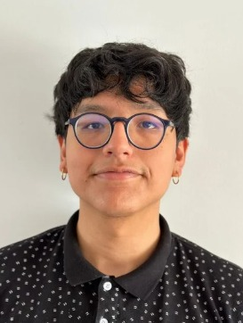
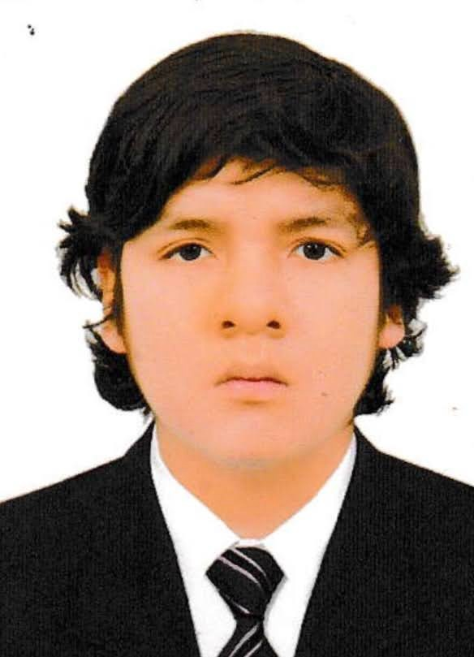
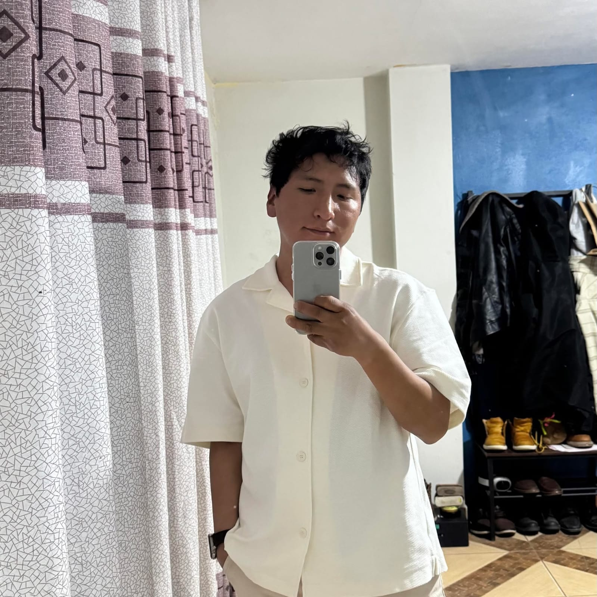

 
 

  

 
 

# 1.1. Startup Profile

## 1.1.1. Descripción de la Startup

**Chronos** es una startup académica de base tecnológica conformada por estudiantes de Ingeniería de Software de la Universidad Peruana de Ciencias Aplicadas. El equipo se orienta al diseño y desarrollo de productos digitales relacionados con la educación preventiva, la preparación ciudadana y el uso responsable de la tecnología en situaciones de emergencia. Su trabajo integra investigación de usuarios, diseño de experiencia, desarrollo de software, pruebas, despliegue y aprendizaje basado en evidencia.

El producto principal de Chronos es **SafeStep**, una plataforma web para el aprendizaje y la práctica guiada de primeros auxilios. SafeStep busca reducir la distancia entre conocer un procedimiento y ser capaz de tomar decisiones ordenadas ante una situación simulada. Para ello, la solución utiliza escenarios interactivos, alternativas de decisión, retroalimentación inmediata, registro del progreso y elementos de gamificación.

La versión actual de SafeStep incluye autenticación de usuarios, catálogo y ejecución de simulaciones, historial de intentos, progreso, insignias, misiones, ranking, SafeCoins, certificados internos y una tienda virtual con productos, carrito, pedidos y pago mediante Stripe Checkout. La plataforma también dispone de una landing page pública para comunicar el problema, la propuesta de valor y las características del producto.

SafeStep es una herramienta educativa complementaria. No sustituye la capacitación práctica impartida por profesionales acreditados, la evaluación médica, los protocolos oficiales ni la comunicación con los servicios de emergencia. El contenido y las recomendaciones del producto deben revisarse periódicamente y mantener trazabilidad hacia fuentes confiables.

### Modelo de Negocio

Chronos plantea para SafeStep un modelo de negocio digital híbrido. La primera fuente potencial de ingresos corresponde a la comercialización de productos e insumos no farmacológicos de primeros auxilios mediante la tienda integrada. La segunda fuente potencial corresponde a servicios digitales de valor agregado, como contenidos avanzados, rutas de aprendizaje y funcionalidades de seguimiento. Esta segunda fuente todavía constituye una hipótesis de negocio y no debe interpretarse como una suscripción implementada ni como una certificación oficial.

La sostenibilidad del modelo dependerá de comprobar, mediante investigación y experimentos, si los usuarios perciben valor en la práctica digital, si las recomendaciones contextuales facilitan decisiones de compra responsables y si existe disposición real de pago. Por ello, las tasas de conversión, recompra, retención y adopción se tratarán como métricas por medir, no como resultados alcanzados.

### Misión

Facilitar el aprendizaje continuo y responsable de primeros auxilios mediante experiencias digitales accesibles, interactivas y basadas en evidencia, ayudando a que estudiantes, familias y brigadistas fortalezcan su preparación ante emergencias cotidianas.

### Visión

Ser una plataforma latinoamericana de referencia en educación preventiva digital, reconocida por la calidad de sus experiencias de aprendizaje, su enfoque inclusivo y el uso ético de datos para mejorar continuamente la preparación de sus usuarios.

## 1.1.2. Perfiles de integrantes del equipo

<table>
  <tr>
    <td width="30%" align="center">
      
    </td>
    <td width="70%">
      <h3>Desarrollador frontend</h3>
      <h4>Palacios Jáuregui, Kalid Jesus U201913639</h4>
      

        Soy estudiante de Ingeniería de Software en la Universidad Peruana de Ciencias Aplicadas (UPC). Tengo conocimientos en Especificación y Análisis de Requerimientos, desarrollo UI/UX y desarrollo Frontend aplicaré lo aprendido para aportar en UX, diseño de interfaces y prototipado dentro del proyecto.
      

    </td>
  </tr>
  <tr>
    <td width="30%" align="center">
      
    </td>
    <td width="70%">
      <h3>Desarrollador backend</h3>
      <h4>Sanchez Arenas, Manuel Angel U201817507</h4>
      

        Soy estudiante de Ingeniería de Software. Tengo conocimientos en Diseño y Patrones de Software, Especificación y Análisis de Requerimientos y desarrollo de Base de Datos.
      

    </td>
  </tr>
  <tr>
    <td width="30%" align="center">
      
    </td>
    <td width="70%">
      <h3>Diseñador UI/UX</h3>
      <h4>Josep Eliu Melgarejo Quiroz u20231516</h4>
      

        Soy estudiante de la carrera de ingenieria de software de la UPC, lidero el diseño UI/UX de SafeStep fusionando la estructura técnica de la ingeniería con una visión centrada en el usuario. Mi labor se enfoca en traducir protocolos médicos de alta complejidad en interfaces intuitivas y accesibles, garantizando que la plataforma sea fácil de usar incluso en situaciones de emergencia.
      

    </td>
  </tr>
  <tr>
    <td width="30%" align="center">
      
    </td>
    <td width="70%">
      <h3>Desarrollador de Base de Datos</h3>
      <h4>Tello Palacios, Fabrizio Rafael U202113310</h4>
      

        Soy estudiante de la carrera de ingenieria de software de la UPC, soy el encargado de diseñar el modelo de base de datos para nuestro proyecto SafeStep aplicando las 3 principales formas de normalizacion. 
      

    </td>
  </tr>

  <tr>
    <td width="30%" align="center">
      
    </td>
    <td width="70%">
      <h3>Desarrollador de Base de Datos</h3>
      <h4>Aylas De La Cruz, Paulo Smit U20181D263</h4>
      

        Soy estudiante de la carrera de ingenieria de software de la UPC, soy el encargado de diseñar el modelo de base de datos para nuestro proyecto SafeStep aplicando las 3 principales formas de normalizacion. 
      

    </td>
  </tr>

</table>

