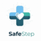
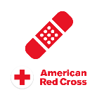
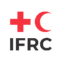

 
 

  

 
 

# 2.1. Competidores

Se comparan tres productos digitales de primeros auxilios con SafeStep. Son **competidores directos por la atención y el tiempo de aprendizaje del usuario**, aunque no necesariamente por su modelo de ingresos. La Escuela Nacional de la Cruz Roja Peruana se considera una alternativa **indirecta** de capacitación formal, no una cuarta aplicación equivalente. El alcance geográfico, el idioma y las características pueden variar por versión; las observaciones corresponden a las fuentes oficiales consultadas el 16/09/2026. No se atribuyen a ningún producto carencias que no puedan verificarse.

Los tres productos digitales del cuadro son First Aid de British Red Cross, First Aid de American Red Cross y First Aid – IFRC. Sus fichas oficiales se enlazan en la cabecera. Como alternativa indirecta adicional se considera la [Escuela Nacional de la Cruz Roja Peruana](https://cruzroja.org.pe/escuela_nacional.html), que ofrece formación en primeros auxilios y RCP, pero no se equipara a una cuarta aplicación.

Estas ofertas no equivalen automáticamente a SafeStep. La comparación se centra en las tareas que una persona podría elegir para aprender, repasar o practicar antes de una emergencia. La capacitación institucional y la práctica presencial siguen siendo complementos necesarios: ninguna simulación digital acredita por sí sola competencia para actuar en una emergencia real.

## 2.1.1. Análisis competitivo

### Competitive Analysis Landscape

<table border="1" cellpadding="6" cellspacing="0" width="100%">
  <tr>
    <th colspan="6" align="left">Competitive Analysis Landscape</th>
  </tr>
  <tr>
    <th colspan="2" align="left">¿Por qué llevar a cabo este análisis?</th>
    <td colspan="4">Identificar cómo aprenden y repasan primeros auxilios los usuarios mediante alternativas digitales, qué valor ofrece cada una y qué posible diferenciación de SafeStep aún debe comprobarse.</td>
  </tr>
  <tr>
    <th colspan="2" align="left">Startup y competidores</th>
    <th align="center"> SafeStep</th>
    <th align="center"> <a href="https://www.redcross.org.uk/first-aid/first-aid-apps">British Red Cross</a></th>
    <th align="center"> <a href="https://www.redcross.org/get-help/how-to-prepare-for-emergencies/mobile-apps.html">American Red Cross</a></th>
    <th align="center"> <a href="https://play.google.com/store/apps/details?id=com.cube.gdpc.fa">IFRC</a></th>
  </tr>
  <tr>
    <th rowspan="2" scope="rowgroup">Perfil</th>
    <th align="left">Overview</th>
    <td>Plataforma web responsiva de práctica simulada de primeros auxilios, progreso y tienda. Producto de la startup Chronos.</td>
    <td>Aplicación de primeros auxilios de la sociedad nacional británica, con guías y recursos para aprender o consultar.</td>
    <td>Aplicación de la sociedad nacional estadounidense, con orientación paso a paso y recursos multimedia.</td>
    <td>Aplicación de la federación internacional con escenarios paso a paso y recursos de aprendizaje multilingües.</td>
  </tr>
  <tr>
    <th align="left">Ventaja competitiva: ¿qué valor ofrece a los clientes?</th>
    <td>Permite ensayar decisiones, revisar errores y repetir escenarios. Que ello genere una ventaja frente a otras apps es una hipótesis pendiente de medición.</td>
    <td>Información gratuita y respaldo institucional, con acceso a contenidos sin conexión.</td>
    <td>Consejos, videos y cuestionarios en una aplicación gratuita, con opción de inglés o español.</td>
    <td>Recursos gratuitos, contenido offline, seguimiento del progreso e insignias.</td>
  </tr>
  <tr>
    <th rowspan="2" scope="rowgroup">Perfil de Marketing</th>
    <th align="left">Mercado objetivo</th>
    <td>Primer ciclo: estudiantes universitarios peruanos mayores de edad. Comunidades vecinales y brigadistas son segmentos secundarios.</td>
    <td>Público que busca aprender o consultar primeros auxilios; oferta desarrollada en el contexto británico.</td>
    <td>Público general que busca orientación básica en primeros auxilios; oferta desarrollada en el contexto estadounidense.</td>
    <td>Público internacional interesado en primeros auxilios y preparación ante emergencias.</td>
  </tr>
  <tr>
    <th align="left">Estrategias de marketing</th>
    <td>Landing page informativa. La captación por alianzas, campañas o planes de pago no está validada en el alcance As-Is.</td>
    <td>Difusión desde el portal y los recursos educativos oficiales de British Red Cross.</td>
    <td>Difusión desde el portal de aplicaciones y los recursos formativos oficiales de American Red Cross.</td>
    <td>Disponibilidad en tiendas de aplicaciones y vinculación con sociedades nacionales de la Cruz Roja y Media Luna Roja.</td>
  </tr>
  <tr>
    <th rowspan="3" scope="rowgroup">Perfil de Producto</th>
    <th align="left">Productos &amp; Servicios</th>
    <td>Simulaciones, intentos, retroalimentación, gamificación, seguimiento, tienda y pedidos. Los certificados son internos.</td>
    <td>Guías paso a paso, videos y cuestionarios; funciona sin internet.</td>
    <td>Guías, videos, cuestionarios, localización de hospitales y acceso a certificaciones de cursos obtenidos por otras vías.</td>
    <td>Escenarios paso a paso, cuestionarios, progreso, insignias, contenido precargado y varios idiomas.</td>
  </tr>
  <tr>
    <th align="left">Precios &amp; Costos</th>
    <td>No existe suscripción premium. La tienda muestra precios de productos; el costo operativo del servicio no se cuantifica aquí.</td>
    <td>Aplicación gratuita; los cursos son una oferta separada.</td>
    <td>Aplicación gratuita; los cursos son una oferta separada.</td>
    <td>Aplicación gratuita.</td>
  </tr>
  <tr>
    <th align="left">Canales de distribución (Web y/o Móvil)</th>
    <td>Web responsiva. No hay aplicación móvil nativa ni funcionamiento offline implementados.</td>
    <td>Aplicación móvil y recursos web de la institución.</td>
    <td>Aplicación móvil y recursos web de la institución.</td>
    <td>Aplicación móvil con contenido precargado.</td>
  </tr>
  <tr>
    <th rowspan="5" scope="rowgroup">Análisis SWOT</th>
    <td colspan="5">Comparación de fortalezas y debilidades internas, y de oportunidades y amenazas del entorno. Las oportunidades y amenazas son inferencias estratégicas; no acreditan superioridad de una oferta. Las fortalezas de SafeStep deben ponerse a prueba para establecer su posible ventaja competitiva.</td>
  </tr>
  <tr>
    <th align="left">Fortalezas</th>
    <td>Simulaciones web con decisiones y retroalimentación; enfoque inicial en usuarios peruanos.</td>
    <td>Respaldo institucional, gratuidad, cuestionarios y acceso offline.</td>
    <td>Respaldo institucional, videos, cuestionarios y opción en español.</td>
    <td>Alcance internacional, varios idiomas, offline, progreso e insignias.</td>
  </tr>
  <tr>
    <th align="left">Debilidades</th>
    <td>Sin app nativa, modo offline ni acreditación profesional; medición experimental pendiente.</td>
    <td>La adecuación de su contenido al segmento peruano de SafeStep no se ha evaluado en este estudio.</td>
    <td>La adecuación de su contenido al segmento peruano de SafeStep no se ha evaluado en este estudio.</td>
    <td>La experiencia específica de estudiantes peruanos no se ha evaluado en este estudio.</td>
  </tr>
  <tr>
    <th align="left">Oportunidades</th>
    <td>Probar onboarding, claridad del feedback y práctica repetida con participantes locales.</td>
    <td>Adaptar recursos a contextos y públicos adicionales.</td>
    <td>Ampliar el alcance de recursos en español y contextos locales.</td>
    <td>Profundizar la localización y colaboración con sociedades nacionales.</td>
  </tr>
  <tr>
    <th align="left">Amenazas</th>
    <td>Alternativas gratuitas y reconocidas; riesgo de prometer aprendizaje no demostrado.</td>
    <td>Otras aplicaciones gratuitas y expectativas cambiantes de aprendizaje.</td>
    <td>Alternativas con recorridos adaptados a contextos locales.</td>
    <td>Alternativas locales más pertinentes para ciertos casos de uso.</td>
  </tr>
</table>

Las descripciones de los competidores se basan en las fichas oficiales enlazadas en la cabecera; el estado de SafeStep se delimita en [1.2. Solution Profile](../chapter-1/1-2-solution-profile.md). «No se ha evaluado» expresa un límite de este análisis, no la ausencia de una capacidad del competidor. Ningún cuestionario, insignia o certificado interno equivale por sí solo a una acreditación profesional.

**Conclusión:** SafeStep no puede alegar «única app interactiva», «única app gamificada» ni superioridad pedagógica general: IFRC y American Red Cross ya ofrecen cuestionarios, y IFRC incluye progreso e insignias. La **posible** ventaja de SafeStep es un recorrido web localizado de decisiones, explicación de errores y repetición que facilite comprender y completar una primera simulación. Esa ventaja queda como hipótesis de comparación y deberá medirse en el Capítulo VIII.

## 2.1.2. Estrategias y tácticas frente a competidores

Las acciones siguientes responden a hallazgos del Landscape y del FODA. Se distinguen cambios implementables en el nuevo ciclo de ideas dependientes de alianzas externas.

| Hallazgo competitivo | Estrategia | Táctica comprobable | Evidencia de éxito o decisión |
| --- | --- | --- | --- |
| Las apps oficiales ya ofrecen contenidos, cuestionarios y, en el caso de IFRC, progreso e insignias | Diferenciar la **comprensión del recorrido**, no solo la existencia de funciones | Comparar onboarding actual con una variante contextual antes de la primera simulación | Exposición, inicio, finalización, abandono y comprensión; conservar el cambio solo si mejora el resultado sin perjuicios relevantes |
| La autoridad de las organizaciones competidoras favorece la confianza | Transparencia sobre fuentes y límites educativos | Mostrar fuente, fecha de revisión y aviso de que SafeStep no sustituye atención ni formación acreditada | Comprensión de límites y confianza informada en entrevistas y pruebas |
| El certificado interno de SafeStep no equivale a una acreditación | Evitar promesas de aval institucional no obtenido | Etiquetar claramente certificados e insignias como reconocimientos internos | Menos confusión observada entre reconocimiento y acreditación profesional |
| British Red Cross e IFRC ofrecen contenido offline; SafeStep aún no | Priorizar según necesidad observada, no por paridad de características | Investigar conectividad y frecuencia de uso antes de estimar un modo offline | Evidencia de necesidad y viabilidad; no prometer una fecha de lanzamiento |
| Los tres competidores digitales ofrecen acceso gratuito | No asumir disposición de pago | Mantener los precios y modelos premium como preguntas de investigación; medir utilidad percibida antes de monetizar | Entrevistas y experimentos específicos; no inferir demanda de una muestra pequeña |
| Una recomendación comercial puede afectar la confianza educativa | Separar aprendizaje y comercio | Explicar por qué se muestra un insumo no farmacológico y permitir ignorarlo | Interacción informada sin pérdida de confianza ni interrupción del aprendizaje |

No se declara como táctica vigente una alianza con la Cruz Roja, MINSA u otra institución: requiere coordinación y autorización de dichas entidades. La estrategia de corto plazo es mejorar y medir el producto propio; una acreditación externa sería un proyecto distinto.
