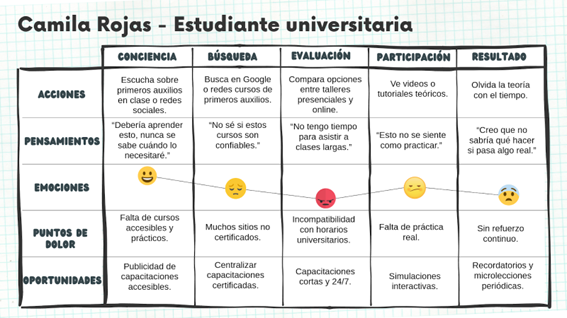
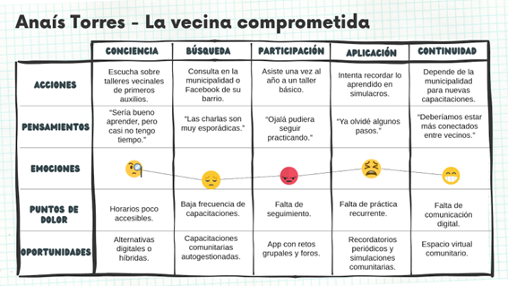
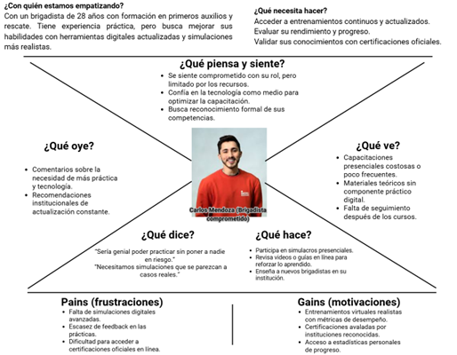
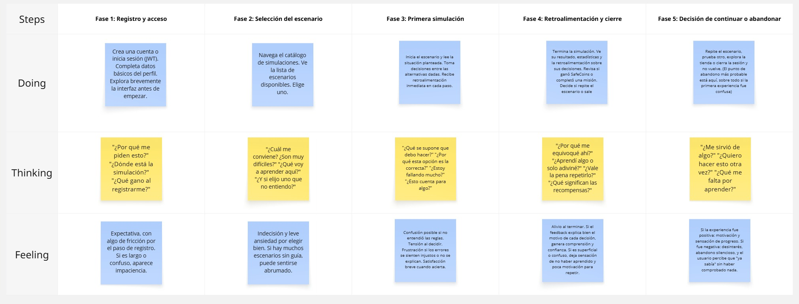

 
 

  

 
 

# 2.3. Needfinding

Esta sección sintetiza necesidades de aprendizaje y preparación en primeros auxilios **antes de utilizar SafeStep**. La evidencia primaria son diez entrevistas del apartado 2.2: cuatro estudiantes universitarios (E01–E04), tres miembros de comunidades vecinales (C01–C03) y tres personas con experiencia actual o previa como brigadistas (B01–B03). El análisis competitivo de 2.1 aporta contexto: existen aplicaciones gratuitas con guías, cuestionarios y, en algunos casos, progreso, insignias o acceso offline. Por ello, ninguno de estos elementos se presenta como ventaja exclusiva de SafeStep.

El recorrido metodológico es: respuestas y resúmenes de entrevistas → patrones por segmento → arquetipos compuestos → tareas independientes de la solución → journeys, empathy maps y escenarios As-Is. Se indica cuando un rasgo es una inferencia de síntesis y cuando faltan datos. **No se observó el comportamiento real de toda la población**, no se midió competencia clínica y los porcentajes de 2.2.3 solo describen a las personas entrevistadas.

Se han restituido las **imágenes originales** del informe. Estas imágenes son material histórico y todavía no reflejan todas las correcciones del análisis textual: en particular, la ficha vecinal muestra a Anaís y no a Alex, algunas edades y rasgos no están sustentados por las entrevistas, y el único escenario original representa el uso de SafeStep en lugar de la situación previa. Por tanto, no se presentan como evidencia de conformidad final. El statement exige elaborar y exportar User Personas, User Journey Maps y Empathy Maps desde **UXPressia**, y los As-Is Scenario Maps desde **Miro o Lucidchart**, con sus enlaces editables.

## 2.3.1. User Personas

Se construyó un arquetipo por segmento, vinculando cada ficha con las características más recurrentes del análisis de entrevistas y con el contexto competitivo. Los nombres son ficticios. Las edades son **ilustrativas y se encuentran dentro de la muestra correspondiente**, no describen una distribución poblacional. Ocupación, experiencia, metas, barreras, dispositivos y señales de confianza se incluyen solo cuando tienen sustento en los registros; familia, estado civil, navegador y personalidad se declaran no documentados en lugar de inventarse. Las fichas no reproducen la biografía de una persona entrevistada.

### Camila Rojas — estudiante universitaria

Camila representa una necesidad compartida por E01–E04: adquirir y repasar conocimientos, ensayar decisiones y reducir la inseguridad ante situaciones cotidianas. Los cuatro usan laptop para estudiar; tres mencionaron laboratorio o taller como fuente de preocupación. Las preferencias de modalidad y los precios declarados difieren, por lo que no se fijan como atributos universales del arquetipo.

  
<b>Gráfico 1.</b> User Persona — Camila Rojas (estudiantes universitarios)

  
  
<i>Fuente: imagen original del equipo; pendiente de actualización con E01–E04.</i>

### Alex Torres — miembro de comunidad vecinal

Alex combina patrones de C01–C03: interés por la preparación local, barrera de tiempo presente en las tres entrevistas y búsqueda de información sobre oportunidades de capacitación. Dos participantes prefirieron actividades grupales y uno el aprendizaje individual; la ficha preserva esa diferencia. Su edad ilustrativa de 27 años coincide con dos participantes, sin suponer que represente a todos los vecinos.

  
<b>Gráfico 2.</b> User Persona original — Anaís Torres (comunidades vecinales)

  
  
<i>Fuente: imagen original del equipo; el arquetipo textual corregido es Alex Torres y la ficha aún no se ha actualizado con C01–C03.</i>

### Carlos Mendoza — persona con experiencia brigadista

Carlos sintetiza B01–B03, quienes declararon formación previa y valoraron la práctica y el respaldo institucional. **Solo B01 desempeñaba un rol activo al momento del registro; B02 y B03 describieron experiencia anterior.** Sus frecuencias de actualización y modalidades preferidas no fueron uniformes. La ficha no lo presenta como profesional sanitario ni como titular de una acreditación verificada.

  
<b>Gráfico 3.</b> User Persona — Carlos Mendoza (experiencia brigadista)

  
  
<i>Fuente: imagen original del equipo; pendiente de actualizar la edad y otros rasgos con B01–B03.</i>

Las fichas originales se conservan visualmente, pero sus edades y algunos rasgos personales no pueden rastrearse a los registros. El aprendizaje **no implica** que un certificado interno de SafeStep sea una acreditación profesional ni que las tres personas entrevistadas representen a todas las comunidades o brigadas.

## 2.3.2. User Task Matrix

La matriz compara tareas que Camila, Alex y Carlos pueden realizar **aunque SafeStep no exista**. Se excluyen acciones como iniciar sesión, obtener puntos, ver un ranking, comprar dentro de la app o revisar un panel de progreso: son interacciones de una solución particular, no tareas del dominio del problema. Las tareas provienen de los objetivos y barreras de 2.2.3; los valores de frecuencia e importancia son **estimaciones ordinales del equipo para priorizar investigación**, no frecuencias observadas, mediciones de uso ni porcentajes. `Alta`, `Media` y `Baja` deben contrastarse en nuevas entrevistas u observación contextual.

<table border="1" cellpadding="6" cellspacing="0" width="100%">
  <tr>
    <th rowspan="2" align="left">Tarea independiente de SafeStep</th>
    <th colspan="2">Camila · estudiante</th>
    <th colspan="2">Alex · comunidad vecinal</th>
    <th colspan="2">Carlos · experiencia brigadista</th>
  </tr>
  <tr>
    <th>Frecuencia</th><th>Importancia</th>
    <th>Frecuencia</th><th>Importancia</th>
    <th>Frecuencia</th><th>Importancia</th>
  </tr>
  <tr><td>Identificar riesgos y reconocer cuándo solicitar ayuda especializada</td><td>Media</td><td>Alta</td><td>Media</td><td>Alta</td><td>Media</td><td>Alta</td></tr>
  <tr><td>Buscar y contrastar fuentes de primeros auxilios</td><td>Media</td><td>Alta</td><td>Media</td><td>Alta</td><td>Media</td><td>Alta</td></tr>
  <tr><td>Localizar y comparar oportunidades de capacitación</td><td>Media</td><td>Alta</td><td>Media</td><td>Alta</td><td>Media</td><td>Media</td></tr>
  <tr><td>Asistir a una capacitación o taller</td><td>Baja</td><td>Alta</td><td>Baja</td><td>Alta</td><td>Media</td><td>Alta</td></tr>
  <tr><td>Ensayar procedimientos y decisiones en prácticas supervisadas</td><td>Baja</td><td>Alta</td><td>Baja</td><td>Alta</td><td>Media</td><td>Alta</td></tr>
  <tr><td>Repasar conocimientos entre capacitaciones</td><td>Baja</td><td>Alta</td><td>Baja</td><td>Alta</td><td>Media</td><td>Alta</td></tr>
  <tr><td>Resolver dudas con instructores, fuentes o pares</td><td>Media</td><td>Media</td><td>Media</td><td>Media</td><td>Media</td><td>Alta</td></tr>
  <tr><td>Coordinar preparación o roles con otras personas</td><td>Baja</td><td>Media</td><td>Media</td><td>Alta</td><td>Media</td><td>Alta</td></tr>
  <tr><td>Comprobar validez y vigencia de cursos o protocolos</td><td>Media</td><td>Media</td><td>Baja</td><td>Media</td><td>Media</td><td>Alta</td></tr>
</table>

**Tareas relativamente más frecuentes.** Buscar información, comparar capacitación y consultar dudas reciben frecuencia `Media` en los tres arquetipos. Ninguna tarea se clasifica como `Alta` en frecuencia porque las entrevistas no midieron recurrencia; atribuir uso habitual sería injustificado. En Carlos, asistencia, práctica y repaso se estiman `Media` por la formación previa y las actualizaciones declaradas, aunque estas tuvieron frecuencias distintas.

**Tareas más importantes.** Identificar riesgos, contrastar fuentes, practicar y repasar se estiman `Alta` en importancia para los tres perfiles por su relación con preparación responsable. Importancia no equivale a frecuencia: asistir y practicar pueden ser valiosos aunque sucedan poco.

**Diferencias y coincidencias.** Alex enfrenta una barrera de tiempo documentada en 3/3 y puede necesitar coordinación vecinal, pero no se debe imponer modalidad grupal a todos. Carlos requiere atención especial a protocolos y acreditaciones; su experiencia institucional es heterogénea. Camila expresa necesidad de práctica y criterios de confianza, con preferencias de aprendizaje y pago divergentes. Los tres perfiles comparten la necesidad de fuentes claras y de oportunidades de practicar sin afirmar que una simulación digital sustituya la formación presencial.

## 2.3.3. User Journey Mapping

Cada User Journey Map muestra el recorrido **end-to-end As-Is**, desde reconocer la necesidad de aprender hasta practicar o intentar recordar lo aprendido, sin incorporar a SafeStep. Se vincula al User Persona correspondiente y presenta fases, acciones, pensamientos, emociones, fricciones y oportunidades. Las emociones y pensamientos son una síntesis interpretativa de respuestas, no citas literales; los mapas deben contrastarse con participantes. Este recorrido se distingue de un flujo de interfaz y del futuro To-Be del Capítulo III.

### Journey As-Is de Camila

Desde una preocupación en universidad u hogar, Camila busca recursos, compara formación, participa cuando puede y necesita repasar. E01–E04 sustentan la preocupación por situaciones concretas, la formación desigual y la falta de práctica.

  
<b>Gráfico 4.</b> User Journey Map As-Is — Camila Rojas

  
  
<i>Fuente: imagen original del equipo; pendiente de contraste con E01–E04.</i>

### Journey As-Is de Alex

Alex identifica riesgos vecinales, intenta encontrar capacitación, contrasta tiempo y costo, participa si le resulta posible y luego comparte o repasa. La barrera temporal procede de C01–C03; el trabajo grupal no se asume universal.

  
<b>Gráfico 5.</b> User Journey Map As-Is — Alex Torres

  
  
<i>Fuente: imagen original del equipo; pendiente de contraste con C01–C03.</i>

### Journey As-Is de Carlos

Carlos reconoce una brecha de actualización, consulta fuentes, participa en capacitación, ensaya cuando hay oportunidad y refuerza conocimientos entre sesiones. Las variantes de rol y frecuencia de B01–B03 impiden interpretar el mapa como un protocolo institucional único.

  
<b>Gráfico 6.</b> User Journey Map As-Is — Carlos Mendoza

  
  
<i>Fuente: imagen original del equipo; pendiente de contraste con B01–B03.</i>

## 2.3.4. Empathy Mapping

Se preparó un mapa por persona, ubicando el arquetipo en el centro y ordenando observaciones en: qué necesita hacer, dice, ve, hace, escucha, piensa y siente; se añadieron pains y gains. El contenido combina **paráfrasis de los registros** con inferencias de síntesis identificadas como tales; no atribuye comillas textuales a participantes sin verificar. Los mapas facilitan preguntas de investigación, no diagnostican personalidad ni prueban comportamiento futuro.

### Empathy Map de Camila

Las respuestas E01–E04 sostienen el interés por practicar, la preparación percibida como incompleta y la certificación como señal de confianza. Falta observar qué decisiones ejecutaría realmente ante un caso simulado.

  
<b>Gráfico 7.</b> Empathy Map — Camila Rojas

  
  
<i>Fuente: imagen original del equipo; pendiente de contraste con E01–E04.</i>

### Empathy Map de Alex

C01–C03 muestran una barrera de tiempo compartida y preferencias distintas entre formación grupal e individual. El mapa no extiende estas observaciones a toda la comunidad.

  
<b>Gráfico 8.</b> Empathy Map — Alex Torres

  
  
<i>Fuente: imagen original del equipo; pendiente de contraste con C01–C03.</i>

### Empathy Map de Carlos

B01–B03 valoran practicar antes de una emergencia y la confianza institucional, aunque difieren en rol, frecuencia de actualización y uso digital. El mapa conserva la distinción entre apoyo de aprendizaje y acreditación profesional.

  
<b>Gráfico 9.</b> Empathy Map — Carlos Mendoza

  
  
<i>Fuente: imagen original del equipo; pendiente de contraste con B01–B03.</i>

## 2.3.5. As-is Scenario Mapping

El único mapa original de esta sección muestra registro, selección del escenario y primera simulación **dentro de SafeStep**. Se restituye como material histórico, pero no cubre el As-Is solicitado por el statement, que debe representar la situación previa a la solución. Faltan mapas por cada User Persona con fases y filas `Phases`, `Doing`, `Thinking` y `Feeling`, además de áreas positivas, negativas y *blank areas*.

Para elaborar los mapas faltantes, el equipo debe revisar individualmente los resúmenes de cada segmento, agrupar las actividades actuales en fases, contrastar acciones y pensamientos con las entrevistas, etiquetar puntos favorables, fricciones y vacíos, y revisar que ninguna fase presuponga la existencia de SafeStep. La revisión colaborativa y la elaboración en Miro/Lucidchart quedan pendientes de evidencia.

  
<b>Gráfico 10.</b> As-Is Scenario Mapping original — recorrido dentro de SafeStep (material histórico)

  
  
<i>Fuente: imagen original del equipo; no cubre el As-Is de Needfinding.</i>

### Escenario As-Is de Camila

Fases: necesidad, búsqueda, capacitación y continuidad. La principal zona negativa es la escasez de práctica; los vacíos preguntan cómo verifica fuentes y cuándo vuelve a practicar realmente.

### Escenario As-Is de Alex

Fases: toma de conciencia, búsqueda de oferta, organización y participación o postergación. El tiempo restringe la capacitación de los tres entrevistados; aún se desconoce cómo coordinan presupuestos y canales de convocatoria en grupos vecinales más amplios.

### Escenario As-Is de Carlos

Fases: identificación de brecha, consulta de fuentes, ensayo y mantenimiento de competencia. Los espacios de práctica y la vigencia de protocolos varían entre instituciones; las competencias reales no fueron evaluadas en las entrevistas.

**Pendiente para conformidad formal con el statement:** corregir las tres fichas, tres journeys y tres empathy maps en UXPressia, y elaborar los tres escenarios As-Is previos a SafeStep en Miro/Lucidchart; exportar capturas legibles, documentar enlaces editables y registrar la revisión del equipo.
