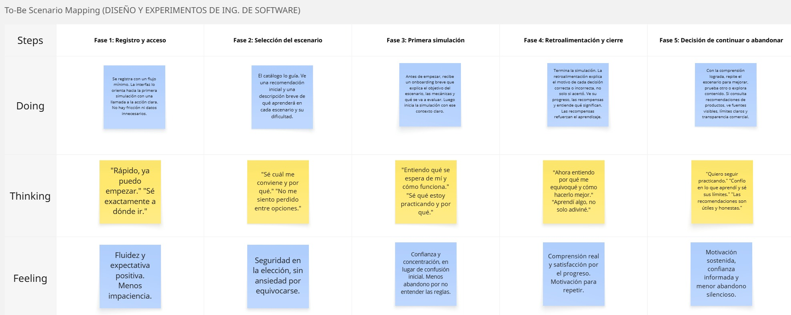

 
 

    

 
 

# 3.1. To-Be Scenario Mapping

Este mapa plantea de forma gráfica una comparación de la experiencia de nuestro User Persona con la experiencia que tendría al usar nuestra solución.

  

    Escenario To-Be elaborado en Miro.
  

  
  

    <i><b>Fuente:</b> elaboración propia.</i>
  

