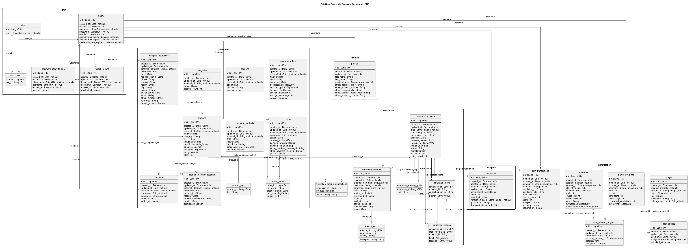
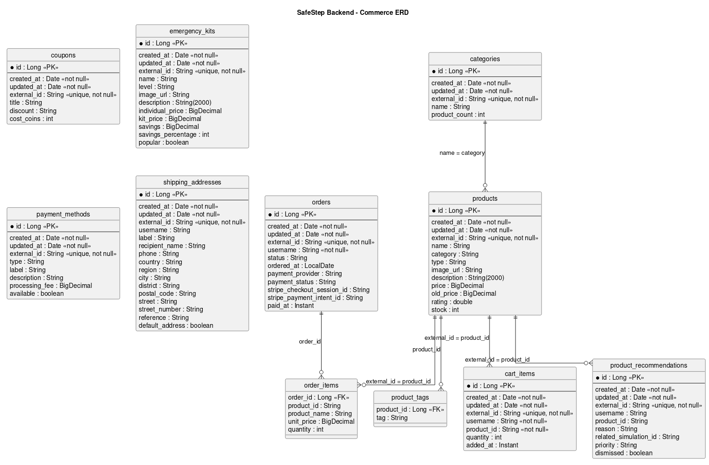
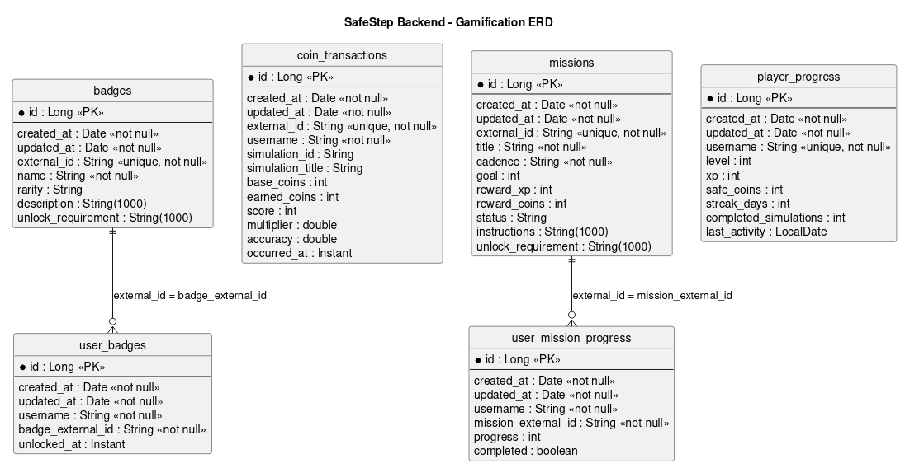

 
 

    

 
 

# 4.10. Database Design

## 4.10.1. Relational/Non-Relational Database Diagram

SafeStep utiliza PostgreSQL y persistencia relacional con JPA; por ello corresponde un **diagrama relacional**, no uno NoSQL adicional. El ERD general muestra **31 tablas** agrupadas en seis bounded contexts: IAM (5), Profiles (1), Simulation (7), Gamification (6), Analytics (1) y Commerce (11). Las imágenes siguientes muestran el modelo completo y sus vistas por contexto. Las clases de dominio no siempre se corresponden uno a uno con tablas: los objetos de valor de `Profile` se embeben en `profiles`, las colecciones de simulación y comercio generan tablas dependientes, y `AnalyticsSummary` se calcula para consulta.

Para reproducir o actualizar los diagramas, se agregaron scripts PostgreSQL en [codefordiagrams](../../assets/codefordiagrams/). Para el ERD general se importa **solo** [00-safestep-completo.sql](../../assets/codefordiagrams/00-safestep-completo.sql). Para visualizar un módulo se importa únicamente su archivo: [IAM](../../assets/codefordiagrams/01-iam.sql), [Profiles](../../assets/codefordiagrams/02-profiles.sql), [Simulation](../../assets/codefordiagrams/03-simulation.sql), [Gamification](../../assets/codefordiagrams/04-gamification.sql), [Analytics](../../assets/codefordiagrams/05-analytics.sql) o [Commerce](../../assets/codefordiagrams/06-commerce.sql). El archivo general reúne las mismas 31 tablas de los archivos parciales; **no** se ejecutan ambos conjuntos sobre el mismo esquema. Tras exportar los diagramas desde LucidChart o Vertabelo, deberán reemplazarse las capturas de esta sección si el modelo visual cambia.

Los SQL son **artefactos de diseño para ERD, no migraciones de producción**. Incluyen claves primarias, unicidad y relaciones internas útiles para representar cardinalidades. Algunas claves foráneas hacia claves naturales (por ejemplo `username`, `slug` y `externalId`) formalizan relaciones lógicas del diagrama que el mapeo JPA actual no impone físicamente; deben validarse antes de aplicarse a una base existente. No incluyen datos personales, `DROP` ni instrucciones de carga.

    

**link del diagrama de base de datos para una mejor vista**

<a href="https://miro.com/app/board/uXjVHUFFqvM=/?embedMode=view_only_without_ui&moveToViewport=-2454%2C-663%2C5474%2C2933&embedId=668883533640">https://miro.com/app/board/uXjVHUFFqvM=/?embedMode=view_only_without_ui&moveToViewport=-2454%2C-663%2C5474%2C2933&embedId=668883533640</a>

    

<strong>Diagrama ERD Analytics</strong>

    

<strong>Diagrama ERD Ecommerce</strong>

    

<strong>Diagrama ERD Gamification</strong>

    

<strong>Diagrama ERD IAM</strong>

    

<strong>Diagrama ERD Profiles</strong>

    

<strong>Diagrama ERD Simulation</strong>

