<br>
<br>

<div align="center">
    
</div>

<br>
<br>

# 5.2. Landing Page, Services & Applications Implementation.

### 5.2.1.5. Sprint 5

#### 5.2.1.5.1. Sprint Planning 5

En esta sección se especifican los aspectos principales del Sprint Planning Meeting correspondiente al Sprint 5. Con el Sprint 4 el producto quedó funcional de punta a punta (autenticación, pagos y backend desplegado), por lo que el quinto Sprint se dedica a **demostrar y proteger esa calidad**: construir las suites de pruebas unitarias, de integración y de comportamiento (BDD), medir la cobertura y el estilo del código, y automatizar la verificación en un pipeline de integración continua con Jenkins y SonarQube. En paralelo se incorporan al backlog y se completan las historias de usuario del panel de administración y del canje de cupones con SafeCoins, que son los flujos nuevos que las pruebas deben cubrir.

<table align="center" border="1" cellpadding="8" cellspacing="0" style="border-collapse: collapse; width: 100%; font-family: Arial, sans-serif;">
    <tbody>
        <tr><td><b>Sprint #</b></td><td>Sprint 5</td></tr>
        <tr><td colspan="2"><b>Sprint Planning Background</b></td></tr>
        <tr><td>Date</td><td>01/10/2026</td></tr>
        <tr><td>Time</td><td>10:00 p. m.</td></tr>
        <tr><td>Location</td><td>Discord (reunión virtual)</td></tr>
        <tr><td>Prepared By</td><td>Melgarejo Quiroz, Josep Eliu</td></tr>
        <tr><td>Attendees (to planning meeting)</td><td>Palacios Jáuregui, Kalid Jesus; Sanchez Arenas, Manuel Angel; Melgarejo Quiroz, Josep Eliu; Tello Palacios, Fabrizio Rafael; Aylas De La Cruz, Paulo Smit</td></tr>
        <tr><td>Sprint n - 1 Review Summary</td><td>Sprint 4 completado: autenticación real con JWT, registro, perfil autenticado, protección de rutas, pago con Stripe y base de datos PostgreSQL desplegada, con el frontend conectado al backend real. Quedó pendiente respaldar esos flujos con pruebas automatizadas y un pipeline que las ejecute.</td></tr>
        <tr><td>Sprint n - 1 Retrospective Summary</td><td>El equipo identificó que el Sprint 4 dejó el producto funcional de punta a punta, con acceso seguro, pagos con Stripe y backend desplegado, pero que esos flujos solo se habían comprobado a mano y no existía una forma repetible de detectar regresiones. Se acordó dedicar el Sprint 5 a las pruebas automatizadas, la medición de cobertura y de estilo, y a un pipeline de integración continua, e incorporar al backlog el panel de administración y el canje de cupones para que las nuevas pruebas cubrieran también los flujos más recientes.</td></tr>
        <tr><td colspan="2"><b>Sprint Goal &amp; User Stories</b></td></tr>
        <tr><td>Sprint 5 Goal</td><td>Nuestro enfoque es verificar de forma automática el comportamiento de SafeStep y entregar cada cambio a través de un pipeline repetible. Creemos que esto da confianza para seguir evolucionando el producto sin romper lo que ya funciona. La meta se considera cumplida si las suites unitarias, BDD y de API aprueban, la cobertura del código de aplicación supera el 80 % y el pipeline de Jenkins termina en éxito con el análisis de SonarQube.</td></tr>
        <tr><td>Sprint 5 Velocity</td><td>El equipo acordó un velocity de 59 Story Points, que coincide con la suma de los puntos de las historias de usuario y technical stories incluidas en el Sprint.</td></tr>
        <tr><td>Sum of Story Points</td><td>Total: 59 SP - Panel de administración y roles (8 SP), cupones canjeables (12 SP), pruebas unitarias y umbral de cobertura (13 SP), BDD (8 SP), pruebas de API (5 SP) e integración continua (13 SP).</td></tr>
    </tbody>
</table>

**User Stories y Technical Stories incluidos en el Sprint 5:**

| ID | User Story / Technical Story | Prioridad | Story Points |
| -- | ---------------------------- | --------- | ------------ |
| US57 | Como administrador, quiero ver un panel con accesos y conteos de los módulos gestionables para administrar la plataforma desde un solo lugar. | Should Have | 3 |
| US58 | Como administrador, quiero asignar o quitar roles a los usuarios para controlar quién puede gestionar la plataforma. | Should Have | 5 |
| US59 | Como usuario, quiero canjear un cupón del catálogo con mis SafeCoins para obtener un descuento en mi próxima compra. | Must Have | 5 |
| US60 | Como usuario, quiero elegir uno de mis cupones canjeados al pagar para que el total a pagar incluya el descuento. | Must Have | 5 |
| US61 | Como usuario, quiero ver mis cupones canjeados separados en disponibles y usados para saber cuáles puedo aplicar. | Should Have | 2 |
| TS25 | Como developer, quiero cubrir con pruebas unitarias las entidades de dominio y los servicios de aplicación para detectar regresiones sin levantar el sistema completo. | Must Have | 8 |
| TS26 | Como developer, quiero medir la cobertura con JaCoCo y exigir un mínimo de 80 % para evitar que el código de negocio quede sin verificar. | Must Have | 3 |
| TS27 | Como developer, quiero analizar el estilo del código con Checkstyle y las reglas de Google para tener una referencia objetiva de calidad. | Could Have | 2 |
| TS28 | Como developer, quiero automatizar los criterios de aceptación en archivos Gherkin con Cucumber para verificar el comportamiento esperado de las historias. | Must Have | 8 |
| TS29 | Como developer, quiero probar los endpoints REST con Karate para validar contratos, estados HTTP y reglas de seguridad de extremo a extremo. | Must Have | 5 |
| TS30 | Como developer, quiero un Jenkinsfile que compile, valide y pruebe el backend en cada ejecución para recibir retroalimentación automática. | Must Have | 8 |
| TS31 | Como developer, quiero enviar el análisis a SonarQube y detener el pipeline si no supera el Quality Gate para evitar que código con defectos avance. | Should Have | 5 |

**Distribución de Trabajo por Componente:**

- **Panel de administración y roles (US57, US58):** 8 Story Points en backend (usuarios, roles y reglas de protección) y frontend.
- **Cupones canjeables (US59, US60, US61):** 12 Story Points: rediseño del cupón, agregado `RedeemedCoupon`, gasto de SafeCoins entre bounded contexts, descuento en la orden y página de canje.
- **Pruebas unitarias y cobertura (TS25, TS26, TS27):** 13 Story Points.
- **BDD y API (TS28, TS29):** 13 Story Points.
- **Integración continua (TS30, TS31):** 13 Story Points.

#### 5.2.1.5.2. Aspect Leaders and Collaborators

En esta sección se elabora el artefacto Leadership-and-Collaboration Matrix (LACX) del Sprint 5. Los aspectos del Sprint son:

1. **Admin & Coupons:** panel de administración, roles y canje de cupones (backend y frontend).
2. **Unit Tests & Coverage:** pruebas unitarias, JaCoCo y Checkstyle.
3. **BDD & API Tests:** pruebas Cucumber y Karate.
4. **CI Pipeline:** Jenkins y SonarQube.
5. **Documentation:** evidencias, reportes y capítulos del informe.

<table align="center" border="1" cellpadding="8" cellspacing="0" style="border-collapse: collapse; width: 100%; font-family: Arial, sans-serif;">
    <tbody>
        <tr><td><b>Team Member (Last Name, First Name)</b></td><td><b>GitHub Username</b></td><td><b>Admin &amp; Coupons / L or C</b></td><td><b>Unit Tests &amp; Coverage / L or C</b></td><td><b>BDD &amp; API Tests / L or C</b></td><td><b>CI Pipeline / L or C</b></td><td><b>Documentation / L or C</b></td></tr>
        <tr><td>Palacios Jáuregui, Kalid Jesus</td><td><b>[POR COMPLETAR POR EL EQUIPO]</b></td><td>C</td><td>L</td><td>—</td><td>—</td><td>C</td></tr>
        <tr><td>Sanchez Arenas, Manuel Angel</td><td><b>[POR COMPLETAR POR EL EQUIPO]</b></td><td>—</td><td>C</td><td>L</td><td>—</td><td>C</td></tr>
        <tr><td>Melgarejo Quiroz, Josep Eliu</td><td>Melga1502</td><td>C</td><td>—</td><td>—</td><td>—</td><td>L</td></tr>
        <tr><td>Tello Palacios, Fabrizio Rafael</td><td><b>[POR COMPLETAR POR EL EQUIPO]</b></td><td>—</td><td>—</td><td>—</td><td>L</td><td>C</td></tr>
        <tr><td>Aylas De La Cruz, Paulo Smit</td><td><b>[POR COMPLETAR POR EL EQUIPO]</b></td><td>L</td><td>—</td><td>—</td><td>—</td><td>C</td></tr>
    </tbody>
</table>

#### 5.2.1.5.3. Sprint Backlog 5

El Sprint Backlog 5 resume las tareas de cada User Story y Technical Story. Las tasks se separaron por historia para mantener la trazabilidad entre el Product Backlog (3.3), la matriz LACX y el trabajo operativo realizado. Las horas de estimación no se registraron durante el Sprint.

**Trello Board:** el equipo utiliza un Trello Board con las listas estándar de Scrum: "Sprint Goal", "To Do", "In Progress", "To Review" y "Done".

**URL pública del Trello Board del Sprint 5:** <b>[POR COMPLETAR POR EL EQUIPO]</b>

<table align="center" border="1" cellpadding="8" cellspacing="0" style="border-collapse: collapse; width: 100%; font-family: Arial, sans-serif;">
    <tbody>
        <tr><td><b>Sprint #</b></td><td colspan="7">Sprint 5</td></tr>
        <tr><td colspan="2">User Story / Technical Story</td><td colspan="6">Work-Item / Task</td></tr>
        <tr><td>Id</td><td>Title</td><td>Id</td><td>Title</td><td>Description</td><td>Estimation (Hours)</td><td>Assigned to</td><td>Status (To-do / In-Process / To-Review / Done)</td></tr>
        <tr><td>US57</td><td>Visualizar el panel de administración</td><td>T501</td><td>Panel de administración</td><td>Crear la página /app/admin con una tarjeta de conteo por módulo y la ruta protegida con adminGuard.</td><td>—</td><td>Aylas De La Cruz, Paulo Smit</td><td>Done</td></tr>
        <tr><td>US58</td><td>Gestionar roles de los usuarios</td><td>T502</td><td>Endpoints de usuarios y roles</td><td>Exponer GET /users, GET /roles y PUT /users/{id}/roles con las reglas: no quitarse el propio rol de administrador y conservar al menos un administrador.</td><td>—</td><td>Aylas De La Cruz, Paulo Smit</td><td>Done</td></tr>
        <tr><td>US58</td><td>Gestionar roles de los usuarios</td><td>T503</td><td>Gestión de roles en el frontend</td><td>Listado de usuarios y formulario de roles en el módulo identity-access.</td><td>—</td><td>Aylas De La Cruz, Paulo Smit</td><td>Done</td></tr>
        <tr><td>US59</td><td>Canjear un cupón con SafeCoins</td><td>T504</td><td>Rediseño del cupón</td><td>Reemplazar el campo discount por type, discountPercentage y minPurchaseAmount, con validaciones.</td><td>—</td><td>Aylas De La Cruz, Paulo Smit</td><td>Done</td></tr>
        <tr><td>US59</td><td>Canjear un cupón con SafeCoins</td><td>T505</td><td>Canje de cupones</td><td>Crear el agregado RedeemedCoupon, el endpoint POST /commerce/coupons/{id}/redeem y el gasto de SafeCoins por la fachada ACL de gamificación (PlayerProgress.spendCoins, CoinSpend).</td><td>—</td><td>Melgarejo Quiroz, Josep Eliu</td><td>Done</td></tr>
        <tr><td>US59</td><td>Canjear un cupón con SafeCoins</td><td>T506</td><td>Página de canje</td><td>Crear /app/store/coupons con el catálogo de cupones y el botón de canje.</td><td>—</td><td>Melgarejo Quiroz, Josep Eliu</td><td>Done</td></tr>
        <tr><td>US60</td><td>Aplicar un cupón canjeado en el checkout</td><td>T507</td><td>Descuento en la orden</td><td>Agregar Order.finalTotal() y el descuento aplicado; Stripe cobra cada producto con el descuento aplicado a su precio unitario.</td><td>—</td><td>Melgarejo Quiroz, Josep Eliu</td><td>Done</td></tr>
        <tr><td>US60</td><td>Aplicar un cupón canjeado en el checkout</td><td>T508</td><td>Selector de cupones en el checkout</td><td>Reemplazar el campo de texto por la lista de cupones disponibles, deshabilitando los que no cumplen el monto mínimo.</td><td>—</td><td>Melgarejo Quiroz, Josep Eliu</td><td>Done</td></tr>
        <tr><td>US60</td><td>Aplicar un cupón canjeado en el checkout</td><td>T509</td><td>Liberación del cupón</td><td>Devolver el cupón a disponible cuando el pago de Stripe falla o se cancela.</td><td>—</td><td>Melgarejo Quiroz, Josep Eliu</td><td>Done</td></tr>
        <tr><td>US61</td><td>Consultar mis cupones canjeados</td><td>T510</td><td>Mis cupones</td><td>Exponer GET /commerce/coupons/redeemed/me y mostrar pestañas de disponibles y usados.</td><td>—</td><td>Palacios Jáuregui, Kalid Jesus</td><td>Done</td></tr>
        <tr><td>TS25</td><td>Pruebas unitarias de entidades y servicios</td><td>T511</td><td>Pruebas de commerce, iam y gamification</td><td>Pruebas JUnit/Mockito de agregados, servicios de comandos y consultas, ACL y manejadores de eventos.</td><td>—</td><td>Palacios Jáuregui, Kalid Jesus</td><td>Done</td></tr>
        <tr><td>TS25</td><td>Pruebas unitarias de entidades y servicios</td><td>T512</td><td>Pruebas de simulation, analytics, profiles y shared</td><td>Pruebas de intentos, certificados, perfiles, Result y manejador global de excepciones.</td><td>—</td><td>Palacios Jáuregui, Kalid Jesus</td><td>Done</td></tr>
        <tr><td>TS26</td><td>Umbral de cobertura con JaCoCo</td><td>T513</td><td>Configurar JaCoCo</td><td>Reporte HTML/XML, regla de 80 % y exclusiones tomadas del proyecto de referencia del curso.</td><td>—</td><td>Palacios Jáuregui, Kalid Jesus</td><td>Done</td></tr>
        <tr><td>TS27</td><td>Análisis de estilo con Checkstyle</td><td>T514</td><td>Configurar Checkstyle</td><td>Reglas de Google sin modificar, en modo reporte; medir la línea base (8,034 observaciones).</td><td>—</td><td>Sanchez Arenas, Manuel Angel</td><td>Done</td></tr>
        <tr><td>TS28</td><td>Pruebas de aceptación BDD con Cucumber</td><td>T515</td><td>Features y steps</td><td>Cinco features Gherkin etiquetados con historias y sus step definitions.</td><td>—</td><td>Sanchez Arenas, Manuel Angel</td><td>Done</td></tr>
        <tr><td>TS28</td><td>Pruebas de aceptación BDD con Cucumber</td><td>T516</td><td>Infraestructura de BDD</td><td>Contexto de Spring Boot con puerto aleatorio y base H2 aislada, cliente HTTP y fábrica de jugadores.</td><td>—</td><td>Sanchez Arenas, Manuel Angel</td><td>Done</td></tr>
        <tr><td>TS29</td><td>Pruebas de integración con Karate</td><td>T517</td><td>Proyecto `api-tests`</td><td>Cinco features Karate (36 escenarios) contra una API en ejecución, con datos únicos por ejecución.</td><td>—</td><td>Sanchez Arenas, Manuel Angel</td><td>Done</td></tr>
        <tr><td>TS30</td><td>Pipeline de integración continua con Jenkins</td><td>T518</td><td>Jenkinsfile</td><td>Etapas de compilación, estilo, pruebas, cobertura, SonarQube y empaquetado.</td><td>—</td><td>Tello Palacios, Fabrizio Rafael</td><td>Done</td></tr>
        <tr><td>TS30</td><td>Pipeline de integración continua con Jenkins</td><td>T519</td><td>Jenkins como código</td><td>Imagen de Jenkins con JDK 26 y Maven; plugins.txt, casc.yaml y docker-compose.yml.</td><td>—</td><td>Tello Palacios, Fabrizio Rafael</td><td>Done</td></tr>
        <tr><td>TS31</td><td>Análisis de calidad con SonarQube y Quality Gate</td><td>T520</td><td>SonarQube y webhook</td><td>Servidor SonarQube, token como credencial de Jenkins, webhook y waitForQualityGate().</td><td>—</td><td>Tello Palacios, Fabrizio Rafael</td><td>Done</td></tr>
        <tr><td>TS31</td><td>Análisis de calidad con SonarQube y Quality Gate</td><td>T521</td><td>Corrección de hallazgos</td><td>Responder 400 ante JSON mal formado, restringir CORS a orígenes configurables y resolver los bugs java:S2184 y java:S2637 de SonarQube, con pruebas nuevas.</td><td>—</td><td>Tello Palacios, Fabrizio Rafael</td><td>Done</td></tr>
    </tbody>
</table>

#### 5.2.1.5.4. Development Evidence for Sprint Review

En esta sección se presentan los avances de implementación del Sprint 5. Todo el trabajo se integró mediante GitFlow: cada pieza se desarrolló en una rama `feature/*`, se confirmó con Conventional Commits y se fusionó a `develop` con `--no-ff`.

**Resumen de Avances Implementados:**

- **Panel de administración y roles (backend y frontend):** panel `/app/admin` con conteos por módulo, listado de usuarios y roles, y asignación de roles con las reglas de protección del administrador.
- **Cupones canjeables (backend y frontend):** rediseño del cupón en dos tipos (descuento simple y descuento con compra mínima), canje con SafeCoins mediante la fachada ACL de gamificación, descuento aplicado a la orden y cobrado por Stripe, y liberación del cupón si el pago falla.
- **Suites de pruebas:** 205 pruebas unitarias y de integración, 33 escenarios BDD y 36 escenarios de API (ver 5.2.1.5.5 y 6.1).
- **Calidad:** cobertura de 93.8 % sobre las clases medidas (antes 44.3 %), reporte de Checkstyle y análisis de SonarQube con el Quality Gate aprobado (ver 6.1 y 7.1).
- **Despliegue:** frontend, backend y base de datos publicados en Render, en una cuenta propia del equipo (ver 5.2.1.5.8).
- **Hallazgos corregidos:** la API responde 400 ante un JSON mal formado, CORS ya no admite cualquier origen y se resolvieron los bugs que reportó SonarQube; solo queda abierta la regla de CSRF, que es una decisión de diseño (ver 7.1).
- **Pipeline de integración continua:** `Jenkinsfile` con siete etapas, y Jenkins y SonarQube configurados como código (ver 7.1).

**Commits Realizados (desarrollo de producto):**

<table align="center" border="1" cellpadding="8" cellspacing="0" style="border-collapse: collapse; width: 100%; font-family: Arial, sans-serif;">
    <tbody>
        <tr><td><b>Repository</b></td><td><b>Branch</b></td><td><b>Commit Id</b></td><td><b>Commit Message</b></td><td><b>Commit Message Body</b></td><td><b>Committed on (Date)</b></td></tr>
        <tr><td>safestept-backend</td><td>main</td><td>f77dfef</td><td>feat: add coupon redemption feature</td><td>—</td><td>17/09/2026</td></tr>
        <tr><td>safestept-backend</td><td>develop</td><td>5dfcbdb</td><td>fix: answer 400 for malformed JSON, restrict CORS and clear Sonar findings</td><td>- GlobalExceptionHandler maps unreadable request bodies to a 400 validation error without leaking the parser message, and logs unexpected exceptions. - CORS no longer allows every origin: the allowed origins come from safestep.cors.allowed-origins (SAFESTEP_CORS_ALLOWED_ORIGINS), defaulting to the local frontend and the published frontends. - Discount factor uses long arithmetic (java:S2184). - ErrorResponseAssembler marks the nullable lookup as @Nullable (java:S2637).</td><td>08/10/2026</td></tr>
        <tr><td>safestept-backend</td><td>develop</td><td>d5faeed</td><td>fix: type the new unreadable-body handler response (java:S1452)</td><td>—</td><td>08/10/2026</td></tr>
    </tbody>
</table>

<table align="center" border="1" cellpadding="8" cellspacing="0" style="border-collapse: collapse; width: 100%; font-family: Arial, sans-serif;">
    <tbody>
        <tr><td><b>Repository</b></td><td><b>Branch</b></td><td><b>Commit Id</b></td><td><b>Commit Message</b></td><td><b>Commit Message Body</b></td><td><b>Committed on (Date)</b></td></tr>
        <tr><td>safestept-frontend</td><td>main</td><td>be56a72</td><td>feat: add admin and coupon redemption features</td><td>—</td><td>17/09/2026</td></tr>
        <tr><td>safestept-frontend</td><td>main</td><td>d9845f5</td><td>chore: point the production environment to the new Render backend</td><td>—</td><td>08/10/2026</td></tr>
    </tbody>
</table>

#### 5.2.1.5.5. Testing Suite Evidence for Sprint Review

En esta sección se presenta el conjunto de Unit Tests, Integration Tests y Acceptance Tests automatizados que verifican los User Stories del Sprint. Los resultados completos, la cobertura y los reportes se analizan en 6.1; aquí se incluye la relación de pruebas diseñadas.

**Repositorios de los proyectos de testing:**

| Suite | Repositorio | Ruta |
|-------|-------------|------|
| Pruebas unitarias y BDD del backend | [1ASI0732-2620-9090-Grupo-4/safestept-backend](https://github.com/1ASI0732-2620-9090-Grupo-4/safestept-backend) | `src/test` |
| Pruebas de integración de API (Karate) | [1ASI0732-2620-9090-Grupo-4/safestept-backend](https://github.com/1ASI0732-2620-9090-Grupo-4/safestept-backend) | `api-tests` |

**Unit Tests.** Las 205 pruebas unitarias y de integración con contexto de Spring se relacionan con las siguientes clases y comportamientos:

<table align="center" border="1" cellpadding="8" cellspacing="0" style="border-collapse: collapse; width: 100%; font-family: Arial, sans-serif;">
    <tbody>
        <tr><td><b>Bounded context</b></td><td><b>Clase de prueba / Clase bajo prueba</b></td><td><b>Pruebas</b></td><td><b>Comportamientos verificados</b></td></tr>
        <tr><td>analytics</td><td><b>Clase de prueba:</b><br><code>CertificateCommandServiceImplTest</code><br><b>Clase bajo prueba:</b><br><code>CertificateCommandServiceImpl</code></td><td align='center'>4</td><td>• Rechaza emitir un certificado si el puntaje es menor a 80<br>• No emite el mismo certificado dos veces<br>• Asigna el nivel de logro según el puntaje<br>• Genera un código de verificación saneado y las URL públicas</td></tr>
        <tr><td>analytics</td><td><b>Clase de prueba:</b><br><code>AnalyticsQueryServiceImplTest</code><br><b>Clase bajo prueba:</b><br><code>AnalyticsQueryServiceImpl</code></td><td align='center'>4</td><td>• <code>handle(GetSummaryQuery)</code> arma las métricas, habilidades y errores a partir de intentos reales<br>• <code>handle(GetSummaryQuery)</code> devuelve las métricas en cero si el usuario no tiene intentos<br>• <code>handle(GetProgressQuery)</code> clasifica cada simulación según su mejor puntaje<br>• <code>handle(GetCertificatesQuery)</code> delega en el repositorio de certificados</td></tr>
        <tr><td>commerce</td><td><b>Clase de prueba:</b><br><code>CommerceCartAndOrderCommandServiceTest</code><br><b>Clase bajo prueba:</b><br><code>CommerceCommandServiceImpl</code></td><td align='center'>15</td><td>• <code>handle(AddCartItemCommand)</code> agrega un producto válido al carrito<br>• <code>handle(AddCartItemCommand)</code> rechaza productos desconocidos y cantidades mayores al stock<br>• <code>handle(UpdateCartItemCommand)</code> cambia la cantidad de un producto del carrito<br>• <code>handle(UpdateCartItemCommand)</code> rechaza productos inexistentes y cantidades mayores al stock<br>• <code>deleteCartItem</code> elimina el producto solo si pertenece al usuario<br>• <code>handle(CreateOrderCommand)</code> falla si el carrito está vacío<br>• <code>handle(CreateOrderCommand)</code> falla si un producto del carrito ya no existe o no tiene stock<br>• <code>handle(CreateOrderCommand)</code> crea la orden, descuenta el stock y vacía el carrito<br>• <code>handle(CreateOrderCommand)</code> rechaza cupones desconocidos, ajenos o ya usados<br>• <code>handle(CreateStripeCheckoutSessionCommand)</code> rechaza órdenes ya pagadas y fallos de Stripe<br>• <code>handle(ConfirmStripePaymentCommand)</code> marca la orden como pagada cuando Stripe lo confirma<br>• <code>handle(ConfirmStripePaymentCommand)</code> rechaza órdenes ajenas, otras sesiones y sesiones sin pagar<br>• <code>handle(CancelStripePaymentCommand)</code> marca el pago como fallido y libera el cupón canjeado<br>• <code>handle(CaptureStripeWebhookCommand)</code> reacciona a sesiones completadas y expiradas<br>• <code>handle(RedeemCouponCommand)</code> falla con un cupón desconocido sin tocar las SafeCoins del jugador</td></tr>
        <tr><td>commerce</td><td><b>Clase de prueba:</b><br><code>CommerceCatalogCommandServiceTest</code><br><b>Clase bajo prueba:</b><br><code>CommerceCommandServiceImpl</code></td><td align='center'>8</td><td>• <code>handle(CreateProductCommand)</code> guarda un producto nuevo y exige un id<br>• <code>handle(UpdateProductCommand)</code> rechaza ids vacíos o desconocidos<br>• <code>handle(DeleteProductCommand)</code> elimina un producto existente<br>• <code>handle(CreateCouponCommand)</code> guarda cupones válidos, simples y con compra mínima<br>• <code>handle(CreateCouponCommand)</code> exige id, porcentaje en rango, compra mínima y que no esté repetido<br>• <code>handle(UpdateCouponCommand)</code> conserva el id guardado y aplica el nuevo descuento<br>• <code>handle(UpdateCouponCommand)</code> rechaza cupones vacíos, desconocidos, con costo negativo o inválidos<br>• <code>handle(DeleteCouponCommand)</code> elimina cupones existentes y avisa cuando no existen</td></tr>
        <tr><td>commerce</td><td><b>Clase de prueba:</b><br><code>CommerceCouponRedemptionCommandServiceTest</code><br><b>Clase bajo prueba:</b><br><code>CommerceCommandServiceImpl</code></td><td align='center'>5</td><td>• Canjear un cupón funciona y descuenta las SafeCoins<br>• Canjear un cupón falla si las SafeCoins no alcanzan<br>• Crear una orden rechaza el cupón si no se llega a la compra mínima<br>• Crear una orden aplica el descuento y marca el cupón como usado<br>• Cancelar el pago de Stripe libera el cupón canjeado</td></tr>
        <tr><td>commerce</td><td><b>Clase de prueba:</b><br><code>CommerceStripeCommandServiceTest</code><br><b>Clase bajo prueba:</b><br><code>CommerceCommandServiceImpl</code></td><td align='center'>9</td><td>• Crear la sesión de Stripe usa el total guardado de la orden y la deja en pago pendiente<br>• Crear la sesión de Stripe rechaza una orden de otro usuario<br>• El webhook de pago completado marca la orden como pagada<br>• Un webhook de pago completado repetido no cambia una orden ya pagada<br>• Una firma de webhook inválida devuelve un error de validación<br>• Crear un producto rechaza un id externo repetido<br>• Actualizar un producto conserva el id de base de datos y el id externo de la ruta<br>• Eliminar un producto que no existe devuelve no encontrado<br>• Crear un cupón rechaza un costo negativo</td></tr>
        <tr><td>commerce</td><td><b>Clase de prueba:</b><br><code>CommerceQueryServiceImplTest</code><br><b>Clase bajo prueba:</b><br><code>CommerceQueryServiceImpl</code></td><td align='center'>3</td><td>• Las consultas de catálogo devuelven lo que tienen los repositorios<br>• Las consultas del usuario filtran por su nombre de usuario<br>• Las recomendaciones usan la lista global cuando el usuario no tiene las suyas</td></tr>
        <tr><td>commerce</td><td><b>Clase de prueba:</b><br><code>CouponAndRedeemedCouponTest</code><br><b>Clase bajo prueba:</b><br><code>Coupon</code>, <code>RedeemedCoupon</code></td><td align='center'>5</td><td>• <code>Coupon</code> usa el tipo de porcentaje simple cuando no se indica ninguno<br>• <code>Coupon</code> conserva la compra mínima solo en el tipo con compra mínima<br>• <code>RedeemedCoupon</code> empieza disponible y pasa a usado una sola vez<br>• <code>RedeemedCoupon</code> vuelve a estar disponible al liberarse<br>• <code>RedeemedCoupon</code> usa un tipo y un estado por defecto cuando faltan</td></tr>
        <tr><td>commerce</td><td><b>Clase de prueba:</b><br><code>OrderTest</code><br><b>Clase bajo prueba:</b><br><code>Order</code></td><td align='center'>6</td><td>• Calcula el total con los precios copiados de los productos<br>• El total final aplica el porcentaje de descuento sin cambiar el total<br>• El total final es igual al total cuando no hay descuento<br>• Inicia el pago con Stripe en estado de pago pendiente<br>• Marca el pago con Stripe como pagado<br>• Una orden pagada o cancelada no puede iniciar un pago con Stripe</td></tr>
        <tr><td>commerce</td><td><b>Clase de prueba:</b><br><code>ProductTest</code><br><b>Clase bajo prueba:</b><br><code>Product</code></td><td align='center'>1</td><td>• Impide vender más unidades que el stock disponible</td></tr>
        <tr><td>commerce</td><td><b>Clase de prueba:</b><br><code>CartAndOrderItemTest</code><br><b>Clase bajo prueba:</b><br><code>CartItem</code>, <code>OrderItem</code></td><td align='center'>2</td><td>• <code>CartItem</code> rechaza cantidades menores a uno al crearse y al cambiarse<br>• <code>OrderItem</code> calcula su subtotal y rechaza cantidades vacías</td></tr>
        <tr><td>commerce</td><td><b>Clase de prueba:</b><br><code>CommerceValueObjectsTest</code><br><b>Clase bajo prueba:</b><br><code>CommerceValueObjects</code></td><td align='center'>4</td><td>• <code>Money</code> redondea a dos decimales y rechaza montos negativos<br>• <code>Stock</code> rechaza cantidades negativas<br>• <code>OrderStatus.from</code> entiende las etiquetas en inglés y en español<br>• Los enums tolerantes usan un valor seguro por defecto cuando el valor es desconocido</td></tr>
        <tr><td>commerce</td><td><b>Clase de prueba:</b><br><code>CommerceResourcesValidationTest</code><br><b>Clase bajo prueba:</b><br><code>AddCartItemResource</code>, <code>CreateOrderResource</code>, <code>UpdateCartItemResource</code></td><td align='center'>3</td><td>• Agregar al carrito rechaza un producto vacío y una cantidad cero<br>• Crear una orden rechaza un estado desconocido<br>• Actualizar el carrito acepta una cantidad positiva</td></tr>
        <tr><td>commerce</td><td><b>Clase de prueba:</b><br><code>CommerceResourceAssemblerTest</code><br><b>Clase bajo prueba:</b><br><code>CommerceResourceAssembler</code></td><td align='center'>5</td><td>• La conversión de productos conserva precio, stock y etiquetas en ida y vuelta<br>• La conversión de cupones conserva el tipo, el porcentaje y la compra mínima<br>• <code>toResource(RedeemedCoupon)</code> expone el estado y los datos guardados del cupón<br>• <code>toResource(CartItem)</code> convierte la línea del carrito<br>• <code>toResource(Order)</code> expone el total, el total con descuento y la referencia al cupón</td></tr>
        <tr><td>gamification</td><td><b>Clase de prueba:</b><br><code>GamificationCommandServiceImplTest</code><br><b>Clase bajo prueba:</b><br><code>GamificationCommandServiceImpl</code></td><td align='center'>13</td><td>• Crear una misión rechaza un id externo repetido<br>• Actualizar una misión conserva el id de base de datos y el id externo de la ruta<br>• Crear una insignia rechaza un id externo repetido<br>• Eliminar una insignia que no existe devuelve no encontrado<br>• Crear una misión guarda una misión válida<br>• Crear una misión exige un id externo<br>• Crear una misión rechaza recompensas y metas negativas<br>• Actualizar una misión falla si la misión no existe<br>• Actualizar una misión rechaza recompensas inválidas<br>• Eliminar una misión borra la misión existente<br>• Crear una insignia guarda una insignia nueva y exige un id<br>• Actualizar una insignia conserva el id de base de datos y maneja la insignia inexistente<br>• Eliminar una insignia borra la insignia existente</td></tr>
        <tr><td>gamification</td><td><b>Clase de prueba:</b><br><code>SimulationAttemptCompletedIntegrationEventHandlerTest</code><br><b>Clase bajo prueba:</b><br><code>SimulationAttemptCompletedIntegrationEventHandler</code></td><td align='center'>3</td><td>• Es idempotente con un intento que ya fue recompensado<br>• Recompensa a un jugador nuevo, registra la transacción y desbloquea la primera insignia<br>• Suma la recompensa al progreso del jugador existente</td></tr>
        <tr><td>gamification</td><td><b>Clase de prueba:</b><br><code>GamificationContextFacadeImplTest</code><br><b>Clase bajo prueba:</b><br><code>GamificationContextFacadeImpl</code></td><td align='center'>5</td><td>• <code>progressByUsername</code> expone el progreso guardado como una copia<br>• <code>progressByUsername</code> devuelve nivel uno por defecto para jugadores desconocidos<br>• <code>spendCoins</code> descuenta el saldo y registra el gasto cuando alcanzan las SafeCoins<br>• <code>spendCoins</code> rechaza el gasto y no guarda nada cuando el saldo no alcanza<br>• <code>spendCoins</code> rechaza montos que no son positivos y jugadores desconocidos</td></tr>
        <tr><td>gamification</td><td><b>Clase de prueba:</b><br><code>GamificationQueryServiceImplTest</code><br><b>Clase bajo prueba:</b><br><code>GamificationQueryServiceImpl</code></td><td align='center'>4</td><td>• <code>handle(GetSummaryQuery)</code> devuelve el progreso guardado cuando existe<br>• <code>handle(GetSummaryQuery)</code> devuelve nivel uno por defecto para jugadores desconocidos<br>• Las consultas de listas delegan en sus repositorios<br>• Las consultas de logros delegan en el repositorio de logros</td></tr>
        <tr><td>gamification</td><td><b>Clase de prueba:</b><br><code>CoinSpendAndValueObjectsTest</code><br><b>Clase bajo prueba:</b><br><code>CoinSpend</code>, <code>ExperiencePoints</code>, <code>SafeCoins</code>, <code>PlayerLevel</code></td><td align='center'>4</td><td>• <code>CoinSpend</code> conserva el cupón y el monto con los que se creó<br>• <code>PlayerProgress</code> rechaza gastos de SafeCoins no positivos o excesivos<br>• <code>PlayerProgress</code> normaliza entradas negativas y reinicia la racha tras un salto de días<br>• Los objetos de valor de gamificación validan sus rangos</td></tr>
        <tr><td>gamification</td><td><b>Clase de prueba:</b><br><code>PlayerProgressTest</code><br><b>Clase bajo prueba:</b><br><code>PlayerProgress</code></td><td align='center'>3</td><td>• Otorga experiencia, SafeCoins y actividad<br>• Gastar SafeCoins reduce el saldo<br>• Gastar SafeCoins se rechaza si el saldo no alcanza</td></tr>
        <tr><td>gamification</td><td><b>Clase de prueba:</b><br><code>GamificationResourceAssemblerTest</code><br><b>Clase bajo prueba:</b><br><code>GamificationResourceAssembler</code></td><td align='center'>5</td><td>• <code>toResource(PlayerProgress)</code> convierte los campos del resumen<br>• <code>toResource(PlayerProgress, rank)</code> arma una entrada del ranking<br>• La conversión de misiones conserva frecuencia, recompensas y progreso en ida y vuelta<br>• La conversión de insignias conserva la rareza y el estado de desbloqueo en ida y vuelta<br>• <code>toResource(CoinTransaction)</code> siempre marca la transacción como exitosa</td></tr>
        <tr><td>iam</td><td><b>Clase de prueba:</b><br><code>AdminSeedCommandServiceImplTest</code><br><b>Clase bajo prueba:</b><br><code>AdminSeedCommandServiceImpl</code></td><td align='center'>6</td><td>• <code>handle</code> omite el seed cuando no hay credenciales configuradas<br>• <code>handle</code> omite el seed cuando ya existe un administrador<br>• <code>handle</code> omite el seed cuando el usuario pertenece a alguien que no es administrador<br>• <code>handle</code> omite el seed cuando <code>ROLE_ADMIN</code> todavía no se ha creado<br>• <code>handle</code> crea el administrador inicial con la contraseña codificada<br>• <code>handle</code> nunca deja que un fallo de persistencia detenga la aplicación</td></tr>
        <tr><td>iam</td><td><b>Clase de prueba:</b><br><code>UserCommandServiceImplTest</code><br><b>Clase bajo prueba:</b><br><code>UserCommandServiceImpl</code></td><td align='center'>13</td><td>• <code>handle(SignInCommand)</code> rechaza un usuario desconocido<br>• <code>handle(SignInCommand)</code> rechaza una contraseña incorrecta<br>• <code>handle(SignInCommand)</code> rechaza cuentas deshabilitadas<br>• <code>handle(SignUpCommand)</code> rechaza un nombre de usuario repetido<br>• <code>handle(SignUpCommand)</code> falla si un rol pedido no existe<br>• <code>handle(UpdateUserStatusCommand)</code> actualiza los indicadores de la cuenta<br>• <code>handle(UpdateUserStatusCommand)</code> falla con un usuario desconocido<br>• <code>handle(UpdateUserRolesCommand)</code> asciende a un usuario normal a administrador<br>• <code>handle(UpdateUserRolesCommand)</code> falla con un usuario desconocido<br>• <code>handle(UpdateUserRolesCommand)</code> falla si un nombre de rol no tiene rol guardado<br>• <code>handle(UpdateUserRolesCommand)</code> impide que un administrador se quite su propio rol de administrador<br>• <code>handle(UpdateUserRolesCommand)</code> mantiene al menos un administrador en el sistema<br>• <code>handle(UpdateUserRolesCommand)</code> quita el rol de administrador a otro si queda al menos un administrador</td></tr>
        <tr><td>iam</td><td><b>Clase de prueba:</b><br><code>UserTest</code><br><b>Clase bajo prueba:</b><br><code>User</code></td><td align='center'>6</td><td>• Un usuario nuevo empieza habilitado, con todos los indicadores de cuenta abiertos<br>• <code>replaceRoles</code> reemplaza todo el conjunto de roles<br>• <code>replaceRoles</code> usa el rol por defecto cuando no recibe ninguno<br>• <code>updateStatus</code> establece los cuatro indicadores de la cuenta<br>• <code>addRole</code> y <code>addRoles</code> acumulan roles sin duplicados<br>• <code>Role.toRoleFromName</code> rechaza nombres que no son un rol conocido</td></tr>
        <tr><td>iam</td><td><b>Clase de prueba:</b><br><code>IamContextFacadeTest</code><br><b>Clase bajo prueba:</b><br><code>IamContextFacade</code></td><td align='center'>5</td><td>• <code>createUser(username, password)</code> registra al usuario con el rol por defecto y devuelve su id<br>• <code>createUser</code> devuelve 0 cuando el registro falla<br>• <code>createUser(username, password, roles)</code> trata los roles nulos como una lista vacía<br>• <code>fetchUserIdByUsername</code> devuelve el id, o 0 si el usuario no existe<br>• <code>fetchUsernameByUserId</code> devuelve el nombre de usuario, o un texto vacío si no existe</td></tr>
        <tr><td>iam</td><td><b>Clase de prueba:</b><br><code>IamSecurityIntegrationTest</code><br><b>Clase bajo prueba:</b><br><code>AuthenticationController</code>, <code>UsersController</code>, <code>RolesController</code>, <code>WebSecurityConfiguration</code></td><td align='center'>9</td><td>• El registro ignora el rol de administrador solicitado<br>• Los endpoints de usuarios y roles exigen el rol de administrador<br>• El inicio de sesión devuelve los roles y un usuario normal no puede modificar los catálogos<br>• Actualizar los roles de un usuario exige ser administrador y funciona para el administrador<br>• Un administrador no puede quitarse su propio rol de administrador<br>• El sistema no puede quedarse sin ningún administrador<br>• El refresh token se rota y el cierre de sesión lo revoca<br>• Un usuario deshabilitado no puede iniciar sesión<br>• Restablecer la contraseña la cambia y revoca los refresh tokens activos</td></tr>
        <tr><td>iam</td><td><b>Clase de prueba:</b><br><code>AuthenticationResourcesValidationTest</code><br><b>Clase bajo prueba:</b><br><code>SignInResource</code>, <code>SignUpResource</code></td><td align='center'>2</td><td>• El inicio de sesión rechaza un usuario vacío y una contraseña corta<br>• El registro acepta credenciales válidas</td></tr>
        <tr><td>profiles</td><td><b>Clase de prueba:</b><br><code>ProfileCommandServiceImplTest</code><br><b>Clase bajo prueba:</b><br><code>ProfileCommandServiceImpl</code></td><td align='center'>7</td><td>• <code>handle(CreateProfileCommand)</code> guarda un perfil nuevo<br>• <code>handle(CreateProfileCommand)</code> informa un conflicto cuando el correo está repetido<br>• <code>handle(CreateProfileCommand)</code> convierte los datos inválidos en un error de validación<br>• <code>handle(CreateProfileCommand)</code> convierte los fallos de persistencia en un error inesperado<br>• <code>handle(UpdateProfileCommand)</code> actualiza el perfil guardado<br>• <code>handle(UpdateProfileCommand)</code> falla con un perfil desconocido<br>• <code>handle(UpdateProfileCommand)</code> rechaza datos inválidos sin guardar</td></tr>
        <tr><td>profiles</td><td><b>Clase de prueba:</b><br><code>ProfileQueryServiceImplTest</code><br><b>Clase bajo prueba:</b><br><code>ProfileQueryServiceImpl</code></td><td align='center'>2</td><td>• Las consultas delegan en el repositorio de perfiles<br>• <code>ProfilesContextFacadeImpl</code> expone los ids de perfil a otros contextos</td></tr>
        <tr><td>(aplicación)</td><td><b>Clase de prueba:</b><br><code>SafeStepPlatformApplicationTests</code><br><b>Clase bajo prueba:</b><br><code>SafeStepPlatformApplication</code></td><td align='center'>1</td><td>• El contexto de Spring se carga</td></tr>
        <tr><td>shared</td><td><b>Clase de prueba:</b><br><code>ResultTest</code><br><b>Clase bajo prueba:</b><br><code>Result</code></td><td align='center'>7</td><td>• Las fábricas de éxito y de fallo informan su estado<br>• <code>toOptional</code> solo contiene el valor de un éxito<br>• <code>getOrElse</code> usa el valor por defecto cuando es un fallo<br>• <code>map</code> transforma los éxitos y deja intactos los fallos<br>• <code>flatMap</code> encadena los éxitos y se detiene en el primer fallo<br>• <code>mapError</code> traduce solo el error de los fallos<br>• <code>recover</code> reemplaza un fallo y deja intacto un éxito</td></tr>
        <tr><td>shared</td><td><b>Clase de prueba:</b><br><code>LocaleConfigurationTest</code><br><b>Clase bajo prueba:</b><br><code>LocaleConfiguration</code></td><td align='center'>1</td><td>• El resolvedor de idioma usa el idioma por defecto y los idiomas soportados esperados</td></tr>
        <tr><td>shared</td><td><b>Clase de prueba:</b><br><code>ApiRobustnessIntegrationTest</code><br><b>Clase bajo prueba:</b><br><code>GlobalExceptionHandler</code>, <code>WebSecurityConfiguration</code></td><td align='center'>3</td><td>• Un cuerpo JSON mal formado se responde con 400 y un error de validación, no con 500<br>• Una solicitud previa (preflight) desde un origen permitido recibe las cabeceras CORS<br>• Una solicitud previa (preflight) desde un origen ajeno se rechaza</td></tr>
        <tr><td>shared</td><td><b>Clase de prueba:</b><br><code>GlobalExceptionHandlerTest</code><br><b>Clase bajo prueba:</b><br><code>GlobalExceptionHandler</code></td><td align='center'>8</td><td>• Una excepción de ejecución usa el mensaje inesperado traducido<br>• Un cuerpo ilegible responde 400 sin revelar el mensaje del analizador<br>• Un argumento inválido une el mensaje de cada campo con error<br>• Un argumento inválido sin errores de campo usa un mensaje genérico<br>• El acceso denegado devuelve prohibido<br>• Una excepción cualquiera responde con error interno del servidor<br>• Un argumento ilegal sin mensaje usa los detalles por defecto<br>• Un argumento ilegal devuelve un error de validación</td></tr>
        <tr><td>shared</td><td><b>Clase de prueba:</b><br><code>ErrorResponseAssemblerTest</code><br><b>Clase bajo prueba:</b><br><code>ErrorResponseAssembler</code></td><td align='center'>3</td><td>• La respuesta de error usa el mensaje del archivo de idioma por defecto<br>• La respuesta de error usa el mensaje del archivo de idioma en español<br>• La respuesta de error usa la clave de la categoría cuando falta la específica</td></tr>
        <tr><td>simulation</td><td><b>Clase de prueba:</b><br><code>SimulationAttemptCommandServiceImplTest</code><br><b>Clase bajo prueba:</b><br><code>SimulationAttemptCommandServiceImpl</code></td><td align='center'>5</td><td>• <code>handle(CreateSimulationAttemptCommand)</code> falla con una simulación desconocida<br>• <code>handle(CreateSimulationAttemptCommand)</code> guarda un intento completado con sus errores<br>• <code>handle(CreateSimulationCommand)</code> rechaza slugs repetidos y guarda simulaciones nuevas<br>• <code>handle(UpdateSimulationCommand)</code> conserva el id guardado y rechaza ids vacíos o desconocidos<br>• <code>handle(DeleteSimulationCommand)</code> elimina solo las simulaciones existentes</td></tr>
        <tr><td>simulation</td><td><b>Clase de prueba:</b><br><code>SimulationCommandServiceImplTest</code><br><b>Clase bajo prueba:</b><br><code>SimulationCommandServiceImpl</code></td><td align='center'>3</td><td>• Crear una simulación rechaza un slug repetido<br>• Actualizar una simulación conserva el id de base de datos y el slug de la ruta<br>• Eliminar una simulación que no existe devuelve no encontrado</td></tr>
        <tr><td>simulation</td><td><b>Clase de prueba:</b><br><code>SimulationDomainTest</code><br><b>Clase bajo prueba:</b><br><code>MedicalSimulation</code>, <code>Score</code>, <code>SimulationSlug</code>, <code>SimulationReward</code></td><td align='center'>5</td><td>• <code>markCompleted</code> publica un evento de finalización con la recompensa de la simulación<br>• <code>markCompleted</code> toma el puntaje como precisión cuando no hay pasos<br>• Los objetos de valor validan puntajes, slugs y recompensas<br>• Los enums tolerantes entienden las etiquetas en español y usan valores por defecto<br>• <code>MedicalSimulation</code> usa listas vacías cuando faltan las colecciones</td></tr>
        <tr><td>simulation</td><td><b>Clase de prueba:</b><br><code>CreateAttemptResourceValidationTest</code><br><b>Clase bajo prueba:</b><br><code>CreateAttemptResource</code></td><td align='center'>2</td><td>• Rechaza un intento con datos inválidos<br>• Acepta un intento con datos válidos</td></tr>
        <tr><td>simulation</td><td><b>Clase de prueba:</b><br><code>SimulationResourceAssemblerTest</code><br><b>Clase bajo prueba:</b><br><code>SimulationResourceAssembler</code></td><td align='center'>6</td><td>• <code>toResource(MedicalSimulation)</code> convierte todos los campos, incluidos los pasos y las sugerencias<br>• <code>toSimulation(SimulationResource)</code> reconstruye el agregado a partir del recurso<br>• <code>toSimulation(SimulationResource)</code> tolera colecciones nulas<br>• <code>toCommand</code> convierte el recurso del intento y sus errores en un comando<br>• <code>toCommand</code> usa una lista de errores vacía cuando el recurso no trae ninguno<br>• <code>toResource(SimulationAttempt)</code> expone el intento con el modo en minúsculas</td></tr>
    </tbody>
</table>

**Acceptance Tests (BDD, backend).** Los archivos `.feature` se relacionan con las historias de usuario mediante las etiquetas `@USnn`: `authentication` con US01 y US02; `coupon-redemption` con US42, US59 y US61; `checkout-with-coupon` con US40 y US60; `role-management` con US57 y US58; `simulation-rewards` con US15 y US16. Los pasos están implementados en la carpeta `src/test/java/com/safestep/acceptance/steps`, por ejemplo:

```java
    @Given("an administrator is signed in")
    public void anAdministratorIsSignedIn() {
        var admin = createUser("admin", "ROLE_ADMIN");
        context.userId(admin.getId());
        players.signIn(context, admin.getUsername());
    }
```

**`authentication.feature`**

```gherkin
@authentication @US01 @US02
Feature: Account registration and sign in
  As a visitor of SafeStep
  I want to create an account and sign in
  So that my training progress is saved and protected

  Scenario: A visitor registers a new account
    When a visitor registers with a new username and a valid password
    Then the response status is 201
    And the new account only has the role "ROLE_USER"

  Scenario: A visitor cannot grant themselves the admin role
    When a visitor registers requesting the role "ROLE_ADMIN"
    Then the response status is 201
    And the new account only has the role "ROLE_USER"

  Scenario: A registered user signs in with valid credentials
    Given a registered user
    When the user signs in with the right password
    Then the response status is 200
    And the response contains an access token

  Scenario: A user cannot register the same username twice
    Given a registered user
    When a visitor registers with the username of the registered user
    Then the response status is 409

  Scenario Outline: Invalid registration data is rejected
    When a visitor registers with the username "<username>" and the password "<password>"
    Then the response status is 400

    Examples:
      | username | password      |
      | ab       | SecurePass1!  |
      | valid    | short         |

  Scenario Outline: A registered user cannot sign in with invalid credentials
    Given a registered user
    When the user signs in with the password "<password>"
    Then the response status is 400

    Examples:
      | password      |
      | WrongPass123! |
      | short         |
```

**`coupon-redemption.feature`**

```gherkin
@coupons @US42 @US59 @US61
Feature: Redeem SafeCoins for store coupons
  As a player who earns SafeCoins by training
  I want to exchange my SafeCoins for discount coupons
  So that I pay less when I buy emergency products

  Background:
    Given a signed-in player with 500 SafeCoins

  Scenario: A player redeems a coupon they can afford
    When the player redeems the coupon "cpn-5"
    Then the response status is 201
    And the player has 350 SafeCoins left
    And the coupon "cpn-5" is listed as available in the player's coupons

  Scenario: A player cannot redeem a coupon that costs more than their balance
    When the player redeems the coupon "cpn-15"
    Then the response status is 422
    And the response contains the error code "BUSINESS_RULE_VIOLATION"
    And the player has 500 SafeCoins left
    And the player has no redeemed coupons

  Scenario: A player cannot redeem a coupon that does not exist
    When the player redeems the coupon "cpn-ghost"
    Then the response status is 404

  Scenario: An anonymous visitor cannot redeem coupons
    When an anonymous visitor redeems the coupon "cpn-5"
    Then the response status is 401

  Scenario Outline: Every catalogue coupon is charged at its published price
    When the player redeems the coupon "<coupon>"
    Then the response status is 201
    And the player has <remaining> SafeCoins left
    And the redeemed coupon gives <discount> percent off

    Examples:
      | coupon     | remaining | discount |
      | cpn-5      | 350       | 5        |
      | cpn-10     | 150       | 10       |
      | cpn-min-5  | 380       | 5        |
      | cpn-min-10 | 200       | 10       |
```

**`checkout-with-coupon.feature`**

```gherkin
@checkout @US40 @US60
Feature: Use a redeemed coupon at checkout
  As a player who redeemed a discount coupon
  I want the discount applied when I create my order
  So that I pay the discounted price for the products in my cart

  Background:
    Given a signed-in player with 1000 SafeCoins

  Scenario: A redeemed coupon discounts the whole order
    Given the player has redeemed the coupon "cpn-10"
    And the cart contains 1 unit of the product "mochila-emergencia"
    When the player creates an order using the redeemed coupon
    Then the response status is 201
    And the order total is 159.90 and the final total is 143.91
    And the redeemed coupon is no longer available

  Scenario: A minimum purchase coupon is rejected below its minimum
    Given the player has redeemed the coupon "cpn-min-15"
    And the cart contains 1 unit of the product "mochila-emergencia"
    When the player creates an order using the redeemed coupon
    Then the response status is 422
    And the redeemed coupon is still available

  Scenario: A minimum purchase coupon is accepted once the minimum is reached
    Given the player has redeemed the coupon "cpn-min-15"
    And the cart contains 2 units of the product "mochila-emergencia"
    When the player creates an order using the redeemed coupon
    Then the response status is 201
    And the order total is 319.80 and the final total is 271.83

  Scenario: A coupon cannot be used twice
    Given the player has redeemed the coupon "cpn-5"
    And the cart contains 1 unit of the product "mochila-emergencia"
    And the player creates an order using the redeemed coupon
    And the cart contains 1 unit of the product "mochila-emergencia"
    When the player creates an order using the redeemed coupon
    Then the response status is 422

  Scenario: An order without a coupon charges the full price
    Given the cart contains 1 unit of the product "mascarilla-rcp"
    When the player creates an order without a coupon
    Then the response status is 201
    And the order total is 24.90 and the final total is 24.90

  Scenario: A player cannot create an order with an empty cart
    When the player creates an order without a coupon
    Then the response status is 422
```

**`role-management.feature`**

```gherkin
@admin @roles @US57 @US58
Feature: Role management by administrators
  As an administrator of SafeStep
  I want to assign roles to users from the admin dashboard
  So that only trusted people can manage the platform data

  Background:
    Given an administrator is signed in
    And a regular player exists

  Scenario: An administrator grants the instructor role
    When the administrator assigns the roles "ROLE_USER,ROLE_INSTRUCTOR" to the regular player
    Then the response status is 200
    And the regular player has the roles "ROLE_USER,ROLE_INSTRUCTOR"

  Scenario: An administrator promotes a player to administrator
    When the administrator assigns the roles "ROLE_ADMIN" to the regular player
    Then the response status is 200
    And the regular player has the roles "ROLE_ADMIN"

  Scenario: A regular player cannot manage roles
    When the regular player tries to assign the roles "ROLE_ADMIN" to themselves
    Then the response status is 403

  Scenario: An anonymous visitor cannot list the users
    When an anonymous visitor lists the users
    Then the response status is 401

  Scenario: An administrator cannot remove their own administrator role
    Given another administrator exists
    When the administrator removes their own administrator role
    Then the response status is 422
    And the response contains the error code "BUSINESS_RULE_VIOLATION"

  Scenario: An administrator cannot assign a role that does not exist
    When the administrator assigns the roles "ROLE_ROOT" to the regular player
    Then the response status is 400
```

**`simulation-rewards.feature`**

```gherkin
@gamification @simulation @US15 @US16
Feature: Earn SafeCoins and XP by completing simulations
  As a player training first aid
  I want to be rewarded when I complete a medical simulation
  So that I stay motivated and can later exchange coins for coupons

  Scenario: Completing a simulation rewards the player with coins and XP
    Given a signed-in player with no SafeCoins
    When the player completes the simulation "rcp-basico" with a score of 90
    Then the response status is 201
    And the player's summary shows 101 SafeCoins and 420 XP

  Scenario: Completing a simulation counts it in the player's summary
    Given a signed-in player with no SafeCoins
    When the player completes the simulation "rcp-basico" with a score of 80
    Then the player's summary shows 1 completed simulation

  Scenario: A player cannot complete a simulation that does not exist
    Given a signed-in player with no SafeCoins
    When the player completes the simulation "ghost-simulation" with a score of 90
    Then the response status is 404

  Scenario Outline: An attempt with an out of range score is rejected
    Given a signed-in player with no SafeCoins
    When the player completes the simulation "rcp-basico" with a score of <score>
    Then the response status is 400

    Examples:
      | score |
      | -1    |
      | 101   |
```


**Integration Tests (API, Karate).** Cubren US01, US02 (autenticación), US57 y US58 (autorización y roles), US30 y US31 (catálogos), US15, US40, US59 y US60 (flujo de cupones) y US15 y US16 (recompensas).

**`authentication/authentication.feature`**

```gherkin
@authentication @US01 @US02
Feature: Authentication API (/api/v1/authentication)

  Background:
    * url karate.properties['api.baseUrl']

  # Data-driven: every record of users-batch.json becomes one scenario execution.
  # A random suffix keeps the suite repeatable against a database that already holds earlier runs.
  Scenario Outline: A visitor registers - <username>
    * def uniqueUsername = '<username>-' + java.util.UUID.randomUUID().toString().substring(0, 6)
    Given path 'api/v1/authentication/sign-up'
    And request { username: '#(uniqueUsername)', password: '<password>' }
    When method post
    Then status 201
    And match response.id == '#number'
    And match response.username == uniqueUsername
    And match response.roles == ['ROLE_USER']

    Examples:
      | read('classpath:com/safestep/apitests/authentication/data/users-batch.json') |

  Scenario: Public registration never grants the admin role
    * def username = 'karate-sneaky-' + java.util.UUID.randomUUID().toString().substring(0, 8)
    Given path 'api/v1/authentication/sign-up'
    And request { username: '#(username)', password: 'SecurePass123!', roles: ['ROLE_ADMIN'] }
    When method post
    Then status 201
    And match response.roles == ['ROLE_USER']

  Scenario: A registered user signs in and receives both tokens
    * def player = call read('classpath:com/safestep/apitests/helpers/register-and-sign-in.feature')
    Given path 'api/v1/authentication/sign-in'
    And request { username: '#(player.username)', password: '#(player.password)' }
    When method post
    Then status 200
    And match response.token == '#string'
    And match response.refreshToken == '#string'
    And match response.roles contains 'ROLE_USER'

  Scenario: A refresh token can only be used once
    * def player = call read('classpath:com/safestep/apitests/helpers/register-and-sign-in.feature')
    Given path 'api/v1/authentication/sign-in'
    And request { username: '#(player.username)', password: '#(player.password)' }
    When method post
    Then status 200
    * def firstRefresh = response.refreshToken
    Given path 'api/v1/authentication/refresh-token'
    And request { refreshToken: '#(firstRefresh)' }
    When method post
    Then status 200
    And match response.refreshToken != firstRefresh
    Given path 'api/v1/authentication/refresh-token'
    And request { refreshToken: '#(firstRefresh)' }
    When method post
    Then status 400

  Scenario: Registering the same username twice is a conflict
    * def player = call read('classpath:com/safestep/apitests/helpers/register-and-sign-in.feature')
    Given path 'api/v1/authentication/sign-up'
    And request { username: '#(player.username)', password: 'SecurePass123!' }
    When method post
    Then status 409

  Scenario Outline: Invalid sign-up data is rejected - <description>
    Given path 'api/v1/authentication/sign-up'
    And request { username: '<username>', password: '<password>' }
    When method post
    Then status 400
    And match response.code == 'VALIDATION_ERROR'

    Examples:
      | description        | username | password     |
      | username too short | ab       | SecurePass1! |
      | password too short | validuser| short        |

  Scenario: A wrong password is refused
    * def player = call read('classpath:com/safestep/apitests/helpers/register-and-sign-in.feature')
    Given path 'api/v1/authentication/sign-in'
    And request { username: '#(player.username)', password: 'WrongPass123!' }
    When method post
    Then status 400
```

**`security/authorization.feature`**

```gherkin
@security @admin @US57 @US58
Feature: Authorization rules of the API

  Background:
    * url karate.properties['api.baseUrl']
    * def admin = call read('classpath:com/safestep/apitests/helpers/sign-in-admin.feature')
    * def player = call read('classpath:com/safestep/apitests/helpers/register-and-sign-in.feature')

  Scenario: Protected endpoints reject anonymous requests
    Given path 'api/v1/commerce/products'
    When method get
    Then status 401

  Scenario Outline: Administrator-only endpoints reject regular players - <method> <path>
    Given path '<path>'
    And header Authorization = 'Bearer ' + player.token
    When method <method>
    Then status 403

    Examples:
      | method | path                                  |
      | get    | api/v1/users                          |
      | get    | api/v1/roles                          |
      | delete | api/v1/commerce/products/not-present  |
      | delete | api/v1/gamification/missions/not-here |
      | delete | api/v1/simulations/not-present        |

  Scenario: An administrator can list users and roles
    Given path 'api/v1/users'
    And header Authorization = 'Bearer ' + admin.token
    When method get
    Then status 200
    And match response == '#[_ > 0]'
    And match response[*].username contains admin.username
    Given path 'api/v1/roles'
    And header Authorization = 'Bearer ' + admin.token
    When method get
    Then status 200
    And match response[*].name contains 'ROLE_ADMIN'

  Scenario: An administrator promotes a player and the change is visible
    Given path 'api/v1/users', player.userId, 'roles'
    And header Authorization = 'Bearer ' + admin.token
    And request { roles: ['ROLE_USER', 'ROLE_INSTRUCTOR'] }
    When method put
    Then status 200
    And match response.roles contains 'ROLE_INSTRUCTOR'
    Given path 'api/v1/users', player.userId
    And header Authorization = 'Bearer ' + admin.token
    When method get
    Then status 200
    And match response.roles contains only ['ROLE_USER', 'ROLE_INSTRUCTOR']

  Scenario: An administrator cannot remove their own administrator role
    Given path 'api/v1/users', admin.userId, 'roles'
    And header Authorization = 'Bearer ' + admin.token
    And request { roles: ['ROLE_USER'] }
    When method put
    Then status 422
    And match response.code == 'BUSINESS_RULE_VIOLATION'
```

**`catalog/catalog.feature`**

```gherkin
@catalog @US30 @US31
Feature: Store catalogue API (/api/v1/commerce)

  Background:
    * url karate.properties['api.baseUrl']
    * def player = call read('classpath:com/safestep/apitests/helpers/register-and-sign-in.feature')

  Scenario: A player lists the product catalogue
    Given path 'api/v1/commerce/products'
    And header Authorization = 'Bearer ' + player.token
    When method get
    Then status 200
    And match response == '#[_ > 29]'
    And match each response contains { id: '#string', name: '#string', price: '#number', stock: '#number' }

  Scenario: A player opens one product
    Given path 'api/v1/commerce/products/mochila-emergencia'
    And header Authorization = 'Bearer ' + player.token
    When method get
    Then status 200
    And match response.id == 'mochila-emergencia'
    And match response.price == 159.9

  Scenario: An unknown product is not found
    Given path 'api/v1/commerce/products/does-not-exist'
    And header Authorization = 'Bearer ' + player.token
    When method get
    Then status 404

  Scenario Outline: Reference catalogues are available - <resource>
    Given path 'api/v1/commerce/<resource>'
    And header Authorization = 'Bearer ' + player.token
    When method get
    Then status 200
    And match response == '#[_ > 0]'

    Examples:
      | resource   |
      | categories |
      | kits       |
      | coupons    |

  Scenario: The coupon catalogue only offers the two supported coupon types
    Given path 'api/v1/commerce/coupons'
    And header Authorization = 'Bearer ' + player.token
    When method get
    Then status 200
    And match each response contains { id: '#string', costCoins: '#number', discountPercentage: '#number' }
    And match each response[*].type == '#regex PERCENTAGE_OFF|PERCENTAGE_OFF_MIN_PURCHASE'
```

**`commerce/coupon-flow.feature`**

```gherkin
@commerce @coupons @US15 @US40 @US59 @US60
Feature: End-to-end SafeCoins coupon flow

  Background:
    * url karate.properties['api.baseUrl']
    * def player = call read('classpath:com/safestep/apitests/helpers/register-and-sign-in.feature')
    * call read('classpath:com/safestep/apitests/helpers/restock-product.feature') { productId: 'mochila-emergencia', stock: 100 }

  Scenario: A player earns SafeCoins, redeems a coupon and uses it in an order
    # 1. Earn coins by completing the same simulation twice (101 SafeCoins each)
    * call read('classpath:com/safestep/apitests/helpers/complete-simulation.feature') { token: '#(player.token)', slug: 'rcp-basico', score: 90 }
    * call read('classpath:com/safestep/apitests/helpers/complete-simulation.feature') { token: '#(player.token)', slug: 'rcp-basico', score: 95 }
    Given path 'api/v1/gamification/summary/me'
    And header Authorization = 'Bearer ' + player.token
    When method get
    Then status 200
    And match response.safeCoins == 202

    # 2. Redeem the 5% coupon, which costs 150 SafeCoins
    Given path 'api/v1/commerce/coupons/cpn-5/redeem'
    And header Authorization = 'Bearer ' + player.token
    And request {}
    When method post
    Then status 201
    And match response.status == 'AVAILABLE'
    And match response.discountPercentage == 5
    * def redeemedId = response.id
    Given path 'api/v1/gamification/summary/me'
    And header Authorization = 'Bearer ' + player.token
    When method get
    Then status 200
    And match response.safeCoins == 52

    # 3. Use the redeemed coupon in an order
    Given path 'api/v1/commerce/cart/items'
    And header Authorization = 'Bearer ' + player.token
    And request { productId: 'mochila-emergencia', quantity: 1 }
    When method post
    Then status 201
    Given path 'api/v1/commerce/orders'
    And header Authorization = 'Bearer ' + player.token
    And request { status: 'PENDING', redeemedCouponExternalId: '#(redeemedId)' }
    When method post
    Then status 201
    And match response.total == 159.9
    And match response.finalTotal == 151.9
    And match response.appliedDiscountPercentage == 5

    # 4. The coupon is now consumed
    Given path 'api/v1/commerce/coupons/redeemed/me'
    And header Authorization = 'Bearer ' + player.token
    When method get
    Then status 200
    And match response[0].status == 'USED'

  Scenario: Redeeming a coupon without enough SafeCoins is refused
    Given path 'api/v1/commerce/coupons/cpn-15/redeem'
    And header Authorization = 'Bearer ' + player.token
    And request {}
    When method post
    Then status 422
    And match response.code == 'BUSINESS_RULE_VIOLATION'

  Scenario: A coupon that does not exist cannot be redeemed
    Given path 'api/v1/commerce/coupons/cpn-ghost/redeem'
    And header Authorization = 'Bearer ' + player.token
    And request {}
    When method post
    Then status 404
```

**`gamification/rewards.feature`**

```gherkin
@gamification @US15 @US16
Feature: Simulation rewards API

  Background:
    * url karate.properties['api.baseUrl']
    * def player = call read('classpath:com/safestep/apitests/helpers/register-and-sign-in.feature')

  Scenario: A new player starts without SafeCoins
    Given path 'api/v1/gamification/summary/me'
    And header Authorization = 'Bearer ' + player.token
    When method get
    Then status 200
    And match response == { username: '#(player.username)', level: 1, xp: 0, safeCoins: 0, streak: 0, completedSimulations: 0 }

  Scenario: Completing a simulation rewards coins and XP and is recorded in the coin history
    * call read('classpath:com/safestep/apitests/helpers/complete-simulation.feature') { token: '#(player.token)', slug: 'rcp-basico', score: 90 }
    Given path 'api/v1/gamification/summary/me'
    And header Authorization = 'Bearer ' + player.token
    When method get
    Then status 200
    And match response.safeCoins == 101
    And match response.xp == 420
    And match response.completedSimulations == 1
    Given path 'api/v1/gamification/coin-transactions/me'
    And header Authorization = 'Bearer ' + player.token
    When method get
    Then status 200
    And match response == '#[1]'
    And match response[0].earnedCoins == 101

  Scenario Outline: An attempt with an out of range score is rejected - <score>
    Given path 'api/v1/simulations/rcp-basico/attempts'
    And header Authorization = 'Bearer ' + player.token
    And request { mode: 'practice', startedAt: '2026-09-14T15:00:00Z', score: <score>, totalSteps: 5, correctSteps: 4, timeElapsed: 100 }
    When method post
    Then status 400

    Examples:
      | score |
      | -1    |
      | 101   |

  Scenario: A simulation that does not exist cannot be attempted
    Given path 'api/v1/simulations/ghost/attempts'
    And header Authorization = 'Bearer ' + player.token
    And request { mode: 'practice', startedAt: '2026-09-14T15:00:00Z', score: 80, totalSteps: 5, correctSteps: 4, timeElapsed: 100 }
    When method post
    Then status 404
```


**Commits relacionados con testing:**

<table align="center" border="1" cellpadding="8" cellspacing="0" style="border-collapse: collapse; width: 100%; font-family: Arial, sans-serif;">
    <tbody>
        <tr><td><b>Repository</b></td><td><b>Branch</b></td><td><b>Commit Id</b></td><td><b>Commit Message</b></td><td><b>Commit Message Body</b></td><td><b>Committed on (Date)</b></td></tr>
        <tr><td>safestept-backend</td><td>feature/quality-tooling</td><td>13728a1</td><td>build: add checkstyle, jacoco and sonar maven plugins</td><td>Checkstyle runs the stock Google checks in report-only mode (8,034 violations measured on the current codebase). JaCoCo gates the application/assembler layers at 80% instruction coverage, excluding domain, infrastructure, REST resources and controllers like the course reference project. The Sonar scanner plugin is registered for the CI pipeline.</td><td>07/10/2026</td></tr>
        <tr><td>safestept-backend</td><td>feature/unit-tests</td><td>d0e6e94</td><td>test(commerce): cover cart, order, stripe, catalog and coupon redemption rules</td><td>Adds AAA unit tests for CommerceCommandServiceImpl (cart, order creation with coupons, Stripe confirm/cancel/webhook, product and coupon CRUD), the query service, the resource assembler and the Coupon/RedeemedCoupon entities.</td><td>07/10/2026</td></tr>
        <tr><td>safestept-backend</td><td>feature/unit-tests</td><td>78aaf5d</td><td>test(iam): cover role management, admin seed and ACL facade</td><td>Covers self-demotion and last-admin protections in UpdateUserRolesCommand, the bootstrap admin seed branches, sign-in/sign-up failures and IamContextFacade.</td><td>07/10/2026</td></tr>
        <tr><td>safestept-backend</td><td>feature/unit-tests</td><td>c60f963</td><td>test(gamification): cover mission/badge rules, coin spending and event handler</td><td>Covers GamificationCommandServiceImpl validation, the attempt-completed integration handler, query service, SafeCoins spend ACL and CoinSpend entity.</td><td>07/10/2026</td></tr>
        <tr><td>safestept-backend</td><td>feature/unit-tests</td><td>1c9d1ed</td><td>test(simulation): cover attempt registration, simulation CRUD and domain events</td><td>—</td><td>07/10/2026</td></tr>
        <tr><td>safestept-backend</td><td>feature/unit-tests</td><td>1aa5aaf</td><td>test(analytics): cover summary, progress and certificate issuing rules</td><td>—</td><td>07/10/2026</td></tr>
        <tr><td>safestept-backend</td><td>feature/unit-tests</td><td>2e17510</td><td>test(profiles): cover profile commands, queries and ACL facade</td><td>—</td><td>07/10/2026</td></tr>
        <tr><td>safestept-backend</td><td>feature/unit-tests</td><td>15f374c</td><td>test(shared): cover Result type and global exception handler branches</td><td>—</td><td>07/10/2026</td></tr>
        <tr><td>safestept-backend</td><td>feature/bdd-acceptance-tests</td><td>68b41bc</td><td>build: add cucumber dependencies for BDD acceptance tests</td><td>—</td><td>07/10/2026</td></tr>
        <tr><td>safestept-backend</td><td>feature/bdd-acceptance-tests</td><td>0d82694</td><td>test(bdd): add Gherkin acceptance features and Cucumber step definitions</td><td>Five features (authentication, coupon redemption, checkout with coupon, role management, simulation rewards) tagged with the user stories they validate. Steps drive the real REST API of the Spring Boot application started on a random port, with its own in-memory database.</td><td>07/10/2026</td></tr>
        <tr><td>safestept-backend</td><td>feature/api-tests-karate</td><td>cf31022</td><td>test(api): add Karate integration tests for the REST API</td><td>Black-box suite (5 features, 36 scenarios) that exercises authentication, authorization, the store catalogue, the SafeCoins coupon flow and simulation rewards over HTTP. Data-driven sign-up reads users-batch.json and every run creates uniquely named users, so it is repeatable on a persistent database.</td><td>07/10/2026</td></tr>
        <tr><td>safestept-backend</td><td>feature/jenkins-pipeline</td><td>837a2c2</td><td>ci(jenkins): add pipeline, Jenkins/SonarQube Docker setup and job as code</td><td>Jenkinsfile stages: compile, Checkstyle report, unit + BDD tests, JaCoCo gate, SonarQube analysis with quality gate, package, Docker image and Karate API tests against the new container. The ci/ folder builds the Jenkins image (JDK 26, Maven, Docker CLI), runs SonarQube on the shared network and configures Jenkins with JCasC (SonarQube server, token credential, job). The application image no longer re-runs the tests that the pipeline already ran.</td><td>08/10/2026</td></tr>
        <tr><td>safestept-backend</td><td>feature/jenkins-pipeline</td><td>3f287c5</td><td>fix(ci): use SonarQube Community Build and allow local checkout in Jenkins</td><td>SonarQube 9.9 LTS cannot parse the Java 21+ syntax used by the project (switch patterns, unnamed variables), so the compose file now uses the current Community Build image. Jenkins is started with ALLOW_LOCAL_CHECKOUT because the job reads the repository mounted from the host.</td><td>08/10/2026</td></tr>
        <tr><td>safestept-backend</td><td>feature/jenkins-pipeline</td><td>b327a39</td><td>chore(ci): allow anonymous read access to the local Jenkins and SonarQube dashboards</td><td>Builds and configuration still require the generated admin user; read access lets the dashboards be inspected and captured as evidence without logging in.</td><td>08/10/2026</td></tr>
        <tr><td>safestept-backend</td><td>feature/story-traceability-tags</td><td>ad364ca</td><td>test: tag features with the new US57-US61 story ids</td><td>—</td><td>08/10/2026</td></tr>
        <tr><td>safestept-backend</td><td>develop</td><td>dd3c9dc</td><td>docs(api-tests): align the story ids with the product backlog</td><td>—</td><td>08/10/2026</td></tr>
        <tr><td>safestept-backend</td><td>develop</td><td>dd3a16e</td><td>ci: limit the pipeline to continuous integration</td><td>Delivery and deployment are out of scope for this delivery, so the Docker image, the Karate run against a container and the Docker Hub publication are removed from the Jenkinsfile. The application Dockerfile is restored and the Jenkins image no longer carries the Docker CLI nor the host socket.</td><td>08/10/2026</td></tr>
        <tr><td>safestept-backend</td><td>develop</td><td>c95ca77</td><td>test: cover the 400 for malformed JSON and the CORS rules</td><td>Adds a unit test for the new handler and an HTTP integration test for the malformed body, an allowed origin and a foreign origin. The test configuration declares the CORS property because it replaces the main application.properties.</td><td>08/10/2026</td></tr>
    </tbody>
</table>

#### 5.2.1.5.6. Execution Evidence for Sprint Review

El Sprint 5 dejó listas las vistas de administración y de canje de cupones y las suites de pruebas que las verifican. Las capturas siguientes muestran las vistas principales de la aplicación web, tomadas con una cuenta nueva creada para la captura y con el catálogo de datos de ejemplo.

**Resumen de lo Alcanzado:**

- Dashboard del jugador después de iniciar sesión.
- Catálogo de simulaciones con filtros y catálogo de la tienda.
- Página de canje de cupones: el jugador ve los cupones del catálogo y, sin SafeCoins, no puede canjearlos.
- Panel de administración con seis módulos, visible solo para administradores.

<div align="center">
  <p><b>Captura:</b> Dashboard de un jugador que acaba de iniciar sesión</p>
  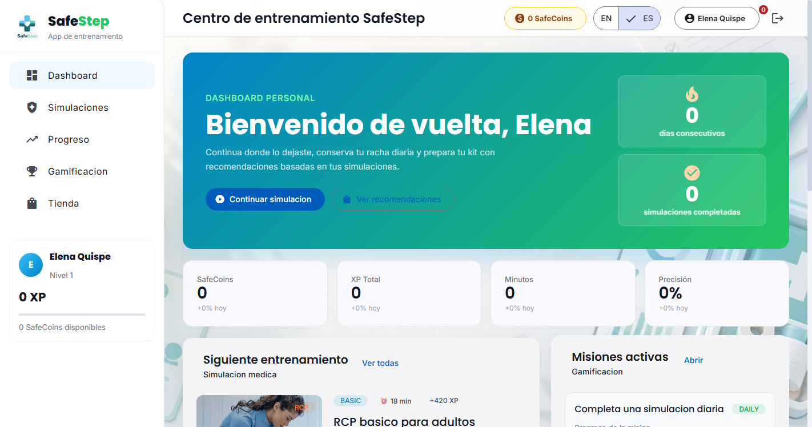
  <p><i><b>Fuente</b>: Elaboración propia.</i></p>
</div>

<div align="center">
  <p><b>Captura:</b> Catálogo de simulaciones</p>
  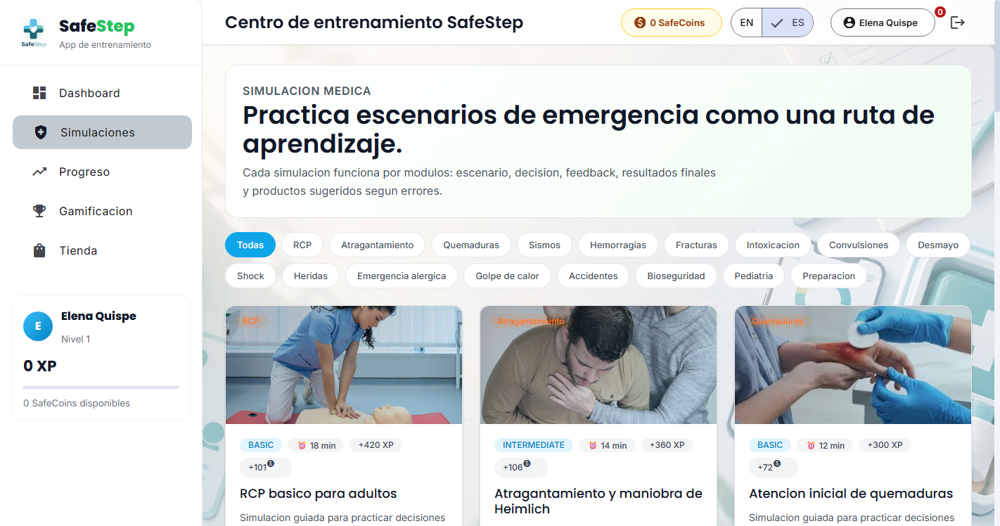
  <p><i><b>Fuente</b>: Elaboración propia.</i></p>
</div>

<div align="center">
  <p><b>Captura:</b> Tienda de productos</p>
  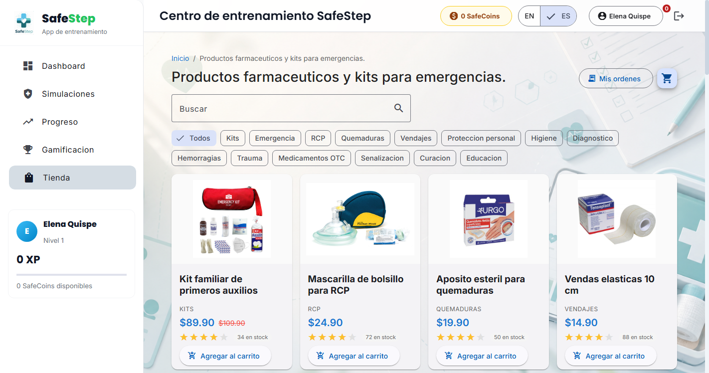
  <p><i><b>Fuente</b>: Elaboración propia.</i></p>
</div>

<div align="center">
  <p><b>Captura:</b> Página de canje de cupones de un jugador sin SafeCoins</p>
  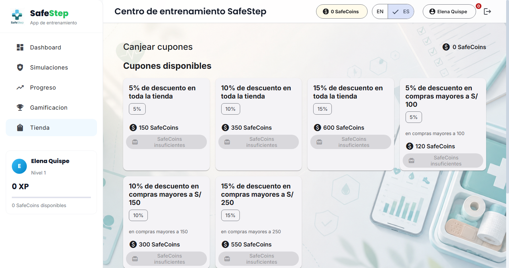
  <p><i><b>Fuente</b>: Elaboración propia.</i></p>
</div>

<div align="center">
  <p><b>Captura:</b> Panel de administración</p>
  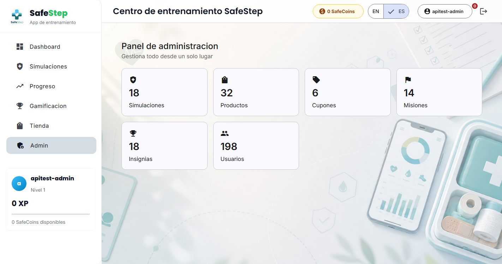
  <p><i><b>Fuente</b>: Elaboración propia.</i></p>
</div>


**Video de la navegación del Sprint:** <b>[POR COMPLETAR POR EL EQUIPO]</b>

#### 5.2.1.5.7. Services Documentation Evidence for Sprint Review

El Sprint 5 amplió la documentación OpenAPI del backend con los endpoints de roles y de canje de cupones, y modificó la creación de órdenes. Todos están publicados en la Swagger UI del backend desplegado en Render, <a href="https://safestept-backend-experimentos.onrender.com/swagger-ui/index.html">https://safestept-backend-experimentos.onrender.com/swagger-ui/index.html</a>, que lista 73 operaciones; la definición OpenAPI está en `/v3/api-docs`. Todos requieren autenticación; los de roles requieren además `ROLE_ADMIN`.

<div align="center">
  <p><b>Captura:</b> Swagger UI del backend publicado en Render</p>
  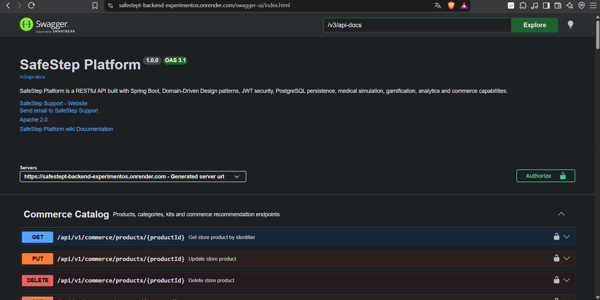
  <p><i><b>Fuente</b>: Elaboración propia.</i></p>
</div>


| Endpoint | Verbo | Descripción | Parámetros | Respuesta |
|----------|-------|-------------|------------|-----------|
| `/api/v1/users` | GET | Lista los usuarios (solo administrador) | — | 200 con la lista de usuarios y sus roles; 403 si no es administrador |
| `/api/v1/roles` | GET | Lista los roles disponibles (solo administrador) | — | 200 con `ROLE_USER`, `ROLE_INSTRUCTOR`, `ROLE_ADMIN` |
| `/api/v1/users/{userId}/roles` | PUT | Reemplaza los roles de un usuario | Ruta: `userId`. Cuerpo: `{"roles": ["ROLE_USER", "ROLE_INSTRUCTOR"]}` | 200 con el usuario actualizado; 422 `BUSINESS_RULE_VIOLATION` si el administrador intenta quitarse su propio rol o dejar al sistema sin administrador |
| `/api/v1/commerce/coupons/{couponId}/redeem` | POST | Canjea un cupón con los SafeCoins del usuario autenticado | Ruta: `couponId` (identificador del cupón del catálogo). Sin cuerpo | 201 con el cupón canjeado (`id`, `status: AVAILABLE`, `discountPercentage`, `minPurchaseAmount`); 422 si el saldo no alcanza; 404 si el cupón no existe |
| `/api/v1/commerce/coupons/redeemed/me` | GET | Lista los cupones canjeados por el usuario autenticado | — | 200 con la lista, cada cupón con su estado `AVAILABLE` o `USED` |
| `/api/v1/commerce/orders` | POST | Crea una orden; ahora acepta un cupón canjeado | Cuerpo: `status` y, opcional, `redeemedCouponExternalId` | 201 con `total`, `finalTotal` y `appliedDiscountPercentage`; 422 si el cupón no es del usuario, ya se usó o la compra no alcanza el mínimo |

<div align="center">
  <p><b>Captura:</b> Endpoint de canje de cupones en Swagger UI</p>
  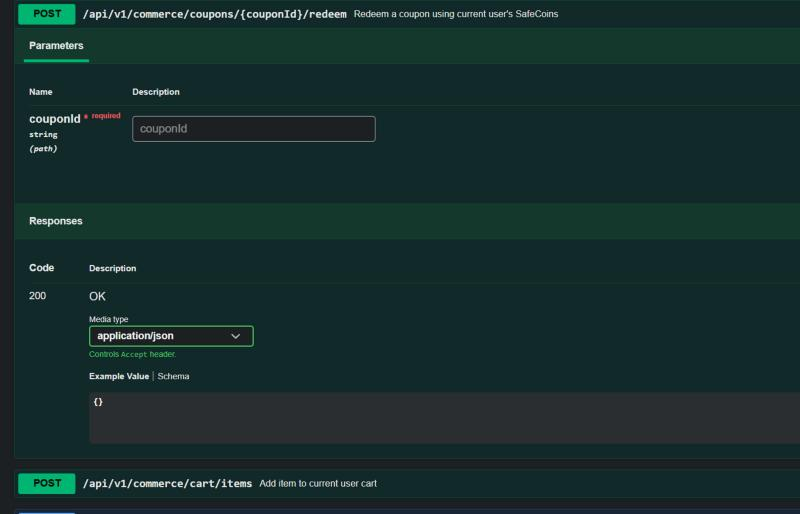
  <p><i><b>Fuente</b>: Elaboración propia.</i></p>
</div>

<div align="center">
  <p><b>Captura:</b> Endpoint de actualización de roles en Swagger UI</p>
  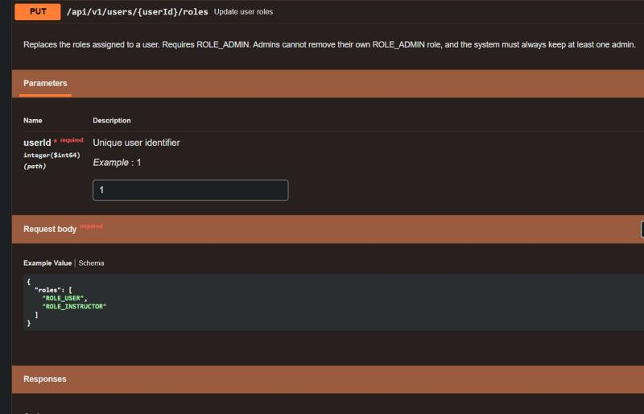
  <p><i><b>Fuente</b>: Elaboración propia.</i></p>
</div>


**Repositorio de Web Services:** [1ASI0732-2620-9090-Grupo-4/safestept-backend](https://github.com/1ASI0732-2620-9090-Grupo-4/safestept-backend). Los commits de este Sprint relacionados con servicios están en la tabla de 5.2.1.5.4 (`feat: add coupon redemption feature`).

**Observación sobre la documentación.** Al desplegar este Sprint, la respuesta del endpoint de canje aparecía documentada como `200` con un cuerpo vacío (`{}`) aunque el servicio responde `201` con el cupón canjeado. La anotación de respuesta se corrigió después, junto con las demás operaciones, y está descrita en 5.2.7.14.

#### 5.2.1.5.8. Software Deployment Evidence for Sprint Review

En el Sprint 5 el equipo desplegó el frontend, el backend y la base de datos en **Render**, en una cuenta propia, y dejó el proceso de integración continua con Jenkins y SonarQube corriendo en contenedores Docker locales. La Landing Page sigue publicada en GitHub Pages sin cambios.

**Recursos creados en Render (región Frankfurt):**

| Recurso | Tipo | Plan | Origen | URL |
|---------|------|------|--------|-----|
| `safestep-db` | PostgreSQL 18 | Free (1 GB) | Servicio gestionado | Hostname interno, accesible solo desde los servicios de la misma región |
| `safestept-backend-experimentos` | Web Service (runtime Docker) | Free | Repositorio `safestept-backend`, rama `main` | <a href="https://safestept-backend-experimentos.onrender.com">https://safestept-backend-experimentos.onrender.com</a> |
| `safestept-frontend-experimentos` | Static Site | Free | Repositorio `safestept-frontend`, rama `main` | <a href="https://safestept-frontend-experimentos.onrender.com">https://safestept-frontend-experimentos.onrender.com</a> |

**Actividades realizadas:**

1. Creación de la base de datos PostgreSQL `safestep-db`; Render generó el nombre de la base (`safestep_i9f3`), el usuario y la contraseña.
2. Creación del Web Service del backend a partir del `Dockerfile` del repositorio, en la misma región que la base de datos para usar su hostname interno.
3. Configuración de las variables de entorno del backend (tabla siguiente); ningún secreto se guarda en el repositorio.
4. Cambio de `src/environments/environment.ts` del frontend para apuntar a la URL del backend nuevo, y confirmación del cambio en `main` (commit `d9845f5`).
5. Creación del Static Site del frontend con el comando de compilación `npm ci && npm run build`, el directorio de publicación `dist/safestep-frontend-v2/browser` y la variable `NODE_VERSION=22`.
6. Regla de reescritura `/*` hacia `/index.html` para que las rutas de Angular (por ejemplo `/app/dashboard`) funcionen al recargar la página.
7. Registro del origen del frontend en la variable `SAFESTEP_CORS_ALLOWED_ORIGINS` del backend, que desde este Sprint ya no admite cualquier origen.
8. Activación del despliegue automático al recibir un commit (*Auto-Deploy: On Commit*) en ambos servicios.

**Variables de entorno del backend:**

| Variable | Contenido | Secreto |
|----------|-----------|---------|
| `DATABASE_URL` | Hostname interno de la base de datos | No |
| `DATABASE_PORT` | `5432` | No |
| `DATABASE_NAME` | `safestep_i9f3` | No |
| `DATABASE_USER` | `safestep` | No |
| `DATABASE_PASSWORD` | Contraseña de la base de datos | Sí |
| `JWT_SECRET` | Clave de firma de los tokens, generada al azar | Sí |
| `SPRING_PROFILES_ACTIVE` | `prod` | No |
| `SAFESTEP_ADMIN_USERNAME` y `SAFESTEP_ADMIN_PASSWORD` | Primer usuario administrador (se crea solo si no existe ninguno) | Sí |
| `SAFESTEP_CORS_ALLOWED_ORIGINS` | `http://localhost:4200` y la URL del frontend desplegado | No |
| `STRIPE_SECRET_KEY` | Clave secreta de Stripe | Sí |

**Resultado de los despliegues:**

| Servicio | Commit | Disparador | Duración | Estado | Fecha |
|----------|--------|------------|----------|--------|-------|
| Frontend | `d9845f5` chore: point the production environment to the new Render backend | Primer despliegue | 47 s | Deploy succeeded, Live | 8-10-2026, 8:03 PM (GMT-5) |
| Backend | `e47b082` Merge branch 'develop' into main | Manual desde el panel | 3 min 35 s | Deploy succeeded, Live | 8-10-2026, 8:10 PM (GMT-5) |

Al construir la imagen, el backend ejecuta en Render las 238 pruebas (sin fallos) antes de empaquetar el JAR. La compilación del frontend usó Node.js 22.23.3 y emitió una advertencia: el paquete inicial supera el presupuesto de 700 kB en 36.6 kB (736.61 kB en total).

<div align="center">
  <p><b>Captura:</b> Panel de la base de datos safestep-db en Render</p>
  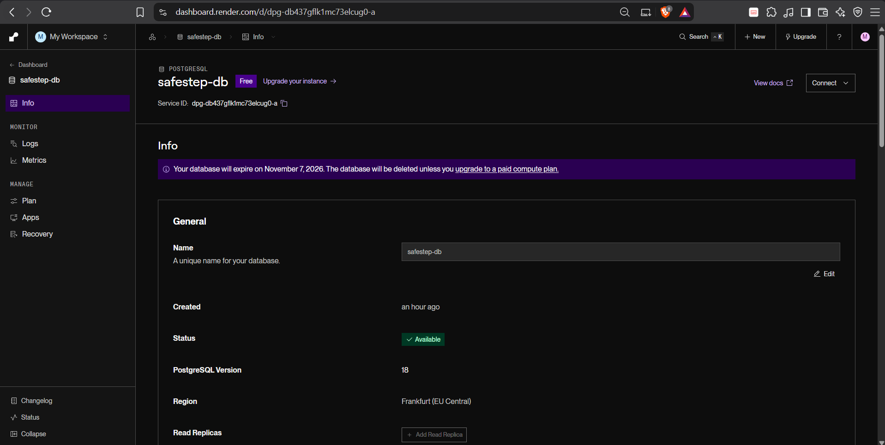
  <p><i><b>Fuente</b>: Elaboración propia.</i></p>
</div>

<div align="center">
  <p><b>Captura:</b> Variables de entorno del backend en Render (los secretos aparecen ocultos)</p>
  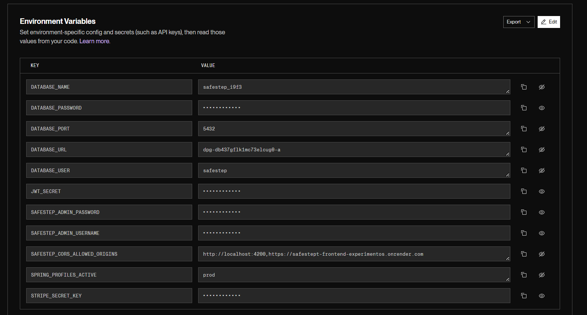
  <p><i><b>Fuente</b>: Elaboración propia.</i></p>
</div>

<div align="center">
  <p><b>Captura:</b> Despliegue del backend en Render: Deploy succeeded, Live</p>
  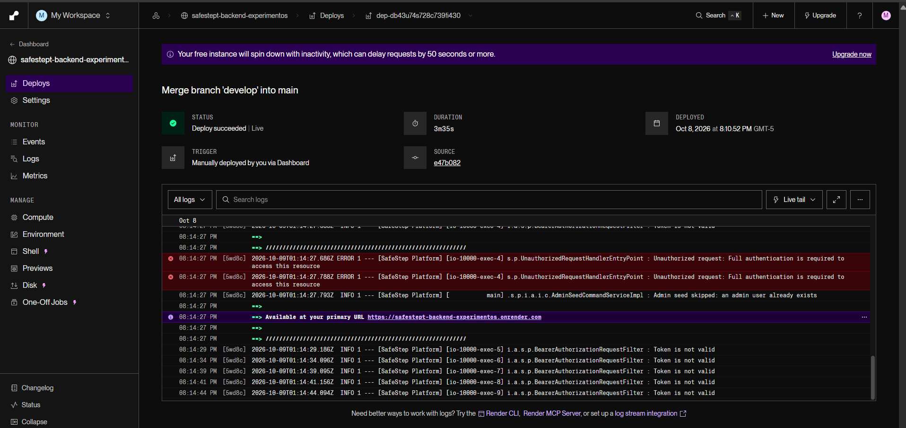
  <p><i><b>Fuente</b>: Elaboración propia.</i></p>
</div>

<div align="center">
  <p><b>Captura:</b> Despliegue del frontend en Render: Deploy succeeded, Live</p>
  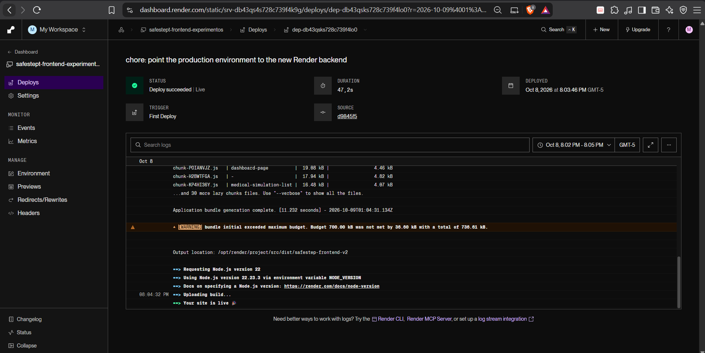
  <p><i><b>Fuente</b>: Elaboración propia.</i></p>
</div>


**Verificación posterior al despliegue** (pruebas de humo contra las URL públicas):

| Prueba | Resultado |
|--------|-----------|
| Frontend: `/`, `/auth` y `/app/dashboard` | HTTP 200; la regla de reescritura permite abrir rutas internas directamente |
| Backend: `/swagger-ui/index.html` y `/v3/api-docs` | HTTP 200 (73 operaciones publicadas) |
| Backend: endpoint protegido sin token | HTTP 401 |
| Backend: cuerpo JSON mal formado | HTTP 400 con `VALIDATION_ERROR` |
| CORS: petición previa desde el frontend desplegado | HTTP 200 con `Access-Control-Allow-Origin` igual a la URL del frontend |
| CORS: petición previa desde un origen desconocido | HTTP 403 |

<div align="center">
  <p><b>Captura:</b> Frontend de SafeStep publicado en Render (pantalla de inicio de sesión)</p>
  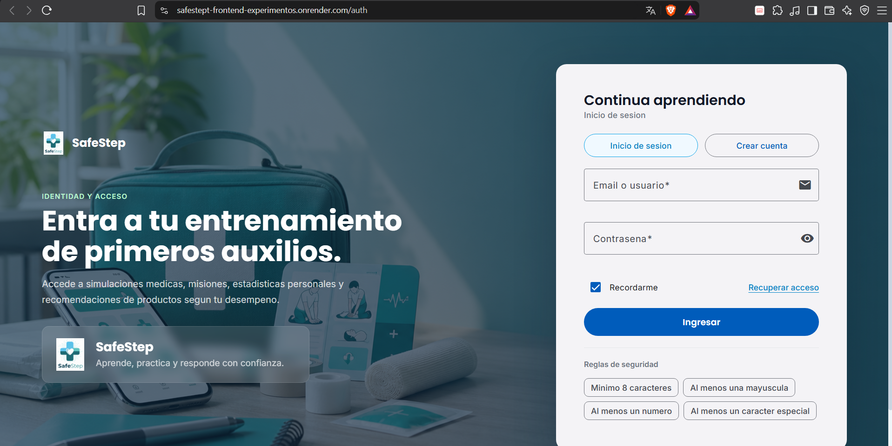
  <p><i><b>Fuente</b>: Elaboración propia.</i></p>
</div>


**Limitaciones del plan gratuito.** El backend se suspende tras unos 15 minutos sin tráfico y la primera petición posterior tarda al menos 50 segundos, y bastante más en este proyecto porque Spring Boot necesita varios minutos para arrancar con 0.1 CPU. La base de datos gratuita **caduca el 7 de noviembre de 2026** y se elimina si no se pasa a un plan de pago, por lo que debe migrarse o recrearse antes de esa fecha si el producto sigue en uso.

**Integración continua local.** Además del despliegue en Render, el trabajo de este Sprint incluyó los siguientes pasos de infraestructura de integración continua, que corren en el equipo del desarrollador:

1. Construcción de la imagen `safestep-jenkins:1.0` (Jenkins LTS con JDK 25 y, para compilar el proyecto, JDK 26 y Maven 3.9.11).
2. Creación del `docker-compose.yml` con Jenkins (puerto 9089) y SonarQube (puerto 9000) en la red `spring-postgres-net`.
3. Configuración de Jenkins con *Configuration as Code*: usuario administrador, servidor SonarQube `MiSonarServer`, credencial del token y el job `safestep-backend`.
4. Registro del webhook `http://jenkins-master:9089/sonarqube-webhook/` en SonarQube.
5. Escritura del `Jenkinsfile` y ejecución del pipeline sobre la rama `develop`.

El despliegue a Render no lo realiza Jenkins: lo dispara el propio repositorio o se lanza a mano desde el panel de Render; la entrega y el despliegue continuos mediante pipeline no forman parte de esta entrega.

<div align="center">
  <p><b>Captura:</b> Pipeline `safestep-backend` en Jenkins con sus etapas y ejecuciones</p>
  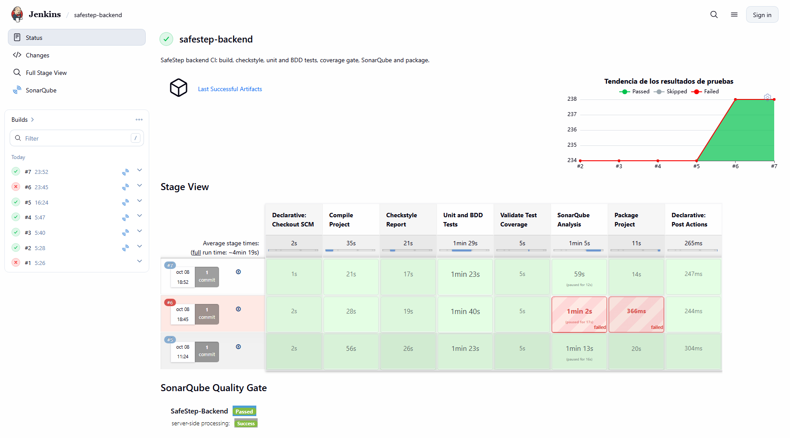
  <p><i><b>Fuente</b>: Elaboración propia.</i></p>
</div>

<div align="center">
  <p><b>Captura:</b> Panel de SonarQube del backend</p>
  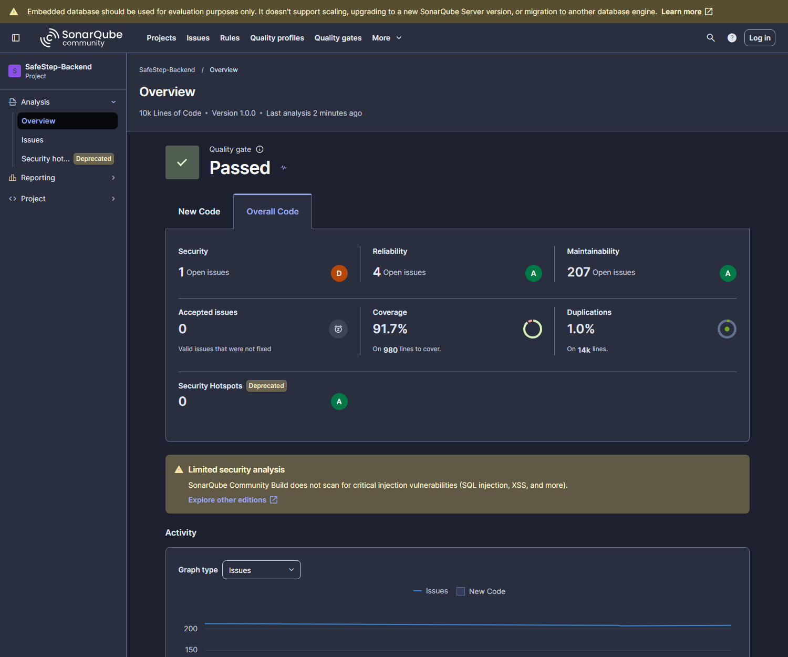
  <p><i><b>Fuente</b>: Elaboración propia.</i></p>
</div>


#### 5.2.1.5.9. Team Collaboration Insights during Sprint

En esta sección se explica cómo se desarrollaron las actividades del Sprint 5 y se presentan los analíticos de colaboración.

**Distribución de Trabajo:** el equipo repartió las 21 tareas del Sprint Backlog 5 por áreas: Aylas De La Cruz, Paulo Smit (panel de administración, roles y rediseño del cupón: T501 a T504); Melgarejo Quiroz, Josep Eliu (canje y descuento de cupones, y documentación: T505 a T509); Palacios Jáuregui, Kalid Jesus (mis cupones, pruebas unitarias y JaCoCo: T510 a T513); Sanchez Arenas, Manuel Angel (Checkstyle, BDD y Karate: T514 a T517) y Tello Palacios, Fabrizio Rafael (Jenkins, SonarQube y corrección de hallazgos: T518 a T521).

**Métricas de Colaboración:**

<table align="center" border="1" cellpadding="8" cellspacing="0" style="border-collapse: collapse; width: 100%; font-family: Arial, sans-serif;">
    <tbody>
        <tr><td><b>Miembro</b></td><td><b>Repositorio</b></td><td><b>Commits (según tareas asignadas)</b></td><td><b>Lineas additions</b></td><td><b>Lineas eliminadas</b></td><td><b>PRs merged</b></td></tr>
        <tr><td>Palacios Jáuregui, Kalid Jesus</td><td>safestept-backend</td><td>7</td><td>3,307</td><td>0</td><td>—</td></tr>
        <tr><td>Sanchez Arenas, Manuel Angel</td><td>safestept-backend</td><td>6</td><td>1,478</td><td>7</td><td>—</td></tr>
        <tr><td>Melgarejo Quiroz, Josep Eliu</td><td>safestept-backend / safestept-frontend</td><td>4</td><td>1,786</td><td>171</td><td>—</td></tr>
        <tr><td>Tello Palacios, Fabrizio Rafael</td><td>safestept-backend</td><td>7</td><td>554</td><td>122</td><td>—</td></tr>
        <tr><td>Aylas De La Cruz, Paulo Smit</td><td>safestept-frontend</td><td>1</td><td>1,343</td><td>94</td><td>—</td></tr>
    </tbody>
</table>

Los commits se asocian a cada integrante según las tareas del Sprint Backlog 5 (5.2.1.5.3) que implementan, y cada commit se cuenta una sola vez, en el área principal que modifica. Se consideran los 25 commits de desarrollo del Sprint en los repositorios de backend y frontend (23 y 2 respectivamente; los commits de las pruebas de sistema del frontend, que se retiraron del alcance, no se cuentan). Los commits asociados son: Palacios (`d0e6e94`, `78aaf5d`, `c60f963`, `1c9d1ed`, `1aa5aaf`, `2e17510`, `15f374c`), Sanchez (`13728a1`, `68b41bc`, `0d82694`, `cf31022`, `ad364ca`, `dd3c9dc`), Melgarejo (`f77dfef`, `d9845f5`, `8a060b0`, `88478a2`), Tello (`837a2c2`, `3f287c5`, `b327a39`, `dd3a16e`, `5dfcbdb`, `c95ca77`, `d5faeed`) y Aylas (`be56a72`). Las líneas se obtuvieron con `git show --numstat` sobre esos commits. La columna de PRs queda vacía porque no se registraron Pull Requests: la integración se hizo con ramas `feature/*` fusionadas a `develop`. Las capturas de GitHub Insights (Contributors, Commits) y la interpretación del equipo deben añadirse una vez publicadas las ramas en GitHub, porque los analíticos de GitHub solo reflejan lo que está en el repositorio remoto.

