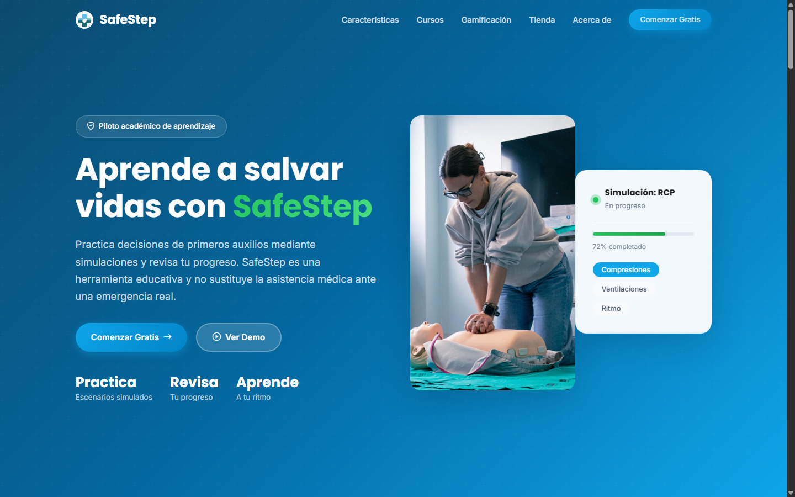
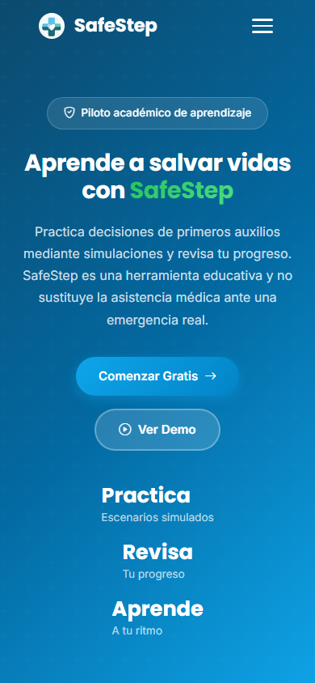
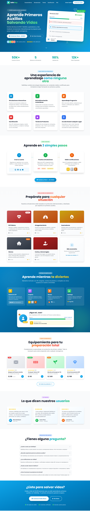
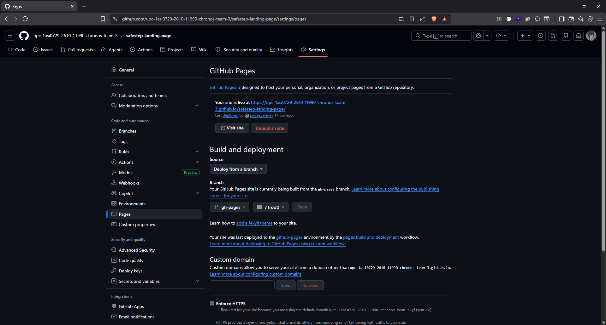

 
 

    

 
 

# 5.2. Landing Page, Services & Applications Implementation.

## 5.2.2. Implemented Landing Page Evidence

Esta sección reúne la evidencia de la Landing Page de SafeStep, el sitio público que presenta el producto a las personas que lo visitan por primera vez. Su construcción se planificó y ejecutó en el Sprint 1 (5.2.1.1), y aquí se consolidan sus características, su correspondencia con las historias de usuario del Product Backlog (3.3), su aspecto final y su publicación.

### 5.2.2.1. Descripción de la Landing Page

La Landing Page es un sitio estático escrito con HTML5, CSS y JavaScript sin frameworks. Se organiza en dos páginas y los recursos que las acompañan:

| Archivo | Contenido | Tamaño |
|---------|-----------|--------|
| `index.html` | Página principal con las secciones *hero*, características, cómo funciona, cursos, gamificación, tienda, preguntas frecuentes y llamado a la acción | 578 líneas |
| `about.html` | Página «Acerca de» con la presentación del equipo | 422 líneas |
| `styles.css` | Estilos, diseño adaptable y tema visual | 2,865 líneas |
| `script.js` | Menú móvil y acordeón de preguntas frecuentes; también conserva el código de un carrusel de testimonios que la página actual no usa | 263 líneas |
| `assets/images` | Logotipo e imágenes del producto | — |

El contenido destaca que SafeStep es una herramienta educativa en fase de piloto académico y que no sustituye la atención médica ante una emergencia real, de acuerdo con los límites éticos definidos en el capítulo I.

### 5.2.2.2. Correspondencia con las historias de usuario

| Historia | Título | Estado | Evidencia en la Landing Page |
|----------|--------|--------|------------------------------|
| US47 | Visualizar propuesta de valor en la landing page | Implementada | Sección principal (*hero*) con el título «Aprende a salvar vidas con SafeStep», el aviso de piloto académico y la aclaración de que la herramienta no sustituye la atención médica |
| US48 | Navegar por secciones de la landing | Implementada | Barra de navegación con anclas a Características, Cursos, Gamificación y Tienda, y enlace a «Acerca de» |
| US49 | Conocer las simulaciones ofrecidas | Implementada | Sección «Escenarios interactivos» con RCP, maniobra de Heimlich, quemaduras, control de hemorragias, preparación ante sismos y cortes y heridas menores |
| US50 | Conocer el sistema de gamificación | Implementada | Sección «Aprender nunca fue tan adictivo» con las mecánicas de puntos de experiencia, insignias, rachas y rankings |
| US51 | Conocer la tienda de productos | Implementada | Sección «Equípate para cualquier emergencia» con un catálogo ilustrativo de productos, aclarado como demostración del piloto académico |
| US52 | Leer testimonios de usuarios | No implementada | La landing no incluye testimonios porque aún no se cuenta con testimonios reales de usuarios |
| US53 | Consultar preguntas frecuentes | Implementada | Sección de preguntas frecuentes con acordeón desplegable |
| US54 | Acceder a registro desde la landing | Implementada | Botones «Comenzar Gratis» en la barra de navegación y en la sección principal, que abren la aplicación web |
| US55 | Visualizar la landing en dispositivos móviles | Implementada | Diseño adaptable con menú de hamburguesa y superposición móvil, verificado con la captura de 390 px de ancho |
| US56 | Ver información de contacto y marca | Parcial | El pie de página muestra la marca, la descripción de Chronos y el copyright; no incluye todavía datos de contacto |

Ocho de las diez historias están implementadas, una lo está de forma parcial (US56) y una queda pendiente (US52).

### 5.2.2.3. Evidencia visual

Los wireframes y mockups del capítulo IV sirvieron de referencia para el diseño. Las capturas siguientes muestran la landing en escritorio y en un teléfono, junto al mockup de escritorio que sirvió de referencia.

  
<b>Captura:</b> Sección principal de la Landing Page en escritorio

  
  
<i><b>Fuente</b>: Elaboración propia.</i>

  
<b>Captura:</b> Sección principal de la Landing Page en un teléfono (390 px de ancho)

  
  
<i><b>Fuente</b>: Elaboración propia.</i>

  
<b>Captura:</b> Mockup de escritorio del capítulo IV tomado como referencia

  
  
<i><b>Fuente</b>: Elaboración propia.</i>

### 5.2.2.4. Despliegue

La Landing Page se publica en GitHub Pages a partir de la rama `gh-pages`, con HTTPS obligatorio. El procedimiento está descrito en 5.1.4.2.1.

| Elemento | Valor |
|----------|-------|
| URL pública | <a href="https://upc-1asi0729-2610-11990-chronos-team-3.github.io/safestep-landing-page/">https://upc-1asi0729-2610-11990-chronos-team-3.github.io/safestep-landing-page/</a> |
| Plataforma | GitHub Pages (despliegue desde la rama `gh-pages`) |
| Repositorio de código | <a href="https://github.com/1ASI0732-2620-9090-Grupo-4/safestept-landing-page">https://github.com/1ASI0732-2620-9090-Grupo-4/safestept-landing-page</a> |

  
<b>Captura:</b> Configuración de GitHub Pages de la Landing Page: sitio activo, rama gh-pages y HTTPS obligatorio

  
  
<i><b>Fuente</b>: Elaboración propia.</i>

**Enlace hacia la aplicación.** Los botones «Comenzar Gratis» abren la aplicación web. Tras la corrección del hito (commit `fix: point frontend call-to-action links to the new deployed application`), todos los botones de la landing («Comenzar Gratis» y «Explorar plataforma») apuntan a la aplicación desplegada por el equipo: <a href="https://safestept-frontend-experimentos.onrender.com">https://safestept-frontend-experimentos.onrender.com</a>. Antes apuntaban a una instalación anterior del frontend.

### 5.2.2.5. Repositorio y commits

<table align="center" border="1" cellpadding="8" cellspacing="0" style="border-collapse: collapse; width: 100%; font-family: Arial, sans-serif;">
    <tbody>
        <tr><td><b>Repository</b></td><td><b>Branch</b></td><td><b>Commit Id</b></td><td><b>Commit Message</b></td><td><b>Committed on (Date)</b></td></tr>
        <tr><td>safestept-landing-page</td><td>main</td><td>76700a8</td><td>Initial commit</td><td>05/09/2026</td></tr>
        <tr><td>safestept-landing-page</td><td>main</td><td>d20a0d8</td><td>chore: add initial project files and assets</td><td>05/09/2026</td></tr>
        <tr><td>safestept-landing-page</td><td>main</td><td>208e670</td><td>fix: point frontend call-to-action links to the new deployed application</td><td>08/10/2026</td></tr>
    </tbody>
</table>
