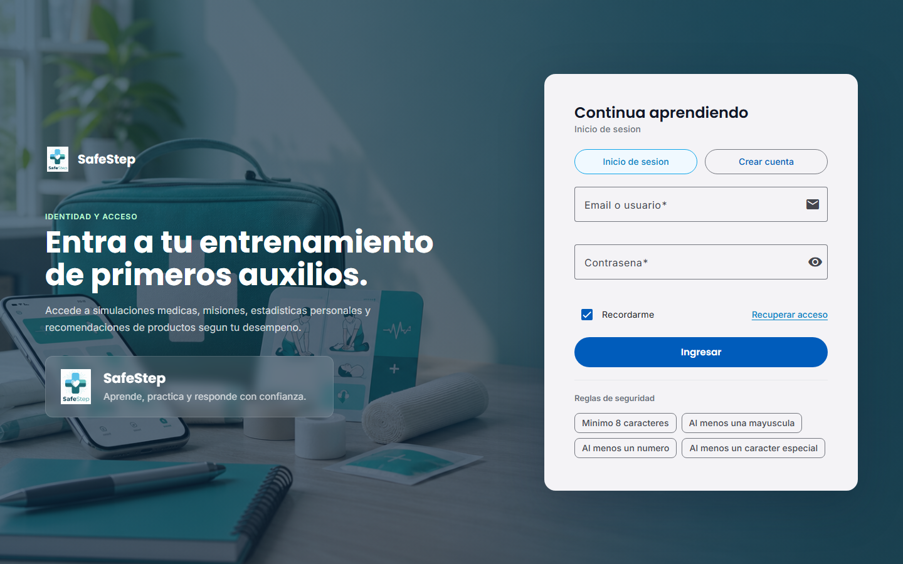
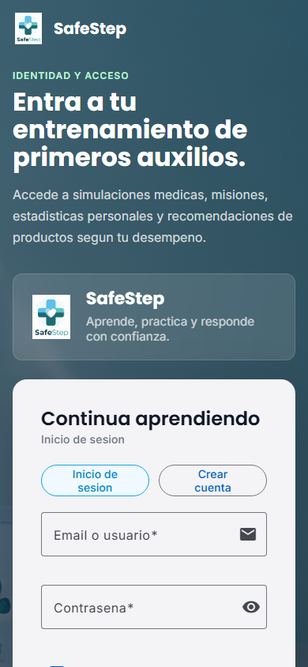
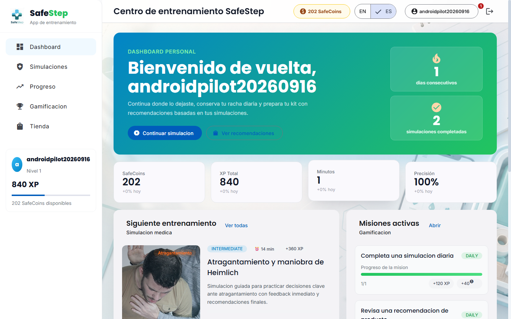
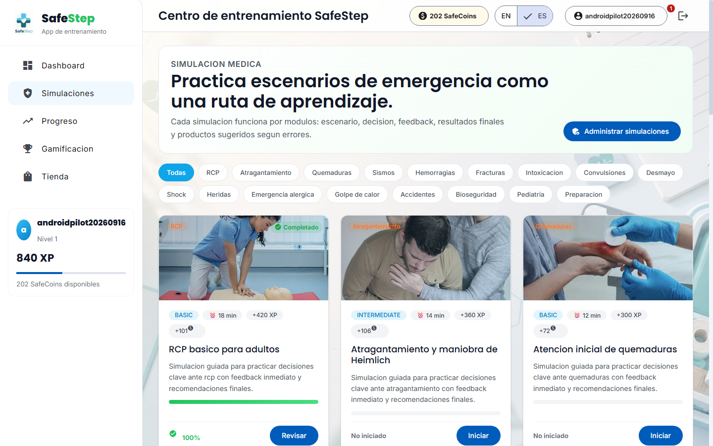

 
 

    

 
 

# 5.2. Landing Page, Services & Applications Implementation.

## 5.2.3. Implemented Frontend-Web Application Evidence

Esta sección reúne la evidencia de la aplicación web de SafeStep, el frontend con el que las personas practican simulaciones, siguen su progreso, ganan recompensas y compran productos. Se construyó en el Sprint 2 (5.2.1.2), se conectó al backend real en el Sprint 3 (5.2.1.3), incorporó autenticación y pagos en el Sprint 4 (5.2.1.4) y recibió el panel de administración y el canje de cupones en el Sprint 5 (5.2.1.5).

### 5.2.3.1. Arquitectura y tecnologías

| Aspecto | Decisión |
|---------|----------|
| Framework | Angular 21 con componentes *standalone* y carga diferida de cada módulo (`loadChildren` y `loadComponent`) |
| Interfaz | Angular Material 21 y diseño adaptable |
| Idiomas | Español e inglés con ngx-translate 17; el selector ES/EN está en la barra superior |
| Estado | Un *store* basado en *signals* por bounded context: `identity-access`, `medical-simulation`, `gamification`, `ecommerce`, `statistics` y `user-admin` |
| Organización | Domain-Driven Design con las capas `domain`, `application`, `infrastructure` y `presentation` dentro de cada bounded context; la capa de infraestructura contiene un *endpoint*, un tipo de respuesta y un *assembler* por recurso de la API |
| Seguridad | Interceptor HTTP que añade el token JWT, guardia de sesión (`authGuard`) y guardia de administrador (`adminGuard`) |
| Pruebas | Vitest con jsdom configurado para las pruebas unitarias del frontend; hoy solo existe la prueba de arranque `app.spec.ts`, y la verificación funcional descansa en las suites del backend (6.1) |

El código tiene 151 archivos TypeScript, 25 componentes de vista y 23 *endpoints* de infraestructura que consumen la API REST (5.2.7).

### 5.2.3.2. Módulos y rutas

La aplicación tiene 30 rutas distribuidas en seis módulos. Todas las rutas internas cuelgan de `/app` y exigen sesión iniciada; las de administración exigen además el rol de administrador.

| Módulo | Rutas | Vista | Acceso |
|--------|-------|-------|--------|
| Identidad y acceso | `/auth` | Inicio de sesión y registro | Público |
| Identidad y acceso | `/app/profile` | Perfil del usuario | Sesión iniciada |
| Identidad y acceso | `/app/users`, `/app/users/edit/:id` | Listado de usuarios y edición de roles | Administrador |
| Compartido | `/app/dashboard` | Dashboard personal | Sesión iniciada |
| Compartido | `/app/admin` | Panel de administración con conteos por módulo | Administrador |
| Simulación médica | `/app/simulations`, `/app/simulations/:id` | Catálogo de simulaciones y detalle para practicar | Sesión iniciada |
| Simulación médica | `/app/simulations/admin`, `/new`, `/edit/:id` | Gestión de simulaciones | Administrador |
| Estadísticas | `/app/statistics` | Progreso y estadísticas personales | Sesión iniciada |
| Gamificación | `/app/gamification` | Nivel, SafeCoins, misiones, insignias y ranking | Sesión iniciada |
| Gamificación | `/app/gamification/admin/missions`, `/admin/badges` (listado, `/new`, `/edit/:id`) | Gestión de misiones e insignias | Administrador |
| Comercio | `/app/store`, `/app/store/products/:id` | Tienda, carrito, checkout y detalle de producto | Sesión iniciada |
| Comercio | `/app/store/coupons` | Canje de cupones con SafeCoins y «Mis cupones» | Sesión iniciada |
| Comercio | `/app/payment/success`, `/app/payment/cancel` | Resultado del pago con Stripe | Sesión iniciada |
| Comercio | `/app/store/admin/products`, `/admin/coupons` (listado, `/new`, `/edit/:id`) | Gestión de productos y cupones | Administrador |

### 5.2.3.3. Vistas implementadas

Las capturas siguientes muestran las vistas principales con datos reales del backend.

  
<b>Captura:</b> Pantalla de inicio de sesión y registro

  
  
<i><b>Fuente</b>: Elaboración propia.</i>

  
<b>Captura:</b> Inicio de sesión en un teléfono (diseño adaptable)

  
  
<i><b>Fuente</b>: Elaboración propia.</i>

  
<b>Captura:</b> Dashboard personal con SafeCoins, XP, racha, siguiente entrenamiento y misiones activas

  
  
<i><b>Fuente</b>: Elaboración propia.</i>

  
<b>Captura:</b> Catálogo de simulaciones con filtros por tipo de emergencia y estado de avance

  
  
<i><b>Fuente</b>: Elaboración propia.</i>

  
<b>Captura:</b> Tienda de productos y kits de emergencia

  
  
<i><b>Fuente</b>: Elaboración propia.</i>

  
<b>Captura:</b> Página de canje de cupones con SafeCoins

  
  
<i><b>Fuente</b>: Elaboración propia.</i>

  
<b>Captura:</b> Panel de administración con los seis módulos gestionables

  
  
<i><b>Fuente</b>: Elaboración propia.</i>

### 5.2.3.4. Conexión con el backend

La URL base del API de cada entorno se define en `src/environments`: `environment.development.ts` apunta al backend local y `environment.ts`, que se usa al compilar para producción, apunta al backend desplegado en Render, <a href="https://safestept-backend-experimentos.onrender.com">https://safestept-backend-experimentos.onrender.com</a>. Los tokens de sesión se guardan en el almacenamiento local del navegador y el interceptor los añade a cada petición. El backend solo acepta peticiones de navegador desde los orígenes que declara en `SAFESTEP_CORS_ALLOWED_ORIGINS`, entre ellos la URL del frontend desplegado.

### 5.2.3.5. Despliegue

La aplicación web se publica en Render como Static Site. El detalle de la configuración, los resultados del despliegue y las verificaciones posteriores están en 5.1.4.2.2 y 5.2.1.5.8.

| Elemento | Valor |
|----------|-------|
| URL pública | <a href="https://safestept-frontend-experimentos.onrender.com">https://safestept-frontend-experimentos.onrender.com</a> |
| Plataforma | Render Static Site (plan gratuito), despliegue automático al hacer commit en `main` |
| Build | `npm ci && npm run build`, con `NODE_VERSION=22` |
| Directorio publicado | `dist/safestep-frontend-v2/browser` |
| Repositorio | <a href="https://github.com/1ASI0732-2620-9090-Grupo-4/safestept-frontend">https://github.com/1ASI0732-2620-9090-Grupo-4/safestept-frontend</a> |

  
<b>Captura:</b> Aplicación web de SafeStep publicada en Render

  
  
<i><b>Fuente</b>: Elaboración propia.</i>

  
<b>Captura:</b> Despliegue del frontend en Render: Deploy succeeded, Live

  
  
<i><b>Fuente</b>: Elaboración propia.</i>

### 5.2.3.6. Repositorio y commits

El historial de commits de la rama `main` del repositorio, tal como está publicado en GitHub, es el siguiente:

<table align="center" border="1" cellpadding="8" cellspacing="0" style="border-collapse: collapse; width: 100%; font-family: Arial, sans-serif;">
    <tbody>
        <tr><td><b>Repository</b></td><td><b>Branch</b></td><td><b>Commit Id</b></td><td><b>Commit Message</b></td><td><b>Committed on (Date)</b></td></tr>
        <tr><td>safestept-frontend</td><td>main</td><td>2b549ad</td><td>Initial commit</td><td>05/09/2026</td></tr>
        <tr><td>safestept-frontend</td><td>main</td><td>b86d1bc</td><td>chore: add initial project files</td><td>05/09/2026</td></tr>
        <tr><td>safestept-frontend</td><td>main</td><td>be56a72</td><td>feat: add admin and coupon redemption features</td><td>17/09/2026</td></tr>
        <tr><td>safestept-frontend</td><td>main</td><td>d9845f5</td><td>chore: point the production environment to the new Render backend</td><td>08/10/2026</td></tr>
    </tbody>
</table>
