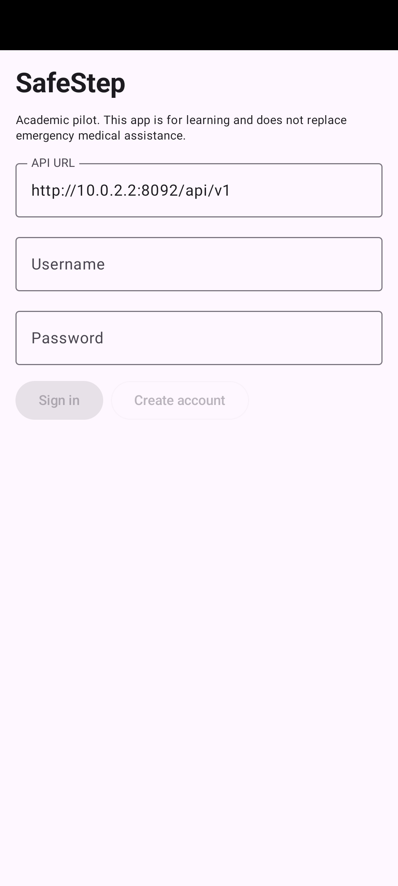
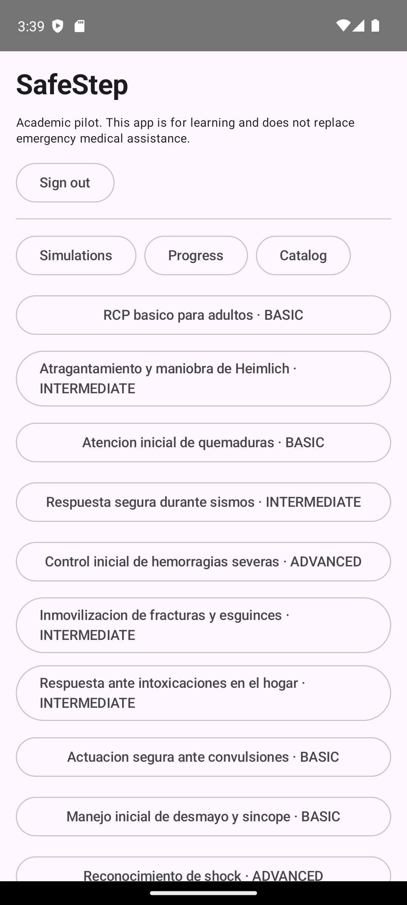
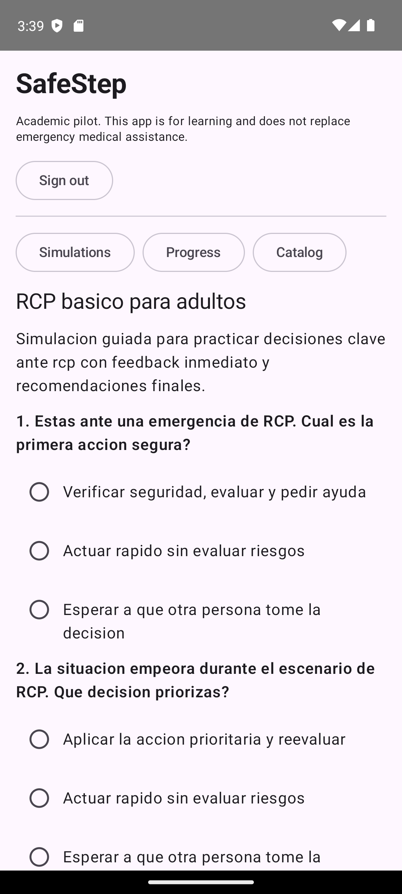
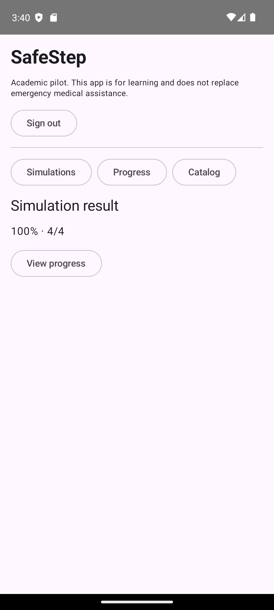
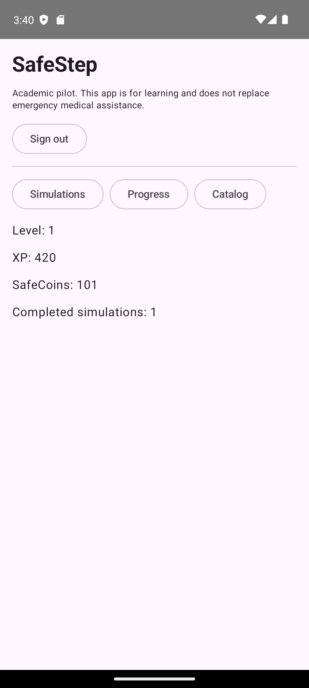
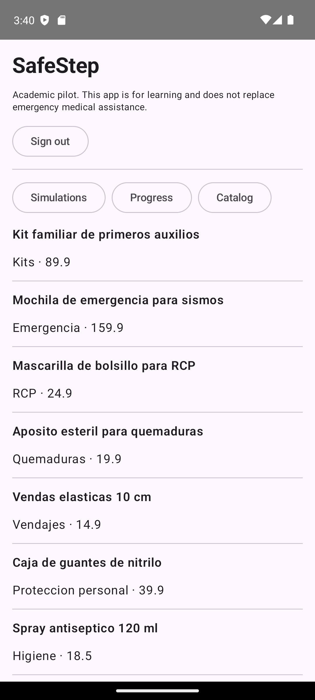

 
 

    

 
 

# 5.2. Landing Page, Services & Applications Implementation.

## 5.2.5. Implemented Native-Mobile Application Evidence

Esta sección reúne la evidencia de la aplicación móvil nativa de SafeStep, un cliente Android escrito en Kotlin que consume la misma API REST que la aplicación web (5.2.7). Es un piloto académico: cubre el recorrido principal de práctica (iniciar sesión, resolver una simulación, ver el progreso y consultar el catálogo) y deja la administración en la aplicación web. El código está en el repositorio <a href="https://github.com/1ASI0732-2620-9090-Grupo-4/safeStept-android.git" style="word-break: break-all; overflow-wrap: anywhere;">https://github.com/1ASI0732-2620-9090-Grupo-4/safeStept-android.git</a>. La verificación se realizó el 8 de octubre de 2026 con la versión `0.1.0`.

### 5.2.5.1. Alcance respecto a las historias de usuario

La aplicación implementa las siguientes historias del Product Backlog (3.3). «Parcial» indica que la app cubre la parte principal de la historia, pero no todos sus criterios.

| Historia | Título | Estado | Qué hace la aplicación |
|----------|--------|--------|------------------------|
| US01 | Iniciar sesión en la aplicación | Cubierta | Pantalla de usuario y contraseña; el token de acceso queda solo en memoria |
| US02 | Registrarse en SafeStep | Cubierta | Botón «Create account»; registra al usuario e inicia sesión de inmediato |
| US10 | Visualizar catálogo de simulaciones | Cubierta | Lista las simulaciones con su título y dificultad |
| US12 | Revisar detalle de una simulación antes de iniciar | Parcial | Muestra título, descripción y pasos al abrir la simulación; no hay una pantalla previa separada |
| US13 | Responder pasos de una simulación | Cubierta | Una opción por paso, con selección única |
| US14 | Finalizar una simulación | Cubierta | El botón «Finish simulation» se habilita solo cuando todos los pasos tienen respuesta |
| US15 | Recibir SafeCoins por completar una simulación | Parcial | La app envía el intento y el backend otorga las SafeCoins; la app las muestra en «Progress», pero no informa la recompensa al terminar |
| US16 | Ver resumen final de simulación | Parcial | Muestra el puntaje y los pasos correctos (por ejemplo, 100 % y 4/4); no muestra el retorno por paso |
| US18 | Visualizar resumen general de progreso | Parcial | Muestra nivel, XP, SafeCoins y simulaciones completadas; no muestra la racha ni gráficos |
| US30 | Visualizar productos relevantes en tienda | Parcial | Lista los productos con categoría y precio; no tiene búsqueda, filtros ni detalle |

No forman parte de la aplicación móvil: el perfil de usuario (US03), la búsqueda de simulaciones (US11), los productos sugeridos según errores (US17), la búsqueda, el filtro y el detalle de productos y kits (US31 a US35), el carrito, los cupones, las compras y todo el panel de administración.

### 5.2.5.2. Arquitectura y stack

| Aspecto | Decisión |
|---------|----------|
| Lenguaje y plataforma | Kotlin sobre Android; `applicationId` `com.safestep.mobile`, `minSdk` 26, `targetSdk` 35, `compileSdk` 37 |
| Interfaz | Jetpack Compose con Material 3 (Compose BOM 2026.08.00) y una sola actividad, `MainActivity` |
| Asincronía | Corrutinas de Kotlin (`kotlinx-coroutines-android` 1.10.2); las llamadas de red se ejecutan en `Dispatchers.IO` |
| Cliente HTTP | `HttpURLConnection` de la plataforma con JSON de `org.json`; no se usan librerías de red adicionales |
| Construcción | Android Gradle Plugin 9.3.2, Kotlin con el plugin de Compose 2.3.21 y Gradle 9.5.0 |
| Idiomas | Recursos de texto en inglés y en español (`values` y `values-es`); la verificación se hizo con el dispositivo en inglés |
| Seguridad | `allowBackup` desactivado; el tráfico HTTP sin cifrar solo se permite en la variante `debug`, para llegar al backend local desde el emulador; la app no contiene claves de Stripe ni credenciales de base de datos |

El código fuente tiene tres archivos principales:

| Archivo | Líneas | Responsabilidad |
|---------|--------|-----------------|
| `MainActivity.kt` | 247 | Interfaz y estado de la pantalla: acceso, pestañas de simulaciones, progreso y catálogo, y resultado |
| `data/SafeStepApi.kt` | 166 | Cliente de la API, modelos (`Simulation`, `SimulationStep`, `Progress`, `Product`) y lectura del JSON |
| `data/AttemptScorer.kt` | 37 | Calcula puntaje, aciertos, tiempo y errores de un intento a partir de las respuestas elegidas |

La aplicación consume estos *endpoints* de la API REST (5.2.7), con la URL base `http://10.0.2.2:8092/api/v1` por defecto, que es la dirección con la que el emulador llega al backend de la computadora y que se puede cambiar en la pantalla de acceso:

| Función | Método y ruta |
|---------|---------------|
| Registro | `POST /authentication/sign-up` |
| Inicio de sesión | `POST /authentication/sign-in` |
| Catálogo de simulaciones | `GET /simulations` |
| Detalle de una simulación | `GET /simulations/{id}` |
| Envío de un intento | `POST /simulations/{id}/attempts` |
| Progreso | `GET /gamification/summary/me` |
| Catálogo de productos | `GET /commerce/products` |

**Artefacto.** El comando `./gradlew assembleDebug` genera el APK `app/build/outputs/apk/debug/app-debug.apk`, de aproximadamente 11.5 MB, firmado con la clave de depuración de Android y con la versión `0.1.0` (`versionCode` 1). Es el APK que se instaló en el emulador para la verificación. No se generó ni se distribuyó un APK firmado de publicación.

### 5.2.5.3. Evidencia de pruebas

Las pruebas y el flujo manual se ejecutaron el 8 de octubre de 2026 contra la rama `develop` del backend (242 pruebas aprobadas, 6.1), levantada localmente con una base de datos PostgreSQL 18 temporal y con la URL base por defecto del emulador. El emulador usado fue un Pixel 7 con Android 13.

| Tipo | Herramienta | Qué verifica | Resultado |
|------|-------------|--------------|-----------|
| Compilación | Gradle `assembleDebug` | Que la aplicación compila y empaqueta | Correcta |
| Unitaria | JUnit 4.13.2 | `AttemptScorerTest`: puntaje al mezclar respuestas correctas e incorrectas (50 %, 1 de 2 pasos, 60 s, error en el paso 2) y simulación sin pasos sin división por cero | 2 de 2 aprobadas |
| Instrumentada | Compose UI Test en el emulador | `MainActivityTest`: la pantalla sin sesión muestra el título, «Sign in» y «Create account» | 1 de 1 aprobada |
| Funcional manual | Emulador y `adb` | Recorrido completo contra el backend local (tabla siguiente) | Sin fallos |

Recorrido funcional manual:

| Paso | Acción | Resultado observado |
|------|--------|---------------------|
| 1 | Crear una cuenta nueva | Se registra, inicia sesión y muestra las simulaciones |
| 2 | Abrir «RCP básico para adultos» | Muestra la descripción y los 4 pasos con sus opciones |
| 3 | Responder los 4 pasos y pulsar «Finish simulation» | El botón se habilita solo con todos los pasos respondidos; el intento se envía correctamente |
| 4 | Ver el resultado | 100 % con 4/4 pasos correctos |
| 5 | Abrir «Progress» | Nivel 1, 420 XP, 101 SafeCoins y 1 simulación completada |
| 6 | Abrir «Catalog» | Lista los productos con categoría y precio |

Las pruebas de la aplicación son pocas (tres) y no cubren el cliente de la API ni los errores de red; la garantía funcional del recorrido descansa sobre las suites del backend (6.1).

### 5.2.5.4. Capturas del flujo

Capturas tomadas en el emulador durante el recorrido anterior.

<table>
<tr>
<td align="center"> <i><b>Figura 5.2.5.1.</b> Pantalla de acceso con la URL de la API. <b>Fuente</b>: Elaboración propia.</i></td>
<td align="center"> <i><b>Figura 5.2.5.2.</b> Catálogo de simulaciones. <b>Fuente</b>: Elaboración propia.</i></td>
<td align="center"> <i><b>Figura 5.2.5.3.</b> Pasos de una simulación. <b>Fuente</b>: Elaboración propia.</i></td>
</tr>
<tr>
<td align="center"> <i><b>Figura 5.2.5.4.</b> Resultado de la simulación. <b>Fuente</b>: Elaboración propia.</i></td>
<td align="center"> <i><b>Figura 5.2.5.5.</b> Progreso del usuario. <b>Fuente</b>: Elaboración propia.</i></td>
<td align="center"> <i><b>Figura 5.2.5.6.</b> Catálogo de productos. <b>Fuente</b>: Elaboración propia.</i></td>
</tr>
</table>

### 5.2.5.5. Limitaciones

- **Alcance reducido.** Es un piloto de un solo recorrido; no incluye perfil, carrito, cupones, compras ni administración (5.2.5.1).
- **Arquitectura mínima.** El estado vive dentro de la función composable de `MainActivity` y no hay ViewModel, navegación entre pantallas, ni separación en capas de dominio, aplicación e infraestructura como en el frontend web y el backend. Mantener y ampliar la app exigiría reorganizarla.
- **Sesión corta.** La app guarda solo el token de acceso, en memoria, y no usa el *refresh token*: al cerrar la aplicación o al expirar el token hay que iniciar sesión de nuevo.
- **Puntaje calculado en el cliente.** `AttemptScorer` calcula el puntaje con la respuesta correcta que entrega la API y lo envía; el backend solo valida que esté entre 0 y 100.
- **Errores poco amigables.** Los fallos de red o de la API se muestran como texto técnico (por ejemplo, `HTTP 401` seguido del cuerpo de la respuesta).
- **Presentación del catálogo.** Los precios se muestran sin símbolo de moneda.
- **Pocas pruebas.** Hay dos pruebas unitarias y una instrumentada; no hay pruebas del cliente de la API.
- **Sin distribución.** No existe un APK firmado de publicación ni una publicación en una tienda; el repositorio contenía un único commit inicial al momento de la verificación.
- **Entorno de Windows.** La ruta del proyecto contiene la letra «ñ», con la que Gradle no localiza las clases de prueba; las pruebas se ejecutaron montando la carpeta en una unidad con ruta ASCII (`subst`), como indica el README del repositorio.
