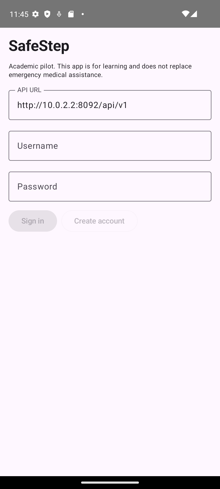

# 5.2. Product Implementation & Deployment

SafeStep parte de una aplicación existente. Esta sección separa **línea base heredada**, **implementación comprobada en el repositorio actual** y **entregables pendientes del nuevo curso**. Una captura antigua, una URL del curso anterior o una funcionalidad descrita en un README no demuestran por sí mismas que la versión actual esté desplegada. Las pruebas detalladas pertenecen al capítulo VI; aquí se registra su vínculo con productos y sprints.

| Estado de evidencia | Significado utilizado en esta sección |
|---|---|
| Implementado en código | Se localizó el archivo, ruta o componente en los repositorios actuales. |
| Probado localmente | Existe un resultado de compilación/prueba ejecutado sobre el código actual. |
| Desplegado/verificado | Se comprobó una URL pública y se registró fecha, versión y captura. |
| Pendiente | Falta artefacto, revisión, ejecución o evidencia; no se presenta como terminado. |

## 5.2.1. Sprint Backlogs

### Línea base As-Is del curso anterior

Los archivos de `Capitulo5antiguo` documentan cuatro sprints del proyecto anterior. Sus números y resultados son **afirmaciones históricas del informe previo** y no se contabilizan como trabajo ni velocidad del equipo del curso actual.

| Sprint antiguo | Alcance declarado en el informe anterior | Story Points declarados | Uso en el proyecto nuevo |
|---|---|---:|---|
| 1 | Landing page inicial | 21 | Identificar piezas reutilizables y deuda de i18n/accesibilidad. |
| 2 | Frontend Angular y API simulada | 43 | Revisar qué vistas siguen vigentes y cuáles usan la API real. |
| 3 | Backend real, PostgreSQL, OpenAPI e integración | 45 | Contrastar contratos y despliegues con los repositorios actuales. |
| 4 | IAM, Stripe, persistencia y validación | 34 | Revisar seguridad, pruebas y flujos de pago de prueba. |

### Sprints del curso de Diseño de Experimentos

La siguiente secuencia es un **backlog de implementación**, no una retrospectiva inventada. El equipo debe fijar fechas, responsables, puntos y velocidad en su tablero actual antes de iniciar cada sprint. Las historias se seleccionarán por ID desde el [Product Backlog del capítulo III](../chapter-3/3-4-product-backlog.md), incorporando nuevas historias Android o de corrección mediante control de versiones.

| Sprint nuevo | Goal y criterio de aceptación propuestos | Historias/tareas principales | Evidencia de cierre exigida | Estado |
|---|---|---|---|---|
| 1 — línea base y contratos | Poder compilar y probar web/API, identificar desviaciones y acordar contratos Android. | Auditoría de repositorios, secretos, OpenAPI, i18n/a11y, pruebas existentes, tablero. | Board, planning, LACX, PR, logs de pruebas, lista priorizada de defectos. | En curso; el board y la asignación son pendientes. |
| 2 — Android e integración | Un usuario puede registrarse, practicar una simulación y consultar su progreso/catálogo en Android. | App Kotlin/Compose, cliente API, pruebas unitarias/UI, manejo de errores. | APK de prueba, captura o video en dispositivo, tests y commits. | En curso; no declarar completado antes de ejecutar en dispositivo. |
| 3 — estabilización y entrega | Los productos principales funcionan en los destinos publicados y su evidencia es trazable. | Correcciones, despliegues, acuerdo SaaS aprobado, seguridad, video actual. | URL verificadas, smoke tests, capturas, video, colaboración y retrospectiva. | Pendiente. |

**Plantilla obligatoria por sprint.** Registrar número y fechas; objetivo SMART; *velocity* y suma de puntos; tabla `Story ID | Título | Task ID | Descripción | Horas | Responsable | Estado`; URL pública y captura del board; tabla de commits `Repositorio | Rama | Commit | Mensaje | Fecha`; pruebas asociadas a historia; capturas y video de ejecución; endpoints OpenAPI añadidos; despliegue; LACX y retrospectiva. No inferir horas o puntos a partir de la cantidad de commits. Las tareas de seguridad y documentación que no dependan de una historia deben etiquetarse como tareas técnicas.

**Registro técnico inicial — 16/09/2026:** `mvn test -q` terminó con **41 pruebas, 0 fallos, 0 errores** en 14 suites del backend. `npm test -- --watch=false` terminó con **2 pruebas aprobadas** en una suite del frontend. `npm run build` generó el frontend, con aviso: el bundle inicial excede en 30,08 kB el presupuesto de 700 kB. `npm ci` reportó 24 alertas de dependencias (1 baja, 12 moderadas, 11 altas); deben revisarse y priorizarse, sin aplicar `npm audit fix` a ciegas. Estos resultados locales no sustituyen un pipeline ni una prueba de extremo a extremo.

## 5.2.2. Implemented Landing Page Evidence

La landing actual incluye `index.html`, `about.html`, CSS y JavaScript, secciones de propuesta de valor, simulaciones, gamificación, catálogo y preguntas frecuentes. La implementación es responsive según su código y antecedentes; **aún falta capturar y probar la versión de este repositorio** en anchuras desktop y móvil y verificar la URL pública de la organización actual.

| Evidencia a conservar | Relación con el producto | Estado |
|---|---|---|
| Capturas del hero, navegación, simulaciones, FAQ y footer en desktop/móvil, con dimensiones y fecha | Historias de landing US47–US53 y relacionadas | Pendiente de captura actual |
| URL y commit de publicación; comprobación de enlaces CTA hacia la web | Despliegue y recorrido del visitante | Pendiente de verificación |
| Cambio de idioma `en`/`es`, semántica, foco y teclado | i18n/a11y exigidos por el statement | Pendiente; los HTML actuales declaran `lang="es"` |
| Enlace accesible a Terms and Conditions tras aprobación del texto | Acuerdo SaaS | Pendiente de revisión y publicación |

Las imágenes `landing-deployed.png` y otras capturas de `assets/images/chapter-5` pertenecen al informe anterior. Pueden ilustrar el As-Is, pero no se usarán como prueba de un despliegue nuevo sin verificar que corresponden al commit y la URL actuales.

## 5.2.3. Implemented Frontend-Web Application Evidence

El repositorio actual implementa rutas de autenticación, dashboard, simulaciones, progreso/estadísticas, gamificación y comercio. Contiene recursos `en.json` y `es.json`, y una configuración de API para desarrollo y producción. La compilación y dos pruebas unitarias pasaron localmente el 16/09/2026; todavía falta demostrar los flujos integrados contra el backend y el despliegue actual.

| Flujo a evidenciar | Captura y comprobación requeridas | Estado |
|---|---|---|
| Registro/inicio de sesión y cierre | Formulario, errores de validación, respuesta de la API, ruta protegida | Código disponible; integración pendiente de prueba |
| Selección y resolución de simulación | Catálogo, detalle, opciones, resultado, persistencia del intento | Código disponible; E2E pendiente |
| Progreso, gamificación y estadísticas | Valores del usuario antes/después de un intento | Código disponible; E2E pendiente |
| Catálogo y checkout de prueba | Producto, carrito, redirección/resultado de Stripe en modo prueba | Código disponible; no usar pagos reales |
| i18n, accesibilidad y responsive | Capturas `en`/`es`, teclado, foco, lector de pantalla y anchuras móvil/desktop | Revisión pendiente |

Antes de registrar «desplegado», se debe asociar cada captura con commit, URL, fecha, navegador y datos de prueba. El aviso del presupuesto del bundle y las alertas de dependencias son hallazgos de calidad pendientes, no fallas ocultas.

## 5.2.4. Acuerdo de Servicio - SaaS

**Borrador para revisión del equipo — no publicar como versión contractual definitiva.** El statement exige derechos, obligaciones y restricciones en una sección pública «Terms and Conditions», clara y accesible. La siguiente redacción establece el alcance del piloto académico; debe completarse con identidad del responsable, contacto y política de tratamiento de datos antes de enlazarla desde la landing y la aplicación. Su revisión debe contemplar la [Ley peruana 29733](https://leyes.congreso.gob.pe/DetLeyNume_1p.aspx?xNorma=6&xNumero=29733) y su [reglamento vigente](https://www.gob.pe/institucion/anpd/normas-legales/6554453-16-2024-jus).

1. **Objeto y alcance.** SafeStep es un piloto académico para practicar decisiones en escenarios simulados de primeros auxilios. Las puntuaciones y recompensas son educativas, no acreditan competencia clínica ni sustituyen formación certificada.
2. **Emergencias reales.** Ante una emergencia, el usuario debe acudir a servicios de emergencia y personal sanitario. SafeStep no ofrece diagnóstico, triaje ni instrucciones médicas individualizadas en tiempo real.
3. **Cuenta y uso aceptable.** El usuario debe proporcionar datos de prueba o información propia autorizada, proteger su contraseña, no acceder a cuentas ajenas, no manipular resultados y no cargar datos sensibles de terceros. El equipo puede suspender uso abusivo del piloto.
4. **Datos y seguridad.** Se informará qué datos de cuenta, intentos y progreso se recogen, con qué finalidad, a quién se comunican, por cuánto tiempo se conservan y cómo solicitar acceso, rectificación o eliminación. Los responsables y el canal de contacto deben figurar con datos reales antes de la publicación; no se incluirán contraseñas o tokens en el informe.
5. **Comercio y pagos.** Durante el piloto, las demostraciones de Stripe deben usar entorno de prueba: las transacciones simuladas no mueven fondos, conforme a la [documentación de Stripe](https://docs.stripe.com/testing?locale=es-ES). No se prometerán ventas, entregas ni reembolsos reales sin un servicio comercial operativo y condiciones adicionales aprobadas.
6. **Disponibilidad, cambios y cierre.** El piloto puede interrumpirse por mantenimiento o fin de curso; no se garantiza disponibilidad continua. Antes de cerrarlo se comunicará el destino de las cuentas y datos según la política aprobada. Las modificaciones sustanciales del acuerdo deben publicarse con fecha y versión.
7. **Accesibilidad y consultas.** Los términos deben poder leerse en inglés y español, desde el footer de landing y web, con texto navegable por teclado. El canal de consultas debe verificarse antes de hacerlo público.

**Campos aún obligatorios antes de publicar:** denominación legal del prestador/responsable, correo de contacto, domicilio o canal institucional aplicable, finalidades y plazo de retención, destinatarios de datos, procedimiento de ejercicio de derechos, fecha de vigencia y responsable de aprobación. Este texto es un borrador de proyecto, no una opinión legal ni una autorización para procesar pagos reales.

## 5.2.5. Implemented Native-Mobile Application Evidence

Se inició un cliente **Android nativo** en el repositorio Git local `safestept-android`, con Kotlin y Jetpack Compose. El código incluye registro e inicio de sesión, lista y detalle de simulaciones, selección de respuestas y envío de un intento, además de consulta de progreso y catálogo. La administración permanece en la aplicación web. El cliente utiliza los contratos REST existentes y mantiene el token de acceso únicamente en memoria; no incluye secretos de producción. La configuración de red permite HTTP sin cifrar **solo en la variante debug** para conectar al emulador con una API local. La variante release exige HTTPS.

| Evidencia Android | Estado y criterio de cierre |
|---|---|
| Código y correspondencia con historias | Código local implementado; asignar IDs de historias Android y PR cuando el equipo incorpore el repositorio al tablero. |
| Pruebas del cálculo de puntuación | **2 pruebas unitarias aprobadas** con `testDebugUnitTest` el 16/09/2026. En Windows se ejecutaron desde una unidad `subst` ASCII debido a la ruta local con caracteres no ASCII. |
| APK debug | `assembleDebug` correcto: artefacto local `safestept-android/app/build/outputs/apk/debug/app-debug.apk`, 11 520 722 bytes, SHA-256 `3AE154736122F51452BA99803ED87486D3C3F357BF4A39F6110BD00B10ABA003`, 16/09/2026. No es una release firmada para distribución. |
| Ejecución en emulador/dispositivo | **1 prueba de interfaz aprobada** en Pixel_7_sem2 (Android 13); instalación y arranque comprobados. [Captura de pantalla inicial](../../assets/images/chapter-5/android-login-2026-09-16.png). Pendientes las capturas de simulación, resultado, progreso, catálogo y estados de error con API real. |
| Publicación del repositorio y release | Pendiente de crear remoto de la organización, revisión por PR y distribución controlada del APK. |

La decisión del equipo es **Android solamente**. Los prototipos iOS del capítulo IV no demuestran una app iOS implementada; esta limitación y su posible impacto en la evaluación deben validarse con el docente. Una compilación sin ejecución integrada tampoco demuestra que el flujo completo funcione con PostgreSQL y la API desplegada.

*Figura 5.1. Pantalla inicial de SafeStep Android, compilación debug local del 16/09/2026. La URL `10.0.2.2` apunta al host del emulador y no demuestra un backend público.*

## 5.2.6. Implemented RESTful API and/or Serverless Backend Evidence

El backend actual es una API Spring Boot con persistencia PostgreSQL, recursos IAM, perfiles, simulaciones e intentos, analítica, gamificación y comercio. Los controladores y modelos están en el [repositorio backend](https://github.com/1ASI0732-2620-9090-Grupo-4/safestept-backend). Se ejecutaron 41 pruebas de backend sin fallos el 16/09/2026; esto verifica los casos cubiertos por esas pruebas, **no** el despliegue, los pagos ni todos los endpoints. Para cada sprint se añadirán capturas de peticiones con datos ficticios, respuesta esperada y respuesta real, referencia a commit y entorno.

La configuración de producción ahora requiere `DATABASE_USER`, `DATABASE_PASSWORD` y `JWT_SECRET` por variables de entorno; no se documentan valores. El Dockerfile compila con pruebas y usa perfil de producción. Debe verificarse su construcción en el pipeline y la conectividad con una base de datos de prueba antes de publicar. Los secretos que aparecieron antes en archivos versionados deben **rotarse** y retirarse del proveedor; el cambio del archivo actual no borra el historial de Git.

**Limitación de integridad:** el contrato de intentos acepta `score` y `correctSteps` calculados por el cliente. Antes de usar estas métricas como resultado experimental o para recompensas sensibles, el backend debe verificar las respuestas contra la simulación o establecer otro mecanismo de validación; las pruebas actuales no demuestran esa integridad.

| Recorrido a comprobar | Prueba y evidencia pendiente |
|---|---|
| Alta, inicio, renovación y cierre de sesión | Respuestas 2xx y errores 4xx; ausencia de datos sensibles en logs/capturas. |
| Consultar simulación, enviar intento, leer progreso | Persistencia real, puntuación, perfil del usuario y comportamiento ante error de red. |
| Catálogo y pago de prueba | Producto, orden y webhook con credenciales **test**; nunca pagos reales. |
| Administrar contenido | Autorización por rol y rechazo de usuario normal. |

## 5.2.7. RESTful API documentation

La documentación OpenAPI se genera mediante `springdoc`; la ruta esperada en una instancia activa es `/swagger-ui/index.html` y el JSON se obtiene en `/v3/api-docs`. Antes de colocar enlaces públicos, abrir esas rutas en el despliegue actual y registrar URL, fecha, versión y captura. La matriz siguiente se basa en controladores del código, no en una API publicada comprobada.

| Método y ruta | Entrada principal | Respuesta funcional | Uso / prueba asociada |
|---|---|---|---|
| `POST /api/v1/authentication/sign-up` | Usuario y contraseña | Cuenta creada o error de validación | Registro web/Android; alta pública solo `ROLE_USER`. |
| `POST /api/v1/authentication/sign-in` | Credenciales | Tokens de acceso/renovación | Autenticación y acceso a rutas protegidas. |
| `POST /api/v1/authentication/refresh-token` | Refresh token | Nuevo par de tokens o rechazo | Continuidad de sesión. |
| `POST /api/v1/authentication/logout` | Refresh token | Revocación o rechazo | Cierre de sesión. |
| `GET /api/v1/simulations` | Consulta | Lista de simulaciones | Catálogo de práctica web/Android. |
| `GET /api/v1/simulations/{simulationId}` | ID de simulación | Detalle, pasos y opciones | Inicio de una práctica. |
| `POST /api/v1/simulations/{simulationId}/attempts` | Modo, tiempo, puntuación y errores | Intento registrado o error | Resultado y persistencia. |
| `GET /api/v1/simulations/attempts/me` | Bearer token | Intentos del usuario | Historial personal. |
| `GET /api/v1/analytics/summary/me` | Bearer token | Resumen analítico | Estadísticas web. |
| `GET /api/v1/gamification/summary/me` | Bearer token | Nivel, XP, monedas y racha | Progreso web/Android. |
| `GET /api/v1/commerce/products` | Consulta | Productos | Catálogo web/Android. |
| `POST /api/v1/commerce/orders/{orderId}/payments/stripe-checkout` | Orden autenticada | Sesión de checkout o error | Solo integración de pagos de prueba. |

También existen recursos de administración y perfiles; su lista completa, parámetros, códigos y esquemas deben consultarse en el OpenAPI generado del commit entregado. Antes de la entrega, contrastar la matriz con ese JSON, añadir los enlaces de historias definitivos y una tabla de casos positivos/negativos. No se deben copiar capturas Swagger antiguas como evidencia de la versión nueva.

## 5.2.8. Team Collaboration Insights

Las capturas y métricas de `Capitulo5antiguo` corresponden al equipo y repositorios del curso previo. Para **cada nuevo sprint**, registrar en la organización actual: integrantes y roles, acta de planificación, pares de revisión, PR enlazados a historias, commits relevantes, comentarios de revisión, decisiones técnicas, bloqueos resueltos y retrospectiva. Adjuntar capturas de las analíticas GitHub con fecha y período, además de una interpretación cualitativa. La cantidad de commits no es una medida suficiente de contribución: una revisión, prueba reproducible, investigación o corrección de seguridad puede no generar muchos commits.

| Sprint actual | Liderazgo y colaboración | PR/commits y analíticas | Reflexión LACX/retrospectiva |
|---|---|---|---|
| 1 | Pendiente de asignación del equipo. | Pendiente de URL y captura del período. | Pendiente de sesión. |
| 2 | Pendiente de asignación del equipo. | Pendiente de URL y captura del período. | Pendiente de sesión. |
| 3 | Pendiente de asignación del equipo. | Pendiente de URL y captura del período. | Pendiente de sesión. |

El capítulo quedará cerrado cuando cada entrega tenga una cadena comprobable `historia → tarea → commit/PR → prueba → captura o URL`. Los defectos, incertidumbres y excepciones de stack deben mantenerse visibles junto con la evidencia positiva.
