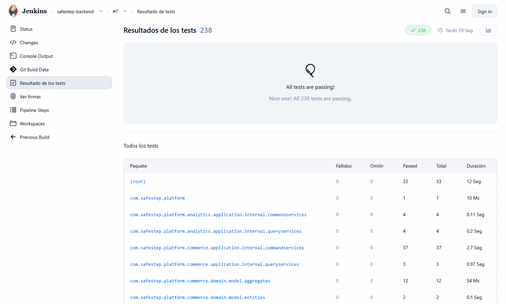
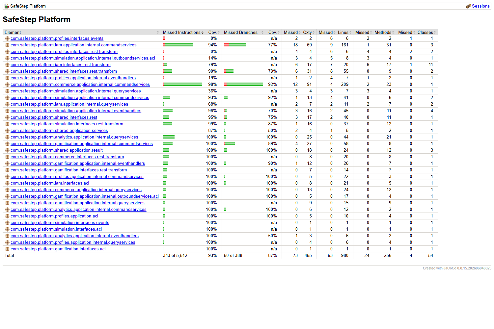
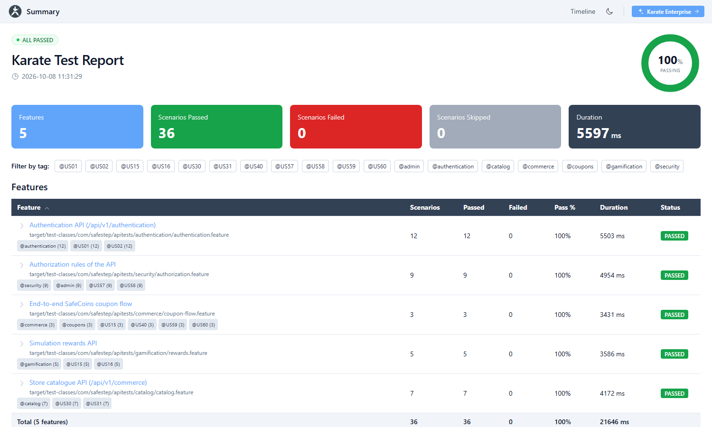
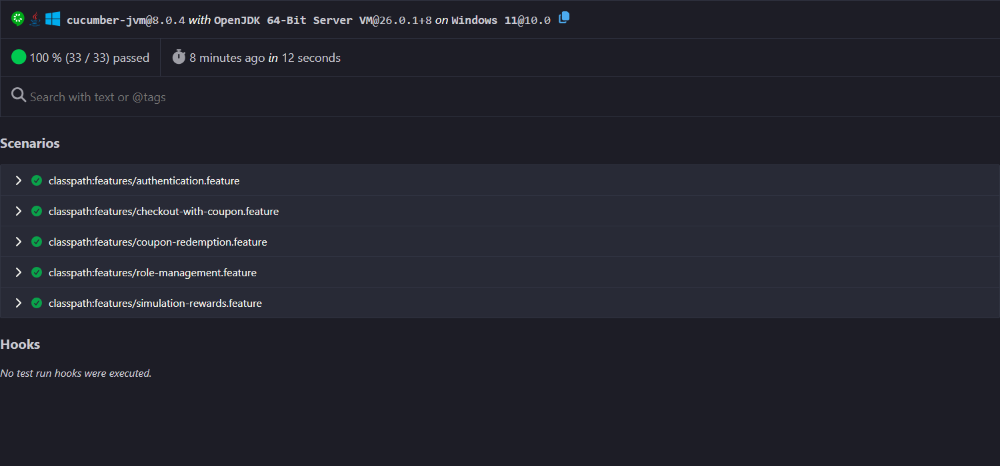

# 6.1. Testing Suites & Validation

Esta sección documenta las suites de prueba que verifican SafeStep. La estrategia sigue la pirámide de pruebas: muchas pruebas unitarias rápidas sobre las entidades y los servicios de aplicación, pruebas de integración de la API desde fuera del sistema y pruebas de comportamiento (BDD) que automatizan los criterios de aceptación de las historias de usuario. Las pruebas unitarias y las de BDD se ejecutan dentro del pipeline de Jenkins descrito en 7.1; las de integración de la API se ejecutan contra una instancia del backend levantada localmente. Las pruebas de sistema (6.1.4) no forman parte de esta entrega.

| Nivel | Herramienta | Repositorio y carpeta | Pruebas | Resultado de la última ejecución |
|-------|-------------|-----------------------|---------|----------------------------------|
| Unitarias de entidades y servicios | JUnit Jupiter 6, Mockito 5, AssertJ | `safeStept-backend/src/test/java/com/safestep/platform` | 205 | 205 aprobadas, 0 fallidas |
| Integración de API | Karate 2.1.2 | `safeStept-backend/api-tests` | 36 escenarios (5 features) | 36 aprobados, 0 fallidos |
| BDD de aceptación | Cucumber-JVM 8.0.4 + Gherkin | `safeStept-backend/src/test/resources/features` | 33 escenarios (5 features) | 33 aprobados, 0 fallidos |

Las 238 pruebas del backend que ejecuta Maven (205 unitarias y de integración con contexto de Spring, más los 33 escenarios BDD) se ejecutaron en Jenkins en 59.9 segundos, sin fallos ni omisiones. Antes del Trabajo Parcial el repositorio contaba con 54 métodos de prueba en 15 clases; las suites actuales reúnen 205 métodos en 40 clases.

<div align="center">
  
  <p><i><b>Figura 6.1.1.</b> Resultado de las 238 pruebas del backend en Jenkins (ejecución #7). <b>Fuente</b>: Elaboración propia</i></p>
</div>

## 6.1.1. Core Entities Unit Tests

Las pruebas unitarias validan en aislamiento las entidades de dominio (agregados, entidades y value objects) y los servicios de aplicación (command y query services, manejadores de eventos y fachadas ACL) de cada bounded context. Todas están escritas con JUnit Jupiter y siguen la estructura **Arrange-Act-Assert**; cuando una clase depende de repositorios o de la fachada de otro contexto (por ejemplo, el canje de cupones consulta al contexto de gamificación) esas dependencias se sustituyen con dobles de Mockito, de modo que cada prueba verifica una sola unidad sin base de datos.

**Pruebas por bounded context:**

| Bounded context | Pruebas | Qué se verifica |
|-----------------|---------|-----------------|
| `commerce` | 66 | Reglas de carrito y órdenes, cálculo del total y del total final con descuento, catálogo de productos y cupones, canje de cupones con SafeCoins, liberación del cupón cuando falla el pago, sesión de pago con Stripe, value objects y validaciones de los recursos REST |
| `iam` | 41 | Registro e inicio de sesión, asignación de roles, regla que impide al administrador quitarse su propio rol, semilla del primer administrador, fachada ACL e integración con la seguridad JWT |
| `gamification` | 37 | Recompensas por simulación, misiones e insignias, gasto de SafeCoins (`PlayerProgress.spendCoins`), registro del gasto (`CoinSpend`), manejador del evento de intento completado y fachada ACL |
| `simulation` | 21 | Registro de intentos, CRUD de simulaciones, eventos de dominio y validación del puntaje |
| `shared` | 22 | Tipo `Result`, manejador global de excepciones, ensamblador de errores y configuración de idioma |
| `profiles` | 9 | Comandos y consultas de perfiles |
| `analytics` | 8 | Resumen, progreso y emisión de certificados |
| Contexto de aplicación | 1 | Arranque de Spring Boot |

**Ejemplo de prueba de entidad.** El cupón canjeado solo puede usarse una vez y vuelve a estar disponible si el pago falla:

```java
@Test
@DisplayName("RedeemedCoupon should start available and become used once (AAA)")
void redeemedCoupon_IsUsedOnlyOnce() {
    // Arrange
    var coupon = availableCoupon();
    var usedAt = Instant.parse("2026-09-15T10:00:00Z");

    // Act
    coupon.markUsed(usedAt);

    // Assert
    assertEquals(RedemptionStatus.USED, coupon.getStatus());
    assertEquals(usedAt, coupon.getUsedAt());
    assertThrows(IllegalStateException.class, () -> coupon.markUsed(Instant.now()));
}
```

**Cobertura.** JaCoCo mide la cobertura de instrucciones y el build exige un mínimo de 80 %. Siguiendo el proyecto de referencia del curso, la medición excluye las clases que no contienen lógica de aplicación: el paquete `domain` completo, la capa `infrastructure`, los recursos y controladores REST, y la clase de arranque (`**/*Application*`). La regla vive en el `pom.xml` (`jacoco:check`, `COVEREDRATIO` mínimo de `0.80`) y por tanto rompe el build si la cobertura baja.

| Medición | Antes del Trabajo Parcial | Después |
|----------|---------------------------|---------|
| Cobertura de instrucciones (clases medidas) | 44.3 % | **93.8 %** (5,164 de 5,506 instrucciones) |
| Pruebas del backend | 54 métodos | 238 pruebas |

| Bounded context | Clases medidas | Cobertura |
|-----------------|----------------|-----------|
| `analytics` | 3 | 100.0 % |
| `gamification` | 6 | 100.0 % |
| `commerce` | 3 | 98.6 % |
| `shared` | 7 | 94.6 % |
| `iam` | 17 | 92.0 % |
| `simulation` | 11 | 91.2 % |
| `profiles` | 7 | 62.1 % |

El contexto `profiles` es el único por debajo del 80 % por sí solo; el umbral se evalúa sobre el conjunto de clases medidas, y la cobertura de `profiles` queda como deuda técnica identificada. SonarQube, que cuenta las líneas y no las instrucciones, reporta 91.7 % de cobertura sobre 980 líneas medibles (ver 7.1.2).

<div align="center">
  
  <p><i><b>Figura 6.1.2.</b> Reporte HTML de JaCoCo generado por el pipeline. <b>Fuente</b>: Elaboración propia</i></p>
</div>

**Cómo ejecutarlas:**

```bash
mvn test            # unitarias + BDD, genera target/site/jacoco
mvn jacoco:check    # falla si la cobertura es menor a 80 %
```

## 6.1.2. Core Integration Tests

Las pruebas de integración verifican que el backend funciona correctamente cuando se consume como lo haría el frontend: por HTTP, atravesando seguridad JWT, controladores, servicios, persistencia en PostgreSQL y la comunicación entre bounded contexts. Se escribieron con **Karate** en un proyecto Maven independiente (`api-tests`) que solo conoce la URL base de la API, por lo que sirve contra una instancia local o un entorno desplegado.

| Feature | Historias | Escenarios | Qué valida |
|---------|-----------|------------|------------|
| `authentication` | US01, US02 | 12 | Registro dirigido por datos (`users-batch.json`), inicio de sesión, rotación del refresh token, conflicto por usuario duplicado y validaciones |
| `security/authorization` | US57, US58 | 9 | Respuestas 401 sin token y 403 para jugadores en rutas de administrador, listado de usuarios y roles, asignación de roles y protección contra auto-degradación (422) |
| `catalog` | US30, US31 | 7 | Catálogos de productos, categorías, kits y cupones |
| `commerce/coupon-flow` | US15, US40, US59, US60 | 3 | El jugador gana SafeCoins, canjea un cupón y lo usa en una orden con el descuento aplicado |
| `gamification/rewards` | US15, US16 | 5 | Recompensas por simulación completada, historial de monedas y rechazo de puntajes fuera de rango |

Cada escenario crea sus propios usuarios con nombres aleatorios, por lo que la suite puede repetirse sobre una base de datos con datos previos; se ejecutó tres veces consecutivas sin fallos. El flujo extremo a extremo de cupones ilustra el estilo de las pruebas:

```gherkin
# 2. Redeem the 5% coupon, which costs 150 SafeCoins
Given path 'api/v1/commerce/coupons/cpn-5/redeem'
And header Authorization = 'Bearer ' + player.token
And request {}
When method post
Then status 201
And match response.status == 'AVAILABLE'
And match response.discountPercentage == 5
```

<div align="center">
  
  <p><i><b>Figura 6.1.3.</b> Resumen del reporte HTML de Karate: 5 features y 36 escenarios aprobados contra una instancia local del backend. <b>Fuente</b>: Elaboración propia</i></p>
</div>

**Hallazgo corregido.** Durante el desarrollo de estas pruebas se detectó que la API respondía HTTP 500 (`UNEXPECTED_ERROR`) cuando recibía un cuerpo JSON mal formado, en lugar de un 400, porque el manejador global de excepciones atendía `RuntimeException` de forma genérica y no registraba el error. Se agregó un manejador específico que responde 400 con un error de validación, sin exponer el mensaje interno del analizador, y los errores inesperados ahora se registran. Lo verifican una prueba unitaria y una prueba de integración por HTTP (`ApiRobustnessIntegrationTest`).

**Cómo ejecutarlas:**

```bash
cd api-tests
mvn test -Dapi.baseUrl=http://localhost:8092 -Dapi.admin.username=<admin> -Dapi.admin.password=<clave>
```

## 6.1.3. Core Behavior-Driven Development

Los criterios de aceptación redactados en Gherkin en 3.2 se automatizaron con **Cucumber-JVM**. Cada archivo `.feature` describe una historia con su narrativa (*As a… I want… So that…*), cada escenario lleva una etiqueta con el identificador de la historia que verifica (por ejemplo `@US42`) y los pasos se implementan en clases `*Steps` que comparten un contexto por escenario. Los escenarios levantan la aplicación Spring Boot completa en un puerto aleatorio sobre una base de datos H2 aislada y la consumen por HTTP, por lo que prueban el comportamiento real sin tocar la base de datos de desarrollo.

| Feature | Historias | Escenarios |
|---------|-----------|------------|
| `authentication.feature` | US01, US02 | 6 |
| `coupon-redemption.feature` | US42, US59, US61 | 5 (uno es un *Scenario Outline* con un ejemplo por cupón del catálogo) |
| `checkout-with-coupon.feature` | US60 | 6 |
| `role-management.feature` | US57, US58 | 6 |
| `simulation-rewards.feature` | US15, US16 | 4 |

La ejecución produce 33 escenarios, todos aprobados. Ejemplo del feature de canje de cupones:

```gherkin
@coupons @US42
Feature: Redeem SafeCoins for store coupons
  As a player who earns SafeCoins by training
  I want to exchange my SafeCoins for discount coupons
  So that I pay less when I buy emergency products

  Background:
    Given a signed-in player with 500 SafeCoins

  Scenario: A player cannot redeem a coupon that costs more than their balance
    When the player redeems the coupon "cpn-15"
    Then the response status is 422
    And the response contains the error code "BUSINESS_RULE_VIOLATION"
    And the player has 500 SafeCoins left
    And the player has no redeemed coupons
```

Y el step definition que lo implementa:

```java
@When("the player redeems the coupon {string}")
public void thePlayerRedeemsTheCoupon(String couponId) {
    context.response(api.post("/api/v1/commerce/coupons/%s/redeem".formatted(couponId), Map.of(), context.token()));
    if (context.response().status() == 201) {
        context.redeemedCouponId(context.response().text("id"));
    }
}
```

<div align="center">
  
  <p><i><b>Figura 6.1.4.</b> Reporte HTML de Cucumber: 33 de 33 escenarios aprobados. <b>Fuente</b>: Elaboración propia</i></p>
</div>

## 6.1.4. Core System Tests

Pendiente.
