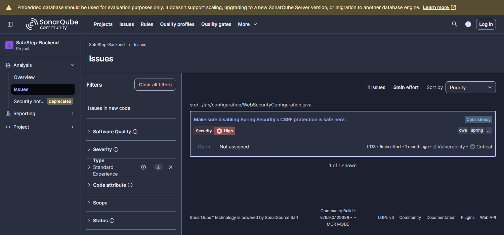
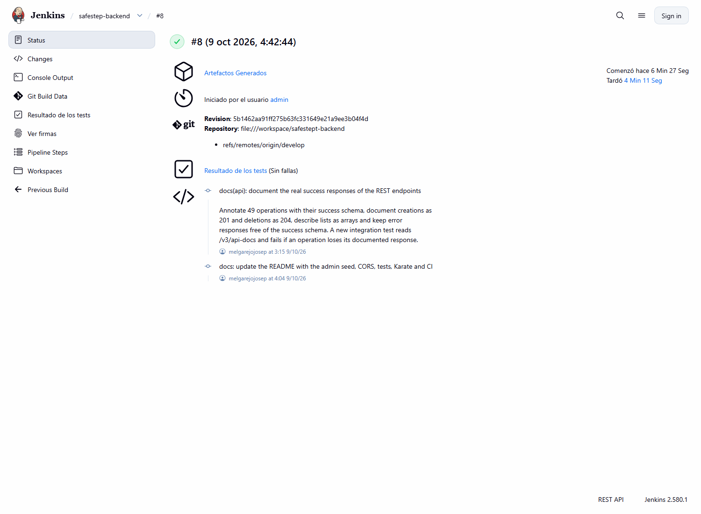

# 7.1. Continuous Integration

La integración continua de SafeStep se implementa con **Jenkins**, siguiendo la arquitectura del material del curso: Jenkins y SonarQube se ejecutan como contenedores Docker en una red compartida y el pipeline se define como código en un `Jenkinsfile` versionado junto al backend. Cada ejecución del pipeline parte del código de la rama `develop`, lo compila, mide su estilo, ejecuta las pruebas unitarias y de comportamiento (BDD), verifica la cobertura, lo analiza con SonarQube y genera el artefacto.

## 7.1.1. Tools and Practices

**Herramientas**

| Herramienta | Versión | Rol en la integración continua |
|-------------|---------|--------------------------------|
| Jenkins | LTS sobre JDK 25 (imagen `safestep-jenkins:1.0`) | Orquesta el pipeline declarativo; plugins: Pipeline, Git, Pipeline Stage View, SonarQube Scanner, Job DSL y Configuration as Code |
| Docker y Docker Compose | 29.6 | Ejecutan Jenkins y SonarQube como contenedores en la red compartida `spring-postgres-net` |
| Maven | 3.9.11 | Compilación, pruebas, cobertura y análisis |
| JDK Eclipse Temurin | 26 | Compila y prueba el backend (se instala en la imagen de Jenkins y se selecciona con `JAVA_HOME_26`) |
| Checkstyle | 14.3.0 (reglas de Google) | Reporte de estilo |
| JUnit Jupiter, Mockito, Cucumber | ver 6.1 | Suites de prueba que ejecuta el pipeline |
| JaCoCo | 0.8.15 | Cobertura y umbral de 80 % |
| SonarQube Community Build | 26.9 | Análisis de calidad y seguridad con Quality Gate |

**Prácticas**

- **Pipeline como código.** El `Jenkinsfile` está en la raíz de `safeStept-backend`; los cambios al pipeline se revisan y versionan como cualquier otro cambio.
- **Infraestructura como código.** La carpeta `ci/` contiene el `Dockerfile` de Jenkins, `plugins.txt`, el `docker-compose.yml` y `casc.yaml`, que configura Jenkins con *Configuration as Code*: usuario administrador, servidor SonarQube (`MiSonarServer`), credencial del token (`sonarqube-token-id`) y el job `safestep-backend`, que se crea solo al iniciar. El script `ci/start-ci.sh` levanta ambos servicios, genera el token de análisis, registra el webhook y arranca Jenkins; las claves generadas se guardan en `ci/.env`, que Git ignora.
- **Fallar rápido.** Las etapas están ordenadas de la más barata a la más costosa y una etapa fallida detiene las siguientes.
- **Un único origen de verdad para las reglas de calidad.** Las exclusiones de cobertura de JaCoCo y de SonarQube son las mismas.
- **Pruebas aisladas.** Las pruebas BDD usan H2 en memoria, de modo que nunca tocan datos de desarrollo ni producción.
- **Evidencia conservada.** Cada etapa archiva sus reportes (resultados JUnit, Checkstyle, JaCoCo, Cucumber y el JAR) como artefactos de la ejecución.
- **Secretos fuera del repositorio.** Las credenciales de Jenkins y SonarQube se generan en cada instalación, y la clave de Stripe se lee de la variable `STRIPE_SECRET_KEY`.
- **Flujo de ramas.** Jenkins construye `develop`; los cambios llegan desde ramas `feature/*` con Conventional Commits, tal como se describe en 5.1.2.

## 7.1.2. Build & Test Suite Pipeline Components

El pipeline completo tiene las etapas siguientes. Los tiempos corresponden a la ejecución #8 en Jenkins (4 min 11 s de principio a fin, resultado **SUCCESS**).

| # | Etapa | Comando | Qué verifica o produce | Si falla | Tiempo |
|---|-------|---------|------------------------|----------|--------|
| 1 | Checkout SCM | Git | Descarga el `Jenkinsfile` y el código de `develop` | Se detiene | 1 s ||
| 2 | Compile Project | `mvn clean compile` | El proyecto compila con JDK 26 | Se detiene | 28 s ||
| 3 | Checkstyle Report | `mvn checkstyle:checkstyle` | Reporte de estilo con reglas de Google (`checkstyle-result.xml`) | No detiene (modo reporte, ver 6.1 y 5.1.3.5) | 22 s ||
| 4 | Unit and BDD Tests | `mvn test` | 209 pruebas unitarias y de integración más 33 escenarios Cucumber; resultados JUnit y reporte Cucumber | Se detiene | 1 min 27 s ||
| 5 | Validate Test Coverage | `mvn jacoco:check` | Cobertura de instrucciones ≥ 80 % sobre las clases medidas (resultado: 93.8 %) | Se detiene | 7 s ||
| 6 | SonarQube Analysis | `mvn sonar:sonar` + `waitForQualityGate()` | Envía el análisis y espera el webhook de SonarQube con el resultado del Quality Gate | Se detiene si el gate no es `OK` | 1 min 21 s ||
| 7 | Package Project | `mvn package -DskipTests` | Genera `safestep-platform-1.0.0.jar`, que se archiva con huella digital | Se detiene | 15 s ||

<div align="center">
  
  <p><i><b>Figura 7.1.1.</b> Vista de etapas del job <code>safestep-backend</code> en Jenkins (ejecuciones #5 a #8). <b>Fuente</b>: Elaboración propia</i></p>
</div>

**Historial de ejecuciones.** La ejecución #1 falló porque Jenkins bloquea por seguridad los checkouts de repositorios locales; se habilitó explícitamente (`hudson.plugins.git.GitSCM.ALLOW_LOCAL_CHECKOUT`) porque el job lee el repositorio montado desde el anfitrión. Las ejecuciones #2 a #4 terminaron en SUCCESS e incluían además etapas de construcción de imagen y pruebas de API en contenedor; esas etapas se retiraron porque la entrega y el despliegue continuos no forman parte de esta entrega. La ejecución #5 fue la primera del pipeline de integración continua actual. Después de corregir los hallazgos de SonarQube (ver abajo), la ejecución #6 **falló a propósito del Quality Gate**: el código nuevo tenía una incidencia de estilo (`java:S1452`, un tipo genérico `ResponseEntity<?>` en el manejador nuevo) y el pipeline se detuvo en la etapa de SonarQube sin generar el JAR. Se corrigió el tipo de retorno y la ejecución #7 terminó en SUCCESS. La ejecución #8, con la documentación OpenAPI corregida y las pruebas que la protegen, también terminó en SUCCESS, ahora con 242 pruebas.

**Integración con SonarQube.** La primera instalación usó la imagen `sonarqube:lts-community` (9.9) del material del curso. Su analizador de Java no puede leer la sintaxis moderna que usa el backend (`switch` con patrones y variables sin nombre `_`) y registró errores de análisis en tres archivos, por lo que el equipo cambió a la imagen vigente `sonarqube:community`, con la que el análisis termina sin errores de lectura. SonarQube notifica a Jenkins mediante el webhook `http://jenkins-master:9089/sonarqube-webhook/`, y `waitForQualityGate()` retoma el pipeline cuando llega el resultado.

<div align="center">
  
  <p><i><b>Figura 7.1.2.</b> Panel de SonarQube del backend SafeStep (código completo). <b>Fuente</b>: Elaboración propia</i></p>
</div>

| Métrica de SonarQube | Valor |
|----------------------|-------|
| Líneas de código | 9,964 en 370 archivos |
| Quality Gate (Sonar way) | **Aprobado** |
| Cobertura | 91.7 % sobre 980 líneas medibles |
| Duplicación | 1.0 % |
| Vulnerabilidades | 1 (calificación de seguridad D; es el CSRF deshabilitado a propósito) |
| Bugs | 0 (calificación de fiabilidad A) |
| Code smells | 207 (calificación de mantenibilidad A) |
| Incidencias con impacto en fiabilidad | 4, de severidad informativa (`java:S8688`); no son bugs |
| Hotspots de seguridad | 0 |

El Quality Gate «Sonar way» evalúa únicamente el **código nuevo**. En el primer análisis del proyecto no existía código nuevo que evaluar y el gate aprobó, por lo que las incidencias existentes se trataron como deuda técnica y se listaron en lugar de ocultarse. En los análisis posteriores sí hay código nuevo, y el gate lo evalúa con tres condiciones: cobertura del código nuevo de al menos 80 % (resultado: 100 %), duplicación menor a 3 % (0 %) y ninguna incidencia nueva (0).

**Hallazgos de seguridad y fiabilidad (6.2.1.2).** El primer análisis reportó 2 vulnerabilidades y 3 bugs. El equipo corrigió los hallazgos que eran reales y dejó, documentada, la que es una decisión de diseño:

| Tipo | Gravedad | Regla | Archivo | Descripción | Estado |
|------|----------|-------|---------|-------------|--------|
| Vulnerabilidad | Crítica | `java:S4502` | `WebSecurityConfiguration` | La protección CSRF de Spring Security está deshabilitada | **Se mantiene.** Es aceptable en esta API: es *stateless*, autentica con JWT en el encabezado `Authorization` y no usa cookies de sesión |
| Vulnerabilidad | Mayor | `java:S5122` | `WebSecurityConfiguration` | CORS permitía cualquier origen (`*`) | **Corregido.** Los orígenes permitidos salen de la propiedad `safestep.cors.allowed-origins` (variable `SAFESTEP_CORS_ALLOWED_ORIGINS`), con el frontend local y los frontends publicados por defecto |
| Bug | Menor | `java:S2184` | `StripeCheckoutClientImpl` | Posible desbordamiento en una resta de enteros que se convierte a `long` | **Corregido.** La resta usa aritmética `long` |
| Bug | Menor | `java:S2637` | `ErrorResponseAssembler` (2) | Se devolvía `null` desde métodos marcados como no nulos (`@NullMarked`) | **Corregido.** El retorno se anotó como `@Nullable` |

<div align="center">
  
  <p><i><b>Figura 7.1.3.</b> Vulnerabilidades y bugs que SonarQube mantiene abiertos tras las correcciones (solo el CSRF deshabilitado). <b>Fuente</b>: Elaboración propia</i></p>
</div>

La corrección se verificó de tres formas: pruebas nuevas (una unitaria y tres de integración por HTTP sobre el cuerpo ilegible y las reglas de CORS), la ejecución completa de Jenkins con las 238 pruebas de entonces (ejecución #7) y una consulta real al backend levantado, que respondió 400 al JSON mal formado, aceptó la petición previa (*preflight*) del frontend publicado y rechazó con 403 la de un origen desconocido.

**Reportes y artefactos de cada ejecución.**

<div align="center">
  
  <p><i><b>Figura 7.1.4.</b> Página de la ejecución #8 con sus artefactos archivados (JAR, Checkstyle, JaCoCo, Cucumber). <b>Fuente</b>: Elaboración propia</i></p>
</div>

**Cómo reproducir el entorno de CI:**

```bash
cd safeStept-backend/ci
bash start-ci.sh          # SonarQube :9000, Jenkins :9089 (usuario admin, clave en ci/.env)
```

Jenkins ejecuta el job `safestep-backend` sobre la rama `develop`; también puede iniciarse manualmente desde la interfaz con *Build Now*.
