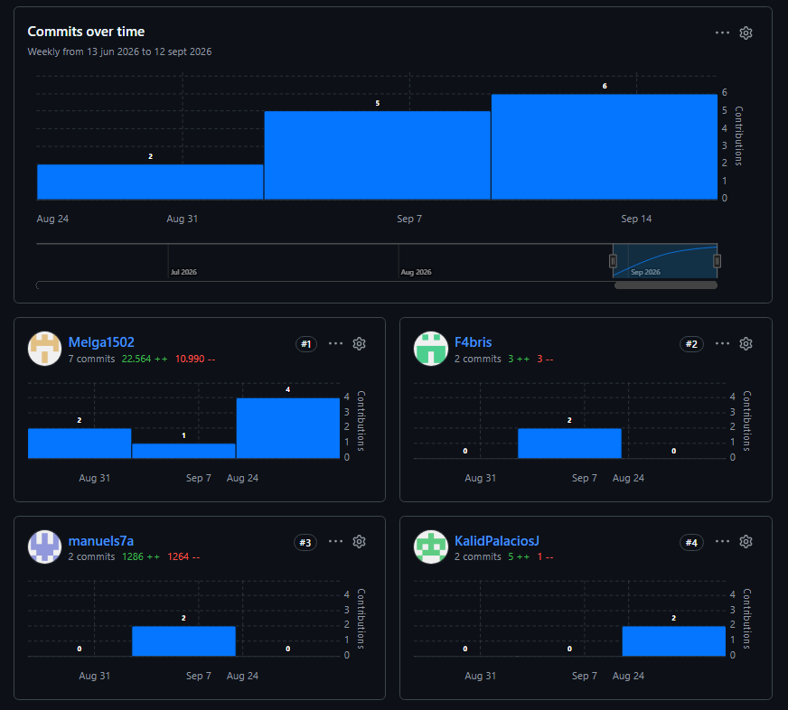

# Project Report Collaboration Insights

**Nombre de la organización**: Chronos

**Nombre del producto**: SafeStep

**URL de la organización**: 

<a href="https://github.com/1ASI0732-2620-9090-Grupo-4">https://github.com/1ASI0732-2620-9090-Grupo-4</a>

**URL del reporte de SafeStep**:

<a href="https://github.com/1ASI0732-2620-9090-Grupo-4/safeStept-report.git">https://github.com/1ASI0732-2620-9090-Grupo-4/safeStept-report.git</a>

**URL del landing page de SafeStep**:

<a href="https://github.com/1ASI0732-2620-9090-Grupo-4/safestept-landing-page.git">https://github.com/1ASI0732-2620-9090-Grupo-4/safestept-landing-page.git</a>

**URL del frontend de SafeStep**:

<a href="https://github.com/1ASI0732-2620-9090-Grupo-4/safestept-frontend.git">https://github.com/1ASI0732-2620-9090-Grupo-4/safestept-frontend.git</a>

**URL del backend de SafeStep**:

<a href="https://github.com/1ASI0732-2620-9090-Grupo-4/safestept-backend.git">https://github.com/1ASI0732-2620-9090-Grupo-4/safestept-backend.git</a>

## Trabajo 1 (AV1)

  

    <b>Gráfico 2</b>: Analytics AV1
  

  
  

    <i><b>Fuente</b>: Elaboración propia.</i>
  

## Trabajo 2 (TB1)

  

    <b>Gráfico 2</b>: Analytics TB1
  

  
  

    <i><b>Fuente</b>: Elaboración propia.</i>
  

## Trabajo 3 (AV2)

  

    <b>Gráfico 2</b>: Analytics AV2
  

  
  

    <i><b>Fuente</b>: Elaboración propia.</i>
  

## Trabajo 4 (TB2)

  

    <b>Gráfico 2</b>: Analytics TB2
  

  
  

    <i><b>Fuente</b>: Elaboración propia.</i>
  

